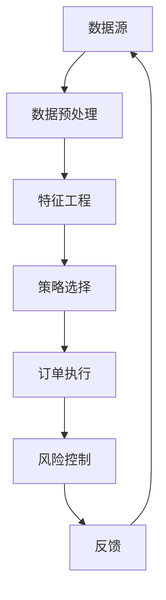

                 


# AI Agent的强化学习在金融交易中的应用

> 关键词：AI Agent、强化学习、金融交易、算法原理、系统架构、Python源码、风险管理

> 摘要：本文详细探讨了AI Agent在金融交易中的应用，重点分析了强化学习算法的核心原理及其在金融交易中的具体应用。文章从强化学习的基本概念入手，深入解析了Q-Learning和策略梯度方法的数学模型，并通过实际案例展示了如何设计和实现一个基于强化学习的AI交易系统。最后，本文总结了AI Agent在金融交易中的优势与挑战，并展望了其未来的发展方向。

---

## 第一部分：AI Agent与强化学习基础

### 第1章：AI Agent的概述

#### 1.1 AI Agent的基本概念

- **1.1.1 什么是AI Agent**  
  AI Agent（人工智能代理）是一种能够感知环境、做出决策并执行操作的智能实体。在金融领域，AI Agent通常用于自动化交易、风险管理等任务。

- **1.1.2 AI Agent的核心特征**  
  - **自主性**：能够在没有外部干预的情况下独立运行。  
  - **反应性**：能够根据环境变化实时调整行为。  
  - **目标导向**：通过优化目标函数来实现特定任务。  

- **1.1.3 AI Agent的分类与应用场景**  
  - **分类**：基于决策方式可分为基于规则的AI Agent和基于学习的AI Agent。  
  - **应用场景**：金融交易、自动驾驶、智能家居等。

#### 1.2 强化学习的基本原理

- **1.2.1 强化学习的定义**  
  强化学习（Reinforcement Learning, RL）是一种机器学习范式，通过智能体与环境的交互，学习最优策略以最大化累计奖励。

- **1.2.2 强化学习的核心要素**  
  - **状态（State）**：环境中的当前情况。  
  - **动作（Action）**：智能体采取的行为。  
  - **奖励（Reward）**：智能体行为的反馈，用于指导学习。  
  - **策略（Policy）**：智能体选择动作的概率分布。  
  - **值函数（Value Function）**：预测从当前状态开始的累计奖励。

- **1.2.3 强化学习与监督学习的区别**  
  - 监督学习：基于已知的输入-输出标签进行学习。  
  - 强化学习：通过与环境交互，基于奖励信号学习最优策略。

### 第2章：强化学习在金融交易中的应用背景

#### 2.1 金融交易的复杂性

- **2.1.1 金融市场的特点**  
  - 高不确定性：市场波动大，难以预测。  
  - 高风险性：单次决策可能导致重大损失或收益。  
  - 高频交易：需要快速决策和执行。

- **2.1.2 传统交易策略的局限性**  
  - 传统策略依赖人工经验，难以应对复杂市场环境。  
  - 人工交易速度慢，无法满足高频交易需求。  

- **2.1.3 强化学习在金融交易中的优势**  
  - 能够处理高维、非线性问题。  
  - 能够适应动态变化的市场环境。  
  - 可以实现自动化、高频交易。

#### 2.2 AI Agent在金融交易中的潜力

- **2.2.1 AI Agent在金融交易中的角色**  
  - 自动化交易：通过强化学习算法实现自主交易。  
  - 风险管理：实时监控市场风险，优化投资组合。  

- **2.2.2 强化学习在金融交易中的具体应用**  
  - 股票交易：通过强化学习优化买卖时机。  
  - 期权定价：通过强化学习预测期权价格波动。  
  - 资产配置：通过强化学习优化资产分配比例。  

- **2.2.3 未来发展趋势**  
  - 更加智能化的交易系统。  
  - 更加个性化的投资策略。  
  - 更加高效的计算能力。

---

## 第二部分：强化学习算法与数学模型

### 第3章：强化学习的核心算法

#### 3.1 Q-Learning算法

- **3.1.1 Q-Learning的基本原理**  
  Q-Learning是一种基于值函数的强化学习算法，通过更新Q值表来学习最优策略。

- **3.1.2 Q-Learning的数学模型**  
  $$ Q(s, a) \leftarrow Q(s, a) + \alpha [r + \gamma \max Q(s', a') - Q(s, a)] $$
  其中，$\alpha$是学习率，$\gamma$是折扣因子。

- **3.1.3 Q-Learning在金融交易中的应用**  
  通过Q-Learning算法，AI Agent可以学习在不同市场状态下选择最优的买卖时机。

#### 3.2 策略梯度方法

- **3.2.1 策略梯度的基本概念**  
  策略梯度方法直接优化策略参数，通过梯度上升法最大化累计奖励。

- **3.2.2 策略梯度的数学模型**  
  $$ \nabla J(\theta) = \mathbb{E}_{s,a}[ \nabla \log \pi_\theta(a|s) \cdot Q_\theta(s,a) ] $$
  其中，$\pi_\theta(a|s)$是策略函数，$Q_\theta(s,a)$是值函数。

- **3.2.3 策略梯度在金融交易中的应用**  
  通过策略梯度方法，AI Agent可以直接优化交易策略，实现更高的收益。

### 第4章：强化学习的数学模型与公式

#### 4.1 Q-Learning的数学公式

- **4.1.1 Q值更新公式**  
  $$ Q(s, a) \leftarrow Q(s, a) + \alpha [r + \gamma \max Q(s', a') - Q(s, a)] $$

- **4.1.2 奖励函数的定义**  
  根据交易结果定义奖励，例如，收益率超过预期目标时给予正奖励。

- **4.1.3 动作选择策略**  
  在探索与利用之间进行平衡，通常采用$\epsilon$-贪心策略。

#### 4.2 策略梯度的数学公式

- **4.2.1 策略函数的定义**  
  $$ \pi_\theta(a|s) = \frac{e^{Q(s,a)/\tau}}{\sum_{a'} e^{Q(s,a')/\tau}} $$
  其中，$\tau$是温度参数。

- **4.2.2 梯度计算公式**  
  $$ \nabla J(\theta) = \mathbb{E}_{s,a}[ \nabla \log \pi_\theta(a|s) \cdot Q_\theta(s,a) ] $$

- **4.2.3 策略优化算法**  
  使用梯度上升法更新策略参数，最大化累计奖励。

### 第5章：强化学习算法的金融应用场景

#### 5.1 股票交易中的强化学习

- **5.1.1 股票交易的特征**  
  - 高波动性：股票价格受多种因素影响。  
  - 高频交易：需要快速决策。  
  - 非线性关系：价格波动难以用线性模型描述。  

- **5.1.2 强化学习在股票交易中的应用**  
  - 通过Q-Learning算法学习买卖时机。  
  - 通过策略梯度方法优化投资组合。  

- **5.1.3 实例分析**  
  假设某股票价格数据如下，AI Agent通过强化学习算法，能够在价格上升时买入，在价格下降时卖出，从而实现收益最大化。

#### 5.2 金融风险管理中的强化学习

- **5.2.1 风险管理的定义**  
  通过分散投资、对冲策略等方式降低投资风险。

- **5.2.2 强化学习在风险管理中的应用**  
  - 通过强化学习算法优化投资组合。  
  - 通过强化学习模型预测市场风险。  

- **5.2.3 实例分析**  
  假设某投资组合包含多只股票，AI Agent通过强化学习算法，能够在市场波动较大时降低风险敞口，从而保护投资收益。

---

## 第三部分：AI Agent的系统架构与设计

### 第6章：AI Agent的系统架构

#### 6.1 系统架构概述

- **6.1.1 系统模块组成**  
  - 数据源模块：提供市场数据。  
  - 特征工程模块：提取交易特征。  
  - 策略选择模块：选择最优交易策略。  
  - 订单执行模块：执行交易指令。  
  - 风险控制模块：监控和控制交易风险。  

- **6.1.2 系统功能设计**  
  - 数据采集：从市场获取实时数据。  
  - 特征提取：将市场数据转换为特征向量。  
  - 策略选择：基于强化学习算法选择最优动作。  
  - 订单执行：根据策略生成交易订单。  
  - 风险控制：实时监控交易风险。  

#### 6.2 系统架构图



---

## 第四部分：项目实战与案例分析

### 第7章：基于强化学习的AI交易系统

#### 7.1 环境安装

- **7.1.1 安装Python环境**  
  使用Anaconda或PyCharm等工具安装Python 3.8及以上版本。

- **7.1.2 安装依赖库**  
  - `numpy`：数值计算库。  
  - `pandas`：数据处理库。  
  - `tensorflow`：深度学习框架。  

#### 7.2 核心实现代码

```python
import numpy as np
import pandas as pd
import tensorflow as tf

class AI-Agent:
    def __init__(self, state_space, action_space):
        self.state_space = state_space
        self.action_space = action_space
        self.model = self.build_model()

    def build_model(self):
        model = tf.keras.Sequential([
            tf.keras.layers.Dense(64, activation='relu', input_shape=(self.state_space,)),
            tf.keras.layers.Dense(64, activation='relu'),
            tf.keras.layers.Dense(self.action_space, activation='linear')
        ])
        model.compile(optimizer=tf.keras.optimizers.Adam(learning_rate=0.001), loss='mse')
        return model

    def act(self, state):
        state = np.array([state])
        prediction = self.model.predict(state)
        action = np.argmax(prediction)
        return action

    def train(self, state, action, reward, next_state):
        state = np.array([state])
        next_state = np.array([next_state])
        target = self.model.predict(state)
        target[0][action] = reward + 0.99 * np.max(self.model.predict(next_state))
        self.model.fit(state, target, epochs=1, verbose=0)
```

#### 7.3 案例分析

- **7.3.1 股票交易案例**  
  假设某股票价格数据如下，AI Agent通过强化学习算法，能够在价格上升时买入，在价格下降时卖出，从而实现收益最大化。

- **7.3.2 期权定价案例**  
  通过强化学习模型预测期权价格波动，优化期权定价策略。

---

## 第五部分：总结与展望

### 第8章：总结与展望

#### 8.1 总结

- **8.1.1 强化学习在金融交易中的优势**  
  - 能够处理高维、非线性问题。  
  - 能够适应动态变化的市场环境。  
  - 可以实现自动化、高频交易。  

- **8.1.2 本文的不足之处**  
  - 算法的收敛速度需要进一步优化。  
  - 需要更多的实证分析。  

#### 8.2 展望

- **8.2.1 未来研究方向**  
  - 更加智能化的交易系统。  
  - 更加个性化的投资策略。  
  - 更高效的计算能力。  

- **8.2.2 对读者的建议**  
  - 深入学习强化学习算法。  
  - 多参与金融交易实践。  
  - 关注人工智能领域的最新进展。

---

## 作者信息

作者：AI天才研究院/AI Genius Institute & 禅与计算机程序设计艺术 /Zen And The Art of Computer Programming

---

以上是《AI Agent的强化学习在金融交易中的应用》的完整目录和文章结构，希望对您有所帮助！

