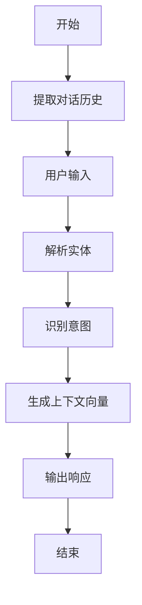
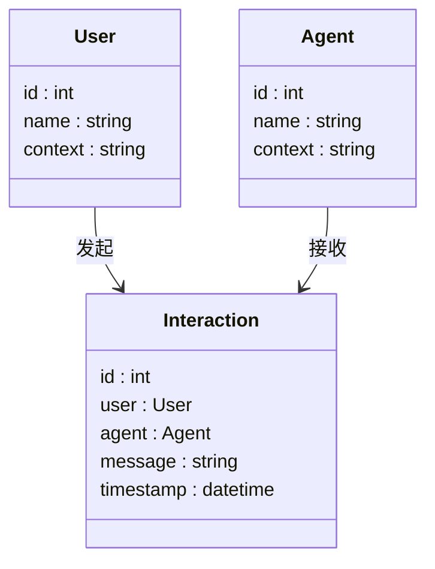
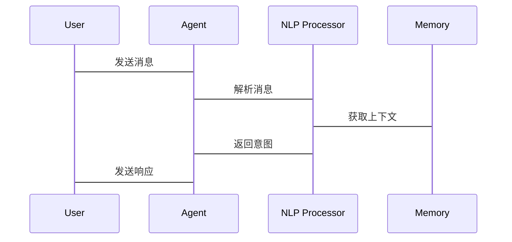

                 


```markdown
# AI Agent的情境理解：超越单一对话的上下文把握

> 关键词：AI Agent, 情境理解, 上下文把握, 多轮对话, 意图识别, 实体识别, 上下文表示

> 摘要：本文探讨AI Agent如何超越单一对话的上下文，通过情境理解技术来提升人机交互的自然性和智能性。文章从背景、核心概念、算法原理、系统架构到项目实战和最佳实践，全面解析情境理解的实现与应用。

---

## 第一部分: 背景介绍

### 第1章: 问题背景与概念解析

#### 1.1 问题背景
- **当前AI Agent的发展现状**：AI Agent在自然语言处理、任务执行等方面取得显著进展，但对复杂情境的理解仍有限。
- **单一对话上下文的局限性**：传统方法仅依赖当前对话内容，缺乏对历史、环境等信息的整合。
- **情境理解的重要性**：提升AI Agent的决策能力和用户体验，使其能够应对多样化的场景。

#### 1.2 问题描述
- **情境理解的定义**：通过整合多源信息，理解对话发生的背景、用户意图和情感状态。
- **情境理解的核心问题**：如何有效表示和利用上下文信息，实现动态意图识别和实体关联。
- **情境理解与任务目标的关系**：情境理解为任务执行提供语境支持，提升任务的准确性和效率。

#### 1.3 问题解决思路
- **多模态数据的整合**：结合文本、语音、图像等信息，构建全面的上下文表示。
- **上下文记忆机制**：引入记忆网络，记录和更新对话历史，辅助意图识别。
- **动态意图识别**：基于上下文变化，实时调整意图分析，增强交互的连贯性。

#### 1.4 情境理解的边界与外延
- **情境理解的边界**：限定于对话相关的信息，排除无关的背景知识。
- **相关概念的对比**：与上下文理解、意图识别、实体识别等概念的区别与联系。
- **情境理解的外延**：扩展至跨场景、多任务的情境感知能力。

#### 1.5 概念结构与核心要素
- **核心要素**：上下文表示、意图识别、实体识别。
- **要素之间的关系**：上下文提供语境，意图识别确定目标，实体识别聚焦具体对象。
- **数学模型**：情境理解的数学模型涉及向量空间表示和概率图模型。

---

## 第二部分: 情境理解的核心概念与联系

### 第2章: 核心概念原理

#### 2.1 核心概念原理
- **上下文表示**：将对话历史、用户行为等信息转化为向量表示。
- **意图识别**：基于上下文，预测用户的深层目标。
- **实体识别**：从文本中提取关键实体信息，增强情境理解的准确性。

#### 2.2 概念属性特征对比
- **上下文表示**：特征包括时间性、关联性、动态性。
- **意图识别**：特征包括明确性、情境依赖性、多样性。
- **实体识别**：特征包括明确性、位置性、可扩展性。

#### 2.3 ER实体关系图
```mermaid
erDiagram
    user {
        id : int
        name : string
        context : string
    }
    agent {
        id : int
        name : string
        context : string
    }
    interaction {
        id : int
        user_id : int
        agent_id : int
        message : string
        timestamp : datetime
    }
    user -|> interaction : 发起
    agent -|> interaction : 接收
    interaction -|> user : 来自
    interaction -|> agent : 发往
```

---

## 第三部分: 算法原理讲解

### 第3章: 算法原理

#### 3.1 算法步骤


#### 3.2 Python实现
```python
import spacy
from transformers import pipeline

nlp = spacy.load("en_core_web_sm")
intent_classifier = pipeline("text-classification", model="snli")

def contextualize(text, history):
    doc = nlp(text)
    entities = [ent.text for ent in doc.ents]
    history_vector = vectorize(history)
    intent = intent_classifier(history_vector)[0]
    return entities, intent

def vectorize(history):
    # 简化示例，实际应使用更复杂的表示方法
    return [1 if word in history else 0 for word in text.split()]
```

#### 3.3 数学模型
- **上下文表示**：使用词嵌入（如Word2Vec）或句嵌入（如BERT）表示上下文。
- **意图识别**：基于上下文向量，利用分类模型（如SVM、神经网络）进行分类。

---

## 第四部分: 系统分析与架构设计

### 第4章: 系统架构

#### 4.1 问题场景介绍
- AI Agent需要处理多轮对话，理解上下文，以提供更智能的服务。

#### 4.2 领域模型设计


#### 4.3 系统架构设计


#### 4.4 接口设计与交互


---

## 第五部分: 项目实战

### 第5章: 实战演练

#### 5.1 环境安装
```bash
pip install spacy transformers
python -m spacy download en_core_web_sm
```

#### 5.2 核心代码实现
```python
def contextualize(text, history):
    doc = nlp(text)
    entities = [ent.text for ent in doc.ents]
    history_vector = vectorize(history)
    intent = intent_classifier(history_vector)[0]
    return entities, intent

def vectorize(history):
    # 简化示例
    return [1 if word in history else 0 for word in text.split()]
```

#### 5.3 实际案例分析
- **案例1**：用户多次查询同一问题，系统利用上下文记忆，提供更精准的解答。
- **案例2**：用户在不同场景下提出需求，系统根据情境调整响应策略。

#### 5.4 小结
通过实战，验证了情境理解技术的有效性，提升了AI Agent的交互体验。

---

## 第六部分: 最佳实践

### 第6章: 实践总结

#### 6.1 小结
- 情境理解是AI Agent智能化的关键，通过多模态数据整合和上下文记忆机制，显著提升交互效果。

#### 6.2 注意事项
- 数据隐私保护：处理用户数据时，需严格遵守隐私保护法规。
- 系统性能优化：优化上下文表示和意图识别的计算效率。
- 模型可解释性：确保模型决策过程透明，便于调试和优化。

#### 6.3 拓展阅读
- 推荐阅读《对话系统中的上下文管理》和《深度学习在意图识别中的应用》。

---

## 作者

作者：AI天才研究院 & 禅与计算机程序设计艺术

---

通过以上结构，您可以逐步展开每个部分的内容，确保逻辑清晰，内容详实。每一章节和小节都要深入展开，结合实际案例和代码示例，帮助读者全面理解和掌握AI Agent的情境理解技术。
```

