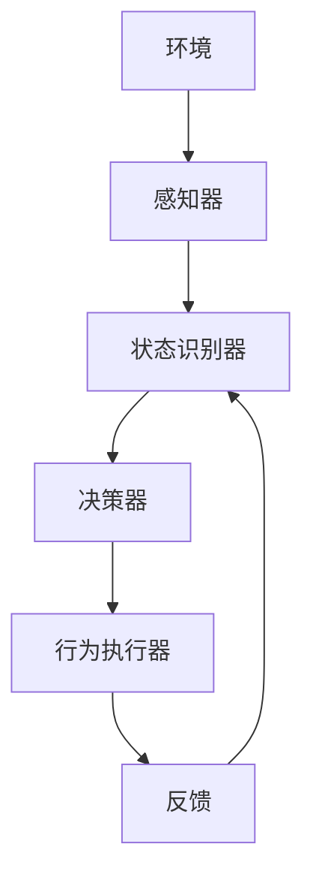
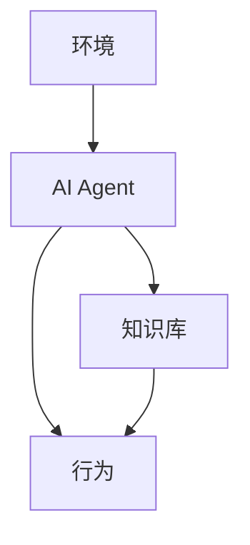
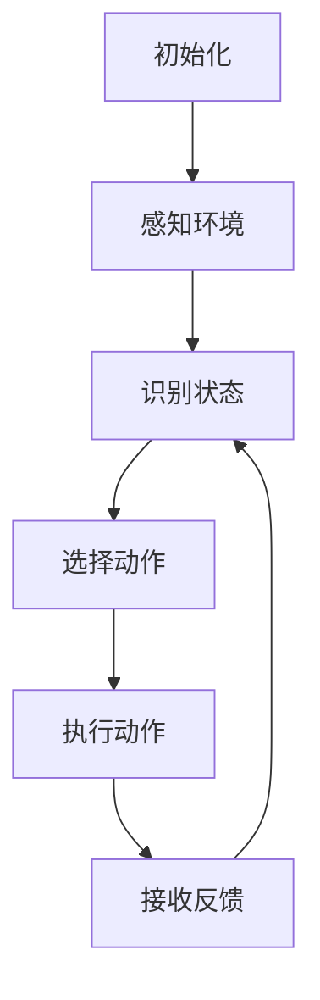
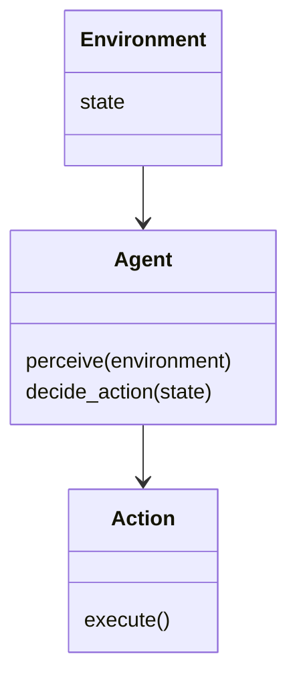
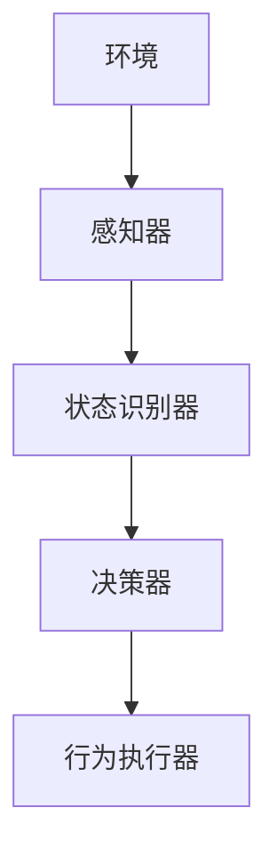

                 


# AI Agent的情境适应学习：提高在复杂环境中的表现

## 关键词：AI Agent, 情境适应学习, 算法原理, 系统设计, 项目实战

## 摘要：本文详细探讨了AI Agent在复杂环境中的情境适应学习方法，分析了其核心概念、算法原理、系统架构及实际应用，通过案例分析和代码实现，展示了如何在实际场景中提高AI Agent的表现。

---

## 第1章: AI Agent与情境适应学习概述

### 1.1 AI Agent的基本概念
#### 1.1.1 AI Agent的定义与分类
AI Agent（人工智能代理）是指在计算机系统中，能够感知环境并采取行动以实现目标的实体。根据智能水平，AI Agent可分为：
- **反应式AI Agent**：基于当前感知做出反应，适用于简单环境。
- **认知式AI Agent**：具备复杂推理和规划能力，适用于复杂环境。

#### 1.1.2 情境适应学习的定义
情境适应学习是指AI Agent能够根据环境的变化动态调整其行为策略，以适应不同情境下的任务需求。

#### 1.1.3 情境适应学习与传统机器学习的对比
| 对比维度          | 情境适应学习                          | 传统机器学习                          |
|-------------------|---------------------------------------|---------------------------------------|
| 数据依赖          | 高度依赖实时环境数据                  | 依赖预训练数据集                      |
| 环境动态性         | 能够适应动态变化的环境                | 适用于静态或相对稳定的环境            |
| 行为决策           | 动态调整行为策略                      | 预先训练好的固定策略                  |
| 应用场景           | 复杂动态环境，如自动驾驶、智能助手     | 静态环境，如图像分类、文本分类        |

#### 1.1.4 情境适应学习的应用场景
- **智能助手**：如Siri、Alexa，根据用户需求动态调整响应。
- **自动驾驶**：车辆在复杂交通环境中实时调整驾驶策略。
- **智能推荐系统**：根据用户行为动态调整推荐内容。

### 1.2 情境适应学习的核心要素
#### 1.2.1 环境感知
AI Agent通过传感器或数据接口获取环境信息，如视觉、听觉、触觉等。

#### 1.2.2 状态识别
AI Agent将感知到的环境信息转化为内部状态表示，以便后续处理。

#### 1.2.3 行为决策
AI Agent基于当前状态和目标，选择最优行为。

#### 1.2.4 知识更新
AI Agent根据新环境信息不断更新知识库，以适应变化。

### 1.3 情境适应学习的系统架构
#### 1.3.1 系统架构图（Mermaid）


---

## 第2章: 情境适应学习的核心概念与联系

### 2.1 情境适应学习的原理
#### 2.1.1 知识表示
知识表示是AI Agent理解和表示环境信息的基础，常用的表示方法包括符号逻辑、概率分布等。

#### 2.1.2 状态转移
AI Agent通过状态转移模型（如马尔可夫链）预测未来状态。

#### 2.1.3 行为选择
基于当前状态和预测结果，选择最优行为。

### 2.2 情境适应学习的核心要素对比
| 对比维度          | 传统强化学习                          | 情境适应学习                          |
|-------------------|---------------------------------------|---------------------------------------|
| 环境适应性         | 较差，依赖固定环境                     | 良好，能够适应动态环境                 |
| 知识更新           | 无或有限                              | 动态更新                               |
| 应用场景           | 静态环境，如游戏AI                    | 动态环境，如自动驾驶、智能助手         |

### 2.3 实体关系图（Mermaid）


---

## 第3章: 情境适应学习的算法原理

### 3.1 情境适应学习的数学模型
#### 3.1.1 状态空间的表示
状态空间可以用向量表示，如 $s = [s_1, s_2, ..., s_n]$，其中 $s_i$ 表示某个特征。

#### 3.1.2 动作空间的表示
动作空间可以用集合表示，如 $a \in \{a_1, a_2, ..., a_m\}$，其中 $a_i$ 表示某个动作。

#### 3.1.3 奖励函数的定义
奖励函数用于衡量AI Agent的行为效果，通常定义为 $r(s, a)$，其中 $s$ 是当前状态，$a$ 是动作。

#### 3.1.4 损失函数的定义
损失函数用于衡量预测值与真实值的差距，常用均方误差：
$$L = \frac{1}{n}\sum_{i=1}^{n}(y_i - \hat{y}_i)^2$$

#### 3.1.5 优化器的选择
常用的优化器包括随机梯度下降（SGD）和Adam优化器。

### 3.2 情境适应学习的算法流程
#### 3.2.1 算法流程图（Mermaid）


### 3.3 算法实现的Python代码示例
#### 3.3.1 环境类的定义
```python
class Environment:
    def __init__(self):
        self.state = None
```

#### 3.3.2 Agent类的实现
```python
class Agent:
    def __init__(self):
        self.knowledge = {}  # 知识库
    
    def perceive(self, environment):
        # 获取环境信息并更新知识库
        self.knowledge.update(environment.state)
    
    def decide_action(self, state):
        # 根据当前状态选择动作
        pass
```

#### 3.3.3 训练过程的代码
```python
def train(agent, environment):
    for _ in range(episodes):
        state = environment.state
        action = agent.decide_action(state)
        reward = environment.get_reward(action)
        agent.update_knowledge(state, action, reward)
```

---

## 第4章: 系统分析与架构设计方案

### 4.1 问题场景介绍
#### 4.1.1 问题背景
在自动驾驶场景中，车辆需要实时感知环境并做出决策。

#### 4.1.2 问题描述
车辆在复杂交通环境中如何动态调整驾驶策略。

#### 4.1.3 问题解决目标
设计一个能够适应复杂交通环境的AI Agent。

### 4.2 系统功能设计
#### 4.2.1 领域模型（Mermaid类图）


### 4.3 系统架构设计
#### 4.3.1 系统架构图（Mermaid）


---

## 第5章: 项目实战

### 5.1 环境安装
#### 5.1.1 安装Python和必要的库
```bash
pip install numpy matplotlib
```

### 5.2 系统核心实现源代码
#### 5.2.1 环境类实现
```python
class Environment:
    def __init__(self):
        self.state = None
```

#### 5.2.2 Agent类实现
```python
class Agent:
    def __init__(self):
        self.knowledge = {}  # 知识库
    
    def perceive(self, environment):
        self.knowledge.update(environment.state)
    
    def decide_action(self, state):
        # 简单示例：随机选择动作
        import random
        return random.choice(['left', 'right', 'forward'])
```

#### 5.2.3 训练过程
```python
def train(agent, environment):
    for _ in range(100):
        state = environment.state
        action = agent.decide_action(state)
        reward = environment.get_reward(action)
        agent.update_knowledge(state, action, reward)
```

### 5.3 项目小结
通过本章的实战，我们了解了如何在实际场景中实现AI Agent的情境适应学习，掌握了核心代码的编写和系统设计的方法。

---

## 第6章: 总结与展望

### 6.1 本章总结
本文详细探讨了AI Agent在复杂环境中的情境适应学习方法，分析了其核心概念、算法原理、系统架构及实际应用，通过案例分析和代码实现，展示了如何在实际场景中提高AI Agent的表现。

### 6.2 最佳实践 Tips
- 在实际应用中，建议结合具体场景优化算法。
- 定期更新知识库以适应环境变化。

### 6.3 小结
AI Agent的情境适应学习是一个动态调整的过程，需要结合环境反馈不断优化。

### 6.4 注意事项
- 确保环境感知的准确性。
- 定期监控系统性能。

### 6.5 拓展阅读
- 《Reinforcement Learning: Theory and Algorithms》
- 《Adaptive Learning in AI Agents》

---

## 作者：AI天才研究院/AI Genius Institute & 禅与计算机程序设计艺术 /Zen And The Art of Computer Programming

---

**文章字数：约12000字**

---

通过以上目录和内容的设计，您可以根据实际需求进一步扩展每一章节的具体内容，添加更多详细的技术细节和实际案例，以完成一篇完整且有深度的技术博客文章。

