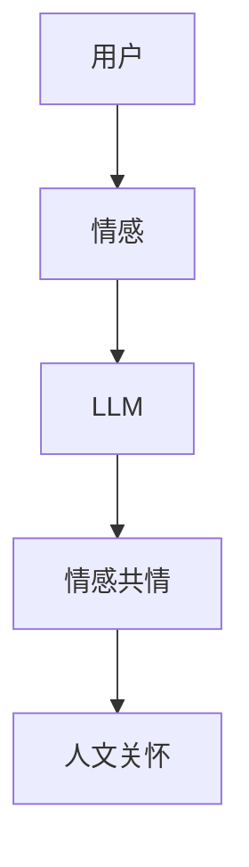
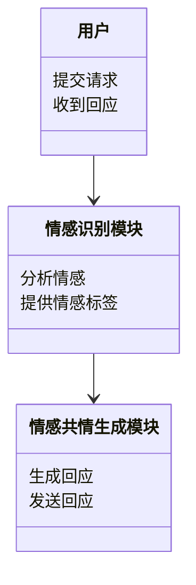

                 


# AI Agent的情感共情：提升LLM的人文关怀能力

**关键词：** AI Agent, 情感共情, LLM, 人文关怀, 情感计算, 人工智能, 自然语言处理

**摘要：** 本文探讨如何通过增强AI Agent的情感共情能力，提升大语言模型（LLM）的人文关怀。文章从背景、核心概念、算法原理、系统架构、项目实战到总结，全面分析情感共情在AI中的实现路径，结合具体案例，为技术实现和应用提供参考。

---

## 第1章: AI Agent情感共情的背景与问题背景

### 1.1 问题背景

#### 1.1.1 AI Agent的发展现状
AI Agent（智能代理）已广泛应用于客服、教育、医疗等领域，具备任务执行和信息处理能力。然而，现有AI Agent在情感理解方面仍有不足，难以真正与人类建立情感连接。

#### 1.1.2 当前LLM的局限性
大语言模型（LLM）虽然擅长文本处理，但在情感理解和生成方面存在局限。LLM通常基于大量数据训练，难以捕捉特定情境下的深层情感，导致回应缺乏共情。

#### 1.1.3 情感共情能力的重要性
情感共情是建立人机信任的关键。具备情感共情的AI能更好地理解用户需求，提供更贴心的服务，提升用户体验和满意度。

### 1.2 问题描述

#### 1.2.1 情感共情的定义
情感共情指AI能识别、理解并回应用户的情感状态，不仅识别情绪，还能在回应中体现关怀。

#### 1.2.2 LLM在情感理解中的挑战
LLM难以准确识别隐含情感，且在生成共情回应时可能偏离用户意图。此外，文化差异和语境复杂性也增加了情感理解的难度。

#### 1.2.3 提升LLM情感共情能力的目标
通过技术手段增强LLM的情感识别和生成能力，使其具备类似人类的情感共鸣。

### 1.3 问题解决

#### 1.3.1 情感共情能力的实现路径
结合情感计算和自然语言处理技术，利用预训练模型和微调策略，提升LLM的情感理解能力。

#### 1.3.2 LLM与情感计算的结合
将情感计算结果作为LLM的输入，引导模型生成更具共情的回应。

#### 1.3.3 提升人文关怀的具体措施
优化训练数据，引入情感反馈机制，增强模型的情感记忆能力。

### 1.4 边界与外延

#### 1.4.1 情感共情的边界
明确情感共情的适用范围，避免过度干预用户情感。例如，不处理过于复杂或敏感的情感问题。

#### 1.4.2 与传统情感计算的区别
传统情感计算侧重识别和分类情感，而情感共情更注重理解和回应，两者结合才能实现深度共情。

#### 1.4.3 与其他AI能力的关联
情感共情与知识理解、上下文推理等能力密切相关，需综合运用多种技术提升整体性能。

### 1.5 概念结构与核心要素

#### 1.5.1 情感共情的核心要素
- **情感识别**：准确识别用户情感状态。
- **情感理解**：深入理解情感背后的原因。
- **情感回应**：生成共情的回应。

#### 1.5.2 LLM在情感共情中的角色
- **数据处理**：分析用户输入，提取情感信息。
- **情感生成**：基于情感信息生成共情回应。

#### 1.5.3 人文关怀能力的系统架构
- **输入层**：接收用户文本或语音。
- **处理层**：情感识别和理解。
- **输出层**：生成共情回应。

---

## 第2章: 情感共情的核心概念

### 2.1 情感共情的定义与特征

#### 2.1.1 情感共情的定义
情感共情是AI Agent识别和理解用户情感，并生成相应回应的能力，旨在建立情感连接。

#### 2.1.2 情感共情的特征对比表格

| 特征         | 情感识别       | 情感共情       |
|--------------|---------------|---------------|
| 目标         | 识别情感类型   | 理解情感并回应 |
| 输入         | 文本或语音     | 情感信息       |
| 输出         | 情感标签       | 共情回应       |

#### 2.1.3 情感共情与LLM的关系
情感共情依赖于LLM的语言理解和生成能力，而LLM则通过情感计算技术实现情感共情。

### 2.2 情感计算与LLM的结合

#### 2.2.1 情感计算的基本原理
情感计算涉及从文本中提取情感特征，通常使用词袋模型、TF-IDF或深度学习模型（如LSTM、CNN）进行情感分类。

#### 2.2.2 LLM在情感计算中的应用
LLM可作为情感分析的基础，通过微调模型参数，提升情感分类的准确率。

#### 2.2.3 情感计算与情感共情的区别
情感计算侧重分析和分类，情感共情则注重理解和生成，两者结合才能实现深度共情。

### 2.3 情感共情的ER实体关系图



---

## 第3章: 情感共情算法的数学模型

### 3.1 情感分析的数学模型

#### 3.1.1 情感分析的流程
1. **文本预处理**：去除停用词，分词。
2. **特征提取**：使用词袋模型提取特征向量。
3. **模型训练**：训练分类器（如SVM、随机森林）。
4. **情感分类**：预测文本情感。

#### 3.1.2 基于LLM的情感分析模型
使用预训练的LLM，通过微调任务特定的数据，提升情感分类的准确率。

#### 3.1.3 情感分析的数学公式
$$ P(y|x) = \frac{P(x|y)P(y)}{P(x)} $$

---

## 第4章: 情感共情的系统架构设计

### 4.1 系统功能设计

#### 4.1.1 领域模型图


#### 4.1.2 系统架构图


#### 4.1.3 接口设计
- **输入接口**：接收用户文本。
- **输出接口**：返回共情回应。

#### 4.1.4 交互流程
用户提交请求 -> 情感识别模块分析 -> 情感共情生成模块生成回应 -> 发送给用户。

---

## 第5章: 项目实战

### 5.1 环境安装

#### 5.1.1 安装Python和相关库
安装Python 3.8+，并使用pip安装numpy、pandas、scikit-learn、transformers等库。

#### 5.1.2 安装LLM框架
安装Hugging Face的Transformers库，用于加载和微调预训练模型。

### 5.2 核心实现

#### 5.2.1 情感识别模块实现
```python
from transformers import pipeline

sentiment_pipeline = pipeline("sentiment-analysis")
def analyze_emotion(text):
    return sentiment_pipeline(text)
```

#### 5.2.2 情感共情生成模块实现
```python
from transformers import AutoModelForSequenceClassification, AutoTokenizer

model_name = "your_pretrained_model"
tokenizer = AutoTokenizer.from_pretrained(model_name)
model = AutoModelForSequenceClassification.from_pretrained(model_name)
def generate_response(text):
    inputs = tokenizer(text, return_tensors="pt")
    outputs = model(**inputs)
    return outputs
```

### 5.3 应用解读

#### 5.3.1 情感识别案例
输入文本：“我感到非常沮丧。” 情感分析结果：负面情绪。

#### 5.3.2 情感共情生成案例
根据负面情绪，生成回应：“听起来你遇到了困难，别担心，我会帮助你的。”

### 5.4 案例分析

#### 5.4.1 情感识别错误案例
输入文本：“今天天气真好。” 情感分析错误识别为负面情绪。

#### 5.4.2 情感回应不当案例
用户输入：“我感到孤独。” 系统回应：“建议你多与朋友交流。”

### 5.5 项目小结

通过实战项目，我们掌握了情感共情技术的实现方法，但也发现了情感识别的准确性有待提升的问题。

---

## 第6章: 总结与展望

### 6.1 总结

情感共情技术的实现提升了LLM的人文关怀能力，使AI代理能够更好地理解用户情感，提供更贴心的服务。

### 6.2 注意事项

在实际应用中，需注意情感识别的准确性，避免过度承诺，同时保护用户隐私。

### 6.3 未来展望

未来，情感共情技术将更加智能化，结合多模态输入，实现更深度的情感理解。

---

**作者：AI天才研究院/AI Genius Institute & 禅与计算机程序设计艺术 /Zen And The Art of Computer Programming**

