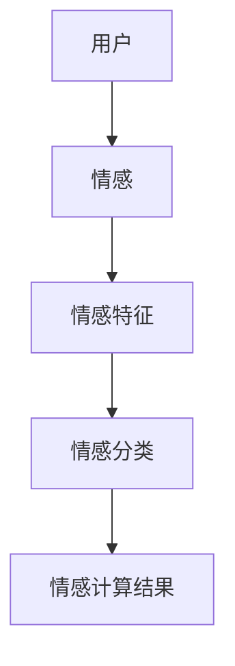
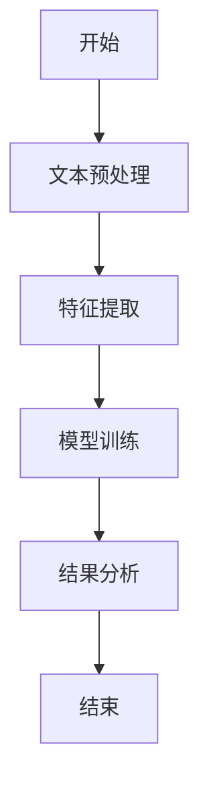
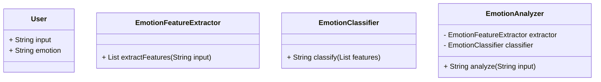
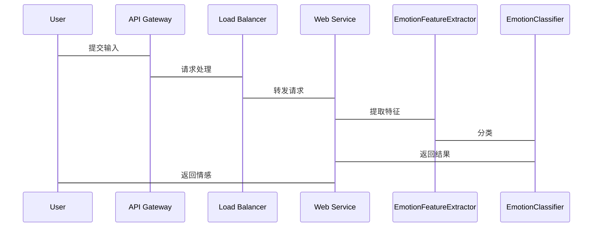

                 


# AI Agent的情感智能：利用LLM实现情感计算

---

## 关键词：AI Agent, 情感计算, LLM, 大语言模型, 情感分析

---

## 摘要：本文探讨了AI Agent如何利用大语言模型（LLM）实现情感计算，从基础概念到实际应用，详细介绍了情感计算的核心原理、算法实现、系统架构以及项目实战，为技术开发者和研究人员提供全面的指导。

---

# 第一部分：AI Agent的情感智能基础

## 第1章：情感计算与AI Agent概述

### 1.1 情感计算的基本概念

#### 1.1.1 情感计算的定义
情感计算（Affective Computing）是研究如何识别、理解和模拟人类情感的计算科学分支。它旨在通过技术手段，赋予计算机理解和处理人类情感的能力。

#### 1.1.2 情感计算的核心要素
- **情感特征**：情绪类型（如快乐、悲伤）、情感强度。
- **情感分类**：将情感分为不同类别（如正面、负面、中性）。
- **情感推理**：理解情感之间的关系和逻辑。

#### 1.1.3 情感计算的背景与意义
随着人机交互的普及，情感计算在提升用户体验、智能客服、情感支持等领域具有重要意义。

### 1.2 AI Agent的定义与特点

#### 1.2.1 AI Agent的基本概念
AI Agent是一种智能实体，能够感知环境、自主决策并执行任务。

#### 1.2.2 AI Agent的核心功能
- 感知环境
- 理解需求
- 自主决策
- 执行任务

#### 1.2.3 AI Agent与传统程序的区别
AI Agent具备自主性、反应性、目标导向性和社交能力。

### 1.3 LLM在情感计算中的作用

#### 1.3.1 LLM的基本原理
大语言模型通过深度学习训练，能够理解和生成自然语言。

#### 1.3.2 LLM在情感分析中的优势
- 大规模数据训练
- 高准确性
- 实时处理能力

#### 1.3.3 LLM与情感计算的结合
LLM用于情感特征提取、情感分类和情感推理。

### 1.4 情感计算的应用场景

#### 1.4.1 情感计算在人机交互中的应用
提升用户体验，提供个性化服务。

#### 1.4.2 情感计算在智能客服中的应用
自动化处理客户情感需求。

#### 1.4.3 情感计算在社交媒体分析中的应用
实时监控情感动态，辅助决策。

---

## 第2章：情感计算的核心概念与联系

### 2.1 情感计算的原理

#### 2.1.1 情感特征提取
从文本中提取情感相关特征，如关键词、语调。

#### 2.1.2 情感分类算法
基于机器学习的分类算法，如SVM、随机森林。

#### 2.1.3 情感推理模型
基于深度学习的模型，如RNN、Transformer。

### 2.2 情感计算的核心概念对比

| **技术**       | **核心功能**                     | **优势**                          |
|----------------|----------------------------------|-----------------------------------|
| 情感计算       | 理解和处理情感                   | 高准确性、实时性                  |
| 自然语言处理   | 处理文本结构和语义               | 语言理解能力强                   |
| 机器学习       | 学习模式和规律                   | 数据驱动、适应性强               |
| 深度学习       | 学习复杂特征和关系               | 高精度、处理大规模数据           |

### 2.3 情感计算的ER实体关系图



---

## 第3章：情感计算的算法原理

### 3.1 情感计算的算法流程



### 3.2 情感分类算法实现

#### 3.2.1 文本预处理

```python
import re
from sklearn.feature_extraction.text import TfidfVectorizer

def preprocess(text):
    # 去除特殊字符
    text = re.sub(r'[^\w\s]', '', text)
    # 转换为小写
    text = text.lower()
    return text

# 示例文本
text = "I love this product!"
preprocessed_text = preprocess(text)
print(preprocessed_text)  # 输出：i love this product
```

#### 3.2.2 特征提取

```python
vectorizer = TfidfVectorizer()
X = vectorizer.fit_transform([preprocessed_text])
```

#### 3.2.3 模型训练与分类

```python
from sklearn.svm import SVC

model = SVC()
model.fit(X, y)
predicted = model.predict(X_new)
```

### 3.3 情感推理模型

#### 3.3.1 基于Transformer的情感推理

```python
import torch
import torch.nn as nn

class EmotionInference(nn.Module):
    def __init__(self, vocab_size, embedding_dim, hidden_dim):
        super(EmotionInference, self).__init__()
        self.embedding = nn.Embedding(vocab_size, embedding_dim)
        self.lstm = nn.LSTM(embedding_dim, hidden_dim, batch_first=True)
        self.fc = nn.Linear(hidden_dim, num_classes)
    
    def forward(self, x):
        embeds = self.embedding(x)
        out, _ = self.lstm(embeds)
        out = self.fc(out[:, -1, :])
        return out
```

### 3.4 情感计算的数学模型

#### 3.4.1 情感分类的损失函数

$$ L = -\sum_{i=1}^{n} y_i \log(p_i) + (1 - y_i)\log(1 - p_i) $$

---

## 第4章：系统架构与设计

### 4.1 问题场景介绍

一个情感计算系统需要处理用户输入，提取情感特征，并返回情感分类结果。

### 4.2 系统功能设计

#### 4.2.1 领域模型



#### 4.2.2 系统架构设计


#### 4.2.3 系统接口设计

| **接口名称** | **输入**           | **输出**           |
|--------------|--------------------|--------------------|
| analyze(input) | String input       | String emotion      |

#### 4.2.4 系统交互流程



---

## 第5章：项目实战

### 5.1 环境安装

```bash
pip install numpy scikit-learn torch transformers
```

### 5.2 核心实现

#### 5.2.1 数据预处理

```python
import pandas as pd
from sklearn.model_selection import train_test_split

data = pd.read_csv('emotion_data.csv')
X_train, X_test, y_train, y_test = train_test_split(data['text'], data['label'])
```

#### 5.2.2 模型训练

```python
from sklearn.svm import SVC

model = SVC()
model.fit(X_train, y_train)
```

#### 5.2.3 模型评估

```python
from sklearn.metrics import accuracy_score

y_pred = model.predict(X_test)
print(accuracy_score(y_test, y_pred))
```

### 5.3 应用案例分析

以社交媒体情感分析为例，展示如何利用训练好的模型实时分析用户评论的情感。

### 5.4 项目小结

情感计算项目的关键在于数据质量和模型调优，实际应用中需结合具体场景进行优化。

---

## 第6章：小结与展望

### 6.1 小结

本文全面介绍了AI Agent的情感智能，从理论到实践，详细讲解了情感计算的实现方法。

### 6.2 展望

未来，情感计算将更加智能化，应用场景将更加广泛，技术也将更加成熟。

### 6.3 最佳实践 Tips

- 数据质量至关重要。
- 模型调优需要结合实际场景。
- 多关注情感计算领域的最新研究。

---

## 作者：AI天才研究院/AI Genius Institute & 禅与计算机程序设计艺术/Zen And The Art of Computer Programming

---

**文章结语：** 情感计算是人工智能领域的重要分支，利用LLM实现情感智能将为AI Agent带来更强大的能力，提升人机交互的体验和效率。

