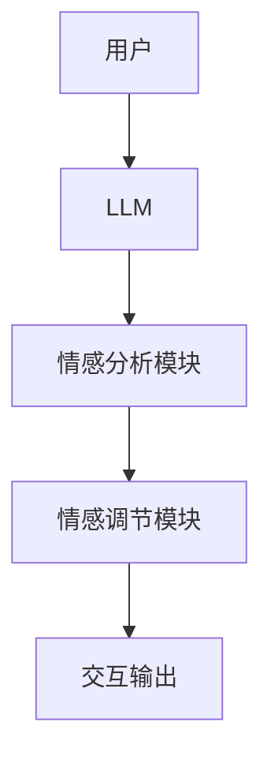
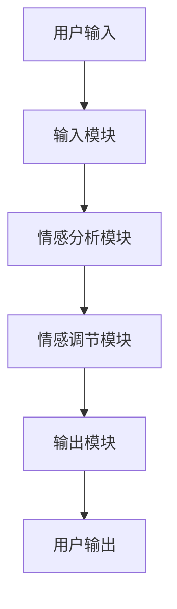
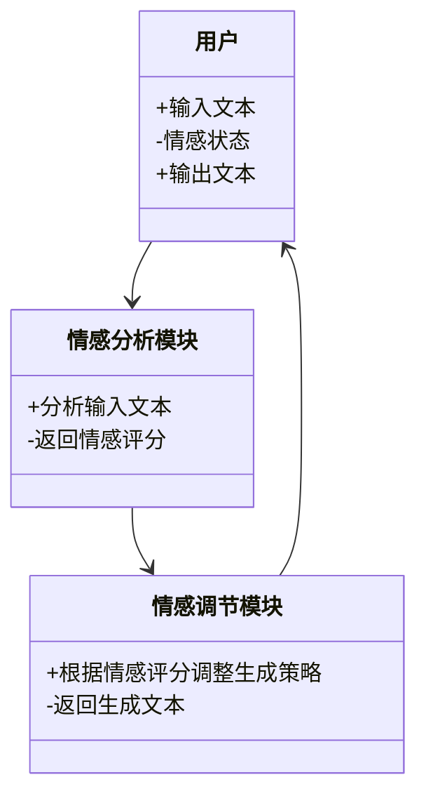
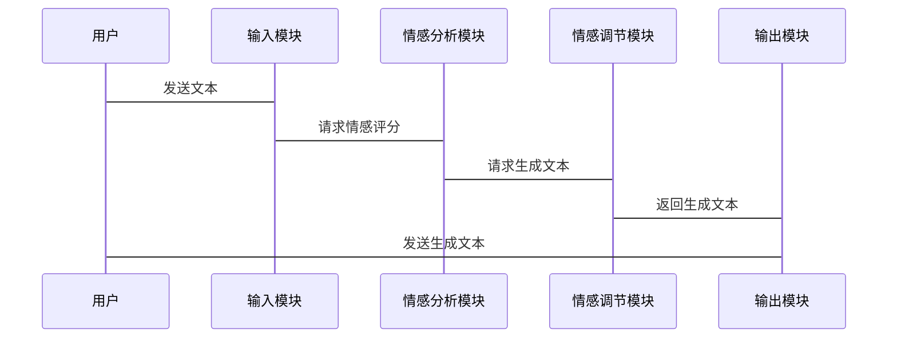

                 


# AI Agent的情感调节：利用LLM实现情绪智能交互

> 关键词：AI Agent，情感调节，LLM，情绪智能交互，情感计算，自然语言处理

> 摘要：本文深入探讨了AI Agent在情感调节中的应用，重点介绍了如何利用大型语言模型（LLM）实现情绪智能交互。通过分析情感调节的核心概念、算法原理、系统架构设计以及项目实战，本文为读者提供了从理论到实践的全面指导。

---

# 第一部分: AI Agent情感调节的背景与基础

## 第1章: AI Agent与情感调节的背景介绍

### 1.1 情感调节在AI Agent中的重要性

#### 1.1.1 问题背景与挑战
在人机交互领域，AI Agent（智能体）需要与用户进行自然、流畅的对话。然而，现有的AI Agent在情感理解与调节方面存在以下问题：
- **情感理解不足**：无法准确识别用户的情感状态。
- **情感表达单一**：在对话中缺乏情感变化，显得机械。
- **情感调节能力有限**：无法根据用户情感反馈进行实时调整。

#### 1.1.2 情感调节的核心目标
情感调节的目标是通过AI Agent的交互能力，动态调整对话的情感倾向，使用户感受到更自然、更贴心的对话体验。

#### 1.1.3 情感调节的边界与外延
- **边界**：情感调节不涉及深度心理分析，仅限于表面情感状态的识别与调整。
- **外延**：情感调节可以结合其他技术（如个性化推荐）提升用户体验。

### 1.2 情感调节的核心概念与联系

#### 1.2.1 情感调节的原理与机制
情感调节通过以下步骤实现：
1. **情感识别**：分析用户输入，确定情感状态。
2. **情感分析**：量化情感强度。
3. **情感调节**：根据情感状态调整对话策略。

#### 1.2.2 情感调节与LLM的关系
- **LLM的优势**：LLM（大型语言模型）具备强大的文本生成能力和语义理解能力，能够辅助情感调节。
- **情感调节对LLM的补充**：通过情感调节，LLM可以生成更符合用户情感需求的回复。

#### 1.2.3 情感调节的属性特征对比表
| 特性 | 描述 |
|------|------|
| 情感识别 | 通过文本分析用户情感状态 |
| 情感生成 | 根据情感状态生成相应回复 |
| 情感调节 | 动态调整情感强度，使对话更自然 |

#### 1.2.4 情感调节的ER实体关系图


### 1.3 情感调节的数学模型与公式

#### 1.3.1 情感评分计算公式
情感评分用于量化用户情感强度：
$$ \text{情感评分} = \sum_{i=1}^{n} w_i \cdot e_i $$
其中，$w_i$ 是情感特征的权重，$e_i$ 是情感特征的值。

#### 1.3.2 情感调节的优化目标
目标是最小化情感预测误差：
$$ \min_{\theta} \sum_{i=1}^{m} (y_i - f(x_i))^2 $$
其中，$y_i$ 是目标情感值，$f(x_i)$ 是模型预测值。

## 1.4 本章小结
本章介绍了情感调节在AI Agent中的重要性，探讨了情感调节的核心概念与机制，并通过数学公式和图表展示了情感调节的基本原理。

---

## 第2章: AI Agent与LLM的基本概念

### 2.1 AI Agent的基本概念

#### 2.1.1 AI Agent的定义与分类
- **定义**：AI Agent是一种能够感知环境并采取行动以实现目标的智能实体。
- **分类**：根据智能水平分为简单AI Agent和复杂AI Agent。

#### 2.1.2 AI Agent的核心功能与特点
- **核心功能**：感知、决策、行动、学习。
- **特点**：自主性、反应性、目标导向。

#### 2.1.3 AI Agent与传统程序的区别
- **自主性**：AI Agent能够自主决策，而传统程序依赖外部指令。
- **适应性**：AI Agent能够学习和适应环境变化。

### 2.2 LLM的基本原理

#### 2.2.1 LLM的定义与特点
- **定义**：大型语言模型是一种基于深度学习的自然语言处理模型。
- **特点**：强大的文本生成能力、语义理解能力。

#### 2.2.2 LLM的训练过程与数学模型
- **训练过程**：基于大量文本数据进行无监督学习。
- **数学模型**：使用概率模型计算文本生成概率。

#### 2.2.3 LLM在情感调节中的应用潜力
- **情感分析**：识别用户情感状态。
- **情感生成**：根据情感状态生成相应回复。

### 2.3 AI Agent与LLM的结合

#### 2.3.1 LLM作为AI Agent的核心模块
- **LLM的作用**：提供语义理解和生成能力。
- **AI Agent的作用**：协调LLM与其他模块（如情感调节模块）的交互。

#### 2.3.2 LLM与情感调节的结合
- **情感分析**：通过LLM分析用户情感。
- **情感生成**：根据情感调节结果生成回复。

## 2.4 本章小结
本章介绍了AI Agent和LLM的基本概念，探讨了两者结合的潜力与优势。

---

## 第3章: 情感计算的原理与实现

### 3.1 情感计算的基本原理

#### 3.1.1 情感计算的定义与目标
- **定义**：通过计算方法分析和模拟人类情感。
- **目标**：实现情感识别、情感生成和情感调节。

#### 3.1.2 情感计算的核心算法
- **情感识别算法**：基于文本的情感分析。
- **情感生成算法**：根据情感状态生成文本。

### 3.2 情感计算的实现步骤

#### 3.2.1 情感识别
- **步骤**：
  1. 文本预处理（分词、去除停用词）。
  2. 文本向量化（如词袋模型、词嵌入）。
  3. 情感分类（如SVM、神经网络）。

#### 3.2.2 情感生成
- **步骤**：
  1. 确定目标情感状态。
  2. 生成与目标情感匹配的文本。

#### 3.2.3 情感调节
- **步骤**：
  1. 根据当前情感评分调整文本生成策略。
  2. 输出情感评分符合目标的文本。

### 3.3 情感计算的数学模型

#### 3.3.1 情感评分计算公式
$$ \text{情感评分} = \sum_{i=1}^{n} w_i \cdot e_i $$

#### 3.3.2 情感调节的优化目标
$$ \min_{\theta} \sum_{i=1}^{m} (y_i - f(x_i))^2 $$

### 3.4 本章小结
本章详细介绍了情感计算的基本原理与实现步骤，并通过数学公式展示了情感评分计算与调节优化的目标。

---

## 第4章: AI Agent情感调节系统的设计与实现

### 4.1 系统架构设计

#### 4.1.1 系统功能模块划分
- **输入模块**：接收用户输入。
- **情感分析模块**：分析用户情感状态。
- **情感调节模块**：根据情感状态调整生成策略。
- **输出模块**：生成并输出调整后的回复。

#### 4.1.2 系统架构图


### 4.2 系统功能设计

#### 4.2.1 领域模型设计


#### 4.2.2 系统交互设计


### 4.3 系统实现细节

#### 4.3.1 环境配置
- **语言**：Python
- **框架**：Flask或Django
- **模型**：使用预训练LLM（如GPT-3）

#### 4.3.2 核心代码实现
```python
def情感分析模块(text):
    # 假设调用预训练模型进行情感分析
    return 情感评分

def情感调节模块(情感评分):
    # 根据情感评分调整生成策略
    return 调整后的生成文本

def输出模块(调整后的生成文本):
    print(调整后的生成文本)
```

### 4.4 本章小结
本章详细介绍了AI Agent情感调节系统的架构设计与实现细节，并通过mermaid图展示了系统各部分的协作关系。

---

## 第5章: 项目实战与案例分析

### 5.1 项目实战

#### 5.1.1 环境安装
- **Python**：3.8+
- **库**：Hugging Face Transformers、Flask

#### 5.1.2 核心代码实现
```python
from transformers import pipeline

# 初始化情感分析管道
sentiment_pipeline = pipeline("sentiment-analysis")

# 情感调节函数
def调节情感(text):
    # 分析情感
    result = sentiment_pipeline(text)
    情感评分 = result[0]['score']
    # 调节情感
    if 情感评分 < 0.5:
        return "我理解您的担忧，我们可以一起解决这个问题。"
    else:
        return "非常高兴听到您对我们的服务满意！"

# 输出模块
def输出模块(调整后的生成文本):
    print(调整后的生成文本)
```

#### 5.1.3 实际案例分析
- **案例1**：用户输入“我感到很沮丧”，系统输出“我理解您的担忧，我们可以一起解决这个问题。”
- **案例2**：用户输入“我非常高兴”，系统输出“非常高兴听到您对我们的服务满意！”

### 5.2 案例分析与解读

#### 5.2.1 案例分析
- **案例1分析**：
  - 用户情感评分：0.3（负面）
  - 系统回复：调整情感至正面，提供支持性回复。
- **案例2分析**：
  - 用户情感评分：0.8（正面）
  - 系统回复：保持正面情感，表达感谢。

#### 5.2.2 案例解读
- **情感识别的准确性**：依赖于模型的训练数据。
- **情感调节的策略**：根据情感评分动态调整回复策略。

### 5.3 本章小结
本章通过实际项目和案例分析，展示了AI Agent情感调节系统在实际应用中的效果与优势。

---

## 第6章: 最佳实践与未来展望

### 6.1 最佳实践

#### 6.1.1 情感调节的注意事项
- **数据隐私**：确保用户数据的安全性。
- **模型优化**：定期更新模型以提升情感识别的准确性。
- **用户体验**：保持对话的自然流畅，避免机械化的回复。

#### 6.1.2 情感调节的优化建议
- **结合个性化特征**：根据用户历史行为调整情感调节策略。
- **多模态交互**：结合视觉、语音等多模态信息提升情感调节的准确性。

### 6.2 小结

### 6.3 未来展望

#### 6.3.1 情感调节的未来发展
- **更精细的情感识别**：从二分类扩展到多分类。
- **更智能的情感调节**：结合上下文和用户历史行为进行动态调整。

#### 6.3.2 技术趋势
- **多模态情感计算**：结合视觉、语音等信息。
- **实时性优化**：提升情感调节的实时性与响应速度。

### 6.4 本章小结
本章总结了情感调节的注意事项与优化建议，并展望了未来的发展方向。

---

# 第七章: 总结与展望

## 7.1 总结
本文深入探讨了AI Agent情感调节的核心概念、算法原理与系统实现，并通过实际案例展示了情感调节在实际应用中的效果。

## 7.2 展望
未来，随着LLM技术的不断进步，情感调节将更加智能化、个性化，为AI Agent与人类交互带来更自然、更贴心的体验。

---

# 作者

**作者：AI天才研究院/AI Genius Institute & 禅与计算机程序设计艺术 /Zen And The Art of Computer Programming**

