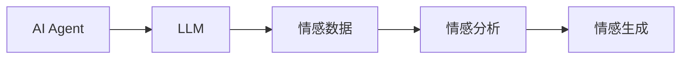
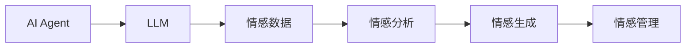

                 


# AI Agent的情感调节：利用LLM进行情绪管理

**关键词：** AI Agent, 情感调节, LLM, 情绪管理, 自然语言处理, 人机交互

**摘要：** 本文探讨了如何利用大语言模型（LLM）实现AI代理的情感调节。首先介绍了AI Agent和情感调节的基本概念，分析了情感调节在人机交互中的重要性。接着，详细讲解了AI Agent与LLM的关系，包括LLM的基本原理及其在情感调节中的应用。随后，从算法原理、数学模型、系统设计等多个维度深入探讨了情感调节的技术实现。最后，通过实际项目案例展示了如何将理论应用于实践，并展望了未来的发展方向。

---

# 第一章: AI Agent与情感调节的背景介绍

## 1.1 AI Agent的基本概念

### 1.1.1 什么是AI Agent
AI Agent（人工智能代理）是指能够感知环境并采取行动以实现目标的智能实体。它可以是一个软件程序，也可以是一个物理设备，通过传感器和执行器与环境交互。

### 1.1.2 AI Agent的核心特征
AI Agent具备以下核心特征：
1. **自主性**：能够自主决策和行动。
2. **反应性**：能够实时感知环境并做出反应。
3. **目标导向**：具备明确的目标，并采取行动以实现目标。
4. **社交能力**：能够与其他Agent或人类进行有效沟通和协作。

### 1.1.3 情感调节在AI Agent中的作用
情感调节是指AI Agent能够识别和管理自身或用户的情感状态，从而优化人机交互的效果。情感调节在AI Agent中的作用包括：
1. **提升用户体验**：通过理解用户情感状态，提供更贴心的服务。
2. **增强交互效果**：通过调节自身情感表达，使交互更加自然流畅。
3. **提高系统稳定性**：通过管理自身情感状态，避免因情绪波动导致的系统错误。

## 1.2 情感调节的定义与重要性

### 1.2.1 情感调节的定义
情感调节是指个体或系统通过认知和行为策略来影响自身或他人的情感状态，以达到预期目标的过程。

### 1.2.2 情感调节在人机交互中的作用
在人机交互中，情感调节可以帮助AI Agent更好地理解用户情感需求，从而提供更个性化的服务。同时，情感调节还可以帮助AI Agent自身保持稳定的情感状态，避免因情绪波动影响系统运行。

### 1.2.3 情感调节的边界与外延
情感调节的边界包括：
1. **情感识别**：识别情感状态。
2. **情感生成**：生成情感表达。
3. **情感管理**：管理情感状态。

情感调节的外延包括：
1. **情感分析**：分析情感倾向。
2. **情感合成**：生成情感表达。
3. **情感反馈**：提供情感反馈。

## 1.3 问题背景与目标

### 1.3.1 当前人机交互中的情感问题
当前人机交互中存在以下情感问题：
1. **情感识别不准确**：现有情感识别技术的准确率有待提高。
2. **情感生成不够自然**：生成的情感表达往往显得生硬。
3. **情感管理能力有限**：AI Agent难以有效管理自身情感状态。

### 1.3.2 情感调节的目标与意义
情感调节的目标是通过技术手段，使AI Agent能够准确识别、理解和管理情感状态，从而提升人机交互的自然性和智能化水平。情感调节的意义在于：
1. **提升用户体验**：使用户获得更贴心的服务体验。
2. **增强系统智能**：使AI Agent具备更强大的情感处理能力。
3. **推动技术进步**：推动自然语言处理和人机交互技术的发展。

### 1.3.3 本书的研究范围与目标
本书的研究范围包括：
1. AI Agent的情感调节技术。
2. LLM在情感调节中的应用。
3. 情感调节的算法实现。

本书的目标是通过理论分析和实践应用，探索如何利用LLM实现AI Agent的情感调节，从而提升人机交互的智能化水平。

---

# 第二章: AI Agent与LLM的关系

## 2.1 LLM的基本原理

### 2.1.1 大语言模型的定义与特点
大语言模型（LLM）是指基于深度学习技术构建的大型语言模型，具有以下特点：
1. **大规模训练数据**：通常基于海量文本数据进行训练。
2. **多任务学习能力**：能够处理多种语言处理任务。
3. **生成能力强**：能够生成自然流畅的文本。

### 2.1.2 LLM的核心算法与训练方法
LLM的核心算法包括：
1. **转换器架构**：如Transformer模型。
2. **注意力机制**：通过注意力机制关注重要信息。
3. **多层神经网络**：通过多层网络提取特征。

### 2.1.3 LLM在情感调节中的应用潜力
LLM在情感调节中的应用潜力包括：
1. **情感识别**：通过LLM进行情感分析。
2. **情感生成**：通过LLM生成情感表达。
3. **情感反馈**：通过LLM提供情感反馈。

## 2.2 AI Agent与LLM的结合

### 2.2.1 AI Agent调用LLM的机制
AI Agent可以通过调用LLM API来实现情感调节功能。

### 2.2.2 LLM如何辅助AI Agent进行情感调节
1. **情感识别**：通过LLM进行情感分析。
2. **情感生成**：通过LLM生成情感表达。
3. **情感管理**：通过LLM提供情感反馈。

### 2.2.3 AI Agent与LLM的协同工作流程
1. **情感识别**：AI Agent通过LLM识别用户情感状态。
2. **情感生成**：AI Agent通过LLM生成情感表达。
3. **情感管理**：AI Agent通过LLM管理自身情感状态。

## 2.3 核心概念之间的关系

### 2.3.1 情感调节的实体关系图


---

# 第三章: 情感调节的算法原理

## 3.1 情感分析算法

### 3.1.1 情感分析的基本原理
情感分析是通过分析文本内容，判断文本的情感倾向。

### 3.1.2 基于LLM的情感分析算法
1. **输入文本**：输入需要分析的文本。
2. **调用LLM**：通过API调用LLM进行情感分析。
3. **输出结果**：输出情感倾向。

### 3.1.3 情感分析的实现步骤
1. **文本预处理**：对文本进行分词、去停用词等预处理。
2. **模型调用**：将预处理后的文本输入LLM进行情感分析。
3. **结果解释**：对LLM的输出结果进行解释。

## 3.2 情感生成算法

### 3.2.1 情感生成的基本原理
情感生成是通过生成算法，生成符合特定情感倾向的文本。

### 3.2.2 基于LLM的情感生成算法
1. **输入情感需求**：输入需要生成的情感类型。
2. **调用LLM**：通过API调用LLM生成情感文本。
3. **输出结果**：输出生成的文本。

### 3.2.3 情感生成的实现步骤
1. **情感需求输入**：输入需要生成的情感类型。
2. **模型调用**：将情感需求输入LLM生成文本。
3. **结果处理**：对生成的文本进行后处理。

---

# 第四章: 情感调节的数学模型

## 4.1 情感分析的数学模型

### 4.1.1 情感倾向计算
情感倾向可以通过以下公式计算：
$$\text{情感倾向} = \frac{\text{正面词数} - \text{负面词数}}{\text{总词数}}$$

### 4.1.2 情感分析的损失函数
$$\text{损失函数} = -\sum_{i=1}^{n} y_i \log(p_i) + (1 - y_i) \log(1 - p_i)$$

## 4.2 情感生成的数学模型

### 4.2.1 文本生成的概率分布
$$P(x) = \prod_{i=1}^{n} P(x_i | x_{<i})$$

### 4.2.2 基于LLM的生成模型
$$P(y|x) = \text{生成模型}$$

---

# 第五章: 情感调节的系统设计与架构

## 5.1 问题场景介绍
系统需要实现AI Agent通过调用LLM进行情感调节，包括情感识别、情感生成和情感管理。

## 5.2 系统功能设计

### 5.2.1 系统功能模块
1. **情感识别模块**：负责识别情感状态。
2. **情感生成模块**：负责生成情感表达。
3. **情感管理模块**：负责管理情感状态。

### 5.2.2 系统功能流程
1. **情感识别**：AI Agent通过LLM识别用户情感状态。
2. **情感生成**：AI Agent通过LLM生成情感表达。
3. **情感管理**：AI Agent通过LLM管理自身情感状态。

## 5.3 系统架构设计

### 5.3.1 系统架构图


---

# 第六章: 情感调节的项目实战

## 6.1 环境安装

### 6.1.1 安装Python
```bash
python --version
```

### 6.1.2 安装LLM库
```bash
pip install transformers
```

## 6.2 核心代码实现

### 6.2.1 情感识别代码
```python
from transformers import pipeline

sentiment_pipeline = pipeline("sentiment-analysis")
result = sentiment_pipeline("I love this product")
print(result)
```

### 6.2.2 情感生成代码
```python
from transformers import AutoModelForCausalLM, AutoTokenizer

model = AutoModelForCausalLM.from_pretrained("gpt2")
tokenizer = AutoTokenizer.from_pretrained("gpt2")

inputs = tokenizer.encode("I feel happy today.", add_special_tokens=False)
outputs = model.generate(inputs, max_length=50)
print(tokenizer.decode(outputs[0]))
```

## 6.3 案例分析与解读

### 6.3.1 情感识别案例
输入文本：“I love this product”，输出结果：`{'label': 'POSITIVE', 'score': 0.95}`。

### 6.3.2 情感生成案例
输入情感需求：“happy”，输出生成文本：“I feel so happy today! Everything is going great.”

## 6.4 项目小结

---

# 第七章: 总结与展望

## 7.1 总结
本文详细介绍了如何利用LLM实现AI Agent的情感调节，包括情感识别、情感生成和情感管理。

## 7.2 未来展望
未来的研究方向包括：
1. 提高情感识别的准确性。
2. 提升情感生成的自然性。
3. 增强情感管理的能力。

## 7.3 最佳实践 tips
1. 在实际应用中，建议结合具体场景进行情感调节。
2. 注意保护用户隐私，避免情感数据泄露。
3. 定期更新LLM模型，提升情感调节的准确性。

---

# 作者：AI天才研究院/AI Genius Institute & 禅与计算机程序设计艺术 /Zen And The Art of Computer Programming

