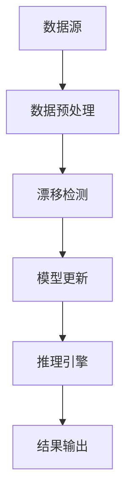

                 


# AI Agent的持续学习与概念漂移适应策略

---

## 关键词：
- AI Agent
- 持续学习
- 概念漂移
- 在线学习
- 动态数据

---

## 摘要：
本文深入探讨了AI Agent在持续学习和概念漂移适应方面的理论与实践。首先，我们介绍了AI Agent的基本概念及其在现代应用中的重要性，随后分析了持续学习和概念漂移适应的背景与挑战。接着，我们详细讲解了持续学习与概念漂移适应的核心原理，包括相关的数学模型和算法流程。通过实际案例分析和系统架构设计，我们展示了如何将这些理论应用于实际项目中，最后总结了最佳实践和未来研究方向。

---

## 第一部分: AI Agent与持续学习概述

---

### 第1章: AI Agent的基本概念

#### 1.1 AI Agent的定义与特征
- **定义**: AI Agent是一个能够感知环境、执行任务并做出决策的智能实体。
- **特征**:
  - **自主性**: 能够自主决策。
  - **反应性**: 能够实时响应环境变化。
  - **学习能力**: 能够通过经验改进性能。
  - **社交能力**: 能够与其他Agent或人类交互。

#### 1.2 持续学习的背景与重要性
- **背景**: 在动态环境中，AI Agent需要不断适应新数据和新任务。
- **重要性**: 持续学习使AI Agent能够保持高性能，避免模型过时。

---

### 第2章: 持续学习的核心概念

#### 2.1 在线学习与持续学习的区别
- **在线学习**: 数据按顺序到达，模型逐步更新。
- **持续学习**: 更广泛的概念，包括在线学习和其他增量学习方法。

#### 2.2 持续学习的原理
- **增量学习**: 逐步处理数据流，避免重新训练整个模型。
- **记忆机制**: 保留关键信息，防止遗忘旧知识。

---

## 第二部分: 概念漂移适应的挑战与策略

---

### 第3章: 概念漂移的定义与挑战

#### 3.1 概念漂移的定义
- **定义**: 数据分布或任务目标的随时间变化，导致模型性能下降。

#### 3.2 概念漂移的类型
- **突然漂移**: 突然发生的变化，如市场需求骤变。
- **渐进漂移**: 缓慢的变化，如用户偏好的逐渐转移。

#### 3.3 概念漂移对企业AI系统的挑战
- **模型失效**: 旧模型无法适应新数据。
- **维护成本**: 频繁更新模型需要大量资源。

---

### 第4章: 概念漂移适应的核心策略

#### 4.1 漂移检测方法
- **统计方法**: 使用分布差异性指标，如KL散度。
- **基于模型的方法**: 监控模型性能变化，判断是否需要更新。

#### 4.2 动态模型更新策略
- **增量训练**: 在新数据上微调模型。
- **模型融合**: 结合旧模型和新模型，平衡稳定性和适应性。

---

## 第三部分: 算法原理与系统架构设计

---

### 第5章: 持续学习的算法实现

#### 5.1 增量学习算法
- **算法流程**:
  1. 接收新数据样本。
  2. 使用当前模型预测结果。
  3. 计算损失，更新模型参数。

#### 5.2 任务迁移学习算法
- **核心思想**: 利用旧任务的知识辅助新任务的学习。

#### 5.3 模型蒸馏算法
- **核心思想**: 使用教师模型指导学生模型学习。

---

### 第6章: 概念漂移适应的系统架构设计

#### 6.1 系统功能模块
- **数据采集模块**: 实时收集新数据。
- **漂移检测模块**: 监控数据分布变化。
- **模型更新模块**: 根据漂移情况调整模型。

#### 6.2 系统架构图


---

## 第四部分: 项目实战与最佳实践

---

### 第7章: 项目实战

#### 7.1 环境安装
```bash
pip install numpy scikit-learn tensorflow
```

#### 7.2 核心代码实现
```python
import numpy as np
from sklearn.linear_model import SGDClassifier
from tensorflow.keras import Sequential
from tensorflow.keras.layers import Dense

# 初始化模型
model = Sequential([
    Dense(64, activation='relu', input_shape=(n_features,)),
    Dense(1, activation='sigmoid')
])

# 编译模型
model.compile(optimizer='adam', loss='binary_crossentropy', metrics=['accuracy'])

# 模型训练
model.fit(X_train, y_train, epochs=10, batch_size=32)
```

#### 7.3 案例分析
- **案例**: 在线广告点击率预测。
- **实施步骤**:
  1. 数据流处理。
  2. 漂移检测。
  3. 模型更新。

---

### 第8章: 最佳实践与小结

#### 8.1 最佳实践
- **定期监控**: 定期检查数据分布变化。
- **模型多样性**: 使用多种模型技术降低风险。
- **快速迭代**: 及时更新模型以应对变化。

#### 8.2 小结
本文系统介绍了AI Agent的持续学习与概念漂移适应策略，结合理论与实践，为实际应用提供了参考。

---

## 作者：
作者：AI天才研究院 & 禅与计算机程序设计艺术

