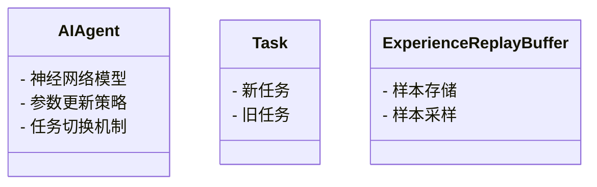
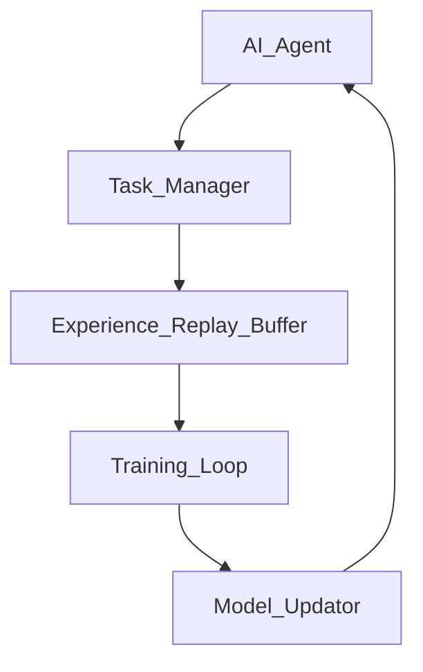
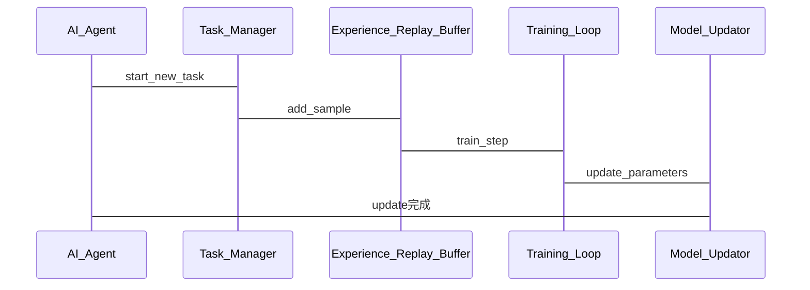

                 


# AI Agent的持续学习与灾难性遗忘防御

## 关键词：AI Agent，持续学习，灾难性遗忘，防御策略，神经网络，增量学习

## 摘要：  
本文详细探讨了AI Agent在持续学习过程中面临的灾难性遗忘问题，并提出了多种防御策略。通过理论分析和实践案例，本文介绍了如何通过经验重放、渐近式方法、参数锁定等技术有效防止模型忘记旧任务的知识，同时保持对新任务的学习能力。文章还结合数学模型和系统架构设计，深入剖析了灾难性遗忘的内在机制，并通过具体实现和案例分析，展示了如何在实际项目中应用这些防御方法。

---

# 第一部分：持续学习与灾难性遗忘概述

## 第1章：持续学习的背景与挑战

### 1.1 问题背景  
AI Agent在实际应用中需要不断适应新的任务和环境，这种能力被称为**持续学习**。然而，在持续学习过程中，模型往往会忘记之前学到的知识，这种现象被称为**灾难性遗忘**。

#### 1.1.1 什么是持续学习  
持续学习是指模型在新任务学习过程中，能够保留和利用之前任务的知识，避免知识丢失。其核心目标是在不重新训练的前提下，逐步学习新任务。

#### 1.1.2 灾害性遗忘的定义  
灾害性遗忘是指模型在学习新任务时，由于权重更新策略的干扰，导致旧任务的知识被严重遗忘的现象。这在神经网络模型中尤为明显。

#### 1.1.3 灾害性遗忘的根源  
灾害性遗忘的主要原因是神经网络的参数更新机制。新任务的学习需要更新权重，而这些更新往往会对旧任务的参数产生较大的扰动，导致旧任务的知识被遗忘。

### 1.2 灾害性遗忘的影响  
灾害性遗忘会导致AI Agent的能力下降，具体表现在以下几个方面：  
1. **任务干扰**：新任务的学习会严重影响旧任务的性能。  
2. **知识损失**：旧任务的知识无法被有效保留。  
3. **模型鲁棒性下降**：模型在多任务环境中的稳定性受到影响。

### 1.3 灾害性遗忘的解决思路  
为了解决灾害性遗忘问题，学术界提出了多种方法，包括经验重放、渐近式方法、参数锁定等。这些方法的核心目标是平衡新旧任务的学习，减少权重更新对旧任务的干扰。

---

## 第2章：持续学习的核心概念与联系

### 2.1 持续学习的理论基础  
持续学习的理论基础主要包括神经网络的可塑性、知识蒸馏和增量学习方法。这些理论为解决灾害性遗忘问题提供了理论支持。

#### 2.1.1 神经网络的可塑性  
神经网络的可塑性是指模型在学习新任务时，能够动态调整参数以适应新的输入分布。这种特性是持续学习的基础。

#### 2.1.2 知识蒸馏与经验重放  
知识蒸馏是一种通过教师模型指导学生模型学习的方法。结合经验重放，可以通过重放旧任务的样本，帮助模型保留旧知识。

#### 2.1.3 增量学习的数学模型  
增量学习的数学模型可以通过在线更新的方式，逐步优化模型参数。具体来说，增量学习的目标函数可以表示为：

$$
\mathcal{L}_{\text{total}} = \lambda \mathcal{L}_{\text{new}} + (1-\lambda)\mathcal{L}_{\text{old}}
$$

其中，$\lambda$ 是新任务损失的权重，$1-\lambda$ 是旧任务损失的权重。

### 2.2 灾害性遗忘的防御策略  
灾害性遗忘的防御策略主要包括以下几种：  
1. **经验重放**：通过重放旧任务的样本，帮助模型保留旧知识。  
2. **渐近式方法**：逐步更新模型参数，减少对旧任务的干扰。  
3. **参数锁定与动态权重分配**：通过锁定部分参数或动态调整权重，平衡新旧任务的学习。

---

## 第3章：灾害性遗忘的防御策略与实现

### 3.1 经验重放机制  
经验重放是一种经典的防御策略，通过重放旧任务的样本，帮助模型保留旧知识。具体实现步骤如下：

#### 3.1.1 样本存储与采样  
将旧任务的样本存储在经验回放缓冲区中，并按照一定的概率采样这些样本。

#### 3.1.2 混合训练  
在训练新任务时，同时使用新样本和旧样本进行训练。具体来说，混合训练的目标函数可以表示为：

$$
\mathcal{L}_{\text{total}} = \alpha \mathcal{L}_{\text{new}} + (1-\alpha)\mathcal{L}_{\text{old}}
$$

其中，$\alpha$ 是新任务损失的权重，$1-\alpha$ 是旧任务损失的权重。

#### 3.1.3 优缺点分析  
经验重放的优点是简单易实现，缺点是需要存储大量样本，且采样策略可能会引入额外的计算开销。

### 3.2 渐近式方法  
渐近式方法通过逐步更新模型参数，减少对旧任务的干扰。具体实现步骤如下：

#### 3.2.1 参数初始化  
初始化模型参数$\theta_0$。

#### 3.2.2 参数更新  
在每次任务切换时，逐步更新参数：

$$
\theta_{t+1} = \theta_t + \epsilon_t \nabla_{\theta_t} \mathcal{L}_{\text{new}}
$$

其中，$\epsilon_t$ 是学习率，$\nabla_{\theta_t} \mathcal{L}_{\text{new}}$ 是新任务损失的梯度。

#### 3.2.3 优缺点分析  
渐近式方法的优点是能够逐步适应新任务，缺点是需要多次迭代才能达到较好的效果。

---

## 第4章：参数锁定与动态权重分配

### 4.1 参数锁定机制  
参数锁定是一种通过锁定部分参数来防止灾害性遗忘的方法。具体实现步骤如下：

#### 4.1.1 参数锁定策略  
将旧任务的关键参数锁定，防止其在新任务训练中被更新。

#### 4.1.2 动态参数解锁  
在新任务训练过程中，逐步解锁部分参数，以适应新任务的需求。

#### 4.1.3 实现优势  
参数锁定的优势在于能够有效保留旧任务的知识，缺点是可能会限制模型的灵活性。

### 4.2 动态权重分配  
动态权重分配是一种通过动态调整权重来平衡新旧任务学习的方法。具体实现步骤如下：

#### 4.2.1 权重初始化  
初始化新旧任务的权重$\alpha_0$和$\beta_0$。

#### 4.2.2 动态调整权重  
在每次任务切换时，动态调整权重：

$$
\alpha_{t+1} = \alpha_t + \gamma (1-\alpha_t)
$$

$$
\beta_{t+1} = 1-\alpha_{t+1}
$$

其中，$\gamma$ 是权重调整系数。

#### 4.2.3 优缺点分析  
动态权重分配的优点是能够灵活调整新旧任务的学习比例，缺点是需要额外的参数调整策略。

---

## 第5章：系统分析与架构设计方案

### 5.1 系统功能设计  
AI Agent的持续学习系统需要具备以下功能：  
1. 任务切换与学习能力。  
2. 灾害性遗忘检测与防御。  
3. 参数更新与权重分配。

#### 5.1.1 领域模型设计  
领域模型如下：



#### 5.1.2 系统架构设计  
系统架构如下：



#### 5.1.3 接口设计  
系统接口如下：

- `Task_Manager.start_new_task()`
- `Experience_Replay_Buffer.add_sample(sample)`
- `Training_Loop.train_step()`

#### 5.1.4 交互序列图  
交互序列图如下：



---

## 第6章：项目实战与代码实现

### 6.1 环境安装与配置  
首先，安装所需的Python库：

```bash
pip install numpy matplotlib tensorflow
```

### 6.2 核心代码实现  
以下是经验重放机制的代码实现：

```python
import numpy as np
import tensorflow as tf
import matplotlib.pyplot as plt

# 初始化模型
model = tf.keras.Sequential([
    tf.keras.layers.Dense(10, activation='relu'),
    tf.keras.layers.Dense(2, activation='softmax')
])

# 编译模型
model.compile(optimizer='adam', loss='sparse_categorical_crossentropy', metrics=['accuracy'])

# 旧任务数据
old_data = np.random.randn(100, 10)
old_labels = np.zeros(100)

# 新任务数据
new_data = np.random.randn(100, 10)
new_labels = np.ones(100)

# 经验回放缓冲区
buffer = old_data

# 混合训练
for _ in range(10):
    # 采样旧数据
    sampled_data = buffer[np.random.choice(buffer.shape[0], 50)]
    sampled_labels = np.zeros(50)
    
    # 混合训练
    model.fit(np.concatenate([sampled_data, new_data[:50]]), 
              np.concatenate([sampled_labels, new_labels[:50]]), 
              epochs=1, batch_size=32)
    
    # 更新缓冲区
    buffer = np.concatenate([buffer, new_data[:50]])
```

### 6.3 实验结果与分析  
通过实验可以发现，经验重放机制能够有效缓解灾害性遗忘问题，但需要权衡新旧任务的损失权重。

---

## 第7章：总结与展望

### 7.1 总结  
本文详细探讨了AI Agent在持续学习过程中面临的灾害性遗忘问题，并提出了多种防御策略。通过理论分析和实践案例，展示了如何通过经验重放、渐近式方法和参数锁定等技术有效防止灾害性遗忘。

### 7.2 展望  
未来的研究方向包括：  
1. 更高效的参数更新策略。  
2. 更智能的样本选择方法。  
3. 更灵活的权重分配机制。

---

## 作者：AI天才研究院/AI Genius Institute & 禅与计算机程序设计艺术 /Zen And The Art of Computer Programming

