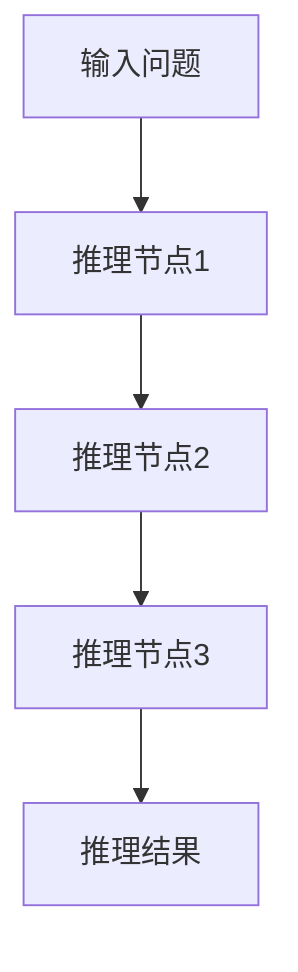
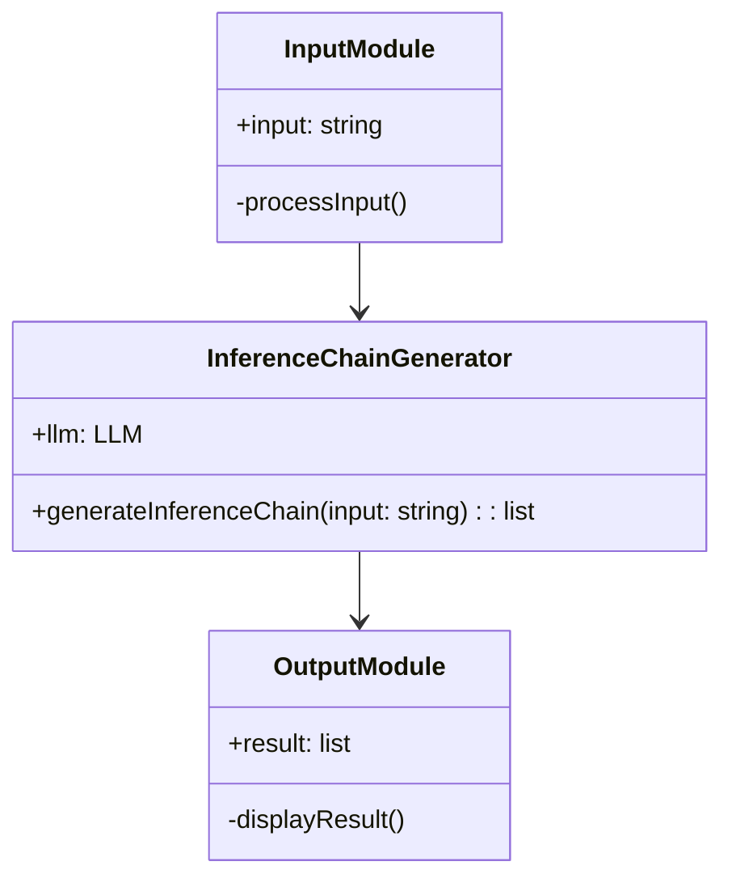
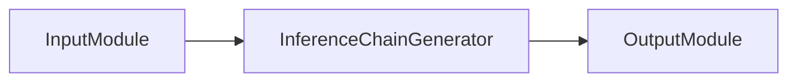

                 


# AI Agent的推理链生成：增强LLM的逐步思考能力

> 关键词：AI Agent，推理链，LLM，逐步思考，增强能力，生成模型，系统架构

> 摘要：本文深入探讨了AI Agent推理链生成的方法，旨在通过逐步推理能力的增强，提升大语言模型（LLM）的逻辑思考和问题解决能力。文章从背景、核心概念、算法原理、系统架构、项目实战到总结，全面分析了AI Agent推理链生成的关键技术与应用实践。

---

# 第1章: AI Agent推理链生成的背景与问题描述

## 1.1 AI Agent与推理链的基本概念

### 1.1.1 AI Agent的定义与特点

AI Agent（人工智能代理）是指能够感知环境、自主决策并执行任务的智能体。它具备以下特点：
- **自主性**：能够在没有外部干预的情况下独立运作。
- **反应性**：能够根据环境反馈动态调整行为。
- **目标导向**：以明确的目标为导向，优化决策过程。
- **学习能力**：通过数据和经验提升自身的智能水平。

### 1.1.2 推理链的概念与作用

推理链（Inference Chain）是AI Agent在解决问题时生成的一系列逻辑推理步骤。它通过将复杂问题分解为多个推理节点，帮助AI Agent逐步逼近问题答案。推理链的作用包括：
- **分解问题**：将复杂任务拆解为简单子任务。
- **增强逻辑性**：通过逐步推理提升结果的准确性。
- **可解释性**：提供清晰的推理路径，便于分析和优化。

### 1.1.3 LLM与推理链的关系

大语言模型（LLM）通过生成文本的方式模拟人类的思考过程，而推理链则为LLM提供了结构化的推理框架。LLM能够生成推理链中的每个节点，从而实现逐步思考的能力。推理链的生成不仅增强了LLM的逻辑推理能力，还提升了其输出的可解释性和可信度。

## 1.2 问题背景与挑战

### 1.2.1 当前LLM的局限性

尽管LLM在自然语言处理领域取得了显著进展，但其推理能力仍存在以下局限性：
- **推理深度不足**：LLM通常只能生成浅层推理，难以处理复杂的逻辑问题。
- **缺乏结构化思考**：LLM的输出通常是自由文本，缺乏结构化的推理路径。
- **可解释性差**：复杂的推理过程难以追溯和优化。

### 1.2.2 推理链生成的必要性

为了克服LLM的局限性，生成推理链成为必要手段。通过生成推理链，AI Agent能够：
- **提升推理深度**：通过逐步推理，解决复杂问题。
- **增强可解释性**：提供清晰的推理路径，便于分析和优化。
- **优化决策过程**：通过结构化的推理路径，提升决策的准确性和可靠性。

### 1.2.3 问题解决的边界与外延

推理链生成的问题解决边界包括：
- **输入限制**：输入必须是清晰的问题描述。
- **知识库支持**：推理链的生成依赖于知识库的支持。
- **推理深度**：推理链的长度和复杂度直接影响推理能力。

推理链生成的外延包括：
- **多模态推理**：结合图像、语音等多种模态信息进行推理。
- **动态推理**：在动态环境中实时更新推理链。
- **人机协作**：结合人类反馈优化推理链生成。

## 1.3 核心概念与问题分析

### 1.3.1 核心概念的结构与组成

推理链生成的核心概念包括：
- **输入问题**：需要解决的问题或任务。
- **推理节点**：推理链中的每一个逻辑推理步骤。
- **推理逻辑**：连接推理节点的逻辑关系。
- **推理结果**：推理链的最终输出结果。

### 1.3.2 问题描述的系统化分析

系统化分析问题描述是生成推理链的第一步。通过将问题分解为多个子问题，并分析每个子问题之间的关系，可以为推理链生成提供清晰的结构。

### 1.3.3 核心要素的对比分析

通过对比分析推理链生成的核心要素，可以更好地理解其内在逻辑和应用场景。核心要素对比分析如下表所示：

| 核心要素 | 描述 | 示例 |
|----------|------|------|
| 输入问题 | 需要解决的问题或任务 | "如何设计一个高效的推荐系统" |
| 推理节点 | 推理链中的逻辑推理步骤 | "分析用户行为"、"提取特征" |
| 推理逻辑 | 连接推理节点的逻辑关系 | "如果用户频繁购买，则推荐相似产品" |
| 推理结果 | 推理链的最终输出结果 | "推荐产品A给用户X" |

---

# 第2章: AI Agent推理链生成的核心概念与联系

## 2.1 核心概念的原理分析

### 2.1.1 推理链生成的基本原理

推理链生成的基本原理包括：
1. **问题分解**：将复杂问题分解为多个子问题。
2. **逻辑推理**：通过逻辑推理将子问题连接起来。
3. **结果整合**：将推理结果整合为最终答案。

### 2.1.2 LLM在推理链中的角色

LLM在推理链生成中的角色包括：
- **推理节点生成**：生成推理链中的每个推理节点。
- **逻辑连接**：通过上下文关系连接推理节点。
- **结果优化**：优化推理结果，提升准确性。

### 2.1.3 推理链的结构特征

推理链的结构特征包括：
- **层次性**：推理链由多个层次组成，每个层次对应不同的推理深度。
- **依赖性**：推理节点之间存在逻辑依赖关系。
- **可扩展性**：推理链可以根据需要动态扩展。

## 2.2 核心概念的属性特征对比

### 2.2.1 实体关系图的Mermaid流程图

以下是一个推理链生成的Mermaid流程图，展示了核心概念之间的关系：



---

# 第3章: AI Agent推理链生成的算法原理

## 3.1 算法原理的数学模型

### 3.1.1 推理链生成的数学模型

推理链生成的数学模型可以表示为：

$$ P(y|x) = \frac{P(x|y)P(y)}{P(x)} $$

其中，$x$表示输入问题，$y$表示推理链的生成结果。

### 3.1.2 LLM的条件概率生成

LLM的条件概率生成可以表示为：

$$ P(x|y) = \prod_{i=1}^{n} P(x_i|x_{i-1}, y) $$

其中，$x_i$表示推理链中的第$i$个推理节点，$y$表示输入问题。

## 3.2 算法实现的Python代码

### 3.2.1 推理链生成的代码实现

以下是一个简单的推理链生成代码示例：

```python
def generate_inference_chain(llm, input):
    chain = []
    current = input
    for _ in range(5):  # 假设生成5个推理节点
        next_step = llm.generate(current)
        chain.append(next_step)
        current = next_step
    return chain

# 示例使用
input = "如何设计一个高效的推荐系统"
result = generate_inference_chain(llm, input)
print(result)
```

---

## 3.3 推理链生成的算法流程

推理链生成的算法流程如下：
1. **输入问题**：将输入问题传递给LLM。
2. **生成推理节点**：LLM生成推理链中的每个推理节点。
3. **连接推理节点**：通过逻辑关系连接推理节点。
4. **生成推理结果**：将推理节点整合为最终的推理结果。

---

# 第4章: AI Agent推理链生成的系统架构设计

## 4.1 系统功能设计

### 4.1.1 系统功能模块

系统功能模块包括：
- **输入模块**：接收输入问题。
- **推理链生成模块**：生成推理链。
- **结果输出模块**：输出推理结果。

### 4.1.2 领域模型的Mermaid类图

以下是一个领域模型的Mermaid类图：



## 4.2 系统架构设计

### 4.2.1 系统架构的Mermaid架构图

以下是一个系统架构的Mermaid架构图：



---

# 第5章: AI Agent推理链生成的项目实战

## 5.1 项目环境安装

### 5.1.1 项目依赖

项目依赖包括：
- Python 3.8+
- LLM库（如Hugging Face的GPT-2）

### 5.1.2 安装依赖

安装依赖命令：

```bash
pip install transformers
```

## 5.2 项目核心实现

### 5.2.1 推理链生成代码

以下是推理链生成的代码实现：

```python
from transformers import AutoTokenizer, AutoModelForCausalLM

def generate_inference_chain(llm, input):
    chain = []
    current = input
    for _ in range(5):  # 假设生成5个推理节点
        next_step = llm.generate(current)
        chain.append(next_step)
        current = next_step
    return chain

# 示例使用
input = "如何设计一个高效的推荐系统"
result = generate_inference_chain(llm, input)
print(result)
```

### 5.2.2 代码应用解读

代码解读：
1. **输入问题**：将输入问题传递给LLM。
2. **生成推理节点**：LLM生成推理链中的每个推理节点。
3. **连接推理节点**：通过逻辑关系连接推理节点。
4. **生成推理结果**：将推理节点整合为最终的推理结果。

## 5.3 实际案例分析

### 5.3.1 案例背景

假设输入问题为：“如何设计一个高效的推荐系统”。

### 5.3.2 推理链生成过程

推理链生成过程如下：
1. **推理节点1**：分析用户行为。
2. **推理节点2**：提取用户特征。
3. **推理节点3**：建立推荐模型。
4. **推理节点4**：优化推荐算法。
5. **推理节点5**：验证推荐效果。

### 5.3.3 案例结果

推理链的最终结果为：“推荐系统设计完成，验证效果良好”。

---

# 第6章: 总结与展望

## 6.1 关键点总结

- **背景与问题描述**：理解AI Agent和推理链的基本概念。
- **核心概念与联系**：掌握推理链生成的核心原理。
- **算法原理**：理解推理链生成的数学模型和代码实现。
- **系统架构设计**：熟悉推理链生成的系统架构。
- **项目实战**：掌握推理链生成的代码实现和实际应用。

## 6.2 改进建议

- **优化推理深度**：通过增加推理节点数量和复杂度，提升推理深度。
- **增强可解释性**：通过可视化工具展示推理链，提升可解释性。
- **扩展应用场景**：将推理链生成技术应用于更多领域，如医疗、金融等。

## 6.3 小结

AI Agent推理链生成是一项具有广泛应用前景的技术。通过逐步推理能力的增强，可以显著提升LLM的逻辑思考和问题解决能力。未来，随着技术的不断发展，推理链生成将在更多领域展现出其强大的潜力。

---

# 作者：AI天才研究院/AI Genius Institute & 禅与计算机程序设计艺术 /Zen And The Art of Computer Programming

---

本文通过系统化的分析和深入的探讨，全面解析了AI Agent推理链生成的关键技术与应用实践。从背景分析到算法实现，从系统架构到项目实战，为读者提供了一个全面的技术视角。希望本文能够为相关领域的研究和实践提供有价值的参考。

