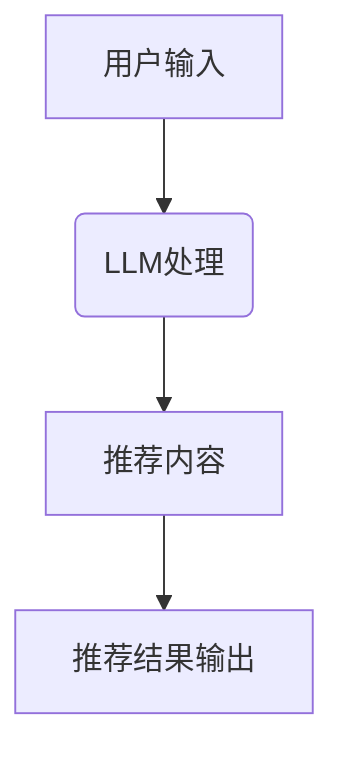
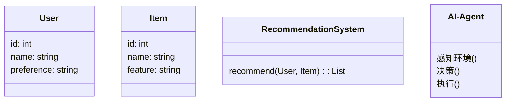
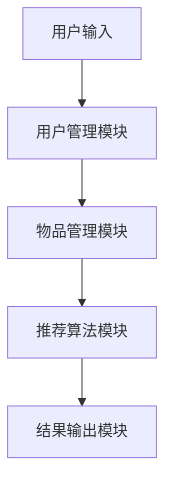
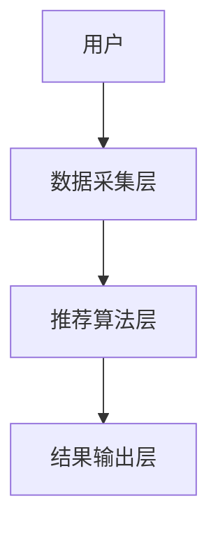

                 


# AI Agent的推荐系统：结合LLM的内容推荐

> 关键词：AI Agent, 推荐系统, LLM, 大语言模型, 内容推荐, 系统架构, 项目实战

摘要：本文将详细探讨AI Agent如何结合大语言模型（LLM）来提升推荐系统的性能和效果。通过分析推荐系统的背景、核心概念、算法原理、系统架构以及实际项目案例，我们将揭示AI Agent与LLM在内容推荐中的协同作用，并提供可操作的解决方案。

---

## 第一章: AI Agent与推荐系统背景

### 1.1 问题背景与描述

#### 1.1.1 当前推荐系统的挑战
传统的推荐系统虽然在提升用户体验方面发挥了重要作用，但仍然面临以下挑战：
- **数据稀疏性**：用户行为数据不足导致推荐精度下降。
- **实时性不足**：难以应对动态变化的需求。
- **个性化不足**：难以满足用户的长尾需求。
- **计算资源消耗大**：随着用户规模的扩大，计算成本急剧上升。

#### 1.1.2 AI Agent在推荐系统中的作用
AI Agent（人工智能代理）作为一种能够感知环境、自主决策的智能体，能够显著提升推荐系统的性能：
- **动态适应性**：AI Agent能够实时感知用户行为和环境变化，动态调整推荐策略。
- **多目标优化**：AI Agent可以在多个目标之间进行权衡，提供更全面的推荐。
- **自适应学习**：AI Agent能够通过机器学习不断优化推荐模型。

#### 1.1.3 问题解决思路与目标
通过结合AI Agent和大语言模型（LLM），我们可以实现以下目标：
1. 提高推荐系统的实时性和个性化。
2. 降低计算资源的消耗。
3. 实现更复杂的推荐策略。

---

### 1.2 AI Agent与推荐系统的核心概念

#### 1.2.1 AI Agent的基本概念
AI Agent是一种能够感知环境、自主决策并执行任务的智能体。其核心特性包括：
- **自主性**：能够在没有外部干预的情况下自主运行。
- **反应性**：能够实时感知环境并做出响应。
- **目标导向性**：具有明确的目标并致力于实现这些目标。

#### 1.2.2 推荐系统的定义与分类
推荐系统是一种通过分析用户行为和偏好，向用户推荐相关内容或产品的技术。常见的推荐系统分类包括：
- **协同过滤**：基于用户行为的相似性进行推荐。
- **基于内容的推荐**：基于物品本身的特征进行推荐。
- **混合推荐**：结合协同过滤和基于内容的推荐方法。

#### 1.2.3 两者的结合与外延
AI Agent与推荐系统的结合主要体现在以下方面：
- **动态推荐**：AI Agent能够实时感知用户行为，动态调整推荐策略。
- **多模态推荐**：结合文本、图像等多种数据类型进行推荐。
- **自适应学习**：通过机器学习不断优化推荐模型。

---

### 1.3 核心要素与概念结构

#### 1.3.1 AI Agent的属性特征
AI Agent的属性特征包括：
- **感知能力**：能够感知用户行为和环境变化。
- **决策能力**：能够基于感知信息做出决策。
- **执行能力**：能够执行推荐操作。

#### 1.3.2 推荐系统的功能模块
推荐系统的主要功能模块包括：
- **数据采集模块**：采集用户行为数据。
- **特征提取模块**：提取用户和物品的特征。
- **推荐算法模块**：基于特征生成推荐结果。
- **结果输出模块**：将推荐结果输出给用户。

#### 1.3.3 两者的实体关系图（ER图）

```mermaid
er
actor AI Agent {
  --> knowledge_base: 知识库
  --> user_profile: 用户画像
  --> recommendation_system: 推荐系统
}
knowledge_base {
  --> item_feature: 物品特征
  --> user_behavior: 用户行为
}
user_profile {
  --> user_preference: 用户偏好
}
recommendation_system {
  --> recommendation_result: 推荐结果
}
```

---

## 第二章: AI Agent与推荐系统的核心概念联系

### 2.1 核心概念原理

#### 2.1.1 AI Agent的决策机制
AI Agent的决策机制包括以下步骤：
1. **感知环境**：通过传感器或数据源感知环境信息。
2. **分析信息**：基于感知信息进行分析和推理。
3. **制定策略**：基于分析结果制定推荐策略。
4. **执行决策**：根据策略执行推荐操作。

#### 2.1.2 推荐系统的算法原理
推荐系统的算法原理包括：
1. **协同过滤**：基于用户行为的相似性进行推荐。
2. **基于内容的推荐**：基于物品特征进行推荐。
3. **混合推荐**：结合协同过滤和基于内容的推荐方法。

#### 2.1.3 两者的协同作用
AI Agent与推荐系统的协同作用体现在以下方面：
- **动态调整推荐策略**：AI Agent能够实时感知用户行为，动态调整推荐策略。
- **多模态推荐**：结合文本、图像等多种数据类型进行推荐。
- **自适应学习**：通过机器学习不断优化推荐模型。

---

### 2.2 概念属性特征对比

#### 2.2.1 AI Agent与传统推荐系统的对比
| 属性 | AI Agent | 传统推荐系统 |
|------|----------|--------------|
| 自主性 | 高       | 低           |
| 实时性 | 高       | 低           |
| 个性化 | 高       | 中           |
| 计算资源 | 低       | 高           |

#### 2.2.2 ER实体关系图
```mermaid
er
actor AI Agent {
  --> knowledge_base: 知识库
  --> user_profile: 用户画像
  --> recommendation_system: 推荐系统
}
knowledge_base {
  --> item_feature: 物品特征
  --> user_behavior: 用户行为
}
user_profile {
  --> user_preference: 用户偏好
}
recommendation_system {
  --> recommendation_result: 推荐结果
}
```

---

## 第三章: 推荐系统算法原理

### 3.1 算法原理概述

#### 3.1.1 协同过滤算法
协同过滤算法基于用户行为的相似性进行推荐。其核心步骤包括：
1. **用户相似度计算**：基于用户行为数据计算用户之间的相似度。
2. **推荐生成**：基于相似用户的偏好生成推荐。

#### 3.1.2 基于内容的推荐算法
基于内容的推荐算法基于物品特征进行推荐。其核心步骤包括：
1. **特征提取**：提取物品的特征。
2. **推荐生成**：基于物品特征生成推荐。

#### 3.1.3 混合推荐算法
混合推荐算法结合协同过滤和基于内容的推荐方法。其核心步骤包括：
1. **协同过滤推荐**：基于用户行为生成推荐。
2. **基于内容的推荐**：基于物品特征生成推荐。
3. **混合推荐结果**：将协同过滤和基于内容的推荐结果进行混合。

---

### 3.2 基于LLM的推荐算法

#### 3.2.1 大语言模型在推荐中的应用
大语言模型（LLM）在推荐中的应用包括：
1. **文本生成**：生成推荐内容。
2. **语义理解**：理解用户需求。

#### 3.2.2 LLM驱动的推荐算法流程
LLM驱动的推荐算法流程包括：
1. **用户输入**：用户输入需求。
2. **LLM处理**：LLM生成推荐内容。
3. **推荐结果输出**：输出推荐结果。

#### 3.2.3 算法流程图（Mermaid图）



---

## 第四章: 系统分析与架构设计

### 4.1 问题场景介绍

#### 4.1.1 系统目标
系统目标包括：
1. 提高推荐系统的实时性和个性化。
2. 降低计算资源的消耗。
3. 实现更复杂的推荐策略。

#### 4.1.2 使用场景
使用场景包括：
1. 电商推荐。
2. 内容推荐。
3. 社交推荐。

#### 4.1.3 用户角色
用户角色包括：
1. 普通用户。
2. 管理员。

---

### 4.2 系统功能设计

#### 4.2.1 领域模型类图（Mermaid图）



#### 4.2.2 功能模块划分
功能模块划分包括：
1. **用户管理模块**：管理用户信息。
2. **物品管理模块**：管理物品信息。
3. **推荐算法模块**：实现推荐算法。
4. **结果输出模块**：输出推荐结果。

#### 4.2.3 功能流程图（Mermaid图）



---

### 4.3 系统架构设计

#### 4.3.1 分层架构图（Mermaid图）



#### 4.3.2 组件交互设计
组件交互设计包括：
1. **用户与数据采集层**：用户输入需求，数据采集层采集用户行为数据。
2. **数据采集层与推荐算法层**：数据采集层将用户行为数据传递给推荐算法层。
3. **推荐算法层与结果输出层**：推荐算法层生成推荐结果，传递给结果输出层。

#### 4.3.3 架构设计说明
架构设计说明包括：
1. **分层设计**：将系统划分为数据采集层、推荐算法层和结果输出层。
2. **模块化设计**：每个功能模块独立设计，便于维护和扩展。

---

## 第五章: 项目实战

### 5.1 环境安装

#### 5.1.1 安装Python
```bash
python --version
pip install --upgrade pip
```

#### 5.1.2 安装LLM框架
```bash
pip install transformers
pip install torch
```

---

### 5.2 系统核心实现源代码

#### 5.2.1 推荐算法实现
```python
import torch
from transformers import AutoTokenizer, AutoModelForCausalLM

model_name = "gpt2"
tokenizer = AutoTokenizer.from_pretrained(model_name)
model = AutoModelForCausalLM.from_pretrained(model_name)

def generate_recommendation(prompt, max_length=50):
    inputs = tokenizer.encode(prompt, return_tensors="pt")
    outputs = model.generate(inputs, max_length=max_length, do_sample=True)
    return tokenizer.decode(outputs[0], skip_special_tokens=True)
```

#### 5.2.2 AI Agent实现
```python
class AI-Agent:
    def __init__(self):
        self.tokenizer = AutoTokenizer.from_pretrained("gpt2")
        self.model = AutoModelForCausal

