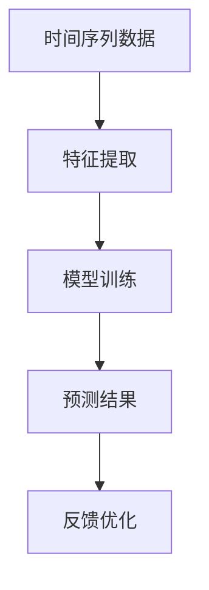
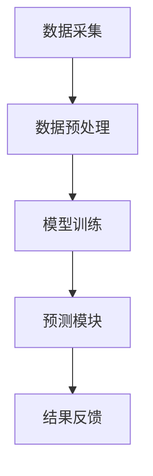
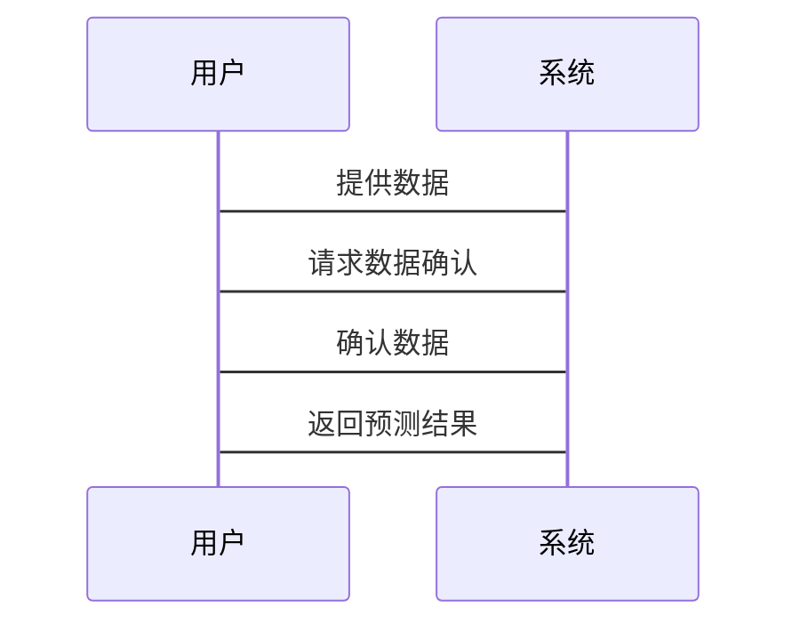

                 


# AI Agent的时序预测能力：理解和预测动态过程

> 关键词：AI Agent，时序预测，动态过程，时间序列分析，深度学习模型，系统架构设计

> 摘要：本文将深入探讨AI Agent的时序预测能力，从基础概念到算法原理，再到系统架构设计与项目实战，全面解析如何理解和实现动态过程中的预测能力。通过对比分析不同模型的特点，结合实际案例，帮助读者掌握AI Agent在时序预测中的应用。

---

# 第1章: 时序预测与AI Agent概述

## 1.1 时序预测的基本概念
### 1.1.1 时间序列分析的定义
时间序列分析是一种通过观察时间数据的变化规律，预测未来趋势的数学方法。它通过分析数据的周期性、趋势性和随机性，建立数学模型，从而实现对未来状态的预测。

### 1.1.2 AI Agent的核心特点
AI Agent是一种智能体，能够感知环境、自主决策并采取行动。它具备学习、推理和自适应能力，能够在动态环境中实时调整策略。

### 1.1.3 动态过程中的时序预测
动态过程是指系统状态随时间不断变化的过程。时序预测在动态过程中至关重要，因为它可以帮助AI Agent提前预知未来的状态，从而做出更优的决策。

## 1.2 AI Agent与时序预测的关系
### 1.2.1 AI Agent的定义与特点
AI Agent通过感知环境信息，利用算法处理数据，生成预测结果，并根据结果采取行动。其核心能力包括数据处理、模型训练和预测推理。

### 1.2.2 时序预测在AI Agent中的作用
时序预测是AI Agent在动态环境中实现智能决策的关键能力。它通过预测未来状态，帮助AI Agent提前规划行动，优化资源分配。

### 1.2.3 动态过程中的预测需求
在动态过程中，系统状态不断变化，传统的静态模型难以适应。时序预测能够捕捉动态变化，为AI Agent提供实时反馈和调整依据。

## 1.3 时序预测的应用场景
### 1.3.1 金融时间序列预测
金融市场的价格波动复杂，时序预测帮助投资者预判市场趋势，优化投资策略。

### 1.3.2 智能交通系统中的预测
智能交通系统通过预测车流量变化，优化信号灯控制，提高道路通行效率。

### 1.3.3 工业自动化中的动态过程预测
工业自动化中，设备运行状态的预测帮助预防故障，降低生产中断风险。

## 1.4 本章小结
时序预测是AI Agent在动态环境中实现智能决策的核心能力，其在金融、交通和工业等领域有广泛应用。

---

# 第2章: 时序预测的核心概念

## 2.1 时间序列分析的基本原理
### 2.1.1 时间序列的组成部分
时间序列通常包括趋势、周期性、季节性和随机性成分。这些成分相互作用，构成了数据的动态变化。

### 2.1.2 时间序列的平稳性
平稳性是指时间序列的统计特性在时间推移中保持不变。平稳时间序列适合使用ARIMA等经典模型。

### 2.1.3 时间序列的预测模型分类
时间序列预测模型可分为统计模型（如ARIMA）、机器学习模型（如支持向量回归）和深度学习模型（如LSTM、Transformer）。

## 2.2 AI Agent中的时序预测模型
### 2.2.1 基于统计的方法
ARIMA模型通过捕捉数据的自相关性，预测未来趋势。其核心公式为：
$$ ARIMA(p, d, q) $$
其中，$p$为自回归阶数，$d$为差分阶数，$q$为移动平均阶数。

### 2.2.2 基于机器学习的方法
支持向量回归（SVR）通过构建非线性回归模型，捕捉数据的复杂关系。其核心公式为：
$$ y = f(x) + \epsilon $$
其中，$f(x)$为回归函数，$\epsilon$为误差项。

### 2.2.3 基于深度学习的方法
长短期记忆网络（LSTM）通过记忆单元捕捉长期依赖关系，适用于处理复杂的时间序列数据。其核心公式为：
$$
\begin{cases}
i_t = \sigma(W_i x_t + U_i h_{t-1}) \\
f_t = \sigma(W_f x_t + U_f h_{t-1}) \\
o_t = \sigma(W_o x_t + U_o h_{t-1}) \\
g_t = \tanh(W_g x_t + U_g h_{t-1}) \\
h_t = i_t \cdot g_t + f_t \cdot h_{t-1}
\end{cases}
$$

## 2.3 时序预测的核心要素
### 2.3.1 数据特征提取
数据特征提取是时序预测的关键步骤。常用特征包括均值、方差、自相关系数等。

### 2.3.2 模型选择与优化
模型选择需要考虑数据特性、预测精度和计算效率。优化方法包括超参数调优和模型集成。

### 2.3.3 预测结果的评估与反馈
评估指标包括均方误差（MSE）、平均绝对误差（MAE）和R²系数。反馈机制用于优化模型性能。

## 2.4 核心概念对比表格
| 模型类型   | 优点                     | 缺点                       | 适用场景             |
|------------|--------------------------|---------------------------|----------------------|
| ARIMA      | 经典，适合平稳时间序列   | 不擅长捕捉复杂模式         | 金融、经济领域       |
| LSTM        | 捕捉长期依赖关系         | 训练复杂，需要大量数据     | 长期依赖的数据       |
| Transformer | 并行计算能力强            | 适合捕捉局部模式           | 短周期数据           |

## 2.5 ER实体关系图


## 2.6 本章小结
时序预测的核心在于选择合适的模型和优化方法，数据特征提取和模型评估同样重要。

---

# 第3章: 时序预测的算法原理与实现

## 3.1 ARIMA模型原理
### 3.1.1 ARIMA模型的构成
ARIMA模型由自回归（AR）、差分（I）和移动平均（MA）三个部分组成。其核心公式为：
$$ ARIMA(p, d, q) $$

### 3.1.2 ARIMA模型的实现步骤
1. 数据预处理：检查数据的平稳性。
2. 参数估计：确定AR和MA的阶数。
3. 模型验证：检验残差的白噪声性质。
4. 预测与优化：调整模型参数，提高预测精度。

### 3.1.3 ARIMA模型的Python实现
```python
from statsmodels.tsa.arima_model import ARIMA

# 示例数据
data = [1, 2, 3, 4, 5]

# 模型训练
model = ARIMA(data, order=(1, 1, 1))
model_fit = model.fit()

# 预测
forecast = model_fit.forecast(steps=5)
print(forecast)
```

## 3.2 LSTM模型原理
### 3.2.1 LSTM模型的结构
LSTM通过记忆单元和控制门来捕捉长期依赖关系。其结构包括输入门、遗忘门和输出门。

### 3.2.2 LSTM模型的实现步骤
1. 数据预处理：归一化和分割训练集与测试集。
2. 模型构建：定义LSTM网络结构。
3. 模型训练：使用反向传播算法优化权重。
4. 模型预测：生成预测结果并评估性能。

### 3.2.3 LSTM模型的Python实现
```python
import numpy as np
from keras.models import Sequential
from keras.layers import LSTM, Dense

# 示例数据
X_train = np.random.random((1000, 1, 1))
y_train = np.random.random((1000, 1))

# 模型构建
model = Sequential()
model.add(LSTM(64, input_shape=(1, 1)))
model.add(Dense(1))
model.compile(loss='mean_squared_error', optimizer='adam')

# 模型训练
model.fit(X_train, y_train, epochs=10, batch_size=32)

# 模型预测
X_test = np.random.random((100, 1, 1))
y_pred = model.predict(X_test)
```

## 3.3 Transformer模型原理
### 3.3.1 Transformer模型的结构
Transformer通过自注意力机制捕捉数据的全局依赖关系，适用于长序列预测。

### 3.3.2 Transformer模型的实现步骤
1. 数据预处理：分割训练集与测试集，归一化处理。
2. 模型构建：定义自注意力层和前馈网络层。
3. 模型训练：使用Adam优化器和交叉熵损失函数。
4. 模型预测：生成预测结果并评估性能。

### 3.3.3 Transformer模型的Python实现
```python
import tensorflow as tf
from tensorflow.keras.layers import Dense, MultiHeadAttention, Dropout

# 示例数据
X_train = tf.random.normal((1000, 10, 1))
y_train = tf.random.normal((1000, 1))

# 模型构建
model = tf.keras.Sequential([
    MultiHeadAttention(head_size=8, num_heads=2, input_shape=(10, 1)),
    Dropout(0.1),
    Dense(1)
])
model.compile(loss='mean_squared_error', optimizer='adam')

# 模型训练
model.fit(X_train, y_train, epochs=10, batch_size=32)

# 模型预测
X_test = tf.random.normal((100, 10, 1))
y_pred = model.predict(X_test)
```

---

# 第4章: 时序预测的系统架构设计

## 4.1 系统功能设计
### 4.1.1 系统功能模块
时序预测系统包括数据采集、数据预处理、模型训练和预测模块。

### 4.1.2 系统功能流程
数据采集模块负责获取实时数据，预处理模块对数据进行归一化和特征提取，模型训练模块构建预测模型，预测模块生成预测结果并反馈优化。

## 4.2 系统架构设计
### 4.2.1 系统架构图


### 4.2.2 接口设计
系统接口包括数据输入接口、模型训练接口和结果输出接口。

### 4.2.3 交互流程图


## 4.3 系统实现
### 4.3.1 环境安装
需要安装TensorFlow、Keras和statsmodels等库。

### 4.3.2 核心代码实现
```python
import pandas as pd
from statsmodels.tsa.arima_model import ARIMA

# 数据加载
data = pd.read_csv('data.csv')

# 模型训练
model = ARIMA(data, order=(1, 1, 1))
model_fit = model.fit()

# 预测结果
forecast = model_fit.forecast(steps=5)
print(forecast)
```

---

# 第5章: 时序预测的项目实战

## 5.1 项目背景
以股票价格预测为例，展示时序预测的实际应用。

## 5.2 数据预处理
对股票价格数据进行归一化和特征提取。

## 5.3 模型训练
使用LSTM模型进行训练，优化模型参数。

## 5.4 模型预测
生成股票价格预测结果，并评估预测精度。

## 5.5 实例分析
对比实际价格与预测价格，分析模型的优缺点。

---

# 第6章: 总结与展望

## 6.1 本章小结
总结全文内容，强调时序预测在AI Agent中的重要性。

## 6.2 最佳实践Tips
- 数据预处理是关键，需仔细选择特征和归一化方法。
- 模型选择需结合数据特性，避免盲目使用深度学习模型。
- 模型评估需使用多种指标，全面分析预测效果。

## 6.3 注意事项
- 数据质量影响预测结果，需确保数据准确性和完整性。
- 模型调优需结合业务需求，避免过度优化。
- 预测结果需结合业务背景，进行合理解释和应用。

## 6.4 拓展阅读
推荐相关书籍和论文，供读者深入学习。

---

作者：AI天才研究院/AI Genius Institute & 禅与计算机程序设计艺术 /Zen And The Art of Computer Programming

