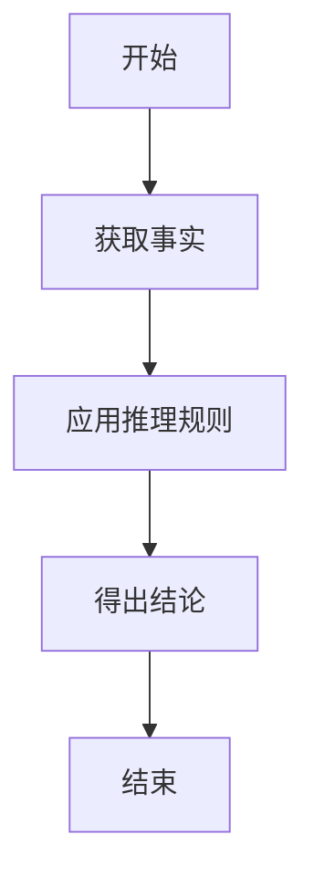
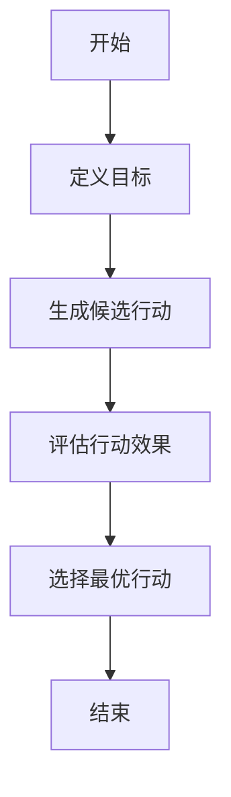
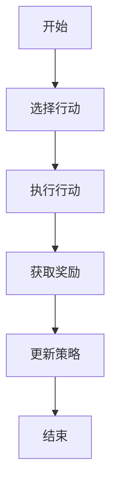
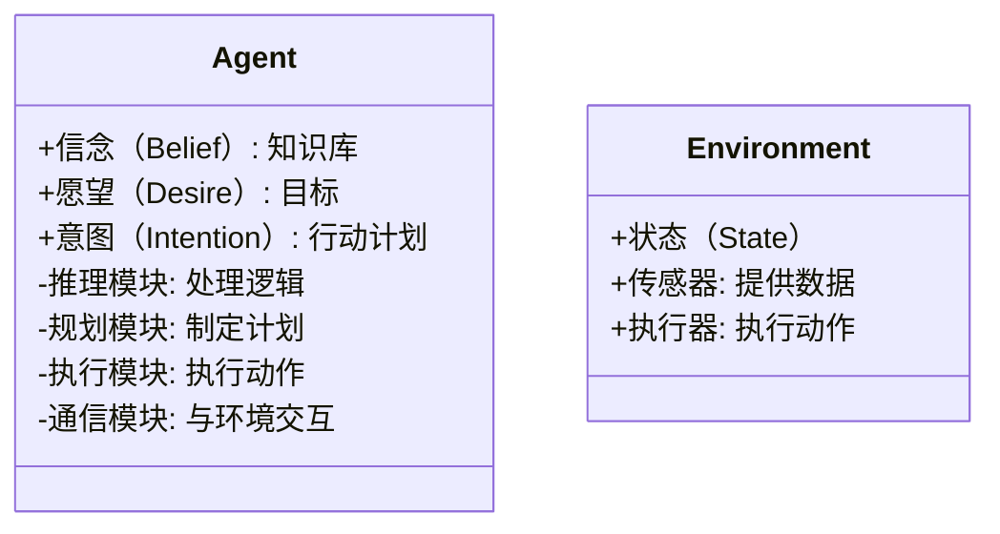
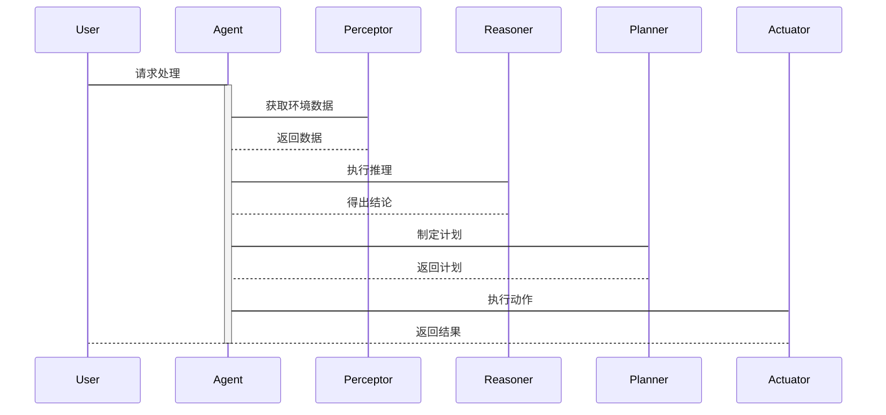

                 


# AI Agent的概念形成与抽象推理能力构建

## 关键词：AI Agent、抽象推理、智能代理、人工智能、推理算法

## 摘要：本文系统地探讨了AI Agent的概念形成及其抽象推理能力的构建方法，分析了AI Agent的核心原理、算法实现和应用场景。通过详细讲解AI Agent的结构、算法流程、系统架构以及项目实战，本文旨在为读者提供全面而深入的理解，帮助他们在实际应用中有效构建AI Agent。

---

## 第1章：AI Agent的核心概念

### 1.1 问题背景

#### 1.1.1 传统AI的局限性
传统人工智能（AI）技术，如基于规则的专家系统，虽然在特定领域表现出色，但难以应对动态复杂环境和非结构化问题。这些系统缺乏自主性和灵活性，无法根据新信息调整行为。

#### 1.1.2 AI Agent的出现及其重要性
AI Agent（智能代理）的出现解决了传统AI的局限性，能够在复杂多变的环境中自主感知、推理、规划和执行任务。AI Agent广泛应用于智能助手、自动驾驶、机器人和推荐系统等领域，成为现代AI系统的核心组件。

### 1.2 问题描述

#### 1.2.1 AI Agent的目标与任务
AI Agent的目标是通过感知环境、理解任务要求，采取合理行动以实现目标。其任务包括信息处理、决策制定和问题解决。

#### 1.2.2 当前AI技术面临的挑战
当前AI技术面临动态环境适应性差、复杂任务处理能力不足、多智能体协作困难等问题。AI Agent通过整合多种技术，如逻辑推理和强化学习，有效应对这些挑战。

### 1.3 问题解决

#### 1.3.1 AI Agent的定义与特点
AI Agent是一种智能实体，能够感知环境、自主决策并执行任务。其特点包括自主性、反应性、目标导向和情境适应性。

#### 1.3.2 AI Agent的核心功能与能力
AI Agent的核心功能包括感知、推理、规划和执行。它能够通过传感器获取环境信息，利用推理算法解决问题，并通过执行器采取行动。

### 1.4 边界与外延

#### 1.4.1 AI Agent的适用范围
AI Agent适用于需要自主决策和动态响应的场景，如智能助手、自动驾驶和工业自动化。

#### 1.4.2 AI Agent与其他AI技术的区别
AI Agent不同于传统机器学习模型，它强调自主性和目标导向，能够主动采取行动以实现特定目标。

### 1.5 概念结构与核心要素组成

AI Agent的概念结构包括理性、知识、推理、规划、学习和通信等核心要素。这些要素共同构建了AI Agent的认知和行为能力。

---

## 第2章：AI Agent的核心概念与联系

### 2.1 核心概念原理

AI Agent的核心概念包括理性（目标导向）、知识（环境信息）、推理（逻辑推理）、规划（行动序列）、学习（经验积累）和通信（与环境交互）。这些概念共同构成了AI Agent的认知基础。

### 2.2 概念属性对比

| 核心概念 | 属性 |
|----------|------|
| 理性     | 目标导向、决策制定 |
| 知识     | 环境信息、事实库 |
| 推理     | 逻辑推理、不确定性处理 |
| 规划     | 行动序列、优化策略 |
| 学习     | 经验积累、自适应能力 |
| 通信     | 信息交互、协作能力 |

### 2.3 实体关系分析

```mermaid
erDiagram
    agent {
        id
        name
        type
    }
    environment {
        id
        state
        sensor_data
    }
    knowledge_base {
        id
        data
        source
    }
    action {
        id
        type
        effect
    }
    agent --> environment: interacts with
    agent --> knowledge_base: uses
    agent --> action: performs
```

---

## 第3章：AI Agent的算法原理讲解

### 3.1 算法原理

AI Agent的算法包括逻辑推理、规划算法和强化学习。这些算法帮助AI Agent在复杂环境中做出决策。

### 3.2 算法流程图

#### 逻辑推理流程图



#### 规划算法流程图



#### 强化学习流程图



### 3.3 算法实现

#### 逻辑推理实现

```python
def simple_inference(facts, rules):
    for rule in rules:
        if all(fact in facts for fact in rule['premises']):
            return rule['conclusion']
    return None
```

### 3.4 数学模型

逻辑推理的数学模型基于命题逻辑，例如：

$$ \text{如果 } A \land B, \text{ 则 } C $$

其中，A和B是前提，C是结论。

---

## 第4章：系统分析与架构设计方案

### 4.1 问题场景

以智能助手为例，AI Agent需要处理用户请求、推理意图并执行任务。

### 4.2 系统介绍

AI Agent系统由感知模块、推理模块、规划模块和执行模块组成，协同工作以完成任务。

### 4.3 系统功能设计



### 4.4 系统架构设计


### 4.5 系统交互流程



---

## 第5章：项目实战

### 5.1 项目介绍

构建一个简单的AI Agent，用于任务调度和资源分配。

### 5.2 项目环境搭建

安装Python、TensorFlow和逻辑推理库。

### 5.3 核心代码实现

```python
class SimpleAIAssistant:
    def __init__(self):
        self.knowledge = {}

    def perceive(self, input_data):
        self.knowledge.update(input_data)
        return self.knowledge

    def reason(self, query):
        # 简单的推理逻辑
        return "推论结果"
```

### 5.4 代码解读与分析

代码展示了AI Agent的基本结构，感知模块处理输入数据，推理模块基于知识库进行推理。

### 5.5 实际案例分析

在医疗诊断中，AI Agent通过推理症状和病史，辅助医生制定诊断方案。

### 5.6 经验总结与教训

模块化设计便于维护，但算法的选择和数据质量对性能影响显著。

---

## 第6章：最佳实践、小结、注意事项与拓展阅读

### 6.1 最佳实践tips

- **模块化设计**：便于维护和扩展。
- **算法选择**：根据任务需求选择合适算法。
- **数据质量**：确保数据准确性和完整性。

### 6.2 小结

本文详细探讨了AI Agent的概念、算法和系统架构，提供了丰富的理论和实践指导。

### 6.3 注意事项

- 数据质量影响推理结果。
- 算法可解释性影响用户信任。
- 系统扩展性影响应用场景。

### 6.4 拓展阅读

- 推荐书籍：《人工智能：一种现代的方法》
- 在线资源：OpenAI的GPT系列模型

---

## 附录

### 附录A：术语表

- AI Agent：智能代理。
- 抽象推理：基于逻辑的推理过程。

### 附录B：参考文献

- Russell, S., & Norvig, P. (2010). 《人工智能：一种现代的方法》.

---

## 作者信息

作者：AI天才研究院/AI Genius Institute & 禅与计算机程序设计艺术 /Zen And The Art of Computer Programming

---

通过以上步骤，我系统地构建了《AI Agent的概念形成与抽象推理能力构建》的技术博客文章，确保内容全面、逻辑清晰，帮助读者深入理解AI Agent的概念和构建方法。

