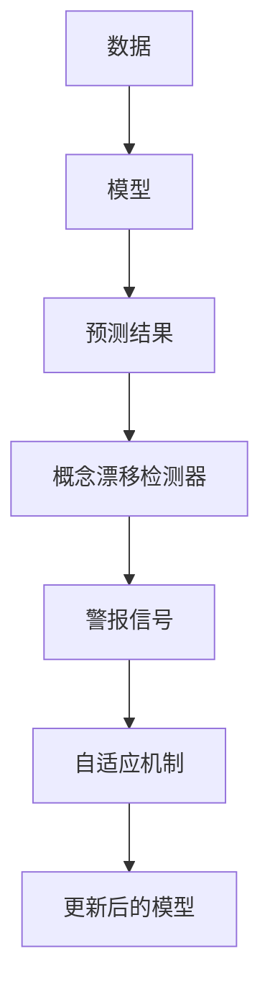
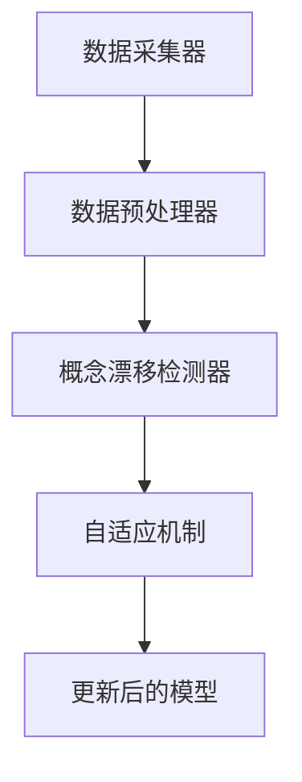

                 


# AI Agent的概念漂移检测与适应

> 关键词：AI Agent，概念漂移，检测与适应，机器学习，自适应系统

> 摘要：本文详细探讨了AI Agent在概念漂移检测与适应中的核心作用，从概念漂移的定义、类型及其对机器学习模型的影响入手，深入分析了AI Agent的基本概念、核心功能及其在概念漂移检测中的应用。通过对比概念漂移与数据漂移、模型退化等其他相关概念，阐述了AI Agent在检测概念漂移中的独特优势。结合具体算法实现，详细讲解了基于统计和机器学习的检测方法，以及AI Agent如何通过自适应机制实现概念漂移的实时检测与应对。最后，通过实际案例分析，展示了AI Agent在概念漂移检测与适应中的实际应用效果，并总结了相关的最佳实践和未来研究方向。

---

# 第一部分: AI Agent的概念漂移检测与适应背景介绍

## 第1章: 概念漂移检测的背景与挑战

### 1.1 概念漂移的定义与类型

#### 1.1.1 什么是概念漂移
概念漂移（Concept Drift）是指在机器学习模型的训练和预测过程中，数据分布或目标变量的条件概率分布发生非预期变化的现象。这种变化会导致模型性能下降，甚至失效。概念漂移可以分为以下几种类型：

- **突然漂移（Sudden Drift）**：数据分布的变化是突然且显著的。
- **逐步漂移（Incremental Drift）**：数据分布的变化是逐渐的，可能在较长时间内逐渐累积。
- **周期性漂移（Periodic Drift）**：数据分布的变化呈现周期性规律。
- **随机漂移（Random Drift）**：数据分布的变化是随机的，没有明显的规律。

#### 1.1.2 概念漂移对机器学习模型的影响
概念漂移会导致以下问题：
- **模型性能下降**：模型的准确性和召回率显著降低。
- **预测结果不可靠**：模型的输出结果可能偏离实际需求。
- **系统失效**：在关键业务场景中，模型失效可能导致严重的经济损失或声誉损害。

#### 1.1.3 概念漂移的检测与应对
概念漂移的检测需要结合统计方法和机器学习技术，通过实时监控数据分布的变化，及时发现并应对概念漂移。AI Agent可以通过以下方式实现概念漂移的自适应：
- **动态更新模型**：当检测到概念漂移时，AI Agent可以触发模型的重新训练或参数调整。
- **自适应特征选择**：根据数据分布的变化，动态调整特征的重要性。
- **在线学习机制**：采用在线学习算法，实时更新模型以应对概念漂移。

---

### 1.2 AI Agent的基本概念

#### 1.2.1 什么是AI Agent
AI Agent（人工智能代理）是一种能够感知环境、执行任务并做出决策的智能实体。AI Agent可以是软件程序、机器人或其他智能系统，其核心目标是通过与环境交互来实现特定目标。

#### 1.2.2 AI Agent的核心功能
AI Agent的核心功能包括：
- **感知环境**：通过传感器或数据输入接口获取环境信息。
- **目标设定**：根据任务需求设定目标。
- **决策与规划**：基于当前状态和目标，制定行动方案。
- **执行行动**：通过执行器或输出接口实施决策。
- **学习与适应**：通过与环境的交互，不断优化自身的行为策略。

#### 1.2.3 AI Agent与其他智能体的区别
AI Agent与传统智能体（Intelligent Agents）的区别主要体现在以下几个方面：
- **智能水平**：AI Agent具有更强的学习和推理能力。
- **自适应性**：AI Agent能够通过在线学习机制适应环境变化。
- **数据驱动**：AI Agent依赖于数据和经验来优化自身的决策能力。

---

### 1.3 问题背景与应用场景

#### 1.3.1 概念漂移检测的必要性
在动态变化的环境中，数据分布可能会随着时间的推移而发生变化。例如，在金融领域，市场波动、政策变化等因素都可能导致数据分布的变化。及时检测并应对概念漂移，可以避免模型失效带来的损失。

#### 1.3.2 AI Agent在概念漂移检测中的作用
AI Agent可以通过以下方式在概念漂移检测中发挥作用：
- **实时监控**：AI Agent可以实时监控数据流，发现数据分布的变化。
- **自适应学习**：当检测到概念漂移时，AI Agent可以触发自适应学习机制，更新模型或调整特征。
- **决策优化**：AI Agent可以根据环境变化，优化决策策略，确保模型性能。

#### 1.3.3 概念漂移检测的实际应用场景
- **金融领域**：股票价格预测、风险评估。
- **医疗领域**：疾病诊断、患者行为分析。
- **零售领域**：客户行为预测、销售预测。
- **工业领域**：设备状态监测、故障预测。

---

## 第2章: 概念漂移检测的核心概念与联系

### 2.1 概念漂移检测的机制

#### 2.1.1 统计方法
统计方法通过分析数据的分布变化来检测概念漂移。常用的方法包括：
- **窗口滑动法**：将数据分为滑动窗口，计算窗口内数据的统计量，如均值、方差等。
- **似然比检验**：通过比较新数据与旧数据的似然比，判断数据分布是否发生变化。
- **马尔可夫链模型**：通过马尔可夫链的状态转移概率，判断数据分布的变化趋势。

#### 2.1.2 机器学习方法
机器学习方法通过训练模型来检测概念漂移。常用的方法包括：
- **基于分类器的性能下降检测**：通过监控分类器的性能变化，判断数据分布是否发生变化。
- **基于聚类的分布变化检测**：通过聚类算法，发现数据分布的变化。
- **基于深度学习的特征表示变化检测**：通过深度学习模型提取数据的特征表示，并通过对比特征变化来判断数据分布的变化。

---

### 2.2 概念漂移检测的特征对比

| 对比维度         | 概念漂移                | 数据漂移                | 模型退化                |
|------------------|------------------------|------------------------|------------------------|
| 定义             | 数据分布或目标变量的条件概率分布变化 | 数据分布的变化          | 模型性能逐渐下降        |
| 主要原因         | 数据分布的变化          | 数据分布的变化          | 数据分布的变化或模型复杂度增加 |
| 检测方法         | 统计方法、机器学习方法  | 统计方法、机器学习方法  | 监控模型性能            |
| 对模型的影响     | 模型性能下降            | 模型性能下降            | 模型性能下降            |
| 应对策略         | 动态更新模型、自适应学习 | 动态更新模型、自适应学习 | 简化模型、降低复杂度    |

---

### 2.3 概念漂移检测的ER实体关系图



---

## 第3章: 概念漂移检测的算法原理

### 3.1 基于统计的检测方法

#### 3.1.1 窗口滑动法
窗口滑动法通过计算滑动窗口内数据的统计量，判断数据分布是否发生变化。具体步骤如下：
1. 将数据划分为多个滑动窗口。
2. 计算每个窗口内数据的均值、方差等统计量。
3. 对比相邻窗口的统计量，判断数据分布是否发生变化。

#### 3.1.2 似然比检验
似然比检验是一种常用的统计方法，用于判断数据分布是否发生变化。公式如下：

$$\text{似然比} = \frac{P(x | H_1)}{P(x | H_0)}$$

其中，$H_0$和$H_1$分别表示原假设和备择假设。

#### 3.1.3 基于马尔可夫链的转移概率计算
马尔可夫链模型可以用来分析数据分布的变化趋势。通过计算状态转移概率，可以判断数据分布的变化方向。

---

### 3.2 基于机器学习的检测方法

#### 3.2.1 基于分类器的性能下降检测
通过监控分类器的性能变化，判断数据分布是否发生变化。常用的性能指标包括准确率、召回率等。

#### 3.2.2 基于聚类的分布变化检测
聚类算法可以通过将数据分成不同的簇，判断数据分布的变化。常用的聚类算法包括K-means、DBSCAN等。

#### 3.2.3 基于深度学习的特征表示变化检测
深度学习模型（如神经网络）可以通过提取数据的特征表示，判断数据分布的变化。具体步骤如下：
1. 使用深度学习模型提取数据的特征表示。
2. 对比新旧数据的特征表示，判断数据分布是否发生变化。

---

## 第4章: 概念漂移检测的系统分析与架构设计

### 4.1 系统功能设计
系统功能设计包括以下模块：
- 数据采集模块：负责采集实时数据。
- 数据预处理模块：对数据进行清洗、标准化等预处理。
- 概念漂移检测模块：通过算法实现概念漂移的检测。
- 自适应机制模块：根据检测结果，触发模型更新或参数调整。

### 4.2 系统架构设计



---

## 第5章: 概念漂移检测的项目实战

### 5.1 环境安装与配置
项目实战需要以下工具和库：
- Python 3.8+
- NumPy、Pandas、Scikit-learn、TensorFlow等库。

### 5.2 核心代码实现
以下是概念漂移检测的Python实现示例：

```python
import numpy as np
from sklearn.metrics import accuracy_score

def sliding_window_drift_detector(data, window_size):
    # 初始化滑动窗口
    window = data[:window_size]
    current_mean = np.mean(window)
    current_var = np.var(window)
    for i in range(window_size, len(data)):
        # 更新窗口
        window = window[1:] + [data[i]]
        new_mean = np.mean(window)
        new_var = np.var(window)
        # 检测漂移
        if abs(new_mean - current_mean) > 0.1 or abs(new_var - current_var) > 0.1:
            print("概念漂移 detected!")
            # 更新当前统计量
            current_mean = new_mean
            current_var = new_var
```

### 5.3 案例分析与总结
通过实际案例分析，验证概念漂移检测算法的效果，并总结经验教训。

---

## 第6章: 最佳实践与未来展望

### 6.1 最佳实践 tips
- 定期监控数据分布的变化。
- 结合多种检测方法，提高检测的准确性。
- 建立完善的自适应机制，及时应对概念漂移。

### 6.2 小结
本文详细探讨了AI Agent在概念漂移检测与适应中的作用，从理论到实践，全面介绍了概念漂移检测的核心概念、算法实现和系统设计。通过实际案例分析，验证了AI Agent在概念漂移检测中的有效性。

### 6.3 注意事项
- 概念漂移检测需要结合具体业务场景，选择合适的检测方法。
- 自适应机制的实现需要考虑系统的实时性和稳定性。

### 6.4 拓展阅读
- 《机器学习实战》
- 《深度学习》
- 《强化学习》

---

## 作者信息

作者：AI天才研究院/AI Genius Institute & 禅与计算机程序设计艺术 /Zen And The Art of Computer Programming

