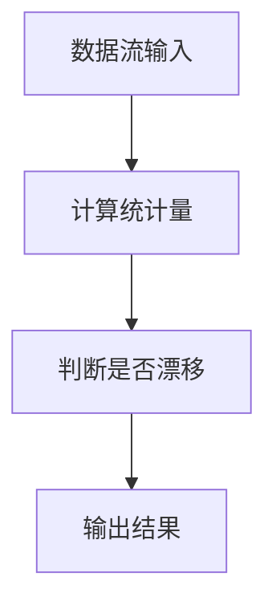
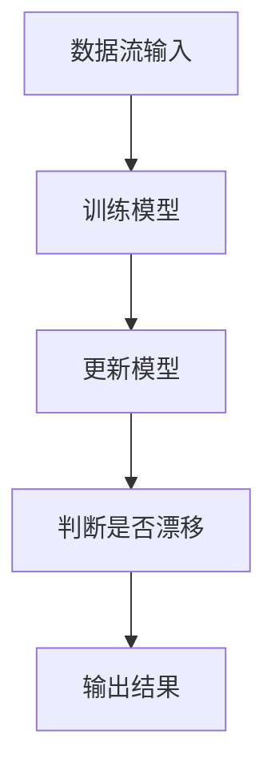
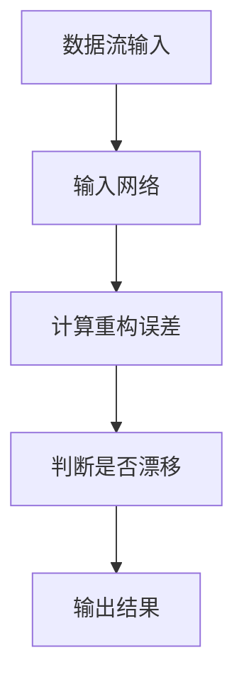
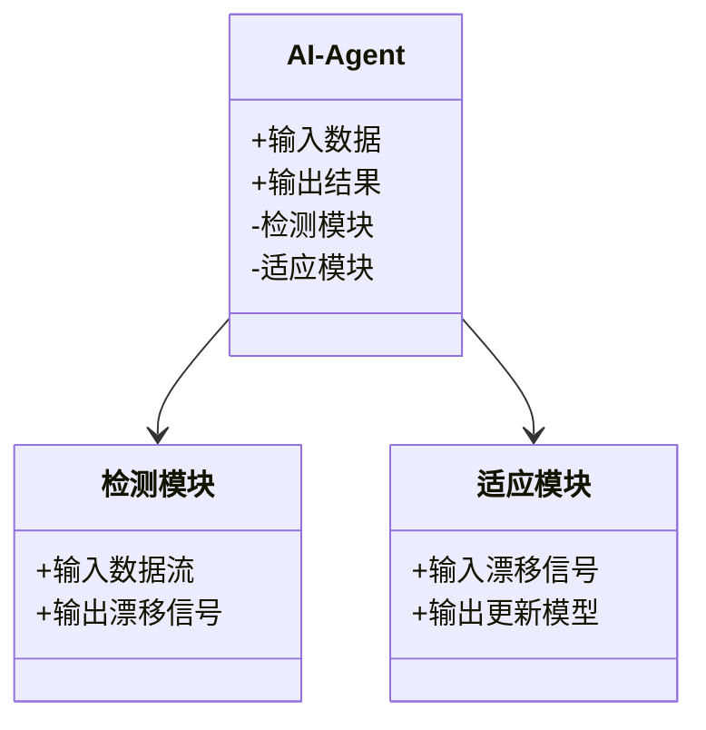

                 


# AI Agent的概念漂移检测与适应策略

> **关键词**: AI Agent, 概念漂移, 检测算法, 适应策略, 系统架构, 项目实战

> **摘要**: 本文详细探讨了AI Agent在动态环境中的概念漂移问题，分析了概念漂移的定义、类型及其对AI Agent的影响，提出了基于统计、机器学习和深度学习的检测方法，并设计了相应的适应策略。文章还结合实际案例，展示了如何通过系统架构设计和项目实战来实现概念漂移的检测与适应。

---

## 第一部分: AI Agent的概念漂移检测与适应策略概述

### 第1章: 概念漂移的背景与问题

#### 1.1 概念漂移的定义与类型

**1.1.1 概念漂移的定义**  
概念漂移（Concept Drift）是指数据分布的变化导致模型性能下降的现象。在动态环境中，数据的特征或类别标签可能发生改变，使得训练好的模型失效。例如，在电商推荐系统中，用户的偏好可能随时间变化，导致模型无法准确推荐商品。

**1.1.2 概念漂移的类型**  
概念漂移可以分为以下几种类型：  
1. **突然漂移（Sudden Drift）**: 数据分布突然发生显著变化，例如突发事件导致用户行为骤变。  
2. **渐进漂移（Incremental Drift）**: 数据分布逐渐变化，例如用户口味的缓慢转变。  
3. **分布漂移（Distribution Shift）**: 数据分布的整体变化，例如用户群体结构的变化。

**1.1.3 概念漂移的特征**  
- **不可预测性**: 概念漂移的发生时间难以预测。  
- **渐进性或突发性**: 漂移可能是渐进的也可能是突然的。  
- **数据依赖性**: 漂移与数据的特征和分布密切相关。

#### 1.2 AI Agent的概念与动态性

**1.2.1 AI Agent的定义**  
AI Agent是一种智能体，能够感知环境、执行任务并做出决策。例如，智能客服系统可以根据用户输入自动回复问题。

**1.2.2 AI Agent的动态性**  
AI Agent需要在动态环境中运行，环境的变化可能导致输入数据的分布发生变化，从而影响模型的性能。

**1.2.3 AI Agent与概念漂移的关系**  
AI Agent的核心功能依赖于数据的准确性，概念漂移会破坏数据的准确性，进而影响AI Agent的决策能力。

---

### 第2章: 概念漂移在AI Agent中的重要性

#### 2.1 概念漂移对AI Agent的影响

**2.1.1 概念漂移对模型性能的影响**  
概念漂移会导致模型的预测精度下降，例如在推荐系统中，用户的偏好变化可能导致推荐算法的效果变差。

**2.1.2 概念漂移对决策准确性的威胁**  
概念漂移可能使得AI Agent的决策出现偏差，例如在金融领域，市场波动可能导致风险评估模型失效。

**2.1.3 概念漂移对实时系统的挑战**  
实时系统需要快速响应，概念漂移的发生可能导致系统延迟或错误，例如自动驾驶系统可能无法及时识别新的交通规则。

#### 2.2 AI Agent中的概念漂移检测与适应

**2.2.1 概念漂移检测的必要性**  
及时检测概念漂移是确保AI Agent稳定运行的关键。例如，在医疗领域，概念漂移可能导致诊断模型的错误判断。

**2.2.2 概念漂移适应的策略**  
AI Agent需要具备自适应能力，例如通过在线学习或模型重训练来应对概念漂移。

**2.2.3 概念漂移检测与适应的边界**  
概念漂移检测需要在不影响系统性能的前提下进行，同时适应策略需要在有限的资源约束下实施。

---

## 第二部分: 概念漂移检测的核心概念与联系

### 第3章: 概念漂移检测的核心原理

#### 3.1 概念漂移检测的原理

**3.1.1 统计学方法**  
统计方法通过分析数据分布的变化来检测概念漂移。例如，使用卡方检验来比较数据分布的差异。

**3.1.2 机器学习方法**  
机器学习方法通过训练模型来识别数据分布的变化。例如，使用分类模型的性能下降来判断概念漂移。

**3.1.3 深度学习方法**  
深度学习方法通过捕捉数据的高层次特征来检测概念漂移。例如，使用自编码器（Autoencoder）来重构数据，检测重构误差的变化。

#### 3.2 概念漂移检测的关键特征对比

| 检测方法         | 基于统计 | 基于机器学习 | 基于深度学习 |
|------------------|----------|--------------|--------------|
| 优点             | 实时性强 | 高准确性      | 强大学习能力 |
| 缺点             | 对复杂数据敏感 | 计算资源消耗大 | 需大量数据训练 |
| 适用场景         | 简单数据流 | 中等复杂度数据 | 复杂数据流     |

#### 3.3 概念漂移检测的ER图架构

```mermaid
erDiagram
    customer {
        int id
        string name
    }
    transaction {
        int id
        string type
        date time
    }
    payment_gateway {
        int id
        string name
    }
    customer --> transaction : "makes"
    transaction --> payment_gateway : "uses"
```

---

## 第三部分: 概念漂移检测的算法原理

### 第4章: 统计学方法

#### 4.1 统计学方法的流程



#### 4.2 统计学方法的数学模型

$$ \text{统计量} = \frac{\sum_{i=1}^{n} (x_i - \mu)^2}{n-1} $$

其中，$\mu$ 是均值，$n$ 是数据点的数量。

### 第5章: 机器学习方法

#### 5.1 机器学习方法的流程



#### 5.2 机器学习方法的数学模型

$$ \text{损失函数} = \sum_{i=1}^{n} (y_i - \hat{y}_i)^2 $$

其中，$y_i$ 是真实标签，$\hat{y}_i$ 是预测标签。

### 第6章: 深度学习方法

#### 6.1 深度学习方法的流程



#### 6.2 深度学习方法的数学模型

$$ \text{重构误差} = \sum_{i=1}^{n} (x_i - \hat{x}_i)^2 $$

其中，$x_i$ 是输入数据，$\hat{x}_i$ 是重构数据。

---

## 第四部分: 概念漂移检测的系统架构设计

### 第7章: 系统分析与架构设计

#### 7.1 问题场景介绍

AI Agent需要在动态环境中实时检测概念漂移，例如在社交媒体情感分析中，用户情感表达的变化可能导致分类模型失效。

#### 7.2 系统功能设计



#### 7.3 系统架构设计


---

## 第五部分: 概念漂移检测的项目实战

### 第8章: 环境安装与核心实现

#### 8.1 环境安装

安装Python和必要的库：

```bash
pip install numpy scikit-learn tensorflow
```

#### 8.2 核心代码实现

```python
import numpy as np
from sklearn.metrics import accuracy_score

def detect_drift(X_train, X_test, y_train, y_test):
    # 统计方法：卡方检验
    from scipy.stats import chi2_contingency
    contingency_table = np.array([X_train, X_test])
    chi2, p, _, _ = chi2_contingency(contingency_table)
    if p < 0.05:
        return True
    else:
        return False

# 示例数据
X_train = np.random.rand(100, 10)
X_test = np.random.rand(50, 10)
y_train = np.random.randint(0, 2, 100)
y_test = np.random.randint(0, 2, 50)

drift = detect_drift(X_train, X_test, y_train, y_test)
print("概念漂移检测结果:", drift)
```

#### 8.3 代码解读与分析

上述代码实现了基于统计的卡方检验来检测概念漂移。如果p值小于0.05，则认为存在概念漂移。

---

### 第9章: 项目实战与案例分析

#### 9.1 案例分析

假设我们有一个分类任务，训练集和测试集的数据分布发生变化。通过上述代码，我们可以检测到概念漂移。

#### 9.2 项目小结

通过实战，我们验证了概念漂移检测算法的有效性，并展示了如何在实际项目中应用这些算法。

---

## 第六部分: 最佳实践与总结

### 第10章: 总结与展望

#### 10.1 小结

本文详细探讨了AI Agent中的概念漂移问题，分析了其检测方法和适应策略，并通过实际案例展示了如何在项目中实现这些方法。

#### 10.2 注意事项

- 概念漂移检测需要实时性，因此需要优化算法的效率。  
- 适应策略需要根据具体场景调整参数，避免过度调整。  
- 深度学习方法虽然强大，但在实时场景中可能需要更多的计算资源。

#### 10.3 拓展阅读

- 阅读相关论文，了解最新的概念漂移检测方法。  
- 学习在线学习算法，进一步提升模型的适应能力。

---

**作者：AI天才研究院 & 禅与计算机程序设计艺术**  
**版权声明：本文由AI天才研究院原创，转载请注明出处。**

