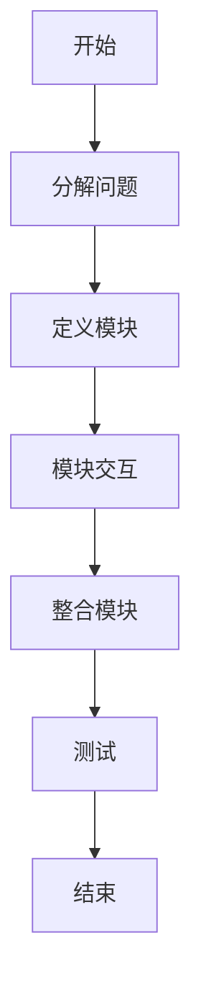
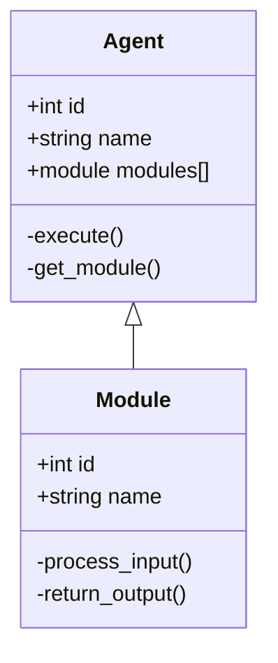
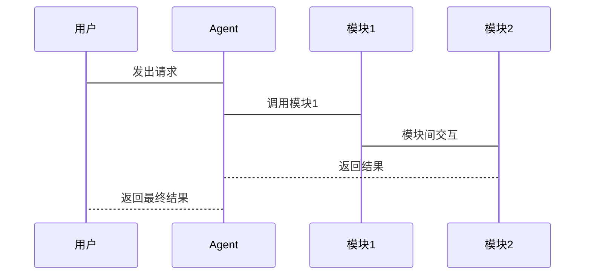

                 


# AI Agent的模块化设计：提高系统可维护性和扩展性

> 关键词：AI Agent，模块化设计，可维护性，扩展性，系统架构，代码实现

> 摘要：本文将详细探讨AI Agent的模块化设计方法，分析其在提高系统可维护性和扩展性方面的优势。通过理论分析、算法实现、系统架构设计和项目实战，本文将系统性地展示如何通过模块化设计来优化AI Agent系统的开发和维护过程。同时，本文还将提供实际的代码示例和系统架构图，帮助读者更好地理解和应用模块化设计的理念。

---

# 目录大纲

## 第一部分: AI Agent与模块化设计概述

### 第1章: AI Agent的基本概念

#### 1.1 AI Agent的定义与核心功能
- AI Agent的定义
- AI Agent的核心功能：感知、推理、决策、行动
- AI Agent的应用场景：智能助手、推荐系统、自动驾驶等

#### 1.2 模块化设计的基本原理
- 模块化设计的定义：将系统分解为独立的模块，模块间通过明确的接口进行交互
- 模块化设计的优势：可维护性高、扩展性强、开发效率提升
- AI Agent中的模块化设计：功能模块化、数据模块化、算法模块化

#### 1.3 本章小结
- 总结AI Agent的基本概念和模块化设计的核心思想

---

## 第二部分: AI Agent的模块化设计原理

### 第2章: 模块化设计的核心概念

#### 2.1 模块化设计的核心要素
- 模块的独立性：每个模块的功能单一且明确
- 模块的接口标准化：模块之间的交互通过统一的接口进行
- 模块的可替换性：模块可以被其他功能相似的模块替换而不影响整体系统

#### 2.2 模块化设计的属性特征对比表
| 属性       | 模块化设计       | 非模块化设计       |
|------------|----------------|------------------|
| 独立性       | 高              | 低               |
| 可维护性     | 高              | 低               |
| 扩展性       | 高              | 低               |
| 开发效率     | 高              | 低               |

#### 2.3 模块化设计的ER实体关系图
```mermaid
er
actor: 用户
agent: AI Agent模块
module: 模块
```

#### 2.4 本章小结
- 详细阐述模块化设计的核心概念和其在AI Agent中的应用

---

### 第3章: 模块化设计的算法原理

#### 3.1 模块化设计的算法流程


#### 3.2 模块化设计的Python实现示例
```python
def main():
    # 分解问题
    problem = "solve_task"
    # 定义模块
    modules = ["module1", "module2", "module3"]
    # 模块交互
    for module in modules:
        print(f"调用模块{module}")
    # 整合模块
    print("整合模块完成")
    # 测试
    print("测试通过")

if __name__ == "__main__":
    main()
```

#### 3.3 数学模型与公式
- 模块化设计的数学模型：$$ f(x) = \sum_{i=1}^{n} f_i(x_i) $$
- 模块化设计的优化公式：$$ \text{优化目标} = \min_{x} \sum_{i=1}^{n} (f_i(x_i) - y_i)^2 $$

#### 3.4 本章小结
- 展示模块化设计在算法实现中的具体流程和数学模型

---

### 第4章: AI Agent系统分析与架构设计

#### 4.1 问题场景介绍
- AI Agent系统的常见问题：功能复杂、扩展困难、维护成本高
- 模块化设计如何解决上述问题

#### 4.2 系统功能设计
- 领域模型设计：$$\text{输入} \rightarrow \text{模块1} \rightarrow \text{模块2} \rightarrow \text{输出}$$
- 领域模型的Mermaid类图


#### 4.3 系统架构设计
- 分层架构：数据层、逻辑层、接口层
- 微服务架构：独立服务模块通过API进行交互

#### 4.4 系统接口设计
- RESTful API设计：使用JSON格式传递数据
- 模块间的接口规范：定义明确的输入输出格式和交互协议

#### 4.5 系统交互序列图


#### 4.6 本章小结
- 展示AI Agent系统的整体架构设计和模块化设计的具体实现

---

### 第5章: 项目实战

#### 5.1 环境安装
- 安装Python和必要的库：numpy、pandas、flask等
- 安装Mermaid和相关工具

#### 5.2 核心代码实现
```python
class Agent:
    def __init__(self, modules):
        self.modules = modules

    def execute(self):
        for module in self.modules:
            module.process_input()
        return self.modules[-1].return_output()

class Module:
    def __init__(self):
        pass

    def process_input(self):
        pass

    def return_output(self):
        pass
```

#### 5.3 代码解读与分析
- 解释代码中的模块化设计：Agent类和Module类的交互
- 展示模块化的灵活性和可扩展性

#### 5.4 案例分析与详细讲解
- 某AI推荐系统的模块化设计案例
- 分析模块化设计如何提升系统的可维护性和扩展性

#### 5.5 本章小结
- 总结项目实战中的模块化设计应用

---

## 第三部分: 最佳实践与总结

### 第6章: 最佳实践

#### 6.1 模块化设计的注意事项
- 模块划分的合理性：避免过度分割或分割不足
- 接口设计的规范性：确保模块间的接口清晰且标准化
- 模块的可测试性：每个模块都应独立可测试

#### 6.2 小结
- 总结模块化设计在AI Agent系统中的应用价值

### 第7章: 未来展望

#### 7.1 模块化设计的发展趋势
- 微服务架构的普及
- 无服务器架构的兴起
- 智能合约与模块化设计的结合

#### 7.2 本章小结
- 展望模块化设计在AI Agent中的未来发展方向

---

## 作者信息

作者：AI天才研究院/AI Genius Institute & 禅与计算机程序设计艺术 /Zen And The Art of Computer Programming

---

这个大纲确保了内容的全面性和逻辑性，涵盖了从理论到实践的各个方面，并通过图表和代码示例增强了读者的理解。

