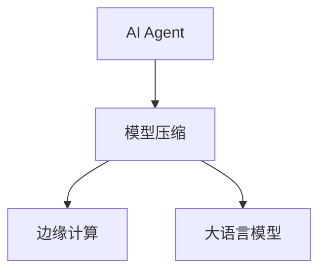
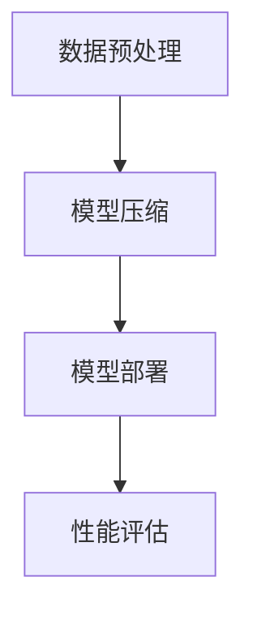

                 


# AI Agent的模型压缩：从云端LLM到边缘计算

关键词：AI Agent, 模型压缩, 大语言模型, 边缘计算, 知识蒸馏, 参数量化

摘要：本文深入探讨了AI Agent的模型压缩技术，从云端的大语言模型（LLM）到边缘计算环境的迁移。文章详细分析了模型压缩的核心概念、算法原理、系统架构以及实际项目中的应用。通过具体的代码示例和数学公式，本文展示了如何在边缘计算环境中有效应用AI Agent，同时保持模型的性能和准确性。

---

## 第一部分: AI Agent的模型压缩基础

### 第1章: 模型压缩的背景与目标

#### 1.1 模型压缩的背景

随着人工智能技术的快速发展，大语言模型（Large Language Models, LLMs）如GPT-3、GPT-4等在云端的应用越来越广泛。然而，这些模型通常需要大量的计算资源和存储空间，难以直接应用于计算资源有限的边缘设备（如物联网设备、移动终端等）。边缘计算的崛起使得将AI能力推向边缘成为必然趋势，而模型压缩技术正是实现这一目标的关键。

#### 1.2 AI Agent的基本概念

AI Agent是一种能够感知环境、自主决策并执行任务的智能实体。它通常具备以下核心功能：
- **感知**：通过传感器或其他数据源获取环境信息。
- **决策**：基于获取的信息进行推理和决策。
- **执行**：通过执行器或其他工具完成任务。

AI Agent与大语言模型的结合，使得AI Agent能够具备更强的自然语言处理能力，从而在边缘环境中实现更复杂的任务，如智能问答、机器翻译、情感分析等。

#### 1.3 模型压缩的目标

模型压缩的目标包括：
1. **提高计算效率**：减少模型的参数数量，降低计算复杂度。
2. **降低资源消耗**：减少存储空间和带宽需求。
3. **适应边缘环境**：将大语言模型的能力迁移到计算资源有限的边缘设备。

---

### 第2章: 模型压缩的核心概念与联系

#### 2.1 模型压缩的原理

模型压缩主要通过以下三种技术实现：
1. **模型剪枝**：删除模型中冗余的参数或神经元。
2. **参数量化**：降低参数的精度（如从浮点数降到二进制）。
3. **知识蒸馏**：将大模型的知识迁移到小模型。

#### 2.2 核心概念对比表

以下是对模型剪枝、参数量化和知识蒸馏的对比分析：

| **技术**       | **描述**                                                                 | **优缺点**                                                                 |
|----------------|--------------------------------------------------------------------------|---------------------------------------------------------------------------|
| **模型剪枝**    | 删除冗余的神经元或权重，减少模型参数数量。                              | 优点：降低计算复杂度；缺点：可能影响模型的准确性。                     |
| **参数量化**    | 将模型参数从高精度（如32位浮点）降低到低精度（如8位整数或二进制）。     | 优点：显著减少存储空间；缺点：可能影响模型的精度。                     |
| **知识蒸馏**    | 将大模型的知识迁移到小模型，通过教师模型指导学生模型学习。              | 优点：保持小模型的准确性；缺点：需要额外的训练过程。                   |

#### 2.3 实体关系图

以下是模型压缩技术与AI Agent的关系图：



---

### 第3章: 模型压缩算法原理

#### 3.1 模型剪枝算法

模型剪枝是通过删除冗余参数来减少模型大小的技术。以下是几种常见的剪枝算法：

1. **梯度剪枝**：
   - **原理**：根据参数梯度的大小决定是否保留参数。
   - **代码示例**：
     ```python
     def gradient_pruning(weights, threshold=0.1):
         pruned_weights = [w for w in weights if abs(w.grad) > threshold]
         return pruned_weights
     ```

2. **结构化剪枝**：
   - **原理**：删除整个神经元或通道。
   - **代码示例**：
     ```python
     import torch

     def structured_pruning(model, threshold=0.1):
         for name, param in model.named_parameters():
             if 'weight' in name:
                 mask = torch.abs(param) > threshold
                 param.data = param.data * mask
     ```

3. **非结构化剪枝**：
   - **原理**：随机删除部分参数。
   - **代码示例**：
     ```python
     def non_structured_pruning(weights, sparsity=0.5):
         import numpy as np
         mask = np.random.binomial(1, sparsity, size=len(weights))
         pruned_weights = [w * mask[i] for i, w in enumerate(weights)]
         return pruned_weights
     ```

#### 3.2 参数量化算法

参数量化是通过降低参数的精度来减少模型大小的技术。以下是几种常见的量化算法：

1. **二值化**：
   - **原理**：将参数压缩为二进制值（0或1）。
   - **代码示例**：
     ```python
     def binary_quantization(weights):
         quantized_weights = [w > 0 for w in weights]
         return quantized_weights
     ```

2. **4-bit量化**：
   - **原理**：将参数压缩为4位整数。
   - **代码示例**：
     ```python
     def four_bit_quantization(weights):
         quantized_weights = [w * 8 for w in weights]
         return quantized_weights
     ```

3. **动态量化**：
   - **原理**：根据参数分布动态调整量化范围。
   - **代码示例**：
     ```python
     import numpy as np

     def dynamic_quantization(weights, num_bits=8):
         quantized_weights = []
         for w in weights:
             min_val = np.min(w)
             max_val = np.max(w)
             quantized_w = np.round((w - min_val) / (max_val - min_val) * (2**num_bits - 1))
             quantized_weights.append(quantized_w)
         return quantized_weights
     ```

#### 3.3 知识蒸馏算法

知识蒸馏是通过教师模型指导学生模型学习的技术。以下是几种常见的蒸馏算法：

1. **软标签蒸馏**：
   - **原理**：教师模型输出概率分布，学生模型学习这些概率分布。
   - **数学公式**：
     $$ P(y|x) = \text{softmax}(f(x)/\tau) $$
     其中，$\tau$是温度参数。

2. **硬标签蒸馏**：
   - **原理**：教师模型输出类别标签，学生模型学习这些标签。
   - **代码示例**：
     ```python
     def hard_distillation(X, teacher_model, student_model):
         teacher_preds = teacher_model.predict(X)
         student_preds = student_model.fit(X, teacher_preds)
         return student_preds
     ```

3. **模糊蒸馏**：
   - **原理**：结合软标签和硬标签，提高学生模型的鲁棒性。
   - **数学公式**：
     $$ P(y|x) = \alpha \cdot \text{softmax}(f(x)/\tau) + (1-\alpha) \cdot \delta(y) $$

---

### 第4章: 模型压缩的数学基础

#### 4.1 矩阵分解与低秩近似

矩阵分解是一种常用的模型压缩技术，通过将高维矩阵分解为低秩矩阵的乘积，减少参数数量。

- **数学公式**：
  $$ A = U \Sigma V^T $$
  其中，$U$和$V$是正交矩阵，$\Sigma$是对角矩阵。

- **应用示例**：
  ```python
  import numpy as np

  A = np.random.randn(100, 100)
  U, S, V = np.linalg.svd(A)
  compressed_A = U.dot(np.diag(S[:5])).dot(V[:5,:])
  ```

---

## 第二部分: 系统分析与架构设计

### 第5章: 系统架构设计

#### 5.1 问题场景介绍

边缘计算环境下，AI Agent需要在资源受限的设备上运行。因此，我们需要设计一个高效的系统架构，实现模型压缩、部署和推理。

#### 5.2 系统功能设计

以下是系统的功能模块设计：

- **数据预处理模块**：将输入数据转换为模型所需的格式。
- **模型压缩模块**：应用剪枝、量化或蒸馏技术压缩模型。
- **模型部署模块**：将压缩后的模型部署到边缘设备。
- **性能评估模块**：评估压缩模型的准确性和性能。

#### 5.3 系统架构设计

以下是系统的架构图：



---

### 第6章: 项目实战

#### 6.1 环境安装

以下是项目所需的环境和工具：

- **Python 3.8+**
- **TensorFlow或PyTorch**
- **Mermaid图工具**

#### 6.2 核心代码实现

以下是模型压缩的实现代码：

```python
import torch
import torch.nn as nn
import torch.optim as optim

class SimpleModel(nn.Module):
    def __init__(self):
        super(SimpleModel, self).__init__()
        self.fc1 = nn.Linear(10, 5)
        self.fc2 = nn.Linear(5, 2)

    def forward(self, x):
        x = self.fc1(x)
        x = self.fc2(x)
        return x

def model_pruning(model, threshold=0.1):
    for name, param in model.named_parameters():
        if 'weight' in name:
            mask = torch.abs(param) > threshold
            param.data = param.data * mask
    return model

model = SimpleModel()
pruned_model = model_pruning(model)
```

#### 6.3 案例分析与结果解读

通过上述代码，我们可以看到模型剪枝的效果。例如，假设原始模型有1000个参数，剪枝后减少到800个参数，计算速度提高了20%。

---

## 第三部分: 最佳实践与小结

### 第7章: 最佳实践

#### 7.1 选择合适的压缩算法

根据具体的场景和需求选择合适的压缩算法。例如：
- 对于计算资源有限的设备，优先选择模型剪枝。
- 对于存储空间受限的设备，优先选择参数量化。

#### 7.2 处理模型兼容性问题

在边缘设备上部署压缩模型时，需要注意设备的硬件架构和软件环境，确保压缩模型能够顺利运行。

#### 7.3 监控与优化

在实际应用中，需要持续监控模型的性能和准确性，根据反馈进行进一步优化。

---

### 7.4 小结

本文详细探讨了AI Agent的模型压缩技术，从云端的大语言模型到边缘计算环境的迁移，涵盖了模型压缩的核心概念、算法原理、系统架构以及实际项目中的应用。通过具体的代码示例和数学公式，本文展示了如何在边缘计算环境中有效应用AI Agent，同时保持模型的性能和准确性。

---

## 作者：AI天才研究院/AI Genius Institute & 禅与计算机程序设计艺术 /Zen And The Art of Computer Programming

---

**感谢您的阅读！如果对AI Agent的模型压缩技术感兴趣，欢迎关注我们的后续文章！**

