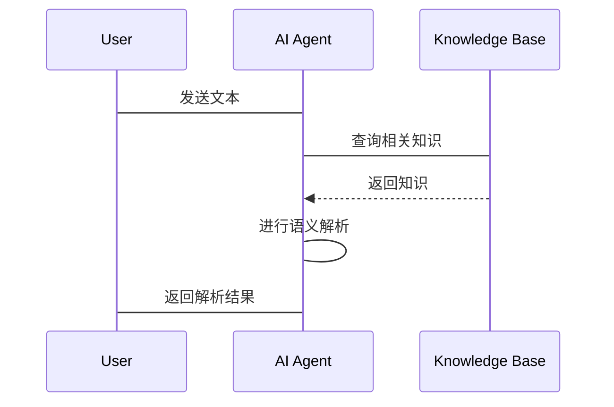

                 


# AI Agent的深层语义解析：提升LLM的语言理解深度

> 关键词：AI Agent, 深层语义解析, 大语言模型, LLM, 语义理解, 语义网络, 自然语言处理

> 摘要：本文深入探讨AI Agent在深层语义解析中的应用，分析如何通过提升LLM的语言理解能力，实现更精准的语义分析与推理。文章从理论基础、算法原理、系统架构到实战案例，全面解析深层语义解析的关键技术与实现细节。

---

## 第一部分: AI Agent与深层语义解析的背景与基础

### 第1章: AI Agent的定义与核心概念

#### 1.1 AI Agent的基本概念

AI Agent（智能体）是指能够感知环境并采取行动以实现目标的实体。在现代人工智能领域，AI Agent通常具备以下特征：

- **自主性**：能够在没有外部干预的情况下独立运作。
- **反应性**：能够实时感知环境并做出响应。
- **目标导向性**：通过目标驱动行为，优化决策过程。

AI Agent的核心目标是通过智能算法实现与人类或其他系统的高效交互与协作。

#### 1.2 深层语义解析的定义与重要性

深层语义解析是指通过对文本的多层分析，理解其背后的语义含义，包括语法结构、语境信息和知识背景。其重要性体现在以下几个方面：

- **提升LLM的理解能力**：传统的LLM（大语言模型）往往只能理解表层语义，无法深入理解文本的深层含义。
- **增强AI Agent的交互能力**：通过深层语义解析，AI Agent能够更准确地理解用户意图，从而提供更智能的服务。
- **推动自然语言处理的进步**：深层语义解析是实现真正意义上的自然语言理解的关键技术。

#### 1.3 LLM的语言理解现状与挑战

当前，LLM（如GPT系列）已经在文本生成、翻译等领域取得了显著成果，但其语言理解能力仍然存在以下问题：

- **表层理解为主**：LLM通常只能理解文本的表层信息，难以捕捉语境中的深层含义。
- **缺乏知识关联**：LLM无法有效结合外部知识库中的信息，导致理解范围受限。
- **语义推理能力不足**：LLM难以进行复杂的语义推理，无法处理复杂的逻辑关系。

---

## 第二部分: 深层语义解析的核心原理与技术

### 第2章: 深层语义解析的原理与方法

#### 2.1 深层语义理解的层次模型

深层语义理解可以分为以下几个层次：

1. **表层结构分析**：分析文本的基本语法结构，包括词法分析和句法分析。
2. **语义分析**：理解文本的基本语义含义，包括实体识别、关系抽取等。
3. **语境分析**：结合上下文信息，理解文本的语境含义。
4. **语义推理**：基于已有知识，进行逻辑推理，得出隐含的语义信息。

#### 2.2 语境与上下文在语义解析中的作用

语境是影响语义理解的重要因素。以下是语境在语义解析中的具体作用：

1. **消除歧义**：通过上下文信息，消除文本中的歧义。
2. **增强理解深度**：结合上下文信息，提升语义理解的深度。
3. **动态调整语义模型**：根据语境变化，动态调整语义解析模型。

#### 2.3 深层语义解析的实现框架

深层语义解析的实现框架通常包括以下几个部分：

1. **文本预处理**：包括分词、句法分析等。
2. **语义表示**：将文本转化为语义表示形式，如向量表示。
3. **语义推理**：基于语义表示，进行逻辑推理。
4. **知识库整合**：结合外部知识库，增强语义理解能力。

---

## 第三部分: AI Agent的语义解析算法与数学模型

### 第3章: 基于深度学习的语义解析算法

#### 3.1 预训练模型在语义解析中的应用

预训练模型（如BERT）在语义解析中起到了重要作用。BERT通过自注意力机制，能够捕捉到文本中的长距离依赖关系，从而提升语义理解能力。

**自注意力机制公式：**

$$
\text{Attention}(Q, K, V) = \text{softmax}\left(\frac{QK^T}{\sqrt{d_k}}\right)V
$$

其中，$Q$、$K$、$V$分别为查询、键、值向量，$d_k$为键的维度。

#### 3.2 语义解析中的注意力机制

注意力机制能够帮助模型聚焦于重要的语义信息。以下是一个简单的注意力机制实现示例：

```python
def attention(query, key, value):
    scores = query @ key.T / (key.shape[-1] ** 0.5)
    attention_weights = torch.softmax(scores, dim=-1)
    output = attention_weights @ value
    return output
```

#### 3.3 对比学习在语义解析中的应用

对比学习是一种有效的语义表示方法。通过对比学习，可以增强语义表示的区分度。

**对比学习公式：**

$$
\text{loss} = -\log\left(\frac{\exp(s)}{\exp(s) + \exp(t)}\right)
$$

其中，$s$为正样本的相似度，$t$为负样本的相似度。

---

## 第四部分: 深层语义解析的系统架构与实现

### 第4章: 深层语义解析的系统架构设计

#### 4.1 系统功能设计

系统功能设计包括以下几个方面：

1. **文本预处理模块**：负责对输入文本进行分词、句法分析等预处理。
2. **语义表示模块**：将文本转化为语义表示形式。
3. **语义推理模块**：基于语义表示，进行逻辑推理。
4. **知识库整合模块**：结合外部知识库，增强语义理解能力。

#### 4.2 系统架构设计

系统架构设计可以采用分层架构：

1. **数据层**：负责数据的输入与输出。
2. **表示层**：负责将文本转化为语义表示。
3. **推理层**：负责逻辑推理。
4. **应用层**：负责与用户的交互。

#### 4.3 系统接口设计

系统接口设计需要考虑以下几点：

1. **输入接口**：接受用户输入的文本。
2. **输出接口**：输出解析后的语义信息。
3. **知识库接口**：与外部知识库进行交互。

#### 4.4 系统交互设计

系统交互设计可以通过序列图来展示：



---

## 第五部分: 项目实战与案例分析

### 第5章: 实战项目：构建一个简单的深层语义解析系统

#### 5.1 环境安装

需要安装以下库：

- Python 3.8+
- torch
- transformers

```bash
pip install torch transformers
```

#### 5.2 核心代码实现

以下是一个简单的深层语义解析系统的实现示例：

```python
from transformers import BertTokenizer, BertModel
import torch

tokenizer = BertTokenizer.from_pretrained('bert-base-cased')
model = BertModel.from_pretrained('bert-base-cased')

def semantic_parsing(text):
    inputs = tokenizer(text, return_tensors='pt')
    outputs = model(**inputs)
    return outputs.last_hidden_state

text = "What is the capital of France?"
result = semantic_parsing(text)
print(result)
```

#### 5.3 代码解读与分析

上述代码实现了以下功能：

1. **导入库**：使用BertTokenizer和BertModel进行语义解析。
2. **文本编码**：将输入文本编码为模型可接受的格式。
3. **模型推理**：通过模型进行语义解析，返回隐藏层状态。

#### 5.4 实际案例分析

以“What is the capital of France?”为例，系统可以解析出“capital”和“France”的关系，并结合知识库返回“Paris”。

#### 5.5 项目小结

通过上述实现，我们可以看到，深层语义解析的核心在于模型的语义表示能力和知识库的整合能力。

---

## 第六部分: 最佳实践与总结

### 第6章: 最佳实践与总结

#### 6.1 最佳实践

1. **选择合适的预训练模型**：根据具体任务选择合适的预训练模型。
2. **优化语义解析算法**：通过调参和优化算法提升语义解析效果。
3. **结合知识库**：将语义解析与外部知识库结合，提升理解能力。

#### 6.2 小结

通过本文的探讨，我们可以看到，AI Agent的深层语义解析是提升LLM语言理解能力的关键技术。通过合理的系统架构设计和算法优化，我们可以实现更精准的语义解析与推理。

#### 6.3 注意事项

- **数据质量**：语义解析的效果 heavily依赖于数据质量。
- **模型选择**：选择合适的模型对于语义解析至关重要。
- **知识库整合**：知识库的质量和规模直接影响语义解析的效果。

#### 6.4 拓展阅读

- [自然语言处理入门](https://zh.wikipedia.org/wiki/自然语言处理)
- [深度学习中的注意力机制](https://zh.wikipedia.org/wiki/注意力机制)

---

## 作者

作者：AI天才研究院/AI Genius Institute & 禅与计算机程序设计艺术 /Zen And The Art of Computer Programming

