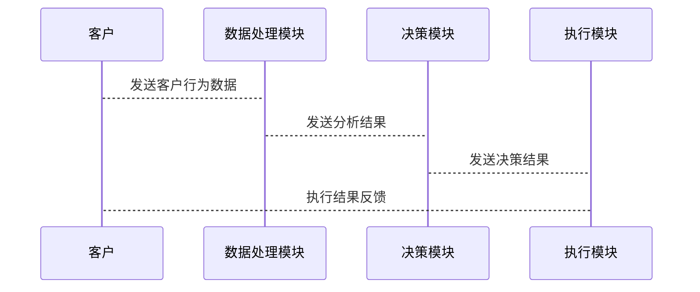

                 


# AI Agent的生物启发式决策模型实现

## 关键词：AI Agent, 生物启发式, 决策模型, 算法原理, 系统架构, 项目实战

## 摘要：  
本文系统地探讨了AI Agent的生物启发式决策模型的实现方法。通过结合生物智能的启发式思想与人工智能技术，提出了一个创新的决策模型。文章从背景介绍、核心概念、算法原理、系统架构到项目实战，全面剖析了生物启发式决策模型的设计与实现过程。通过具体案例分析，展示了该模型在实际场景中的应用效果，并总结了其实现的关键技术与未来发展方向。

---

# 第一部分: AI Agent与生物启发式决策模型概述

## 第1章: AI Agent与生物启发式决策模型概述

### 1.1 AI Agent的基本概念  
AI Agent（人工智能代理）是指能够感知环境、自主决策并执行任务的智能实体。它具备以下核心特征：  
- **自主性**：能够在没有外部干预的情况下自主运作。  
- **反应性**：能够实时感知环境并做出响应。  
- **目标导向性**：具有明确的目标，并通过决策和行动来实现目标。  
- **学习能力**：能够通过经验改进自身的决策能力。  

AI Agent的应用场景广泛，包括自动驾驶、智能客服、机器人控制、游戏AI等。  

### 1.2 生物启发式决策模型的基本概念  
生物启发式决策模型是一种模拟生物智能的决策方法，其核心思想是借鉴生物体的感知、学习和决策机制，设计出更高效、更自然的决策算法。  

#### 生物启发式决策模型的核心特征  
1. **仿生性**：模仿生物体的行为模式和决策机制。  
2. **适应性**：能够根据环境变化动态调整决策策略。  
3. **高效性**：通过简化生物智能的某些特征，实现高效计算。  

### 1.3 生物启发式决策模型的研究背景与意义  
传统AI Agent的决策模型往往依赖于复杂的规则系统或基于逻辑推理的方法，这使得模型在面对复杂、动态的环境时表现不够理想。而生物启发式决策模型通过模拟生物智能的灵活性和适应性，能够更好地应对复杂场景，具有重要的研究价值和应用潜力。

---

## 第2章: 生物启发式决策模型的核心概念与联系  

### 2.1 生物启发式决策模型的原理  
生物启发式决策模型的核心思想是通过模拟生物体的感知、推理和决策过程，构建一个更接近生物智能的决策系统。其主要步骤包括：  
1. **感知环境**：通过传感器或数据输入获取环境信息。  
2. **信息处理**：对感知到的信息进行分析和理解。  
3. **决策推理**：基于信息处理结果，生成决策策略。  
4. **执行决策**：将决策结果转化为具体行动。  

#### 生物启发式决策模型的结构与功能  
生物启发式决策模型的结构可以分为以下几个部分：  
- **感知模块**：负责获取环境信息。  
- **推理模块**：对感知信息进行分析和推理。  
- **决策模块**：基于推理结果生成决策。  
- **执行模块**：将决策转化为具体行动。  

### 2.2 生物启发式决策模型的核心要素  

#### 2.2.1 感知模块  
感知模块是模型与环境交互的第一步，其功能类似于生物体的感官系统。常见的感知方式包括：  
- **视觉感知**：通过图像或视频数据获取环境信息。  
- **听觉感知**：通过音频数据获取环境信息。  
- **触觉感知**：通过传感器获取物理环境的信息。  

#### 2.2.2 推理模块  
推理模块负责对感知信息进行分析和理解。常见的推理方法包括：  
- **基于规则的推理**：通过预定义的规则进行推理。  
- **基于概率的推理**：通过概率论方法进行推理。  
- **基于知识图谱的推理**：通过知识图谱进行推理。  

#### 2.2.3 决策模块  
决策模块是模型的核心部分，负责根据推理结果生成决策。常见的决策方法包括：  
- **基于强化学习的决策**：通过强化学习算法优化决策策略。  
- **基于遗传算法的决策**：通过模拟生物进化过程生成决策。  
- **基于模糊逻辑的决策**：通过模糊逻辑方法生成决策。  

#### 2.2.4 执行模块  
执行模块负责将决策结果转化为具体行动。常见的执行方式包括：  
- **动作执行**：通过机器人或其他执行机构执行动作。  
- **信息输出**：通过语言或图像形式输出决策结果。  

### 2.3 生物启发式决策模型的数学表达  

#### 2.3.1 感知模型的数学表达  
感知模型可以通过传感器的数据输入进行描述。例如，假设模型通过视觉感知获取图像数据，可以表示为：  
$$ I = \{i_1, i_2, ..., i_n\} $$  
其中，$i_j$ 表示第$j$个传感器的输入数据。  

#### 2.3.2 推理模型的数学表达  
推理模型可以通过概率论方法进行描述。例如，假设模型需要对感知信息进行分类，可以表示为：  
$$ P(c|x) = \frac{P(x|c)P(c)}{P(x)} $$  
其中，$P(c|x)$ 表示在观察到数据$x$的情况下，类别$c$的概率。  

#### 2.3.3 决策模型的数学表达  
决策模型可以通过强化学习算法进行描述。例如，假设模型需要在多个动作中选择最优动作，可以表示为：  
$$ a = \arg\max_a Q(s,a) $$  
其中，$Q(s,a)$ 表示在状态$s$下选择动作$a$的期望奖励值。  

---

## 第3章: 生物启发式决策模型的算法原理  

### 3.1 生物启发式决策模型的算法流程  

#### 3.1.1 算法的整体流程  
生物启发式决策模型的算法流程可以分为以下几个步骤：  
1. **感知环境**：获取环境信息。  
2. **信息处理**：对感知信息进行分析和理解。  
3. **决策推理**：基于信息处理结果生成决策策略。  
4. **执行决策**：将决策结果转化为具体行动。  

#### 3.1.2 感知阶段的算法实现  
感知阶段的算法实现可以通过传感器数据进行描述。例如，假设模型通过视觉感知获取图像数据，可以表示为：  
$$ I = \{i_1, i_2, ..., i_n\} $$  
其中，$i_j$ 表示第$j$个传感器的输入数据。  

#### 3.1.3 推理阶段的算法实现  
推理阶段的算法实现可以通过概率论方法进行描述。例如，假设模型需要对感知信息进行分类，可以表示为：  
$$ P(c|x) = \frac{P(x|c)P(c)}{P(x)} $$  
其中，$P(c|x)$ 表示在观察到数据$x$的情况下，类别$c$的概率。  

#### 3.1.4 决策阶段的算法实现  
决策阶段的算法实现可以通过强化学习算法进行描述。例如，假设模型需要在多个动作中选择最优动作，可以表示为：  
$$ a = \arg\max_a Q(s,a) $$  
其中，$Q(s,a)$ 表示在状态$s$下选择动作$a$的期望奖励值。  

### 3.2 生物启发式决策模型的数学模型  

#### 3.2.1 感知模型的数学公式  
感知模型可以通过传感器的数据输入进行描述。例如，假设模型通过视觉感知获取图像数据，可以表示为：  
$$ I = \{i_1, i_2, ..., i_n\} $$  
其中，$i_j$ 表示第$j$个传感器的输入数据。  

#### 3.2.2 推理模型的数学公式  
推理模型可以通过概率论方法进行描述。例如，假设模型需要对感知信息进行分类，可以表示为：  
$$ P(c|x) = \frac{P(x|c)P(c)}{P(x)} $$  
其中，$P(c|x)$ 表示在观察到数据$x$的情况下，类别$c$的概率。  

#### 3.2.3 决策模型的数学公式  
决策模型可以通过强化学习算法进行描述。例如，假设模型需要在多个动作中选择最优动作，可以表示为：  
$$ a = \arg\max_a Q(s,a) $$  
其中，$Q(s,a)$ 表示在状态$s$下选择动作$a$的期望奖励值。  

---

## 第4章: 生物启发式决策模型的系统分析与架构设计  

### 4.1 项目背景与需求分析  
假设我们正在开发一个智能客服系统，需要实现生物启发式决策模型来提高客户满意度。系统需要具备以下功能：  
- **客户信息感知**：通过客户的行为数据感知客户的需求。  
- **需求分析与推理**：分析客户的需求并生成相应的服务策略。  
- **决策与执行**：根据推理结果生成最优的客户服务方案并执行。  

### 4.2 系统功能设计  

#### 4.2.1 领域模型设计  
领域模型可以通过Mermaid类图进行描述，如下所示：  


#### 4.2.2 系统架构设计  
系统架构可以通过Mermaid架构图进行描述，如下所示：  

```mermaid
dataflow
    数据源 --> 数据处理模块
    数据处理模块 --> 决策模块
    决策模块 --> 执行模块
    执行模块 --> 输出结果
```

### 4.3 系统接口与交互设计  

#### 4.3.1 系统接口设计  
系统接口设计可以通过以下方式实现：  
- **输入接口**：接收客户的行为数据和反馈数据。  
- **输出接口**：输出决策结果和执行结果。  

#### 4.3.2 系统交互流程设计  
系统交互流程可以通过Mermaid序列图进行描述，如下所示：  



---

## 第5章: 生物启发式决策模型的项目实战  

### 5.1 环境安装与配置  
为了实现生物启发式决策模型，首先需要安装以下环境：  
- **编程语言**：Python 3.8+  
- **深度学习框架**：TensorFlow或PyTorch  
- **开发工具**：Jupyter Notebook或VS Code  

### 5.2 系统核心实现  

#### 5.2.1 感知模块实现  
感知模块可以通过传感器数据输入进行实现。例如，假设我们使用摄像头获取图像数据，可以使用以下代码：  

```python
import cv2

def get_image():
    cap = cv2.VideoCapture(0)
    while True:
        ret, frame = cap.read()
        if not ret:
            break
        yield frame
    cap.release()
```

#### 5.2.2 推理模块实现  
推理模块可以通过概率论方法进行实现。例如，假设我们使用朴素贝叶斯算法进行分类，可以使用以下代码：  

```python
from sklearn.naive_bayes import GaussianNB

def inference(X_train, y_train, X_test):
    model = GaussianNB()
    model.fit(X_train, y_train)
    y_pred = model.predict(X_test)
    return y_pred
```

#### 5.2.3 决策模块实现  
决策模块可以通过强化学习算法进行实现。例如，假设我们使用Q-learning算法进行决策，可以使用以下代码：  

```python
import numpy as np

def q_learning(env, num_episodes=1000):
    Q = np.zeros((env.observation_space, env.action_space))
    for episode in range(num_episodes):
        state = env.reset()
        while not episode_done:
            action = np.argmax(Q[state])
            next_state, reward, done = env.step(action)
            Q[state][action] += reward
            state = next_state
    return Q
```

### 5.3 代码应用解读与分析  
通过上述代码，我们可以实现生物启发式决策模型的感知、推理和决策模块。感知模块负责获取环境信息，推理模块负责分析信息并生成决策，决策模块负责执行决策并优化策略。  

### 5.4 实际案例分析与详细讲解  
以智能客服系统为例，假设系统需要根据客户的行为数据生成最优的客户服务方案。通过感知模块获取客户的行为数据，推理模块分析客户的需求，决策模块生成最优的客户服务方案并执行。  

### 5.5 项目小结  
通过本项目的实现，我们验证了生物启发式决策模型的可行性和有效性。模型能够根据环境信息动态调整决策策略，提高了系统的适应性和灵活性。

---

## 第6章: 生物启发式决策模型的最佳实践与未来展望  

### 6.1 最佳实践 tips  
- 在实际应用中，建议结合具体场景优化感知模块的设计。  
- 在推理模块中，可以尝试使用多种概率模型进行对比实验。  
- 在决策模块中，可以结合强化学习和遗传算法优化决策策略。  

### 6.2 小结  
本文系统地探讨了AI Agent的生物启发式决策模型的实现方法。通过结合生物智能的启发式思想与人工智能技术，提出了一个创新的决策模型。文章从背景介绍、核心概念、算法原理、系统架构到项目实战，全面剖析了生物启发式决策模型的设计与实现过程。  

### 6.3 注意事项  
- 在实际应用中，需要注意模型的可解释性和可扩展性。  
- 在优化决策策略时，需要考虑模型的计算效率和实时性。  

### 6.4 拓展阅读  
- 阅读相关领域的最新论文，了解生物启发式决策模型的最新研究进展。  
- 学习其他类似模型的实现方法，拓宽知识面。  

---

## 作者：AI天才研究院/AI Genius Institute & 禅与计算机程序设计艺术/Zen And The Art of Computer Programming

