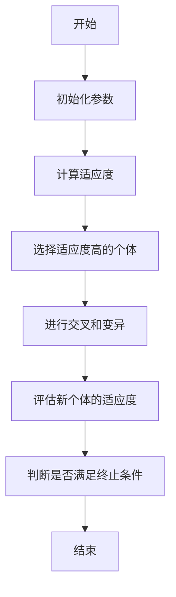
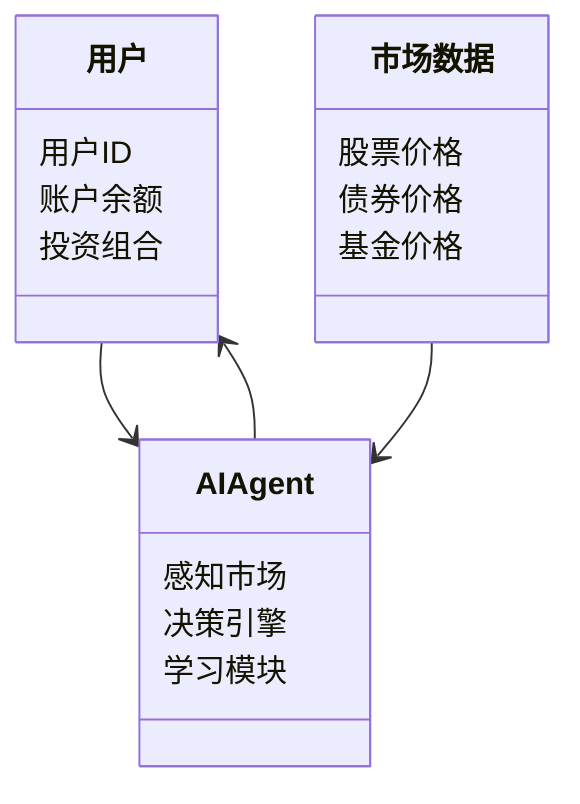
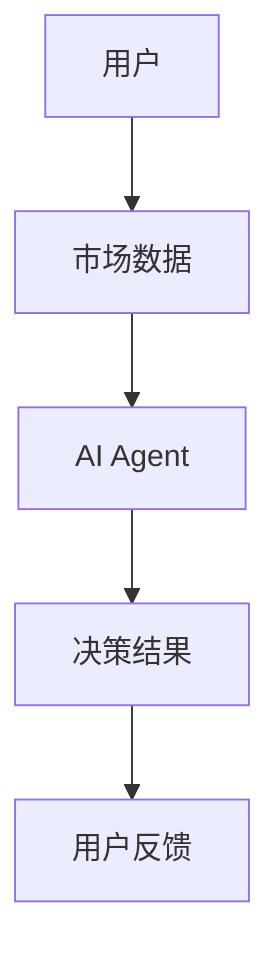

                 


# AI Agent的生物启发式学习算法实现

> 关键词：AI Agent，生物启发式学习，强化学习，进化算法，系统架构

> 摘要：本文详细探讨了AI Agent的生物启发式学习算法的实现，从基本概念到算法原理，再到系统架构和项目实战，全面解析了生物启发式学习算法在AI Agent中的应用。文章通过具体的案例分析和代码实现，帮助读者深入理解并掌握AI Agent的生物启发式学习算法的核心原理和实际应用。

---

## 第1章: AI Agent与生物启发式学习算法的背景介绍

### 1.1 AI Agent的基本概念

#### 1.1.1 什么是AI Agent
AI Agent（人工智能代理）是指能够感知环境、自主决策并采取行动以实现特定目标的智能实体。它可以是一个软件程序，也可以是一个物理设备，通过与环境交互来完成任务。

#### 1.1.2 AI Agent的核心属性与功能
- **自主性**：能够自主决策，无需外部干预。
- **反应性**：能够实时感知环境并做出反应。
- **目标导向性**：具有明确的目标，并通过行动来实现目标。
- **学习能力**：能够通过经验改进自身性能。

#### 1.1.3 AI Agent的应用场景
- **自动驾驶**：通过感知环境和决策实现自动驾驶。
- **智能推荐系统**：根据用户行为推荐个性化内容。
- **智能机器人**：在制造业和物流中完成复杂任务。
- **智能客服**：通过自然语言处理与用户交互，提供服务。

### 1.2 生物启发式学习算法的背景

#### 1.2.1 生物启发式学习算法的定义
生物启发式学习算法是一种模仿生物进化、学习和适应机制的算法。它通过模拟生物的自然选择、遗传变异、学习记忆等过程，解决复杂问题。

#### 1.2.2 生物启发式学习算法的特点
- **自适应性**：能够根据环境变化自动调整策略。
- **鲁棒性**：在不确定和动态环境中表现稳定。
- **分布式计算**：通过分布式计算提高效率和容错性。

#### 1.2.3 生物启发式学习算法的应用领域
- **机器人控制**：通过进化算法优化机器人路径。
- **游戏AI**：使用强化学习训练游戏代理。
- **金融交易**：通过算法交易优化投资策略。

---

## 第2章: 生物启发式学习算法的核心概念与联系

### 2.1 生物启发式学习算法的原理

#### 2.1.1 生物学习机制的模拟
生物启发式学习算法通过模拟生物的学习机制，如强化学习、进化算法等，来优化AI Agent的行为。

#### 2.1.2 生物启发式算法的核心要素
- **适应度函数**：衡量个体行为的好坏。
- **选择机制**：选择适应度高的个体进行繁殖。
- **交叉与变异**：通过交叉和变异操作生成新个体。

#### 2.1.3 生物启发式算法的数学模型
生物启发式算法通常涉及以下数学模型：
$$ f(x) = \sum_{i=1}^{n} x_i $$
其中，$f(x)$ 是适应度函数，$x_i$ 是个体的特征。

### 2.2 核心概念对比分析

#### 2.2.1 生物启发式算法与传统机器学习算法的对比

| 对比维度         | 生物启发式算法             | 传统机器学习算法           |
|------------------|--------------------------|---------------------------|
| 基础原理         | 模拟生物进化和学习         | 基于统计学习和模式识别       |
| 优化目标         | 最大化适应度函数           | 最小化损失函数              |
| 应用场景         | 动态和复杂环境             | 数据相对稳定                |

#### 2.2.2 生物启发式算法与深度学习算法的对比
- **生物启发式算法**：适用于动态和复杂环境，具有较强的自适应性。
- **深度学习算法**：依赖大量数据，适合模式识别和特征提取。

#### 2.2.3 生物启发式算法与强化学习算法的对比
- **生物启发式算法**：通过进化策略优化行为。
- **强化学习算法**：通过试错学习优化行为。

### 2.3 系统架构设计

#### 2.3.1 生物启发式算法的系统架构



---

## 第3章: 生物启发式学习算法的数学模型与公式

### 3.1 强化学习算法的数学模型

#### 3.1.1 Q-learning算法的数学公式
Q-learning算法通过以下公式更新Q值：
$$ Q(s,a) = Q(s,a) + \alpha [r + \max Q(s',a') - Q(s,a)] $$
其中，$\alpha$ 是学习率，$r$ 是奖励，$s'$ 是下一个状态。

#### 3.1.2 策略梯度算法的数学公式
策略梯度算法通过以下公式优化策略：
$$ \nabla \theta \log \pi(a|s) \cdot Q(s,a) $$

### 3.2 进化算法的数学模型

#### 3.2.1 适应度函数
适应度函数用于评估个体的适应度：
$$ f(x) = \sum_{i=1}^{n} x_i $$

#### 3.2.2 选择与交叉操作
选择和交叉操作用于生成新个体：
$$ p_i = \frac{f(x_i)}{\sum_{j=1}^{N} f(x_j)} $$

---

## 第4章: 系统分析与架构设计方案

### 4.1 问题场景介绍
我们以一个智能投资顾问系统为例，设计一个基于生物启发式学习算法的AI Agent。

### 4.2 系统功能设计

#### 4.2.1 领域模型


#### 4.2.2 系统架构设计


---

## 第5章: 项目实战

### 5.1 环境安装
安装Python和必要的库：
```bash
pip install gym numpy matplotlib
```

### 5.2 核心代码实现

#### 5.2.1 强化学习算法实现
```python
import gym
import numpy as np

env = gym.make('CartPole-v0')
env.seed(42)
np.random.seed(42)

class AI_Agent:
    def __init__(self, env):
        self.env = env
        self.learning_rate = 0.01
        self.episode = 1000
        self.max_steps = 200

    def epsilon_greedy(self, q_values, epsilon=0.1):
        if np.random.random() < epsilon:
            return self.env.action_space.sample()
        return np.argmax(q_values)

    def q_learning(self):
        q_table = np.zeros([self.env.observation_space.shape[0], self.env.action_space.n])
        for _ in range(self.episode):
            state = self.env.reset()
            for t in range(self.max_steps):
                action = self.epsilon_greedy(q_table, 0.1)
                next_state, reward, done, _ = self.env.step(action)
                q_table[state][action] += self.learning_rate * (reward + np.max(q_table[next_state]) - q_table[state][action])
                state = next_state
                if done:
                    break
        return q_table
```

### 5.3 案例分析与代码解读

#### 5.3.1 案例分析
以智能投资顾问系统为例，AI Agent通过强化学习算法优化投资组合。

#### 5.3.2 代码解读
```python
import gym
import numpy as np

env = gym.make('CartPole-v0')
env.seed(42)
np.random.seed(42)

class AI_Agent:
    def __init__(self, env):
        self.env = env
        self.learning_rate = 0.01
        self.episode = 1000
        self.max_steps = 200

    def epsilon_greedy(self, q_values, epsilon=0.1):
        if np.random.random() < epsilon:
            return self.env.action_space.sample()
        return np.argmax(q_values)

    def q_learning(self):
        q_table = np.zeros([self.env.observation_space.shape[0], self.env.action_space.n])
        for _ in range(self.episode):
            state = self.env.reset()
            for t in range(self.max_steps):
                action = self.epsilon_greedy(q_table, 0.1)
                next_state, reward, done, _ = self.env.step(action)
                q_table[state][action] += self.learning_rate * (reward + np.max(q_table[next_state]) - q_table[state][action])
                state = next_state
                if done:
                    break
        return q_table
```

### 5.4 项目小结
通过强化学习算法实现的AI Agent可以在复杂环境中做出优化决策，帮助投资者实现收益最大化。

---

## 第6章: 最佳实践与拓展阅读

### 6.1 最佳实践 tips
- **算法选择**：根据具体场景选择合适的生物启发式算法。
- **参数调优**：通过实验优化算法参数。
- **性能监控**：实时监控系统性能，及时调整策略。

### 6.2 小结
本文详细介绍了AI Agent的生物启发式学习算法的实现，从理论到实践，全面解析了其核心原理和应用方法。

### 6.3 注意事项
- **数据质量**：确保数据的准确性和完整性。
- **算法收敛性**：关注算法的收敛速度和稳定性。
- **环境复杂度**：评估环境的复杂度对算法性能的影响。

### 6.4 拓展阅读
- **强化学习经典论文**：[DeepMind的DQN论文](https://www.nature.com/articles/nature13598)
- **进化算法书籍**：《进化计算》

---

## 作者：AI天才研究院/AI Genius Institute & 禅与计算机程序设计艺术 /Zen And The Art of Computer Programming

---

以上是《AI Agent的生物启发式学习算法实现》的技术博客文章的完整目录大纲和详细内容。

