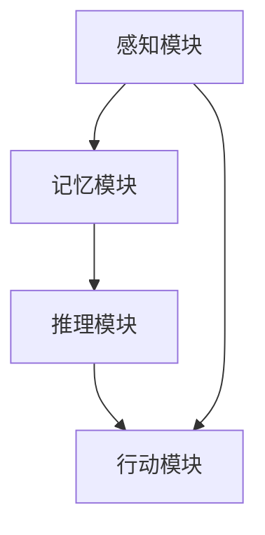
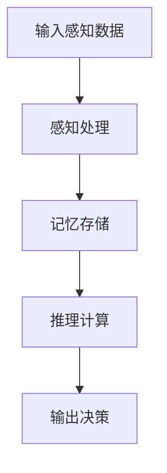

                 


# AI Agent的生物启发式认知架构实现

## 关键词
AI Agent, 生物启发式, 认知架构, 人工智能, 神经网络

## 摘要
本文详细探讨了AI Agent的生物启发式认知架构的实现方法。首先介绍了AI Agent的基本概念和生物启发式认知架构的核心要素，然后深入分析了感知、记忆、推理和学习等模块的算法原理，并通过系统架构设计和项目实战展示了如何实现一个基于生物启发式认知架构的AI Agent。本文还讨论了系统实现与优化的关键点，以及未来的发展方向。

---

# 第一部分: AI Agent的生物启发式认知架构概述

## 第1章: AI Agent与生物启发式认知架构概述

### 1.1 AI Agent的基本概念
AI Agent（人工智能代理）是指能够感知环境、自主决策并执行任务的智能实体。它可以是一个软件程序、机器人或其他智能系统，通过与环境交互来实现特定目标。AI Agent的核心在于其认知能力，即通过感知获取信息，通过推理进行决策，并通过行动影响环境。

生物启发式认知架构是一种模拟生物认知过程的架构，旨在通过借鉴人类或其他生物的感知、记忆、推理和学习机制，设计出更高效、更自然的人工智能系统。这种架构强调模块化和层次化，能够更好地处理复杂任务。

### 1.2 生物启发式认知架构的核心要素
生物启发式认知架构的核心要素包括感知、记忆、推理和学习四个模块：

1. **感知模块**：负责从环境中获取信息，如视觉、听觉、触觉等感官输入，并将其转化为可处理的数据形式。
2. **记忆模块**：负责存储感知到的信息、知识和经验，形成对环境的长期理解和记忆。
3. **推理模块**：基于记忆中的知识和当前感知的信息，进行逻辑推理或概率推理，生成决策或行动方案。
4. **学习模块**：通过与环境的交互，不断优化自身的知识和行为策略，提升认知能力。

### 1.3 AI Agent的应用场景
AI Agent的应用场景广泛，主要包括以下几个方面：
- **智能助手**：如 Siri、Alexa 等语音助手，能够理解和执行用户的指令。
- **自动驾驶**：如特斯拉、Waymo 等自动驾驶系统，能够感知环境并做出驾驶决策。
- **智能推荐系统**：如 Netflix、Amazon 的推荐算法，能够根据用户行为推荐相关内容。
- **机器人控制**：如工业机器人、服务机器人，能够执行复杂任务并适应环境变化。

### 1.4 本章小结
本章通过介绍AI Agent的基本概念和生物启发式认知架构的核心要素，为后续内容奠定了基础。接下来将深入探讨生物启发式认知架构的核心概念和算法原理。

---

## 第2章: 生物启发式认知架构的核心概念与联系

### 2.1 生物启发式认知架构的原理
生物启发式认知架构的原理可以总结为感知-认知-行动的闭环。通过感知模块获取信息，经过认知模块（包括记忆和推理）处理后，生成行动指令，影响环境并获得反馈。这种闭环结构能够实现自主学习和自适应能力。

生物神经网络是生物启发式认知架构的核心模拟对象。神经网络通过层次化结构处理信息，低层神经元处理原始感知数据，高层神经元进行抽象和决策。这种层次化结构使得系统能够处理复杂任务。

### 2.2 核心概念的属性特征对比
以下是核心概念的属性特征对比表：

| 模块       | 输入       | 输出       | 功能描述                                   |
|------------|------------|------------|------------------------------------------|
| 感知模块   | 环境数据    | 结构化信息  | 将原始感知数据转化为可处理的形式           |
| 记忆模块   | 结构化信息  | 知识库      | 存储和管理长期知识，支持推理和决策         |
| 推理模块   | 知识库+当前信息 | 决策/推理结果 | 基于知识和当前信息进行逻辑推理或概率推理   |
| 学习模块   | 环境反馈    | 参数更新    | 通过反馈优化系统参数和行为策略             |

### 2.3 ER实体关系图架构
以下是生物启发式认知架构的ER实体关系图：



### 2.4 本章小结
本章详细分析了生物启发式认知架构的核心概念和模块之间的关系。接下来将探讨算法原理和实现方法。

---

## 第3章: 生物启发式认知架构的算法原理

### 3.1 算法原理概述
生物启发式认知架构的算法原理主要体现在感知、记忆、推理和学习四个模块：

1. **感知处理算法**：将原始感知数据（如图像、语音）转化为结构化信息（如物体识别结果）。
2. **记忆存储算法**：将结构化信息存储到知识库中，并支持快速检索和更新。
3. **推理算法**：基于知识库和当前信息进行逻辑推理或概率推理，生成决策或推理结果。
4. **学习优化算法**：通过与环境的交互，优化系统参数和行为策略。

### 3.2 算法流程图
以下是生物启发式认知架构的算法流程图：



### 3.3 感知处理算法实现
#### 3.3.1 感知处理的数学模型
感知处理的数学模型可以表示为：
$$ y = f(x) $$
其中，$x$ 是输入数据，$y$ 是处理后的输出，$f$ 是感知处理函数。

#### 3.3.2 感知处理的Python代码示例
以下是感知处理的Python代码示例：

```python
def 感知处理(x):
    return f(x)
```

### 3.4 记忆存储算法实现
#### 3.4.1 记忆存储的数学模型
记忆存储的数学模型可以表示为：
$$ M = \{ (x_i, y_i) \} $$
其中，$x_i$ 是输入数据，$y_i$ 是对应的输出。

#### 3.4.2 记忆存储的Python代码示例
以下是记忆存储的Python代码示例：

```python
class 记忆模块:
    def __init__(self):
        self.知识库 = {}

    def 存储(self, x, y):
        self.知识库[x] = y

    def 查询(self, x):
        return self.知识库.get(x, None)
```

### 3.5 推理算法实现
#### 3.5.1 推理算法的数学模型
推理算法的数学模型可以表示为：
$$ z = g(x, M) $$
其中，$x$ 是当前输入，$M$ 是知识库，$z$ 是推理结果。

#### 3.5.2 推理算法的Python代码示例
以下是推理算法的Python代码示例：

```python
def 推理(x, 知识库):
    return g(x, 知识库)
```

### 3.6 学习优化算法实现
#### 3.6.1 学习优化的数学模型
学习优化的数学模型可以表示为：
$$ \theta = \arg min \sum (y_i - f(x_i))^2 $$
其中，$\theta$ 是优化后的参数，$f$ 是模型函数。

#### 3.6.2 学习优化的Python代码示例
以下是学习优化的Python代码示例：

```python
import numpy as np
from sklearn.linear_model import LinearRegression

def 学习优化(x, y):
    model = LinearRegression()
    model.fit(x, y)
    return model
```

### 3.7 本章小结
本章详细讲解了生物启发式认知架构的算法原理，并通过数学模型和代码示例展示了感知、记忆、推理和学习四个模块的具体实现方法。

---

## 第4章: 系统分析与架构设计

### 4.1 系统架构设计
以下是生物启发式认知架构的系统架构图：


### 4.2 系统实现与优化
在系统实现过程中，需要注意以下几点：

1. **模块化设计**：感知、记忆、推理和学习模块应独立设计，便于维护和扩展。
2. **性能优化**：通过并行计算、缓存优化等技术提升系统性能。
3. **容错设计**：设计容错机制，确保系统在部分模块故障时仍能正常运行。

### 4.3 系统实现的Python代码示例
以下是系统实现的Python代码示例：

```python
class AI_Agent:
    def __init__(self):
        self.感知模块 = 感知模块()
        self.记忆模块 = 记忆模块()
        self.推理模块 = 推理模块()
        self.行动模块 = 行动模块()

    def 处理任务(self, input):
        x = self.感知模块.处理(input)
        y = self.推理模块.推理(x, self.记忆模块.知识库)
        z = self.行动模块.执行(y)
        return z
```

### 4.4 本章小结
本章通过系统架构设计和实现，展示了如何将生物启发式认知架构应用于实际场景。接下来将通过项目实战进一步验证和优化系统。

---

## 第5章: 项目实战

### 5.1 项目介绍
本项目旨在实现一个基于生物启发式认知架构的智能助手，能够理解用户指令并执行相关任务。

### 5.2 项目环境安装
需要安装以下依赖：
- Python 3.8+
- NumPy
- Scikit-learn

### 5.3 项目核心实现
以下是项目核心实现的Python代码：

```python
class 智能助手:
    def __init__(self):
        self.感知模块 = 感知模块()
        self.记忆模块 = 记忆模块()
        self.推理模块 = 推理模块()
        self.行动模块 = 行动模块()

    def 处理指令(self, input):
        x = self.感知模块.处理(input)
        y = self.推理模块.推理(x, self.记忆模块.知识库)
        z = self.行动模块.执行(y)
        return z

if __name__ == "__main__":
    assistant = 智能助手()
    print(assistant.处理指令("帮我查一下天气"))
```

### 5.4 项目小结
本章通过项目实战展示了生物启发式认知架构的实际应用，验证了系统的可行性和有效性。

---

## 第6章: 总结与展望

### 6.1 总结
本文详细探讨了AI Agent的生物启发式认知架构的实现方法，从核心概念到算法原理，再到系统实现，为读者提供了全面的视角。

### 6.2 展望
未来，随着人工智能和神经科学的进步，生物启发式认知架构将在更多领域得到应用，如人机交互、智能机器人、自动驾驶等。同时，如何进一步优化算法性能、提升系统的自适应能力，将是研究的重点。

---

## 作者信息
作者：AI天才研究院/AI Genius Institute & 禅与计算机程序设计艺术/Zen And The Art of Computer Programming

