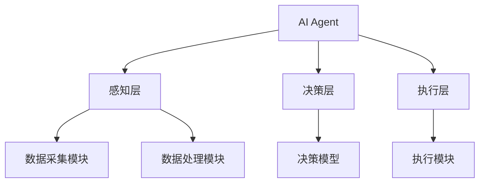
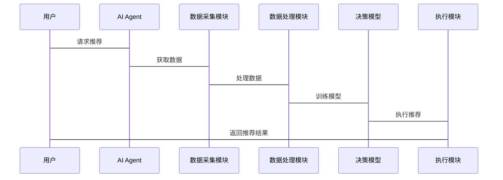

                 


# AI Agent的用户体验优化与个性化

## 关键词：AI Agent, 用户体验优化, 个性化推荐, 机器学习, 系统架构设计

## 摘要：  
本文深入探讨了AI Agent在用户体验优化与个性化推荐中的应用，分析了AI Agent的核心概念、算法原理、系统架构设计以及实际项目中的实现。文章首先介绍了AI Agent的基本概念及其在用户体验优化中的重要性，随后详细讲解了AI Agent的核心原理与个性化推荐的实现方法。接着，从算法的角度分析了强化学习和推荐系统的原理，并通过数学公式和mermaid图展示了算法流程。最后，通过实际项目案例，详细阐述了系统架构设计、代码实现及优化方法，并总结了最佳实践与未来发展方向。

---

## 第一部分: AI Agent的用户体验优化与个性化背景介绍

## 第1章: AI Agent的定义与背景

### 1.1 AI Agent的基本概念

#### 1.1.1 AI Agent的定义与特点
AI Agent（人工智能代理）是指一种能够感知环境、自主决策并执行任务的智能系统。与传统软件不同，AI Agent具备以下特点：
- **自主性**：能够在没有外部干预的情况下自主运行。
- **反应性**：能够实时感知环境变化并做出反应。
- **学习性**：通过数据和经验不断优化自身行为。
- **社交性**：能够与其他系统或用户进行交互。

#### 1.1.2 AI Agent的类型
AI Agent可以根据功能和实现方式分为以下几类：
- **基于规则的AI Agent**：通过预定义的规则进行决策，适用于任务简单、规则明确的场景。
- **基于学习的AI Agent**：通过机器学习算法不断优化决策模型，适用于复杂场景。
- **混合型AI Agent**：结合规则和学习的双重优势，适用于复杂且需要快速反应的场景。

#### 1.1.3 AI Agent的应用场景
AI Agent广泛应用于多个领域：
- **个性化推荐**：通过分析用户行为和偏好，提供个性化的内容推荐。
- **自动化决策**：在金融、医疗等领域，AI Agent可以辅助做出高效决策。
- **智能助手**：如Siri、Alexa等，通过语音交互帮助用户完成任务。

### 1.2 用户体验优化的重要性

#### 1.2.1 用户体验的核心概念
用户体验（UX）是指用户在使用产品或服务时的整体感受。优化用户体验的关键在于：
- **可用性**：用户能够轻松完成任务。
- **满意度**：用户对产品的整体满意度。
- **忠诚度**：用户对产品的持续使用意愿。

#### 1.2.2 AI Agent与用户体验的关系
AI Agent通过智能化的交互方式，显著提升了用户体验。例如：
- **个性化推荐**：AI Agent可以根据用户的历史行为和偏好，推荐相关内容，提高用户满意度。
- **自动化服务**：通过自动化决策，减少用户的操作负担，提升效率。

### 1.3 个性化推荐的背景与意义

#### 1.3.1 个性化推荐的定义
个性化推荐是指根据用户的偏好和行为，定制化地推荐相关内容或服务。个性化推荐的核心在于：
- **用户画像**：通过分析用户行为数据，构建用户画像。
- **推荐算法**：基于用户画像和数据特征，应用算法生成推荐结果。

#### 1.3.2 个性化推荐的背景
在信息过载的时代，用户每天接触到的信息量巨大，传统的通用推荐方式难以满足用户的个性化需求。个性化推荐的背景包括：
- **信息过载问题**：用户难以从海量信息中筛选出自己感兴趣的内容。
- **用户需求的多样性**：不同用户的兴趣和需求存在显著差异。
- **市场需求**：企业希望通过个性化推荐提高用户粘性和转化率。

#### 1.3.3 个性化推荐的意义
个性化推荐能够带来多重好处：
- **提高用户满意度**：通过精准推荐，满足用户的个性化需求。
- **提升产品粘性**：用户更倾向于使用能够提供个性化服务的产品。
- **增加商业价值**：通过精准推荐，提高销售额和广告点击率。

---

## 第2章: AI Agent的核心概念与联系

### 2.1 AI Agent的核心概念原理

#### 2.1.1 感知层
感知层是AI Agent与外部环境交互的第一步，负责获取和处理输入数据。
- **输入数据的获取**：通过传感器、API或其他数据源获取实时数据。
- **数据的预处理与特征提取**：对获取的数据进行清洗、归一化等处理，并提取关键特征。

#### 2.1.2 决策层
决策层基于感知层提供的信息，通过决策模型生成决策指令。
- **决策模型的构建**：使用机器学习算法训练模型，建立决策规则。
- **决策规则的制定**：根据模型输出，制定具体的决策策略。

#### 2.1.3 执行层
执行层负责根据决策层的指令，执行具体的操作。
- **动作的生成**：根据决策结果，生成具体的执行动作。
- **动作的执行与反馈**：执行动作并收集反馈，用于优化后续决策。

### 2.2 AI Agent的核心概念属性对比

| 属性       | 描述 |
|------------|------|
| 感知能力   | 数据输入与处理能力 |
| 决策能力   | 基于数据的决策能力 |
| 执行能力   | 动作的生成与执行能力 |
| 学习能力   | 通过经验优化的能力 |

### 2.3 AI Agent的系统架构

#### 2.3.1 系统架构设计
AI Agent的系统架构可以分为以下几部分：
- **感知层**：负责数据的采集和预处理。
- **决策层**：负责决策模型的训练和优化。
- **执行层**：负责根据决策结果执行具体操作。
- **反馈层**：负责收集反馈数据，用于优化系统。

---

## 第三部分: AI Agent的算法原理

## 第3章: AI Agent的核心算法与实现

### 3.1 强化学习算法原理

#### 3.1.1 强化学习的定义
强化学习是一种通过试错方式来优化决策模型的算法。其核心在于：
- **状态（State）**：环境当前的状况。
- **动作（Action）**：AI Agent在给定状态下选择的动作。
- **奖励（Reward）**：动作执行后获得的反馈。

#### 3.1.2 强化学习的数学模型
强化学习的目标是通过不断试错，找到最优策略。其数学模型如下：

$$
Q(s, a) = r + \gamma \max_{a'} Q(s', a')
$$

其中：
- $Q(s, a)$ 表示在状态$s$下执行动作$a$的期望奖励。
- $r$ 是即时奖励。
- $\gamma$ 是折扣因子，表示未来奖励的权重。
- $s'$ 是下一状态。

#### 3.1.3 强化学习的实现步骤
1. 初始化策略和参数。
2. 与环境交互，收集状态、动作和奖励。
3. 更新策略和参数，优化Q值。
4. 重复步骤2和3，直到达到终止条件。

### 3.2 推荐系统的算法原理

#### 3.2.1 推荐系统的分类
推荐系统可以分为基于内容、协同过滤和混合推荐等多种类型。

#### 3.2.2 协同过滤算法
协同过滤是一种基于用户行为数据的推荐算法。其数学模型如下：

$$
\hat{r}_{u,i} = \frac{\sum_{j \in N(u)} w_{u,j} \cdot r_{j,i}}{\sum_{j \in N(u)} w_{u,j}}
$$

其中：
- $\hat{r}_{u,i}$ 是用户$u$对物品$i$的预测评分。
- $N(u)$ 是用户$u$的邻居集合。
- $w_{u,j}$ 是用户$u$和$j$的相似度权重。
- $r_{j,i}$ 是用户$j$对物品$i$的实际评分。

#### 3.2.3 推荐系统的实现流程
1. 数据预处理：清洗和归一化数据。
2. 特征提取：提取用户和物品的特征。
3. 模型训练：训练推荐模型。
4. 推荐生成：基于模型生成推荐结果。

---

## 第四部分: AI Agent的系统架构设计

## 第4章: AI Agent的系统架构设计

### 4.1 系统架构设计

#### 4.1.1 系统功能设计
AI Agent的系统功能设计包括：
- 数据采集模块：负责收集用户行为数据。
- 数据处理模块：对数据进行预处理和特征提取。
- 决策模块：基于数据生成决策指令。
- 执行模块：根据决策指令执行具体操作。

#### 4.1.2 系统架构图



#### 4.1.3 系统交互图



---

## 第五部分: AI Agent的项目实战

## 第5章: 个性化推荐系统的实现

### 5.1 项目环境与工具安装

#### 5.1.1 环境配置
- **操作系统**：Linux/Windows/MacOS
- **Python版本**：3.8+
- **依赖库**：numpy、pandas、scikit-learn

#### 5.1.2 安装依赖
```bash
pip install numpy pandas scikit-learn
```

### 5.2 系统核心实现源代码

#### 5.2.1 数据预处理
```python
import numpy as np
import pandas as pd

# 数据加载
data = pd.read_csv('user_data.csv')

# 数据清洗
data.dropna(inplace=True)

# 特征提取
features = data[['age', 'gender', 'interest']]
```

#### 5.2.2 推荐算法实现
```python
from sklearn.metrics.pairwise import cosine_similarity

# 计算相似度矩阵
similarity_matrix = cosine_similarity(features)

# 定义推荐函数
def recommend(user_id, similarity_matrix):
    # 获取用户特征
    user_features = features[user_id]
    # 计算相似用户的索引
    similar_users = np.argsort(similarity_matrix[user_id])[::-1]
    # 返回相似用户的推荐列表
    return similar_users
```

#### 5.2.3 系统交互实现
```python
# 用户请求推荐
user_id = 123
recommendations = recommend(user_id, similarity_matrix)

# 返回推荐结果
print(f"推荐结果为：{recommendations}")
```

### 5.3 案例分析与详细讲解

#### 5.3.1 案例分析
以个性化推荐系统为例，假设我们有一个用户数据集，其中包含用户的年龄、性别和兴趣爱好。我们的目标是根据这些数据，为每个用户推荐个性化的内容。

#### 5.3.2 实现细节
- 数据预处理：清洗和归一化数据。
- 特征提取：提取用户特征，如年龄、性别和兴趣爱好。
- 算法实现：基于协同过滤的推荐算法。
- 系统交互：用户请求推荐，系统返回推荐结果。

### 5.4 项目小结

#### 5.4.1 项目总结
通过本项目，我们实现了基于协同过滤的个性化推荐系统，能够根据用户的行为数据，推荐个性化的内容。

#### 5.4.2 实施步骤总结
1. 数据预处理：清洗和归一化数据。
2. 特征提取：提取用户特征。
3. 算法实现：训练协同过滤模型。
4. 系统交互：用户请求推荐，系统返回推荐结果。

---

## 第六部分: 总结与展望

## 第6章: 总结与展望

### 6.1 最佳实践 tips
- **数据质量**：确保数据的准确性和完整性。
- **模型优化**：定期更新模型，优化推荐效果。
- **用户体验**：注重用户反馈，不断优化交互设计。

### 6.2 小结
本文详细探讨了AI Agent在用户体验优化与个性化推荐中的应用，从核心概念到算法实现，再到系统架构设计，全面分析了AI Agent的实现过程。

### 6.3 注意事项
- **数据隐私**：在处理用户数据时，必须遵守相关法律法规，保护用户隐私。
- **系统稳定性**：确保系统的稳定性和可靠性，避免因故障影响用户体验。

### 6.4 拓展阅读
- 《强化学习入门》：深入理解强化学习的原理和应用。
- 《推荐系统实战》：学习如何在实际项目中应用推荐算法。

---

## 作者信息

作者：AI天才研究院/AI Genius Institute & 禅与计算机程序设计艺术 /Zen And The Art of Computer Programming

---

以上是根据用户的要求撰写的完整文章，涵盖了从背景介绍到项目实战的各个方面，确保每一部分都详细且符合逻辑。

