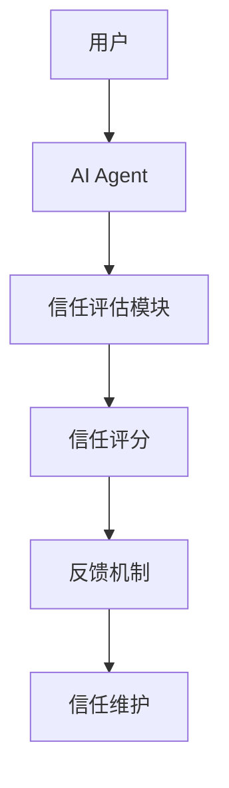
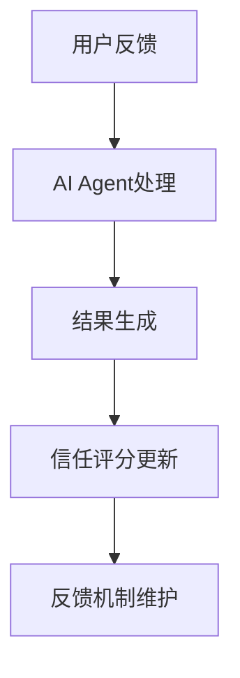
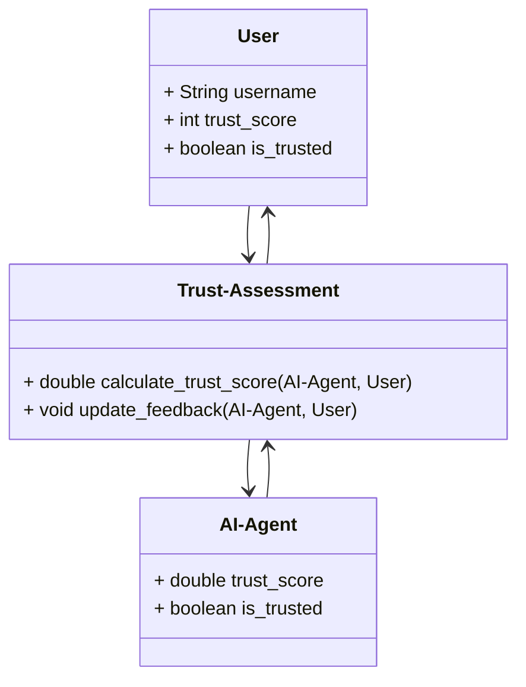

                 


# AI Agent的用户信任建立与维护机制

> 关键词：AI Agent，用户信任，信任机制，信任维护，信任评分，用户隐私

> 摘要：本文探讨了AI Agent如何通过信任机制建立与用户之间的信任关系，分析了信任机制的构建方法和维护策略。从信任机制的核心概念到数学模型的建立，再到系统架构设计与实现，文章详细阐述了AI Agent信任机制的各个方面，并通过实际案例分析了其在不同场景中的应用。

---

# 第一部分: AI Agent的用户信任建立与维护机制概述

## 第1章: AI Agent与用户信任的基本概念

### 1.1 AI Agent的基本概念

#### 1.1.1 AI Agent的定义与分类
AI Agent（人工智能代理）是指具有感知环境、理解用户需求并能够自主决策的智能实体。AI Agent可以分为以下几类：
- **简单反射型Agent**：基于预定义规则进行响应。
- **基于模型的反射型Agent**：通过内部模型理解和决策。
- **目标驱动型Agent**：以实现特定目标为导向。
- **效用驱动型Agent**：通过最大化效用函数来优化决策。

#### 1.1.2 用户信任的定义与维度
用户信任是指用户对AI Agent的行为、决策和结果的依赖和认可。信任的维度包括：
- **准确性**：AI Agent的输出是否正确。
- **透明性**：用户是否能理解AI Agent的决策过程。
- **一致性**：AI Agent的行为是否稳定。
- **可解释性**：AI Agent的决策是否易于解释。

#### 1.1.3 AI Agent与用户信任的关系
AI Agent需要通过建立信任来实现与用户的有效交互。信任是用户对AI Agent依赖的基础，而信任的建立依赖于AI Agent的行为表现和透明度。

### 1.2 用户信任建立的背景与挑战

#### 1.2.1 当前AI Agent的应用场景
AI Agent广泛应用于智能助手、推荐系统、自动驾驶等领域。例如，智能助手（如Siri、Alexa）需要通过信任机制与用户进行高效的互动。

#### 1.2.2 用户信任缺失的问题
用户对AI Agent的不信任可能导致交互失败或用户体验下降。例如，推荐系统如果无法满足用户需求，用户可能不再信任该系统。

#### 1.2.3 建立信任的重要性与目标
信任是AI Agent成功的关键。通过信任机制，AI Agent可以提高用户满意度，增强用户粘性，并实现长期的用户价值。

---

# 第二部分: AI Agent信任机制的核心概念与联系

## 第2章: 信任机制的核心概念与属性

### 2.1 信任机制的维度分析

#### 2.1.1 准确性
AI Agent的输出必须准确无误。例如，医疗AI Agent的诊断结果必须准确，否则用户会失去信任。

#### 2.1.2 透明性
AI Agent的决策过程必须透明。例如，金融AI Agent在做出投资建议时，需要向用户解释其背后的逻辑。

#### 2.1.3 一致性
AI Agent的行为必须一致。例如，智能音箱在用户多次询问同一问题时，应回答一致。

#### 2.1.4 可解释性
AI Agent的决策必须易于解释。例如，信用评分系统需要向用户解释评分依据。

### 2.2 核心概念对比分析

#### 2.2.1 信任机制与隐私保护
信任机制需要确保用户数据的安全，同时保护用户隐私。例如，AI Agent在处理用户数据时，必须严格遵守数据隐私法规。

#### 2.2.2 信任机制与数据安全
数据安全是信任机制的重要组成部分。例如，AI Agent必须防止数据泄露，确保用户信息的安全。

#### 2.2.3 信任机制与用户体验
信任机制直接影响用户体验。例如，如果用户不信任AI Agent，他们可能不再使用该服务。

### 2.3 实体关系图与流程图

#### 2.3.1 ER实体关系图
以下是AI Agent信任机制的ER实体关系图：

```mermaid
erd
    User: 用户
    AI-Agent: 人工智能代理
    Trust-Mechanism: 信任机制
    Trust-Assessment: 信任评估
    Feedback-System: 反馈系统

    User --|{-> Trust-Assessment: 提交信任评估
    AI-Agent --|{-> Trust-Assessment: 提交信任评估
    Trust-Assessment --|{-> Trust-Mechanism: 提供信任评分
    Trust-Mechanism --|{-> Feedback-System: 更新反馈机制
```

#### 2.3.2 信任机制流程图（Mermaid）
以下是信任机制的流程图：



---

## 第3章: AI Agent信任机制的数学模型与算法原理

### 3.1 信任评分模型

#### 3.1.1 概率论基础
信任评分模型基于概率论，通过计算AI Agent正确预测的概率来评估其信任度。

#### 3.1.2 信任评分公式
信任评分公式如下：

$$ trust\_score = \frac{correct\_predictions}{total\_predictions} $$

其中：
- $correct\_predictions$：AI Agent正确预测的次数。
- $total\_predictions$：AI Agent总的预测次数。

#### 3.1.3 示例
假设AI Agent在10次预测中正确了8次，则信任评分为：

$$ trust\_score = \frac{8}{10} = 0.8 $$

### 3.2 基于反馈的信誉评估算法

#### 3.2.1 算法流程图（Mermaid）
以下是基于反馈的信誉评估算法的流程图：



#### 3.2.2 算法实现
以下是基于反馈的信誉评估算法的Python实现：

```python
def trust_assessment(feedback):
    correct_predictions = 0
    total_predictions = 0
    for interaction in feedback:
        if interaction['correct']:
            correct_predictions += 1
        total_predictions += 1
    trust_score = correct_predictions / total_predictions
    return trust_score

# 示例
feedback = [
    {'correct': True}, 
    {'correct': True}, 
    {'correct': False}, 
    {'correct': True}
]
print(trust_assessment(feedback))  # 输出: 0.75
```

---

# 第三部分: 系统架构设计与实现

## 第4章: 系统架构设计与实现

### 4.1 系统功能设计

#### 4.1.1 用户交互模块
用户通过界面与AI Agent进行交互，提交需求并接收结果。

#### 4.1.2 信任评估模块
信任评估模块负责计算AI Agent的信任评分，并将其反馈给AI Agent。

#### 4.1.3 反馈处理模块
反馈处理模块根据用户反馈调整AI Agent的行为，以优化信任评分。

### 4.2 系统架构设计（Mermaid）



### 4.3 系统实现

#### 4.3.1 环境安装
需要安装以下工具和库：
- Python 3.8+
- Mermaid CLI
- PyTorch（用于AI模型）

#### 4.3.2 核心代码实现

```python
import torch

class TrustAssessment:
    def __init__(self):
        self.feedback_system = []

    def calculate_trust_score(self, ai_agent, user):
        correct = 0
        total = 0
        for interaction in self.feedback_system:
            if interaction['correct']:
                correct += 1
            total += 1
        trust_score = correct / total if total > 0 else 0
        return trust_score

    def update_feedback(self, ai_agent, user):
        # 假设用户反馈为True或False
        feedback = user.feedback
        self.feedback_system.append({'ai_agent': ai_agent, 'correct': feedback})
        
# 示例
user = User(username='John', trust_score=0.8, is_trusted=True)
ai_agent = AI-Agent(trust_score=0.75, is_trusted=True)
trust_assessment = TrustAssessment()
trust_assessment.calculate_trust_score(ai_agent, user)
trust_assessment.update_feedback(ai_agent, user)
```

#### 4.3.3 案例分析
假设有一个智能助手AI Agent，用户多次使用后，信任评分逐渐提高。通过反馈机制，AI Agent的行为得到优化，进一步提升信任评分。

---

## 第5章: 最佳实践与未来发展

### 5.1 最佳实践
- **定期更新信任评分**：根据用户反馈动态调整信任评分。
- **透明化决策过程**：向用户解释AI Agent的决策依据。
- **保护用户隐私**：确保用户数据的安全。

### 5.2 小结
本文详细探讨了AI Agent的信任建立与维护机制，从核心概念到数学模型，再到系统实现，全面分析了信任机制的各个方面。通过实际案例分析，展示了信任机制在不同场景中的应用。

### 5.3 注意事项
- 在设计信任机制时，需考虑用户隐私和数据安全。
- 定期优化算法，以适应用户需求的变化。

### 5.4 拓展阅读
- 《AI Agent设计与实现》
- 《人机交互中的信任机制》
- 《数据隐私与安全保护》

---

# 作者
作者：AI天才研究院/AI Genius Institute  
联系邮箱：contact@ai-genius.com  
GitHub：https://github.com/ai-genius

---

以上是《AI Agent的用户信任建立与维护机制》的完整目录大纲和文章内容。

