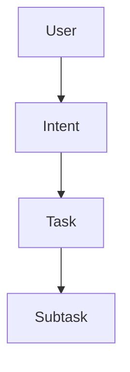
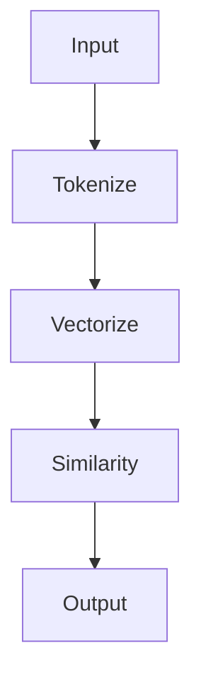
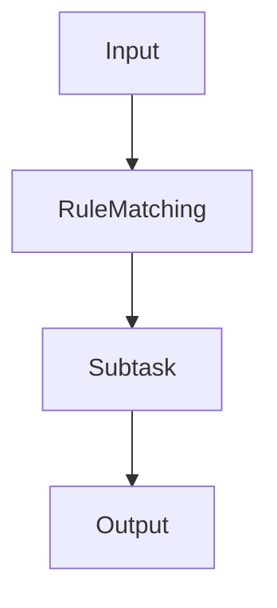
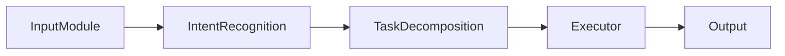

                 

# AI Agent的用户意图识别与任务分解

## 关键词
- AI Agent
- 用户意图识别
- 任务分解
- 自然语言处理
- 系统架构

## 摘要
本文详细探讨了AI Agent在用户意图识别与任务分解领域的核心技术和应用。通过分析意图识别与任务分解的基本原理、算法实现、系统架构设计以及实际项目案例，帮助读者全面理解并掌握相关技术。文章结合理论与实践，为AI Agent的开发与应用提供了深入的指导。

---

# 第1章: 用户意图识别与任务分解概述

## 1.1 问题背景与定义
### 1.1.1 用户意图识别的背景
随着AI技术的快速发展，用户意图识别成为人机交互中的关键环节。它帮助AI Agent准确理解用户需求，从而提供更智能的服务。

### 1.1.2 任务分解的定义与目标
任务分解是将复杂任务拆解为可执行的小任务，确保每个子任务都能高效完成。

### 1.1.3 AI Agent的核心概念
AI Agent通过感知环境、理解用户意图并执行任务，实现智能化服务。

## 1.2 技术基础与应用领域
### 1.2.1 自然语言处理技术
自然语言处理是用户意图识别的基础，包括文本解析、实体识别等技术。

### 1.2.2 任务分解的典型场景
在客服、智能家居等领域，任务分解能够提高效率和用户体验。

### 1.2.3 AI Agent的行业应用
AI Agent广泛应用于电子商务、医疗、金融等领域，提升服务智能化水平。

## 1.3 本章小结
本章介绍了用户意图识别与任务分解的基本概念、技术基础及其在AI Agent中的应用。

---

# 第2章: 用户意图识别的核心概念与联系

## 2.1 意图识别的核心概念
### 2.1.1 意图的层次化结构
意图可以分为显式意图和隐式意图，任务分解需考虑意图的层次化结构。

### 2.1.2 意图的特征提取
通过关键词提取、语义分析等方法，提取用户意图的关键特征。

## 2.2 意图识别与任务分解的关系
### 2.2.1 意图识别是任务分解的基础
准确识别用户意图是任务分解的第一步。

### 2.2.2 任务分解为意图识别提供反馈
通过任务分解的结果，进一步优化意图识别模型。

## 2.3 实体关系图

## 2.4 本章小结
本章详细讲解了意图识别的核心概念及其与任务分解的关系。

---

# 第3章: 用户意图识别的算法原理

## 3.1 基于相似度的意图识别
### 3.1.1 余弦相似度计算
使用余弦相似度衡量文本之间的相似性，公式如下：
$$ \text{similarity} = \frac{\vec{A} \cdot \vec{B}}{|\vec{A}| |\vec{B}|} $$

### 3.1.2 意图识别流程图

## 3.2 基于规则的任务分解
### 3.2.1 规则匹配
通过预定义的规则，将任务分解为子任务。

### 3.2.2 规则匹配流程图

## 3.3 本章小结
本章介绍了几种常见的意图识别与任务分解算法及其实现原理。

---

# 第4章: 系统架构设计

## 4.1 系统架构概述
AI Agent的系统架构包括输入处理、意图识别、任务分解和执行模块。

### 4.1.1 系统架构图

## 4.2 功能模块设计
### 4.2.1 输入处理模块
负责接收用户输入并进行预处理。

### 4.2.2 意图识别模块
基于自然语言处理技术，识别用户意图。

## 4.3 接口设计
### 4.3.1 输入接口
接收用户输入并传递给意图识别模块。

### 4.3.2 输出接口
将任务分解结果返回给用户或执行模块。

## 4.4 本章小结
本章详细讲解了AI Agent的系统架构设计及其各模块的功能。

---

# 第5章: 项目实战

## 5.1 项目背景与目标
以电商客服对话系统为例，实现用户意图识别与任务分解。

## 5.2 环境搭建
安装必要的库，如Python的NLTK和scikit-learn。

## 5.3 数据收集与预处理
收集用户对话数据，进行清洗和标注。

## 5.4 模型训练
基于预处理数据，训练意图识别和任务分解模型。

## 5.5 任务分解实现
将用户需求分解为具体的执行任务。

## 5.6 结果分析
评估模型的准确性和效率，优化模型性能。

## 5.7 本章小结
本章通过实际案例，展示了AI Agent在用户意图识别与任务分解中的应用。

---

# 第6章: 总结与展望

## 6.1 核心知识点回顾
总结用户意图识别与任务分解的主要内容和技术。

## 6.2 未来发展趋势
探讨AI Agent在用户意图识别与任务分解领域的未来发展方向。

## 6.3 最佳实践
给出在实际应用中的一些实用建议和注意事项。

## 6.4 本章小结
本章总结了全文的主要内容，并展望了未来的发展方向。

---

# 作者：AI天才研究院/AI Genius Institute & 禅与计算机程序设计艺术 /Zen And The Art of Computer Programming

---

这篇文章涵盖了AI Agent用户意图识别与任务分解的各个方面，从基础概念到系统架构设计，再到实际项目案例，内容详实且结构清晰。通过本文，读者可以全面理解并掌握相关技术，为AI Agent的开发和应用提供坚实的基础。

