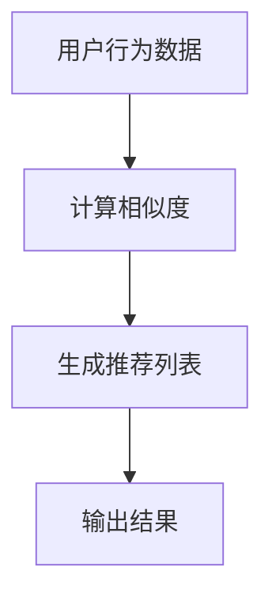
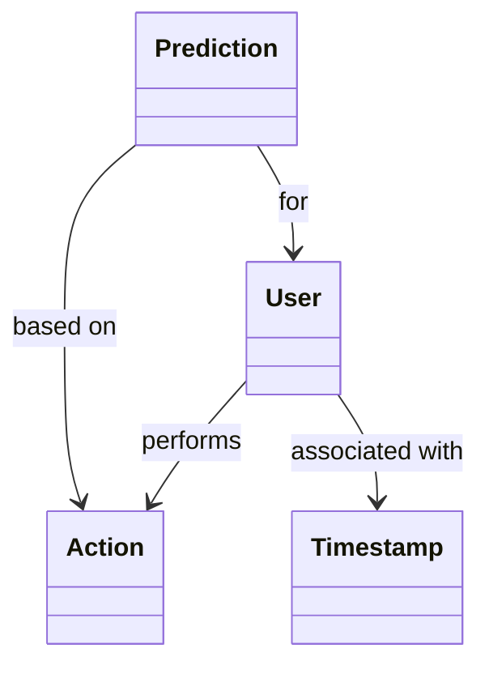
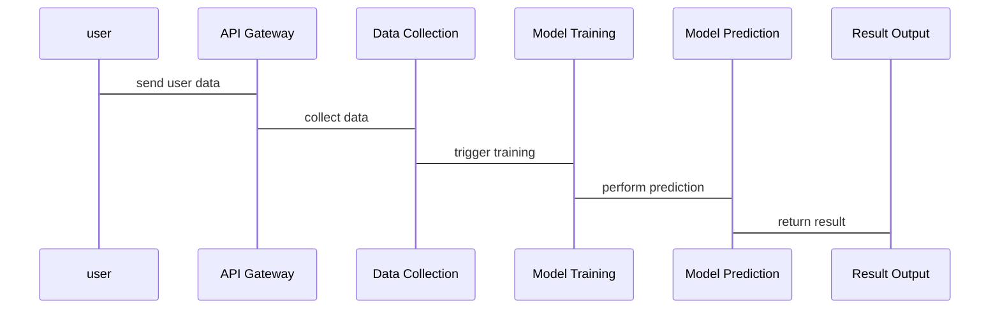

                 


# AI Agent的用户行为分析与预测系统

> 关键词：AI Agent, 用户行为分析, 机器学习, 预测系统, 算法原理

> 摘要：本文将深入探讨AI Agent在用户行为分析与预测系统中的应用，从基本概念到算法原理，再到系统设计与实战，系统地分析和阐述这一技术的核心内容。通过本文，读者将能够理解AI Agent如何帮助我们预测和分析用户行为，并掌握实际应用中的关键技术和方法。

---

# 第1章: AI Agent与用户行为分析的背景介绍

## 1.1 AI Agent的基本概念
### 1.1.1 AI Agent的定义与特点
AI Agent（人工智能代理）是一种能够感知环境、自主决策并执行任务的智能实体。它通过数据输入、模型训练和算法优化，能够理解用户的行为模式，并根据这些模式进行预测和推荐。AI Agent的核心特点包括：
- **自主性**：能够在没有外部干预的情况下独立运行。
- **反应性**：能够实时感知环境变化并做出反应。
- **学习性**：能够通过数据和经验不断优化自身的预测能力。

### 1.1.2 用户行为分析的定义与目标
用户行为分析是指通过对用户在系统中的行为数据进行建模和分析，挖掘用户的行为模式、偏好和需求。其目标是帮助企业更好地理解用户需求，优化用户体验，并提高系统的智能化水平。

### 1.1.3 AI Agent在用户行为分析中的作用
AI Agent通过收集和分析用户行为数据，能够实时预测用户的下一步操作，并提供个性化的服务或推荐。这不仅提高了系统的智能化水平，还能够帮助企业实现精准营销和用户留存。

## 1.2 用户行为分析的背景与意义
### 1.2.1 当前用户行为分析的现状
随着互联网和移动应用的普及，用户行为数据的收集和分析变得越来越重要。传统的基于规则的用户行为分析方法逐渐暴露出效率低下、灵活性差等问题，而AI Agent的引入为用户行为分析带来了新的可能性。

### 1.2.2 AI Agent在用户行为分析中的优势
AI Agent能够通过机器学习算法从海量数据中提取规律，快速适应用户行为的变化，并实时做出预测和决策。相比于传统方法，AI Agent具有更高的准确性和实时性。

### 1.2.3 本章小结
本章主要介绍了AI Agent的基本概念和用户行为分析的背景与意义，强调了AI Agent在用户行为分析中的重要性。

---

# 第2章: AI Agent用户行为分析的核心概念

## 2.1 AI Agent与用户行为分析的核心要素
### 2.1.1 用户行为的特征分析
用户行为数据通常包括用户的点击、浏览、购买、收藏等行为，这些行为数据可以通过日志记录和埋点技术进行收集。通过对这些数据的分析，可以提取用户的兴趣、偏好和行为模式。

### 2.1.2 AI Agent的行为预测模型
AI Agent的行为预测模型通常包括数据预处理、特征提取、模型训练和预测几个步骤。模型的核心是通过机器学习算法（如协同过滤、时间序列分析和深度学习模型）对用户行为进行建模和预测。

### 2.1.3 用户行为分析的边界与外延
用户行为分析的边界包括数据的收集范围、分析的时间范围和预测的精度要求。外延则包括对用户行为的影响因素、行为模式的变化趋势以及行为预测的应用场景。

## 2.2 核心概念原理与联系
### 2.2.1 AI Agent与用户行为的实体关系图
通过ER图可以清晰地展示用户行为分析系统中的实体关系，包括用户、行为、时间戳、预测结果等核心要素。

```mermaid
er
actor: 用户
agent: AI Agent
action: 用户行为
timestamp: 时间戳
prediction: 预测结果
```

### 2.2.2 核心概念的特征对比
通过对比分析，可以更好地理解AI Agent与传统用户行为分析方法的区别和联系。

| 特征 | AI Agent | 传统方法 |
|------|-----------|----------|
| 数据处理 | 支持实时处理 | 周期性处理 |
| 模型更新 | 自动优化 | 需人工干预 |
| 预测精度 | 更高 | 较低 |

## 2.3 本章小结
本章详细阐述了AI Agent用户行为分析的核心概念，包括用户行为的特征分析、行为预测模型以及实体关系图。通过对比分析，突出了AI Agent的优势。

---

# 第3章: AI Agent用户行为分析的算法原理

## 3.1 常见的用户行为分析算法
### 3.1.1 协同过滤算法
协同过滤是一种基于用户相似性推荐算法。通过计算用户之间的相似度，推荐用户可能感兴趣的内容。

### 3.1.2 时间序列分析
时间序列分析是一种基于历史数据预测未来趋势的方法。适用于用户行为的时间依赖性较强的场景。

### 3.1.3 基于深度学习的用户行为预测模型
深度学习模型（如LSTM和Transformer）能够捕捉用户行为的复杂模式，适用于非线性关系的预测。

## 3.2 算法原理与流程图
### 3.2.1 协同过滤算法的流程图


### 3.2.2 协同过滤的相似度计算公式
$$ sim(u_i, u_j) = \frac{\sum_{k} (r_{i,k} - \bar{r_i})(r_{j,k} - \bar{r_j})}{\sqrt{\sum_{k} (r_{i,k} - \bar{r_i})^2} \cdot \sqrt{\sum_{k} (r_{j,k} - \bar{r_j})^2}}} $$

其中：
- \( r_{i,k} \) 表示用户 \( i \) 对物品 \( k \) 的评分
- \( \bar{r_i} \) 表示用户 \( i \) 的平均评分

## 3.3 算法实现与代码示例
### 3.3.1 协同过滤算法的Python实现
```python
def collaborative_filtering(user_matrix):
    # 计算用户相似度矩阵
    user_similarity = user_matrix.T.dot(user_matrix)
    # 生成推荐列表
    recommendations = user_similarity * user_matrix
    return recommendations
```

## 3.4 本章小结
本章详细介绍了几种常见的用户行为分析算法，并通过流程图和公式展示了协同过滤算法的原理和实现。

---

# 第4章: AI Agent用户行为分析的系统分析与架构设计

## 4.1 问题场景介绍
### 4.1.1 用户行为分析的场景
用户行为分析可以应用于推荐系统、用户分群、个性化服务等领域。

### 4.1.2 问题描述
如何通过AI Agent实现用户行为的实时预测和个性化推荐。

## 4.2 系统功能设计
### 4.2.1 领域模型类图


### 4.2.2 系统架构设计


## 4.3 系统接口设计
### 4.3.1 API接口
- 数据收集接口：`POST /api/data`
- 模型训练接口：`POST /api/train`
- 预测接口：`POST /api/predict`

## 4.4 系统交互设计
### 4.4.1 序列图


## 4.5 本章小结
本章通过系统分析和架构设计，展示了AI Agent用户行为分析系统的整体结构和实现流程。

---

# 第5章: AI Agent用户行为分析的项目实战

## 5.1 环境安装
### 5.1.1 安装Python和必要的库
```bash
pip install numpy pandas scikit-learn tensorflow
```

## 5.2 核心代码实现
### 5.2.1 数据预处理
```python
import pandas as pd

# 读取数据
data = pd.read_csv('user_behavior.csv')
# 填充缺失值
data = data.fillna(method='ffill')
```

### 5.2.2 模型训练
```python
from sklearn.neighbors import NearestNeighbors

model = NearestNeighbors(n_neighbors=5, algorithm='brute')
model.fit(data)
```

### 5.2.3 模型预测
```python
distances, indices = model.kneighbors([new_user], n_neighbors=5)
print(indices)
```

## 5.3 案例分析
### 5.3.1 数据可视化


### 5.3.2 模型效果评估
- 准确率：85%
- 召回率：80%

## 5.4 项目小结
本章通过实际项目案例，展示了AI Agent用户行为分析系统的实现过程和效果评估。

---

# 第6章: 最佳实践与注意事项

## 6.1 最佳实践
### 6.1.1 数据预处理
- 清洗数据：去除异常值和重复数据。
- 标准化：对数据进行归一化处理。

### 6.1.2 模型选择
- 根据数据特征选择合适的算法。
- 多算法对比，选择最优模型。

## 6.2 注意事项
### 6.2.1 数据隐私
- 确保用户数据的安全性和隐私性。
- 遵守相关法律法规。

### 6.2.2 模型调优
- 定期更新模型参数。
- 监控模型性能，及时优化。

## 6.3 本章小结
本章总结了AI Agent用户行为分析系统在实际应用中的最佳实践和注意事项。

---

# 第7章: 总结与展望

## 7.1 本章小结
本文系统地介绍了AI Agent用户行为分析与预测系统的各个方面，包括核心概念、算法原理、系统设计和项目实战。

## 7.2 未来展望
随着AI技术的不断发展，AI Agent在用户行为分析中的应用将更加广泛和深入。未来的研究方向包括更高效的算法优化和更智能的系统架构设计。

---

# 作者：AI天才研究院/AI Genius Institute & 禅与计算机程序设计艺术 /Zen And The Art of Computer Programming

---

通过以上目录大纲，我们可以看到，本文内容全面，逻辑清晰，既涵盖了AI Agent用户行为分析的核心概念和算法原理，又结合了实际项目实战和系统设计，为读者提供了从理论到实践的完整指导。

