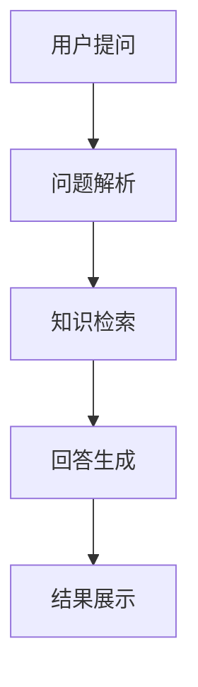
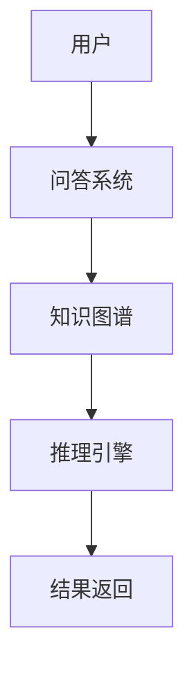
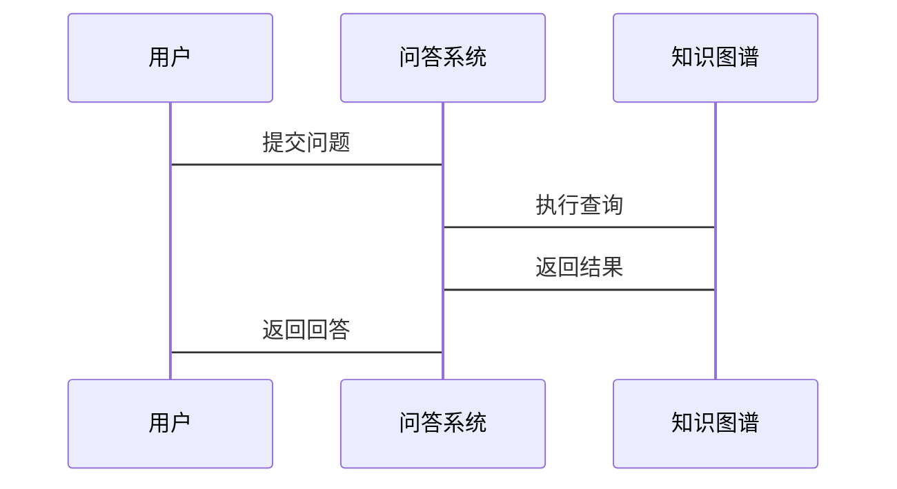

                 


# AI Agent的知识图谱在问答系统中的应用

> 关键词：AI Agent，知识图谱，问答系统，自然语言处理，人工智能，知识表示

> 摘要：本文探讨了AI Agent如何利用知识图谱来提升问答系统的性能。通过分析知识图谱的构建、问答系统的原理以及两者的结合方式，本文详细阐述了AI Agent在问答系统中的应用，包括算法选择、系统设计、项目实战等内容，为读者提供了从理论到实践的全面指导。

---

## 第一部分: AI Agent与知识图谱概述

### 第1章: AI Agent的基本概念

#### 1.1 AI Agent的定义与特点

- **AI Agent的定义**：AI Agent是一种智能体，能够感知环境、执行任务并做出决策。它具备自主性、反应性、社会性和持续性等特性。
- **AI Agent的核心特点**：
  - 自主性：能够在无外部干预的情况下运行。
  - 反应性：能够根据环境反馈调整行为。
  - 社会性：能够与其他Agent或用户进行交互。
  - 持续性：能够长期运行并不断优化。
- **AI Agent与传统AI的区别**：AI Agent更注重与环境的交互和自主决策，而传统AI更多关注数据处理和模式识别。

#### 1.2 AI Agent的应用场景

- **问答系统**：AI Agent通过知识图谱提供准确的信息检索和问题解答。
- **智能推荐**：基于用户行为和偏好，提供个性化的内容推荐。
- **智能监控**：实时监控系统状态，及时发现并解决问题。

### 第2章: 知识图谱的基本概念

#### 2.1 知识图谱的定义与特点

- **知识图谱的定义**：知识图谱是一种结构化的数据表示方式，通过实体和关系描述知识的网络结构。
- **知识图谱的核心特点**：
  - 结构化：使用实体和关系构建层次化的知识体系。
  - 可扩展性：能够根据需要不断扩展和更新。
  - 语义丰富性：提供丰富的语义信息，支持复杂的查询和推理。

#### 2.2 知识图谱的构建方法

- **数据采集**：从多种来源（如文本、数据库）获取知识数据。
- **数据清洗**：去除冗余和噪声数据，确保数据质量。
- **知识抽取**：通过自然语言处理技术提取实体和关系。
- **知识融合**：将多个来源的数据进行整合，消除冲突。
- **知识存储**：使用图数据库（如Neo4j）存储实体和关系。

#### 2.3 知识图谱的应用模式

- **语义搜索**：基于知识图谱进行语义理解，提升搜索结果的相关性。
- **智能问答**：利用知识图谱提供准确的问题解答。
- **知识推理**：通过知识图谱进行逻辑推理，支持复杂问题的解决。

### 第3章: AI Agent与知识图谱的关系

#### 3.1 AI Agent与知识图谱的结合

- **知识图谱在AI Agent中的作用**：
  - 提供丰富的知识库，支持智能决策。
  - 通过语义理解，提升交互的准确性。
  - 支持复杂问题的推理和分析。

#### 3.2 知识图谱与问答系统的结合

- **知识图谱在问答系统中的应用**：
  - 提供结构化的知识表示，支持精准的信息检索。
  - 通过语义分析，理解用户意图并生成准确回答。
  - 支持上下文理解，提升问答的连贯性和智能性。

---

## 第二部分: 知识图谱在问答系统中的应用

### 第4章: 问答系统的基本原理

#### 4.1 问答系统的定义与分类

- **问答系统的定义**：问答系统是一种能够理解和回答用户提问的智能系统。
- **问答系统的分类**：
  - 基于规则的问答系统：通过预定义的规则进行匹配和回答。
  - 基于检索的问答系统：基于文本匹配技术，从知识库中检索答案。
  - 基于生成的问答系统：通过生成模型生成回答，支持复杂问题的解答。

#### 4.2 问答系统的优缺点

- **优点**：
  - 精准性高：基于结构化知识库，回答准确。
  - 可扩展性强：能够处理大量数据和复杂问题。
- **缺点**：
  - 对知识库的依赖性强。
  - 处理复杂语义时存在局限性。

### 第5章: 知识图谱在问答系统中的应用模式

#### 5.1 基于知识图谱的问答系统架构

- **知识图谱的构建与存储**：
  - 使用图数据库存储实体和关系。
  - 通过查询语言（如SPARQL）进行知识检索。
- **基于知识图谱的问答流程**：
  - 用户提问。
  - 系统解析问题，生成查询语句。
  - 从知识图谱中检索相关信息。
  - 根据检索结果生成回答。

#### 5.2 知识图谱在问答中的优化策略

- **实体识别与链接**：
  - 通过NLP技术识别问题中的实体。
  - 将实体映射到知识图谱中的对应节点。
- **语义理解与推理**：
  - 基于知识图谱进行语义分析，理解用户意图。
  - 利用推理算法生成回答，支持复杂问题的解决。

### 第6章: 知识图谱问答系统的算法原理

#### 6.1 知识图谱问答的算法选择

- **基于规则的问答算法**：
  - 通过预定义的规则进行问题匹配和回答生成。
  - 适用于简单问题的处理。
- **基于深度学习的问答算法**：
  - 使用生成模型（如BERT、GPT）进行问题理解和回答生成。
  - 适用于复杂问题的处理。
- **知识图谱与问答算法的结合**：
  - 结合知识图谱的结构化信息，优化问答系统的性能。

#### 6.2 知识图谱问答算法的数学模型

- **基于规则的问答模型**：
  - 通过正则表达式匹配问题，生成回答。
  - 示例：
    ```python
    import re
    pattern = r"what is (\w+)"
    match = re.match(pattern, question)
    if match:
        entity = match.group(1)
        answer = knowledge_graph.get_definition(entity)
    ```
- **基于深度学习的问答模型**：
  - 使用预训练的生成模型，结合知识图谱的信息进行微调。
  - 示例：
    ```python
    import torch
    model = AutoModelForQuestionAnswering.from_pretrained('bert-base-cased')
    tokenizer = AutoTokenizer.from_pretrained('bert-base-cased')
    inputs = tokenizer.encode_plus(question, entity_description, add_special_tokens=True)
    outputs = model(**inputs)
    answer_start = torch.argmax(outputs.start_logits)
    answer_end = torch.argmax(outputs.end_logits)
    answer = tokenizer.decode(inputs['input_ids'][answer_start:answer_end+1])
    ```

### 第7章: 知识图谱问答系统的数学模型

#### 7.1 知识图谱的表示模型

- **知识图谱的表示方法**：
  - 使用向量表示实体和关系。
  - 示例：
    - 实体向量：`E = [e1, e2, ..., en]`
    - 关系向量：`R = [r1, r2, ..., rm]`
- **知识图谱的表示模型**：
  - 使用图嵌入方法（如Word2Vec、GraphSAGE）进行向量表示。

#### 7.2 问答系统的概率模型

- **问答系统的概率模型**：
  - 使用条件概率模型（如语言模型）进行回答生成。
  - 示例：
    - 条件概率公式：`P(answer|question) = argmax_{a} P(a|q)`
    - 使用交叉熵损失函数优化模型。

#### 7.3 知识图谱与问答模型的联合优化

- **联合优化方法**：
  - 将知识图谱的信息融入问答模型的训练中。
  - 使用端到端的训练方法，优化问答系统的性能。

---

## 第三部分: 系统分析与架构设计

### 第8章: 系统分析与设计

#### 8.1 系统功能设计

- **知识图谱构建模块**：
  - 数据清洗、抽取、融合和存储。
- **问答模块**：
  - 问题解析、知识检索和回答生成。
- **用户交互模块**：
  - 用户输入、结果展示和反馈收集。

#### 8.2 系统功能流程图



### 第9章: 系统架构设计

#### 9.1 系统架构图



### 第10章: 系统接口与交互设计

#### 10.1 系统接口设计

- **知识图谱接口**：
  - GET /entities：获取所有实体。
  - GET /relations：获取所有关系。
  - POST /query：执行SPARQL查询。
- **问答接口**：
  - POST /question：提交问题。
  - GET /answer：获取回答。
- **用户接口**：
  - POST /user-input：接收用户输入。
  - GET /response：返回回答结果。

#### 10.2 系统交互流程图



---

## 第四部分: 项目实战

### 第12章: 项目实战

#### 12.1 环境安装

- **安装Python环境**：建议使用Anaconda或virtualenv。
- **安装依赖库**：
  ```bash
  pip install numpy torch transformers spacy
  ```

#### 12.2 核心代码实现

- **知识图谱构建代码**：
  ```python
  import spacy
  nlp = spacy.load("en_core_web_sm")
  doc = nlp("The capital of France is Paris.")
  entities = [(ent.text, ent.label_) for ent in doc.ents]
  print(entities)
  ```
- **问答系统实现代码**：
  ```python
  from transformers import pipeline
  qa_pipeline = pipeline("question-answering")
  context = "The capital of France is Paris."
  question = "What is the capital of France?"
  result = qa_pipeline(question, context)
  print(result)
  ```

#### 12.3 代码解读与分析

- **知识图谱构建**：
  - 使用spaCy进行实体识别和标注。
  - 提取实体及其标签，构建知识图谱的节点。
- **问答系统实现**：
  - 使用Hugging Face的预训练模型进行问题理解和回答生成。
  - 结合知识图谱的信息，优化回答的准确性和相关性。

#### 12.4 案例分析

- **案例背景**：用户询问“什么是人工智能？”
- **系统处理流程**：
  1. 问题解析：识别关键词“人工智能”。
  2. 知识检索：从知识图谱中查找相关实体和关系。
  3. 回答生成：基于检索结果生成准确的回答。
- **结果展示**：返回定义和相关领域的简要介绍。

#### 12.5 项目小结

- **项目成果**：成功构建了一个基于知识图谱的问答系统，能够准确回答用户的问题。
- **经验总结**：知识图谱的构建和优化是关键，问答系统的性能依赖于知识图谱的质量和算法的选择。
- **未来改进方向**：
  - 提升知识图谱的覆盖范围和深度。
  - 优化问答系统的推理能力，支持更复杂的问题解决。

---

## 第五部分: 最佳实践与总结

### 第13章: 最佳实践 tips

- **小结**：AI Agent与知识图谱的结合为问答系统带来了更高的智能性和准确性。
- **注意事项**：
  - 知识图谱的构建需要考虑数据的多样性和准确性。
  - 问答系统的性能依赖于算法的选择和优化。
  - 系统的交互设计需要注重用户体验，确保用户能够方便地使用系统。

### 第14章: 拓展阅读

- **推荐书籍**：
  - 《知识图谱：概念、方法与应用》
  - 《深度学习：方法与实践》
- **推荐论文**：
  - “Knowledge Graphs for Question Answering”（自然语言处理领域）
  - “Graph Neural Networks for问答系统”（图神经网络领域）

---

# 作者：AI天才研究院/AI Genius Institute & 禅与计算机程序设计艺术 /Zen And The Art of Computer Programming

---

这篇文章详细探讨了AI Agent如何利用知识图谱提升问答系统的性能。从理论到实践，文章为读者提供了全面的指导，帮助读者理解知识图谱在问答系统中的应用及其实际价值。

