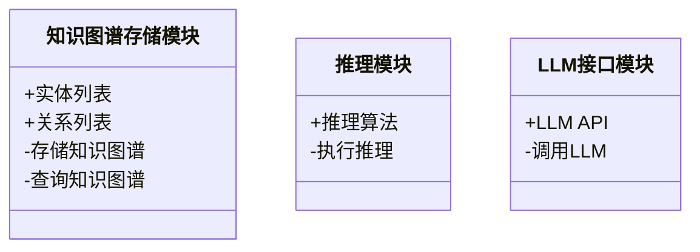
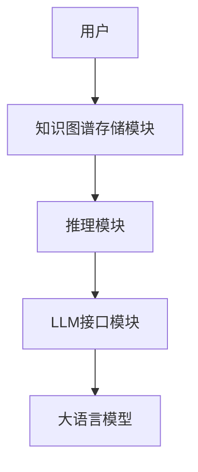
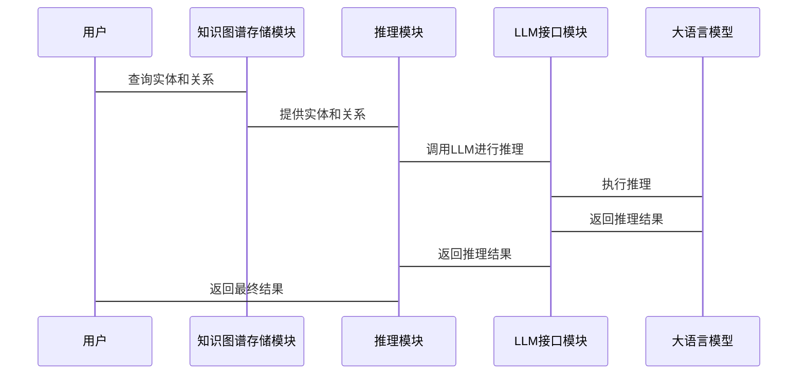

                 


# AI Agent的知识图谱推理：增强LLM的关系理解

> 关键词：知识图谱，AI Agent，大语言模型，关系理解，图谱推理，LLM增强

> 摘要：本文深入探讨了AI Agent在知识图谱推理中的应用，重点分析了如何通过知识图谱增强大语言模型（LLM）的关系理解能力。文章从基础知识、核心概念、算法原理、系统设计、项目实战等多个维度展开，详细讲解了知识图谱的构建、AI Agent的工作原理、LLM的关系理解能力，以及如何将知识图谱推理与LLM结合，从而提升AI Agent的智能水平。

---

# 第一部分: AI Agent与知识图谱推理基础

## 第1章: AI Agent与知识图谱概述

### 1.1 知识图谱的基本概念

#### 1.1.1 知识图谱的定义
知识图谱是一种以图结构形式表示知识的语义网络，由节点（实体）和边（关系）组成，广泛应用于搜索引擎、自然语言处理和人工智能领域。

#### 1.1.2 知识图谱的结构与特点
- **节点**：代表实体或概念，例如“人”、“书”、“城市”等。
- **边**：代表实体之间的关系，例如“人出生在城市”、“人写了一本书”。
- **特点**：语义丰富、结构化、可扩展性强。

#### 1.1.3 知识图谱的应用场景
- 搜索引擎优化：通过知识图谱提升搜索结果的相关性和准确性。
- 自然语言处理：帮助模型理解实体间的关系。
- 智能推荐：基于知识图谱进行个性化推荐。

### 1.2 AI Agent的基本概念

#### 1.2.1 AI Agent的定义
AI Agent是一种智能实体，能够感知环境并采取行动以实现目标。它可以是一个软件程序，也可以是一个物理设备。

#### 1.2.2 AI Agent的分类与特点
- **分类**：
  - **简单反射型**：基于预定义规则执行任务。
  - **基于模型的反应型**：使用内部模型感知环境并做出决策。
  - **目标驱动型**：根据目标选择行动。
  - **效用驱动型**：通过最大化效用函数实现目标。
- **特点**：自主性、反应性、目标导向、学习能力。

#### 1.2.3 AI Agent与知识图谱的关系
AI Agent可以利用知识图谱中的结构化知识，增强其理解和推理能力，从而做出更智能的决策。

### 1.3 大语言模型（LLM）的概述

#### 1.3.1 LLM的定义与特点
大语言模型是一种基于深度学习的自然语言处理模型，具有大规模参数和强大的文本生成能力。

#### 1.3.2 LLM在自然语言处理中的应用
- 文本生成、机器翻译、问答系统、情感分析等。

#### 1.3.3 LLM与知识图谱的结合
通过将知识图谱的知识融入LLM，可以增强模型的关系理解能力和推理能力。

### 1.4 本章小结
本章介绍了知识图谱、AI Agent和LLM的基本概念，并探讨了它们之间的联系，为后续内容打下基础。

---

## 第2章: 知识图谱的结构与属性

### 2.1 知识图谱的实体与关系

#### 2.1.1 实体的定义与分类
- 实体是知识图谱中的基本单位，可以是具体的人、事、物，也可以是抽象的概念。

#### 2.1.2 关系的定义与分类
- 关系是实体之间的联系，可以是“属于”、“构成”、“导致”等。

#### 2.1.3 实体关系的表示方法
- 三元组表示：（头实体，关系，尾实体）。
- 图结构表示：通过节点和边表示实体及其关系。

#### 2.1.4 实体关系的ER图
```mermaid
erDiagram
    actor 实体 {
        +string 名称
        +string 类型
    }
    actor 关系 {
        +string 名称
        +string 类型
    }
    实体 --> 关系 : 参与
```

### 2.2 知识图谱的属性与特征

#### 2.2.1 实体的属性特征
- 实体的名称、类型、属性值等。

#### 2.2.2 关系的属性特征
- 关系的名称、类型、方向等。

#### 2.2.3 知识图谱的特征对比表格

| 特征 | 实体 | 关系 |
|------|------|------|
| 类型 | 名称、类型、属性值 | 名称、类型、方向 |
| 示例 | 人、城市、书籍 | 出生在、写、出版 |

### 2.3 知识图谱的ER实体关系图
```mermaid
erDiagram
    实体 [University] {
        名称 : string
        类型 : string
    }
    实体 [Person] {
        名称 : string
        类型 : string
    }
    关系 [毕业于] {
        名称 : string
        类型 : string
    }
    Person --> 毕业于 : 毕业于
    University --> 毕业于 : 毕业于
```

### 2.4 本章小结
本章详细讲解了知识图谱的实体和关系，以及它们的属性特征和图结构表示。

---

## 第3章: 知识图谱推理算法概述

### 3.1 知识图谱推理的基本原理

#### 3.1.1 推理的定义与分类
- 推理是根据已有知识得出新结论的过程。
- 分类：基于符号逻辑的推理和基于概率的推理。

#### 3.1.2 知识图谱推理的流程
1. 输入查询或问题。
2. 在知识图谱中找到相关实体和关系。
3. 通过推理算法得出结论。

### 3.2 增强LLM的关系理解

#### 3.2.1 LLM的关系理解能力
- LLM通过大规模数据训练，可以理解文本中的关系，但缺乏结构化的知识支持。

#### 3.2.2 知识图谱在LLM中的作用
- 提供结构化知识，增强模型的关系理解能力。
- 帮助模型进行更准确的推理。

#### 3.2.3 增强LLM关系理解的方法
- 将知识图谱嵌入到LLM中。
- 结合符号推理和概率推理。

### 3.3 知识图谱推理的算法

#### 3.3.1 基于符号逻辑的推理算法
- 三元组推理：通过查询知识图谱中的三元组，直接得到答案。
- 规则推理：基于预定义的规则进行推理。

#### 3.3.2 基于概率的推理算法
- 贝叶斯推理：根据概率模型进行推理。
- 嵌入式推理：将实体和关系嵌入到向量空间中，通过向量运算进行推理。

#### 3.3.3 知识图谱推理算法的数学模型
- 基于符号逻辑的推理：
  $$ (A, R, B) \rightarrow B $$
- 基于概率的推理：
  $$ P(B|R, A) = \frac{P(A|R, B) \cdot P(B)}{P(A)} $$

#### 3.3.4 算法实现的Python代码示例
```python
# 基于符号逻辑的三元组推理
def triple_retrieval(head, relation, tail):
    return f"{head} {relation} {tail}"

# 基于概率的贝叶斯推理
def bayesian_inference(P_A_given_B, P_B, P_A):
    return (P_A_given_B * P_B) / P_A
```

### 3.4 本章小结
本章介绍了知识图谱推理的基本原理，以及如何通过知识图谱增强LLM的关系理解能力，并给出了具体的算法实现。

---

## 第4章: 系统分析与架构设计

### 4.1 项目背景介绍
- 知识图谱推理在AI Agent中的应用日益广泛。
- 需要设计一个高效的系统来支持知识图谱推理和LLM的关系理解。

### 4.2 系统功能设计

#### 4.2.1 系统功能模块
- 知识图谱存储模块：存储实体和关系。
- 推理模块：实现知识图谱推理算法。
- LLM接口模块：与大语言模型进行交互。

#### 4.2.2 功能模块的类图


### 4.3 系统架构设计

#### 4.3.1 系统架构图


#### 4.3.2 接口设计
- 用户接口：接收输入查询或问题。
- 知识图谱接口：提供实体和关系的查询接口。
- LLM接口：调用大语言模型进行推理。

### 4.4 系统交互流程

#### 4.4.1 交互流程的序列图


### 4.5 本章小结
本章详细分析了系统的架构设计和交互流程，为后续的项目实现奠定了基础。

---

## 第5章: 项目实战与案例分析

### 5.1 环境安装与配置

#### 5.1.1 环境要求
- Python 3.8+
- 安装必要的库：networkx、numpy、pandas、mermaid等。

#### 5.1.2 安装命令
```bash
pip install networkx numpy pandas mermaid
```

### 5.2 系统核心实现

#### 5.2.1 知识图谱构建
```python
import networkx as nx

G = nx.DiGraph()
G.add_node("PersonA")
G.add_node("UniversityX")
G.add_edge("PersonA", "UniversityX", label="毕业于")
```

#### 5.2.2 推理算法实现
```python
def kg_retrieval(G, head, relation):
    for edge in G.edges():
        if edge[0] == head and G.get_edge_data(edge[0], edge[1]).get('label', '') == relation:
            return edge[1]
    return None
```

#### 5.2.3 LLM接口实现
```python
import requests

def call_llm(prompt):
    url = "https://api.example.com/llm"
    payload = {"prompt": prompt}
    response = requests.post(url, json=payload)
    return response.json()['result']
```

### 5.3 案例分析与实际应用

#### 5.3.1 案例背景
- 电商知识图谱构建与推理。

#### 5.3.2 案例分析
- 实体：商品、用户、订单。
- 关系：用户购买商品、商品属于类别。

#### 5.3.3 实际应用
- 通过知识图谱推理，分析用户的购买行为，推荐相关商品。

### 5.4 项目总结

#### 5.4.1 项目成果
- 成功构建了一个基于知识图谱的AI Agent系统，增强了LLM的关系理解能力。

#### 5.4.2 经验总结
- 知识图谱的构建和管理是关键。
- 算法的选择和优化直接影响系统的性能。
- 系统的可扩展性和可维护性需要重点关注。

### 5.5 本章小结
本章通过一个具体的项目实战，展示了如何将知识图谱推理与LLM结合，实现一个高效的AI Agent系统。

---

## 第6章: 总结与未来展望

### 6.1 本章总结
本文系统地探讨了AI Agent的知识图谱推理，分析了知识图谱的结构与属性，介绍了增强LLM的关系理解能力的方法，详细讲解了系统的架构设计和实现过程，并通过项目实战展示了知识图谱推理的实际应用。

### 6.2 未来展望
- 知识图谱的动态更新与维护。
- 更复杂的推理算法研究。
- 多模态知识图谱的构建与应用。
- 知识图谱与LLM的深度融合。

---

# 作者：AI天才研究院/AI Genius Institute & 禅与计算机程序设计艺术 /Zen And The Art of Computer Programming

