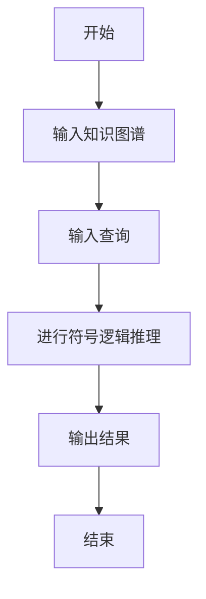
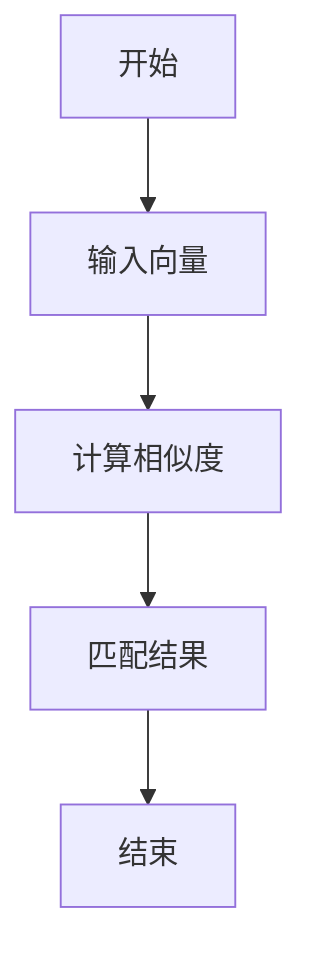
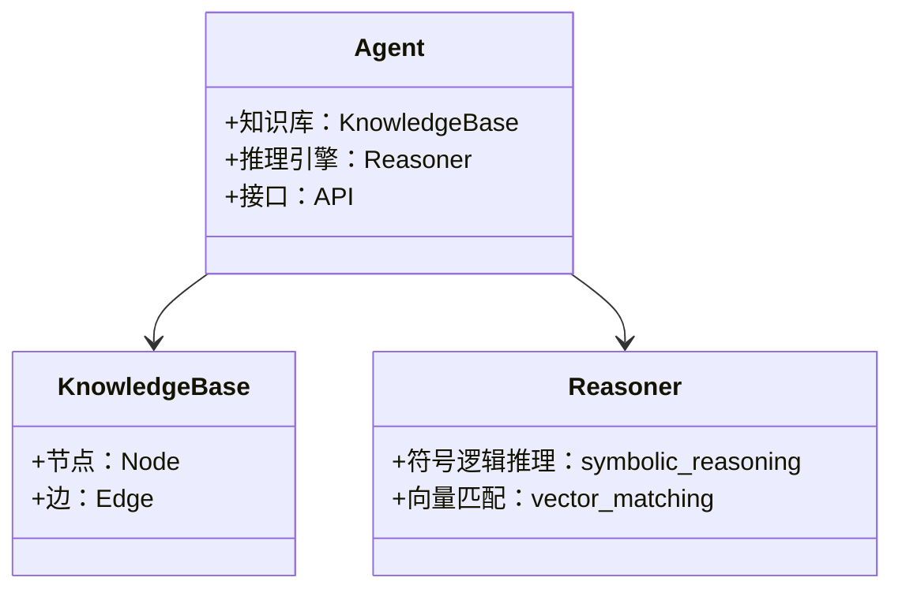
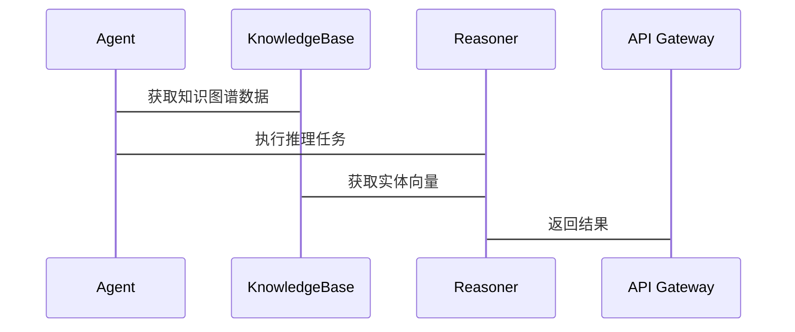

                 


# AI Agent的知识图谱推理：结合LLM与图数据库技术

> 关键词：AI Agent, 知识图谱, LLM, 图数据库, 图数据库技术

> 摘要：本文探讨了AI Agent如何通过知识图谱进行推理，并结合大语言模型（LLM）与图数据库技术，深入分析了其核心概念、算法原理、系统架构及项目实战。通过详细的技术分析和案例解读，揭示了这一结合在实际应用中的潜力和优势。

---

## 第一部分: AI Agent与知识图谱推理基础

### 第1章: AI Agent与知识图谱概述

#### 1.1 AI Agent的基本概念
- **1.1.1 AI Agent的定义与分类**  
  AI Agent（智能体）是指在计算机系统中，能够感知环境并采取行动以实现目标的实体。AI Agent可以分为简单反射型、基于模型的反射型、目标驱动型和效用驱动型。

- **1.1.2 知识图谱的定义与特点**  
  知识图谱是一种以图结构形式表示知识的语义网络，包含实体（节点）和关系（边）。知识图谱的特点包括语义丰富性、结构化可扩展性和语境相关性。

- **1.1.3 AI Agent与知识图谱的关系**  
  AI Agent通过知识图谱进行推理和决策，知识图谱为AI Agent提供了丰富的语义信息和上下文理解能力。

#### 1.2 知识图谱推理的背景与意义
- **1.2.1 知识图谱推理的背景**  
  随着大数据和人工智能技术的发展，知识图谱在搜索引擎、智能问答系统和推荐系统中的应用日益广泛。

- **1.2.2 知识图谱推理的意义**  
  知识图谱推理能够帮助AI Agent理解复杂的关系和语义，提升其在动态环境中的适应能力和决策能力。

- **1.2.3 知识图谱推理的应用场景**  
  医疗诊断、金融风险评估、智能客服、推荐系统等领域。

---

### 第2章: LLM与图数据库技术结合的原理

#### 2.1 大语言模型（LLM）的基本原理
- **2.1.1 LLM的定义与特点**  
  大语言模型是基于深度学习的自然语言处理模型，具有大规模参数和强大的上下文理解能力。

- **2.1.2 LLM的训练与推理机制**  
  基于监督学习和强化学习的训练方法，通过大量文本数据进行预训练和微调。

- **2.1.3 LLM在知识图谱中的应用**  
  LLM可以用于知识图谱的构建、推理和问答。

#### 2.2 图数据库的基本原理
- **2.2.1 图数据库的定义与特点**  
  图数据库是一种以图结构存储和查询数据的数据库，具有高效的查询性能和丰富的关系表示能力。

- **2.2.2 图数据库的存储与查询机制**  
  使用节点和边存储数据，支持高效的图遍历和查询操作。

- **2.2.3 图数据库在知识图谱中的应用**  
  知识图谱的构建、存储和查询。

---

### 第3章: 知识图谱推理的核心概念与联系

#### 3.1 知识图谱推理的原理
- **3.1.1 符号逻辑推理的基本原理**  
  基于符号逻辑的推理方法，通过逻辑规则和事实库进行推理。

- **3.1.2 基于向量的相似度匹配原理**  
  通过向量空间模型，计算实体或关系的相似度，进行推理。

- **3.1.3 知识图谱推理的数学模型**  
  使用符号逻辑和向量嵌入的结合，构建推理模型。

#### 3.2 核心概念对比表
- **符号逻辑与向量嵌入的对比**  
  | 对比维度 | 符号逻辑 | 向量嵌入 |
  |----------|----------|----------|
  | 表示方式 | 符号化表示 | 向量空间表示 |
  | 推理方式 | 基于规则 | 基于相似度 |
  | 优点 | 高精度，可解释性 | 高效，鲁棒性 |
  | 缺点 | 对知识覆盖有限，推理规则复杂 | 可能存在语义漂移 |

#### 3.3 知识图谱推理的ER实体关系图
```mermaid
er
actor(Agent, 实体, 关系)
```

---

### 第4章: 知识图谱推理的算法原理

#### 4.1 符号逻辑推理算法
- **算法流程图**

- **算法实现代码**
```python
def symbolic_reasoning(knowledge_graph, query):
    # 简单符号逻辑推理实现
    result = knowledge_graph.query(query)
    return result
```

#### 4.2 基于向量的相似度匹配算法
- **算法流程图**

- **算法实现代码**
```python
def vector_similarity_matching(embeddings, query_embedding, threshold=0.8):
    matches = []
    for e in embeddings:
        if similarity(e, query_embedding) > threshold:
            matches.append(e)
    return matches
```

---

### 第5章: 系统架构设计与实现

#### 5.1 项目介绍
- 系统名称：知识图谱推理系统
- 系统目标：结合LLM与图数据库技术，实现高效的AI Agent推理能力。

#### 5.2 系统功能设计
- **领域模型设计**


- **系统架构设计**
```mermaid
docker
    services {
        Agent
        KnowledgeBase
        Reasoner
        API Gateway
    }
```

- **系统接口设计**


---

### 第6章: 项目实战

#### 6.1 环境安装
- 安装Python环境
- 安装必要的库（如NetworkX、Neo4j、PyTorch）

#### 6.2 系统核心实现源代码
```python
# 知识图谱构建
import networkx as nx

G = nx.DiGraph()
G.add_nodes_from(["A", "B", "C"])
G.add_edges_from([("A", "B"), ("B", "C")])

# LLM与图数据库结合的推理
def llm_reasoning(llm, graph):
    query = "从A到C的关系是什么？"
    result = llm.generate_response(query, graph)
    return result

# 示例调用
llm_reasoning(llm, G)
```

#### 6.3 实际案例分析
- 案例背景：医疗诊断
- 案例分析：通过知识图谱推理疾病症状和诊断关系。

---

### 第7章: 总结与展望

#### 7.1 总结
- AI Agent的知识图谱推理结合了LLM和图数据库技术，具有强大的语义理解和推理能力。
- 通过符号逻辑推理和向量嵌入匹配，实现了高效的推理过程。

#### 7.2 展望
- 结合更先进的模型和算法，进一步提升推理的准确性和效率。
- 扩展应用领域，探索更多创新场景。

---

### 第8章: 最佳实践与注意事项

#### 8.1 最佳实践
- 定期更新知识图谱，保持数据的准确性和完整性。
- 结合多种推理方法，提升系统的鲁棒性。

#### 8.2 注意事项
- 注意数据隐私和安全问题。
- 合理选择模型和算法，避免性能瓶颈。

---

### 第9章: 扩展阅读

- 推荐书籍：《知识图谱：概念、方法与应用》
- 推荐论文：《Large Language Models for Knowledge Graph Reasoning》

---

**作者：AI天才研究院/AI Genius Institute & 禅与计算机程序设计艺术 /Zen And The Art of Computer Programming**

---

**注意：以上内容为示例，实际撰写时需要根据具体需求调整内容和结构。**

