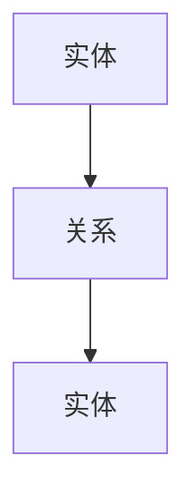
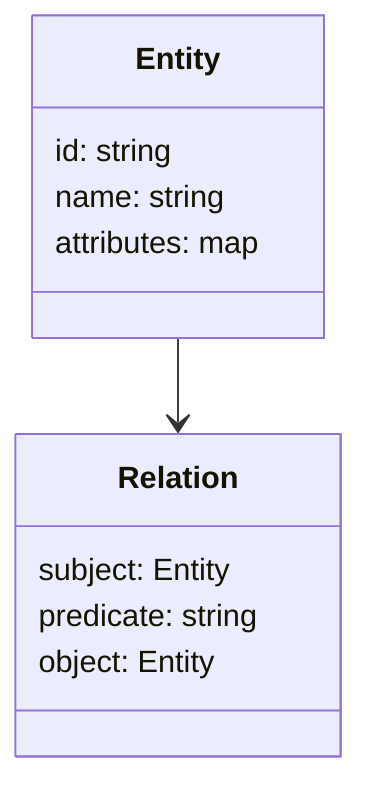
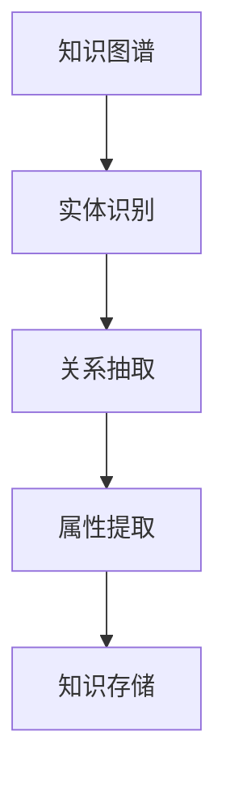
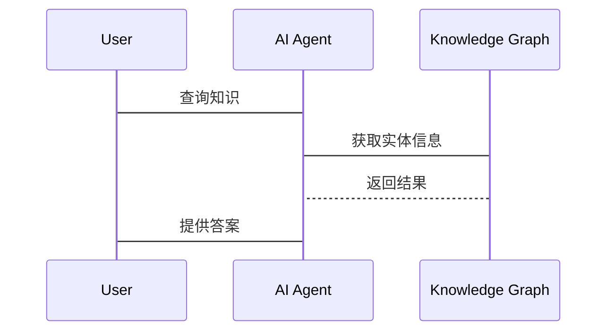

                 


# AI Agent的知识图谱构建与应用

## 关键词：AI Agent, 知识图谱, 构建算法, 系统架构, 应用实践

## 摘要：本文系统地探讨了AI Agent的知识图谱构建与应用，从基本概念到构建算法，再到系统架构与实际应用，层层深入，结合技术细节与实际案例，全面剖析知识图谱在AI Agent中的核心作用与应用价值。

---

# 第1章 知识图谱与AI Agent概述

## 1.1 知识图谱的背景与概念

### 1.1.1 知识图谱的定义与特点
知识图谱是一种以结构化形式表示知识的图数据，由实体（概念）和关系（属性）组成。其特点包括：
- **结构化**：通过图结构清晰表达实体间的关系。
- **语义丰富**：支持多粒度的知识表示。
- **可扩展性**：支持动态更新和扩展。

### 1.1.2 知识图谱的构建背景
随着大数据和AI技术的发展，知识图谱成为连接数据与智能应用的桥梁。其构建背景包括：
- 数据爆炸式增长，需要结构化组织。
- 智能应用（如搜索、推荐）需要语义理解能力。
- 知识图谱提供了一种统一的知识表示方式。

### 1.1.3 知识图谱的应用场景
- 智能搜索：通过知识图谱提供语义搜索。
- 推荐系统：基于实体关系进行个性化推荐。
- 自然语言处理：用于实体链接和语义解析。

## 1.2 AI Agent的定义与特点

### 1.2.1 AI Agent的基本概念
AI Agent是具有感知环境、自主决策和执行任务的智能体。其特点包括：
- **自主性**：无需外部干预。
- **反应性**：能实时感知并响应环境变化。
- **目标导向**：基于目标驱动行为。

### 1.2.2 AI Agent的核心能力
- **感知能力**：通过传感器或数据源获取信息。
- **推理能力**：基于知识库进行逻辑推理。
- **决策能力**：根据推理结果做出决策。
- **执行能力**：通过执行器完成任务。

### 1.2.3 AI Agent与传统AI的区别
AI Agent强调自主性和实时性，而传统AI更多关注特定任务的解决。AI Agent需要在动态环境中自主完成任务，而传统AI通常在静态环境中运行。

## 1.3 知识图谱与AI Agent的关系

### 1.3.1 知识图谱在AI Agent中的作用
知识图谱为AI Agent提供了语义理解和推理的能力，使其能够更好地理解环境和任务需求。

### 1.3.2 AI Agent如何利用知识图谱
AI Agent通过知识图谱进行实体识别、关系推理和语义解析，从而实现更智能的决策和交互。

### 1.3.3 知识图谱与AI Agent的结合案例
例如，在智能客服中，AI Agent可以通过知识图谱理解用户需求，并根据上下文进行推理，提供更精准的服务。

---

# 第2章 知识图谱的构建与核心概念

## 2.1 知识图谱的构建过程

### 2.1.1 数据采集与预处理
- 数据来源：结构化数据、非结构化数据、外部知识库。
- 预处理：清洗、去重、标准化。

### 2.1.2 知识抽取与实体识别
- 技术：基于规则、统计和深度学习的方法。
- 实体识别：通过NLP技术提取实体信息。

### 2.1.3 关系抽取与属性提取
- 关系抽取：识别实体之间的关系，如“是”、“属于”等。
- 属性提取：提取实体的属性信息，如“颜色”、“价格”等。

## 2.2 知识图谱的表示方法

### 2.2.1 实体表示的属性特征
- 实体：如“书籍”、“作者”等。
- 属性：如“书籍.作者=张三”。
- 关系：如“张三.写了《人工智能入门》”。

### 2.2.2 关系表示的属性特征
- 主体、谓词、宾语（Subject-Predicate-Object，SPO）。
- 示例：张三（主体）写了（谓词）《人工智能入门》（宾语）。

### 2.2.3 知识图谱的ER实体关系图


## 2.3 知识图谱的存储与管理

### 2.3.1 知识图谱的存储方式
- 图数据库：如Neo4j，支持高效的图查询。
- 关系型数据库：如MySQL，适合结构化数据存储。
- 索引存储：如Elasticsearch，支持快速搜索。

### 2.3.2 知识图谱的数据库设计
- 实体表：存储实体信息。
- 关系表：存储实体间的关系。
- 属性表：存储实体的属性信息。

### 2.3.3 知识图谱的管理工具
- 图数据库工具：Neo4j、DGraph。
- 知识库管理工具：Ubergraph、Wikidata。

## 2.4 本章小结
本章介绍了知识图谱的构建过程、表示方法和存储管理方式，为后续章节的算法实现奠定了基础。

---

# 第3章 AI Agent的知识图谱构建算法

## 3.1 知识抽取算法

### 3.1.1 基于规则的知识抽取
- 方法：通过正则表达式提取特定模式的信息。
- 代码示例：
```python
import re
text = "张三的书《人工智能入门》出版于2023年。"
pattern = r"([^\s.]+)的书(.*)出版于(\d+)年。"
match = re.match(pattern, text)
if match:
    print(match.group(1), match.group(2), match.group(3))
```

### 3.1.2 基于统计的知识抽取
- 方法：使用统计模型识别模式。
- 代码示例：
```python
from collections import defaultdict
text = "张三写了《人工智能入门》。"
freq = defaultdict(int)
for word in text.split():
    freq[word] += 1
print(freq)
```

### 3.1.3 基于深度学习的知识抽取
- 方法：使用预训练语言模型（如BERT）进行抽取。
- 代码示例：
```python
import transformers
model = transformers.BertTokenizer.from_pretrained('bert-base-chinese')
inputs = model(text, return_tensors='np')
...
```

## 3.2 实体识别与链接算法

### 3.2.1 实体识别的常用算法
- 基于CRF的序列标注。
- 代码示例：
```python
from sklearn_crfsuite import CRF
crf = CRF()
crf.fit(X_train, y_train)
```

### 3.2.2 实体链接的算法原理
- 使用向量空间模型进行相似度计算。
- 示例：将实体映射到向量空间，计算余弦相似度。

## 3.3 关系抽取与属性提取算法

### 3.3.1 关系抽取的算法选择
- 基于规则、统计和深度学习的方法。
- 代码示例：
```python
from transformers import pipeline
nlp = pipeline('relation_extraction', model='facebook/roberta-base-typo-doctor')
result = nlp(text)
print(result)
```

## 3.4 算法实现的Python代码示例

### 3.4.1 知识抽取的代码实现
```python
import re
text = "张三的书《人工智能入门》出版于2023年。"
pattern = r"([^\s.]+)的书(.*)出版于(\d+)年。"
match = re.match(pattern, text)
if match:
    print(match.group(1), match.group(2), match.group(3))
```

### 3.4.2 实体识别的代码实现
```python
from sklearn_crfsuite import CRF
crf = CRF()
crf.fit(X_train, y_train)
```

### 3.4.3 关系抽取的代码实现
```python
from transformers import pipeline
nlp = pipeline('relation_extraction', model='facebook/roberta-base-typo-doctor')
result = nlp(text)
print(result)
```

## 3.5 本章小结
本章详细介绍了知识图谱构建中的核心算法，包括知识抽取、实体识别和关系抽取，并通过代码示例展示了实现过程。

---

# 第4章 知识图谱与AI Agent的系统架构设计

## 4.1 系统功能设计

### 4.1.1 领域模型设计


### 4.1.2 系统架构图


## 4.2 系统接口设计

### 4.2.1 接口设计
- 实体识别接口：`POST /api/entity/recognize`
- 关系抽取接口：`POST /api/relation/extract`

### 4.2.2 交互流程图


## 4.3 本章小结
本章通过系统架构设计，展示了知识图谱与AI Agent的结合方式，为后续的项目实现提供了指导。

---

# 第5章 项目实战：AI Agent的知识图谱构建与应用

## 5.1 环境安装

### 5.1.1 安装依赖
```bash
pip install neo4j==4.0.0 transformers scikit-learn
```

## 5.2 系统核心实现

### 5.2.1 知识抽取模块
```python
import re
def extract_entities(text):
    pattern = r"([^\s.]+)的书(.*)出版于(\d+)年。"
    match = re.match(pattern, text)
    if match:
        return {
            'author': match.group(1),
            'book': match.group(2),
            'year': match.group(3)
        }
    return None
```

### 5.2.2 实体识别模块
```python
from sklearn_crfsuite import CRF
def train_crf_model(train_data):
    crf = CRF()
    crf.fit(train_data)
    return crf
```

### 5.2.3 关系抽取模块
```python
from transformers import pipeline
def extract_relations(text):
    nlp = pipeline('relation_extraction', model='facebook/roberta-base-typo-doctor')
    return nlp(text)
```

## 5.3 代码应用解读与分析

### 5.3.1 知识抽取模块解读
该模块通过正则表达式从文本中提取实体信息，适用于结构化文本的处理。

### 5.3.2 实体识别模块解读
基于CRF模型进行序列标注，适用于命名实体识别任务。

### 5.3.3 关系抽取模块解读
利用预训练语言模型进行关系抽取，支持多种关系类型。

## 5.4 实际案例分析

### 5.4.1 案例背景
假设我们有一个关于书籍和作者的知识库，需要构建知识图谱以支持智能问答。

### 5.4.2 实施步骤
1. 数据采集：爬取书籍和作者信息。
2. 知识抽取：提取实体和关系。
3. 知识存储：将抽取的信息存储到图数据库中。
4. AI Agent实现：基于知识图谱提供问答服务。

## 5.5 项目小结
通过实际案例，展示了知识图谱构建与AI Agent应用的完整流程，帮助读者更好地理解理论与实践的结合。

---

# 第6章 最佳实践与注意事项

## 6.1 小结
知识图谱为AI Agent提供了强大的语义理解和推理能力，是实现智能应用的核心技术之一。

## 6.2 注意事项
- 数据质量：知识图谱的质量直接影响AI Agent的表现。
- 算法选择：根据任务需求选择合适的算法。
- 系统架构：设计高效的系统架构以支持实时响应。

## 6.3 拓展阅读
- 《知识图谱构建与应用》
- 《AI Agent开发实战》
- 《深度学习与自然语言处理》

---

# 作者：AI天才研究院/AI Genius Institute & 禅与计算机程序设计艺术 /Zen And The Art of Computer Programming

---

以上是文章的完整内容，涵盖了知识图谱与AI Agent的构建与应用的各个方面，从理论到实践，帮助读者系统地理解和掌握相关技术。

