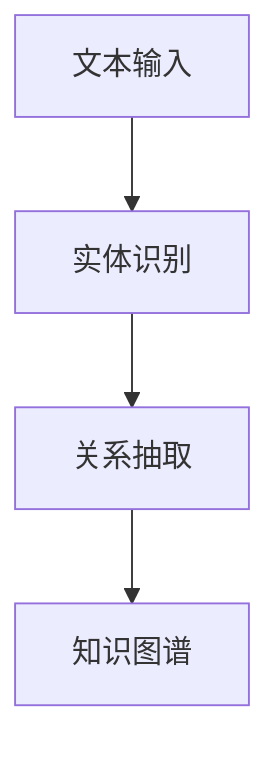
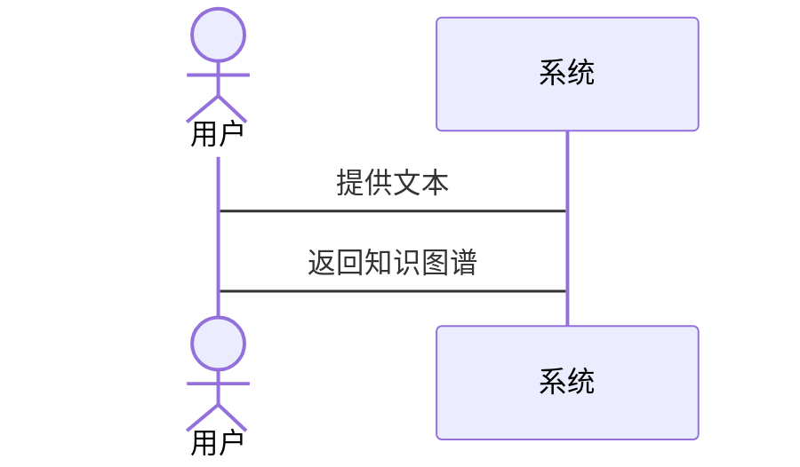

                 


# AI Agent的知识图谱构建与推理机制

## 关键词
知识图谱、AI Agent、构建方法、推理机制、应用案例

## 摘要
知识图谱作为AI Agent的核心知识基础，其构建与推理机制是实现智能化决策的关键。本文详细探讨了知识图谱的构建过程，包括实体识别、关系抽取和图谱构建，并分析了基于图的推理算法。通过实际案例和系统设计，本文为AI Agent的知识图谱构建提供了全面的解决方案。

---

# 第1章: AI Agent与知识图谱概述

## 1.1 AI Agent的基本概念
### 1.1.1 AI Agent的定义
AI Agent是一种智能主体，能够感知环境、自主决策并执行任务，具备学习和推理能力。

### 1.1.2 AI Agent的核心特点
- **自主性**：无需外部干预。
- **反应性**：能实时感知环境变化。
- **社会性**：能与其他Agent或人类交互协作。
- **学习性**：能通过经验改进性能。

### 1.1.3 AI Agent与传统AI的区别
AI Agent强调自主性和适应性，而传统AI依赖固定规则和数据。

## 1.2 知识图谱的定义与特点
### 1.2.1 知识图谱的定义
知识图谱是结构化的知识库，由实体和关系构成，通常以图的形式表示。

### 1.2.2 知识图谱的核心特点
- **结构化**：数据以实体和关系的形式组织。
- **可扩展性**：支持大规模数据。
- **语义丰富性**：提供上下文信息，增强语义理解。

### 1.2.3 知识图谱与传统数据库的区别
知识图谱支持复杂关系和语义查询，而传统数据库基于简单查询。

## 1.3 AI Agent与知识图谱的关系
### 1.3.1 AI Agent的知识需求
AI Agent需要丰富的知识来支持决策和推理。

### 1.3.2 知识图谱在AI Agent中的作用
知识图谱为AI Agent提供知识库，支持语义理解、推理和决策。

### 1.3.3 知识图谱构建的必要性
构建知识图谱是实现AI Agent智能化的关键步骤。

## 1.4 本章小结
本章介绍了AI Agent和知识图谱的基本概念，探讨了它们的关系和构建知识图谱的重要性。

---

# 第2章: 知识图谱构建的核心概念与联系

## 2.1 知识图谱构建的背景与目标
### 2.1.1 知识图谱构建的背景
随着大数据的发展，需要结构化知识库支持智能应用。

### 2.1.2 知识图谱构建的目标
构建可扩展、语义丰富的知识库，支持智能应用。

### 2.1.3 知识图谱构建的边界与外延
边界：数据抽取和图谱构建；外延：知识融合和应用。

## 2.2 知识图谱构建的核心要素
### 2.2.1 实体与属性
- **实体**：真实世界中的对象，如“人”、“书”。
- **属性**：描述实体的特征，如“书名”、“作者”。

### 2.2.2 关系与事实
- **关系**：实体间的关联，如“人写书”。
- **事实**：具体的关系实例，如“张三写《Python编程》”。

### 2.2.3 知识图谱的结构特征
- **层次性**：通过层次组织知识。
- **关联性**：实体间通过关系连接。

## 2.3 知识图谱构建的原理与方法
### 2.3.1 知识抽取与实体识别
- **文本挖掘**：从文本中提取信息。
- **模式匹配**：使用正则表达式识别特定模式。

### 2.3.2 关系抽取与属性提取
- **基于规则的方法**：使用预定义规则识别关系。
- **基于机器学习的方法**：使用模型学习关系。

### 2.3.3 知识融合与图谱构建
- **数据清洗**：消除重复和错误数据。
- **数据整合**：将多个数据源整合到一个图谱中。

## 2.4 本章小结
本章探讨了知识图谱构建的核心要素和方法，强调了构建过程中的关键步骤。

---

# 第3章: 知识图谱构建的算法原理

## 3.1 知识抽取与实体识别算法
### 3.1.1 基于规则的实体识别
- **方法**：使用正则表达式识别特定模式。
- **优缺点**：简单易实现，但难以处理复杂情况。

### 3.1.2 基于统计的实体识别
- **方法**：利用统计特征识别实体。
- **优缺点**：鲁棒性强，但需要大量数据。

### 3.1.3 基于深度学习的实体识别
- **方法**：使用神经网络模型，如BERT。
- **优缺点**：准确率高，但计算资源消耗大。

## 3.2 关系抽取与属性提取算法
### 3.2.1 基于规则的关系抽取
- **方法**：预定义关系模式匹配。

### 3.2.2 基于统计的关系抽取
- **方法**：利用统计特征进行关系分类。

### 3.2.3 基于深度学习的关系抽取
- **方法**：使用神经网络模型，如LSTM。
- **优缺点**：准确率高，但需要大量标注数据。

## 3.3 知识融合与图谱构建算法
### 3.3.1 知识融合的基本原理
- **方法**：将多个数据源的数据整合到一个图谱中。
- **挑战**：解决数据冲突和冗余。

### 3.3.2 知识图谱构建的算法流程
1. 数据预处理：清洗和转换数据。
2. 实体识别：识别文本中的实体。
3. 关系抽取：提取实体间的关系。
4. 图谱构建：将实体和关系整合到图谱中。

## 3.4 本章小结
本章详细讲解了知识图谱构建的算法原理，包括知识抽取、关系抽取和图谱构建的具体方法。

---

# 第4章: 知识图谱构建的数学模型与公式

## 4.1 知识图谱构建的数学基础
### 4.1.1 图论基础
- **图**：由节点和边组成的数据结构。
- **邻接矩阵**：表示节点间的关系。

### 4.1.2 矩阵与张量基础
- **矩阵**：二维数据结构。
- **张量**：多维数据结构。

### 4.1.3 概率论基础
- **概率**：事件发生的可能性。

## 4.2 知识图谱构建的数学模型
### 4.2.1 实体表示的向量空间模型
- **向量空间模型**：将实体表示为向量。
- **公式**：$$v_i = [v_{i1}, v_{i2}, ..., v_{in}]^T$$

### 4.2.2 关系表示的图结构模型
- **图结构模型**：使用图表示关系。
- **公式**：$$G = (V, E)$$，其中$$V$$是节点集合，$$E$$是边集合。

### 4.2.3 知识融合的矩阵运算模型
- **矩阵运算模型**：通过矩阵运算融合知识。
- **公式**：$$C = A \times B$$，其中$$A$$和$$B$$是矩阵。

## 4.3 知识图谱推理的数学公式
### 4.3.1 基于向量的相似度计算公式
- **余弦相似度**：$$\cos\theta = \frac{\sum_{i=1}^{n} x_i y_i}{\sqrt{\sum_{i=1}^{n} x_i^2} \sqrt{\sum_{i=1}^{n} y_i^2}}$$

### 4.3.2 基于图的最短路径计算公式
- **最短路径算法**：Dijkstra算法。
- **公式**：$$d(s, t) = \min_{s \rightarrow t} \sum_{e \in path} w(e)$$

## 4.4 本章小结
本章通过数学模型和公式，详细讲解了知识图谱构建的理论基础和实现方法。

---

# 第5章: 系统分析与架构设计方案

## 5.1 问题场景介绍
### 5.1.1 问题背景
AI Agent需要知识图谱支持智能化决策。

### 5.1.2 项目介绍
构建一个支持AI Agent的知识图谱系统。

## 5.2 系统功能设计
### 5.2.1 领域模型设计
- **实体识别模块**：识别文本中的实体。
- **关系抽取模块**：抽取实体间的关系。
- **图谱构建模块**：构建知识图谱。

## 5.3 系统架构设计
### 5.3.1 系统架构图


### 5.3.2 系统接口设计
- **输入接口**：接收文本数据。
- **输出接口**：输出知识图谱数据。

## 5.4 系统交互设计
### 5.4.1 交互流程


## 5.5 本章小结
本章通过系统设计，详细讲解了知识图谱构建的实现方案。

---

# 第6章: 项目实战

## 6.1 环境安装
### 6.1.1 环境要求
- Python 3.6+
- 安装必要的库：numpy, pandas, networkx

## 6.2 系统核心实现
### 6.2.1 知识抽取实现
```python
import numpy as np

def extract_entities(text):
    # 示例：基于规则的实体识别
    entities = []
    # 假设text是待处理的文本
    # 这里只是示例，实际需要更复杂的实现
    return entities
```

### 6.2.2 图谱构建实现
```python
import networkx as nx

def build_graph(entities, relations):
    graph = nx.Graph()
    for entity in entities:
        graph.add_node(entity)
    for relation in relations:
        graph.add_edge(relation[0], relation[1], relation[2])
    return graph
```

## 6.3 代码应用解读与分析
### 6.3.1 代码解读
- `extract_entities`：从文本中提取实体。
- `build_graph`：根据实体和关系构建图。

### 6.3.2 代码实现细节
- 使用网络x库构建图。
- 实体和关系存储为列表，方便处理。

## 6.4 实际案例分析
### 6.4.1 案例介绍
假设输入文本为“张三写了一本书《Python编程》”。

### 6.4.2 处理过程
1. 实体识别：识别“张三”和“《Python编程》”。
2. 关系抽取：识别“写”关系。
3. 图谱构建：构建“张三”和“《Python编程》”的边。

## 6.5 本章小结
本章通过实际案例，详细讲解了知识图谱构建的具体实现过程。

---

# 第7章: 总结与展望

## 7.1 最佳实践 tips
- 确保数据质量，选择合适的方法。
- 使用高效的算法优化性能。

## 7.2 小结
本文详细探讨了知识图谱的构建与推理机制，为AI Agent提供了理论和实践支持。

## 7.3 注意事项
- 数据清洗和融合是关键步骤。
- 算法选择需要根据实际需求。

## 7.4 拓展阅读
- 推荐阅读相关书籍和论文，深入学习知识图谱和AI Agent的知识。

## 7.5 本章小结
本章总结了全文，并提出了进一步研究的方向。

---

# 作者
作者：AI天才研究院 & 禅与计算机程序设计艺术

