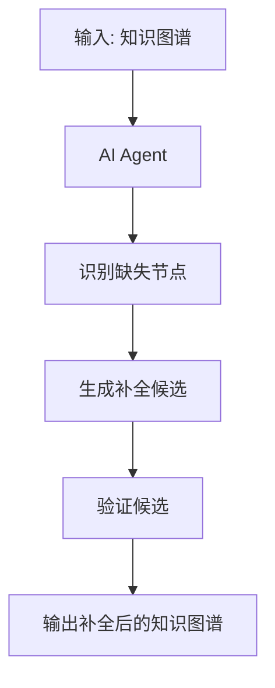
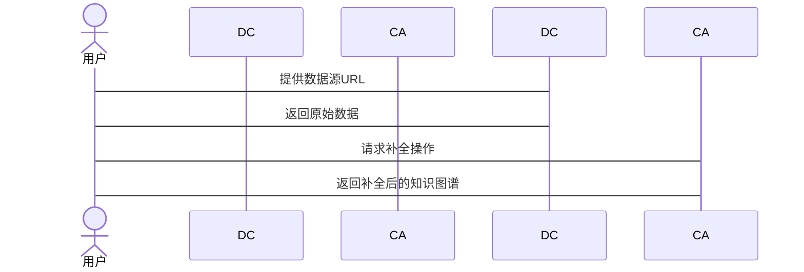

                 


# AI Agent的知识图谱补全技术

> 关键词：AI Agent，知识图谱，补全技术，算法原理，系统架构，项目实战，最佳实践

> 摘要：本文详细探讨了AI Agent在知识图谱补全技术中的应用，从背景介绍、核心概念到算法原理、系统架构、项目实战，再到最佳实践，全面解析了这一技术的实现细节和实际应用。通过本文，读者将深入了解如何利用AI Agent提升知识图谱的完整性和准确性。

---

## 正文

### 第一部分: AI Agent的知识图谱补全技术背景介绍

#### 第1章: 知识图谱与AI Agent概述

##### 1.1 知识图谱的基本概念
知识图谱是一种结构化的数据表示形式，由节点（实体）和边（关系）组成，用于描述真实世界中的实体及其关系。知识图谱的核心目标是构建一个可以被机器理解和推理的知识网络。

##### 1.2 AI Agent的基本概念
AI Agent（智能体）是指在计算机系统中，能够感知环境并采取行动以实现目标的实体。AI Agent可以是软件程序，也可以是机器人，它们能够自主决策、执行任务并与其他系统或用户交互。

##### 1.3 知识图谱补全技术的背景与问题背景
知识图谱在构建过程中常常面临数据不完整的问题，例如某些实体或关系未能被准确识别或捕获。这种不完整性限制了知识图谱的应用范围和效果。AI Agent可以通过自动化的方式识别和补全知识图谱中的缺失部分，从而提升其完整性和可用性。

---

### 第二部分: 知识图谱补全技术的核心概念与联系

#### 第2章: 知识图谱补全技术的核心概念

##### 2.1 知识图谱补全技术的原理
知识图谱补全技术旨在通过算法和模型，识别知识图谱中的缺失节点或关系，并生成合理的补全建议。AI Agent在这一过程中扮演着关键角色，它能够根据上下文信息和历史数据，智能地推断出缺失的部分。

##### 2.2 核心概念的属性特征对比
以下是知识图谱补全技术中的核心概念及其属性特征对比表：

| 概念         | 属性特征                     |
|--------------|------------------------------|
| 知识图谱节点  | 实体名称、类型、属性值       |
| 知识图谱边    | 关系名称、方向、权重         |
| AI Agent行为  | 感知能力、决策能力、执行能力 |

##### 2.3 知识图谱补全技术的ER实体关系图
```mermaid
er
actor: AI Agent
action: 补全操作
entity: 知识图谱节点
relation: 知识图谱边
```

---

### 第三部分: 知识图谱补全技术的算法原理

#### 第3章: 知识图谱补全算法的原理与实现

##### 3.1 基于AI Agent的知识图谱补全算法
以下是基于AI Agent的知识图谱补全算法的流程图：



##### 3.2 算法的数学模型与公式
知识图谱可以表示为一个三元组（头实体，关系，尾实体），即：
$$ (h, r, t) $$
其中，$h$ 是头实体，$r$ 是关系，$t$ 是尾实体。

AI Agent的任务是通过算法推断出缺失的三元组。例如，给定部分已知的信息，AI Agent可以通过推理生成新的三元组：
$$ P(h, r, t) = \text{True} $$

---

### 第四部分: 系统分析与架构设计方案

#### 第4章: 系统分析与架构设计

##### 4.1 问题场景介绍
知识图谱补全系统需要处理大规模的数据，同时需要高效的算法来保证补全的效率和准确性。AI Agent需要能够实时感知知识图谱的状态，并动态调整补全策略。

##### 4.2 系统功能设计
以下是知识图谱补全系统的功能模块：

- 数据采集模块：从多种数据源采集知识图谱数据。
- 缺失检测模块：识别知识图谱中的缺失节点或关系。
- 补全算法模块：基于AI Agent的算法生成补全建议。
- 验证模块：对补全结果进行验证和优化。
- 输出模块：输出最终的补全后的知识图谱。

##### 4.3 系统架构设计
以下是知识图谱补全系统的架构图：


##### 4.4 系统接口设计
以下是系统的接口设计：

- 数据采集模块接口：
  - 输入：数据源URL
  - 输出：原始数据
- 补全算法模块接口：
  - 输入：知识图谱数据
  - 输出：补全后的知识图谱

##### 4.5 系统交互设计
以下是系统的交互序列图：



---

### 第五部分: 项目实战

#### 第5章: 项目实战

##### 5.1 环境安装
以下是项目所需的环境和工具：

- Python 3.8+
- PyTorch 1.9+
- NumPy 1.21+
- Mermaid CLI

##### 5.2 系统核心实现源代码
以下是补全算法的核心代码：

```python
def complete_knowledge_graph(kg):
    missing_nodes = detect_missing_nodes(kg)
    candidates = generate_candidates(missing_nodes)
    validated_candidates = validate_candidates(candidates, kg)
    return complete_kg(kg, validated_candidates)
```

##### 5.3 代码应用解读与分析
- `detect_missing_nodes` 函数用于检测知识图谱中的缺失节点。
- `generate_candidates` 函数基于AI Agent生成补全候选。
- `validate_candidates` 函数对候选进行验证，确保补全的合理性和准确性。
- `complete_kg` 函数将验证后的候选整合到知识图谱中。

##### 5.4 实际案例分析
假设我们有一个简单的知识图谱：
```
- 实体：猫、狗
- 关系：属于
```
如果我们发现“猫”和“狗”都属于“动物”，但知识图谱中缺少“动物”这个实体，AI Agent可以通过推理生成补全建议：
```
- 实体：动物
- 关系：属于
```

##### 5.5 项目小结
通过本项目，我们可以看到AI Agent在知识图谱补全中的强大能力，同时也需要注意算法的效率和结果的准确性。

---

### 第六部分: 最佳实践

#### 第6章: 最佳实践

##### 6.1 小结
知识图谱补全技术是提升知识图谱完整性和可用性的关键技术。AI Agent在这一过程中发挥着重要作用，通过智能化的算法和模型，能够高效地完成补全任务。

##### 6.2 注意事项
- 确保数据的质量和多样性
- 选择合适的算法和模型
- 定期验证和优化补全结果

##### 6.3 拓展阅读
- 知识图谱构建技术
- AI Agent的决策算法
- 图神经网络在知识图谱中的应用

---

### 作者

作者：AI天才研究院 / AI Genius Institute  
禅与计算机程序设计艺术 / Zen And The Art of Computer Programming  

---

通过本文，读者可以全面了解AI Agent在知识图谱补全技术中的应用，从理论到实践，从算法到系统架构，为实际应用提供了丰富的技术参考。

