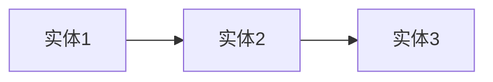
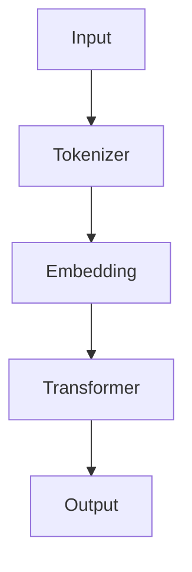
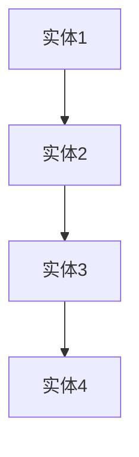
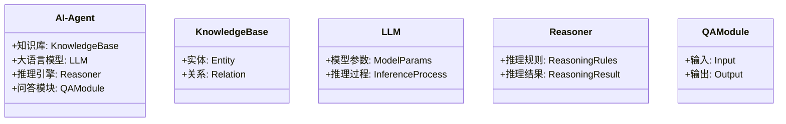
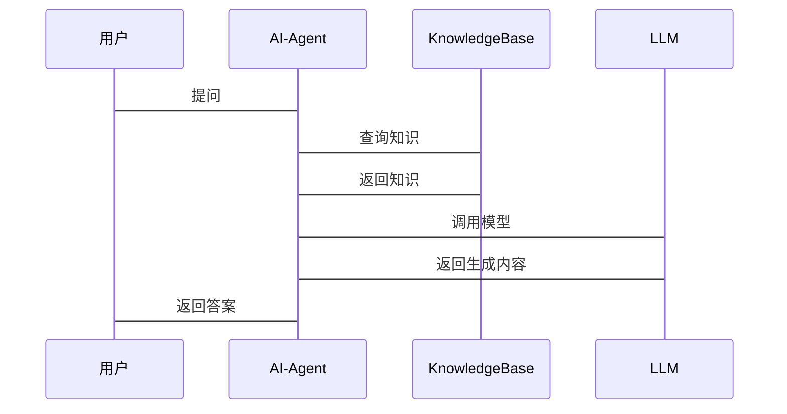

                 


# AI Agent的知识图谱：整合LLM与结构化知识库

> 关键词：AI Agent, 知识图谱, 大语言模型（LLM）, 结构化知识库, 自然语言处理, 数据融合, 知识推理

> 摘要：本文深入探讨AI Agent与知识图谱的结合，重点分析如何将大语言模型（LLM）与结构化知识库有效整合。通过背景介绍、核心概念、算法原理、系统架构设计、项目实战及最佳实践等多维度解析，揭示知识图谱在AI Agent中的关键作用，展示LLM与结构化知识库的协同优势，为构建高效智能的AI系统提供理论支持与实践指导。

---

## 第1章: AI Agent与知识图谱的背景与概念

### 1.1 知识图谱的基本概念

知识图谱是一种结构化的语义网络，由节点（实体）和边（关系）组成，用于表示现实世界中的概念及其相互关系。其核心特征包括：

- **结构化**：通过标准化的格式（如RDF、RDFS、OWL）表示实体和关系。
- **语义化**：通过属性和关系赋予数据深层含义。
- **可扩展性**：支持大规模数据的构建与管理。

### 1.2 大语言模型的基本概念

大语言模型（LLM）是指基于深度学习的自然语言处理模型，具有海量的参数和强大的上下文理解能力。其主要特点包括：

- **参数规模**：通常拥有 billions 级别的参数。
- **上下文窗口**：支持长上下文窗口，理解复杂语义。
- **多任务能力**：通过微调可以处理多种NLP任务。

### 1.3 知识图谱与大语言模型的整合背景

随着AI技术的发展，知识图谱与LLM的结合成为趋势。知识图谱提供结构化知识，帮助模型理解上下文；而LLM则赋予模型生成和推理能力。这种结合使得AI Agent能够更好地理解用户需求，提供更精准的服务。

---

## 第2章: AI Agent的知识图谱整合基础

### 2.1 AI Agent的基本概念

AI Agent是一种智能主体，能够感知环境、自主决策并执行任务。其核心功能包括：

- **感知**：通过传感器或API获取环境信息。
- **推理**：基于知识库进行逻辑推理。
- **决策**：根据推理结果做出最优选择。
- **执行**：通过执行器完成任务。

### 2.2 知识图谱在AI Agent中的作用

知识图谱作为AI Agent的知识库，提供丰富的结构化信息，帮助其理解用户需求和环境。例如，在智能客服中，知识图谱可以存储产品信息、客户问题及其解决方案。

### 2.3 大语言模型在AI Agent中的应用

大语言模型作为AI Agent的核心，负责处理自然语言输入和生成输出。例如，在智能对话系统中，模型可以理解用户意图并生成自然的回复。

---

## 第3章: 知识图谱与大语言模型的核心概念

### 3.1 知识图谱的核心概念

知识图谱通过实体和关系构建语义网络，支持复杂的语义理解和推理。例如，构建一个简单的知识图谱：



### 3.2 大语言模型的核心概念

大语言模型基于Transformer架构，通过自注意力机制处理长文本。例如，GPT模型的生成过程如下：



### 3.3 知识图谱与大语言模型的对比分析

| 特性         | 知识图谱                     | 大语言模型                 |
|--------------|-----------------------------|-----------------------------|
| 表示方式       | 结构化数据                   | 非结构化文本               |
| 查询效率       | 快速基于属性查询             | 较慢，依赖模型训练           |
| 可解释性       | 高                          | 较低                       |
| 更新频率       | 定期更新                     | 实时生成                   |

---

## 第4章: 知识图谱与大语言模型的算法原理

### 4.1 知识图谱构建算法

知识图谱的构建通常包括数据抽取、实体识别、关系抽取和数据融合等步骤。例如，使用DBpedia抽取实体信息：

```python
# 示例代码：从网页中抽取实体信息
import requests
from bs4 import BeautifulSoup

url = "https://en.wikipedia.org/wiki/Python"
response = requests.get(url)
soup = BeautifulSoup(response.text, 'html.parser')
title = soup.find('h1').text
print(title)  # 输出：Python (programming language)
```

### 4.2 大语言模型的训练与推理

大语言模型的训练通常采用监督学习和无监督学习结合的方式。例如，使用GPT模型生成文本：

```python
# 示例代码：使用GPT生成文本
import openai

model = "gpt-3.5-turbo"
messages = [
    {"role": "user", "content": "请解释一下Python的面向对象编程概念"}
]
response = openai.ChatCompletion.create(model=model, messages=messages)
print(response.choices[0].message.content)
```

### 4.3 知识图谱与大语言模型的协同推理

通过将知识图谱嵌入到LLM中，可以增强模型的推理能力。例如，使用知识图谱中的实体关系进行推理：



---

## 第5章: 系统分析与架构设计方案

### 5.1 问题场景介绍

假设我们正在开发一个智能问答系统，需要整合知识图谱和LLM，以提高回答的准确性和相关性。

### 5.2 系统功能设计

系统功能包括：

- 知识抽取：从文本中提取实体和关系。
- 知识存储：将知识以结构化形式存储。
- 知识推理：基于知识图谱进行推理。
- 自然语言问答：生成自然的问答内容。

### 5.3 系统架构设计



### 5.4 系统接口设计

系统接口包括：

- 知识库接口：用于查询和更新知识。
- LLM接口：用于生成文本和进行推理。
- 问答接口：提供对外的问答服务。

### 5.5 系统交互设计



---

## 第6章: 项目实战

### 6.1 环境安装

安装必要的库：

```bash
pip install numpy pandas spacy openai
```

### 6.2 系统核心实现

实现知识图谱构建和LLM调用：

```python
# 知识图谱构建
import spacy

nlp = spacy.load("en_core_web_sm")
doc = nlp("Apple is a company based in California.")
for ent in doc.ents:
    print(f"{ent.text} - {ent.label_}")

# LLM调用
import openai

messages = [
    {"role": "user", "content": "What is the capital of France?"}
]
response = openai.ChatCompletion.create(model="gpt-3.5-turbo", messages=messages)
print(response.choices[0].message.content)
```

### 6.3 实际案例分析

案例：智能问答系统

用户提问：“什么是人工智能？”

系统处理流程：

1. 知识库查询：获取“人工智能”的定义。
2. LLM生成：结合知识库内容生成自然语言回答。

---

## 第7章: 总结与最佳实践

### 7.1 总结

整合知识图谱与大语言模型，能够提升AI Agent的理解和推理能力，使其在复杂场景下表现更佳。

### 7.2 最佳实践

- 数据质量：确保知识图谱的数据准确性和完整性。
- 模型优化：根据具体任务优化LLM的参数和训练数据。
- 系统设计：合理设计系统架构，确保各模块高效协同。

### 7.3 注意事项

- 知识图谱的构建和维护需要时间和资源。
- LLM的调用需要考虑计算成本和响应时间。
- 系统设计需考虑扩展性和可维护性。

### 7.4 拓展阅读

- 《知识图谱构建与应用》
- 《大语言模型的原理与实践》
- 《AI Agent的设计与实现》

---

## 作者

作者：AI天才研究院/AI Genius Institute & 禅与计算机程序设计艺术 /Zen And The Art of Computer Programming

