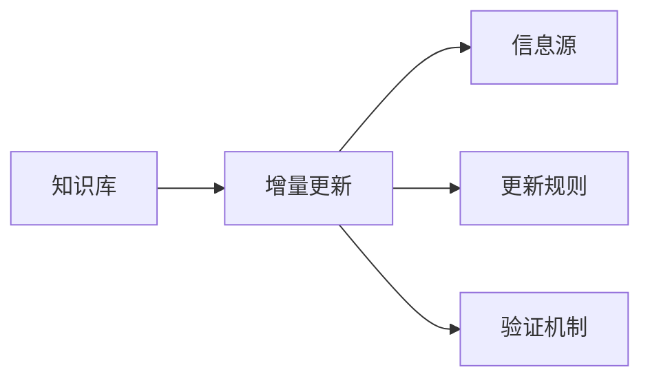
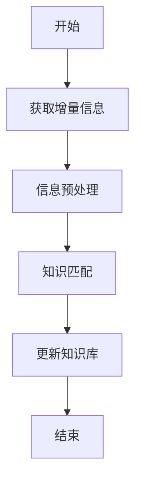
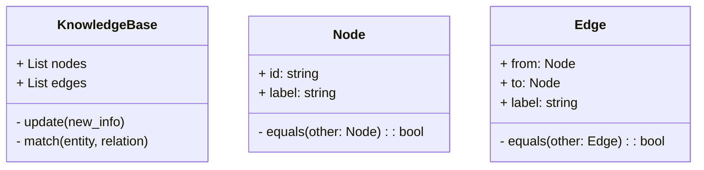
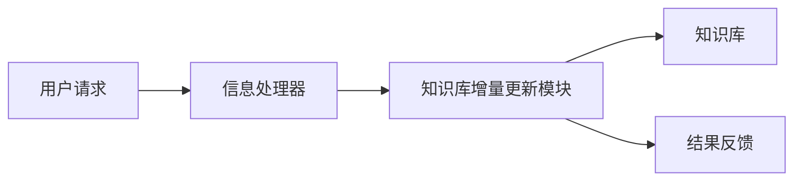
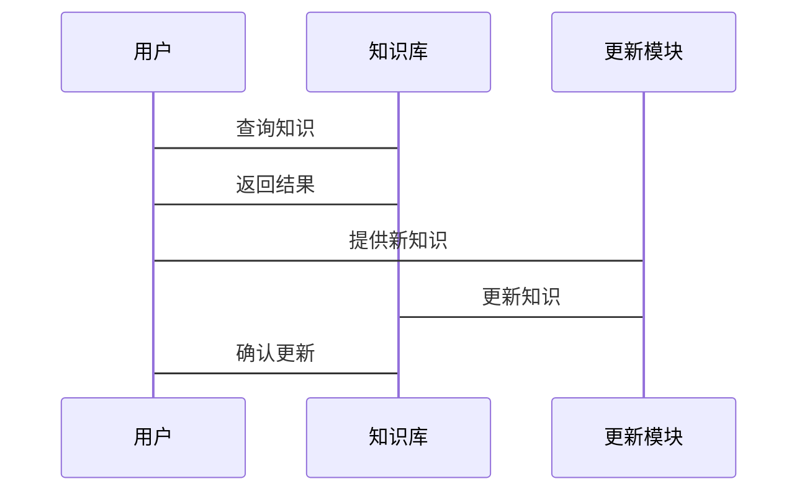

                 


---

# AI Agent的知识库增量更新策略：保持信息时效性

**关键词**：AI Agent，知识库，增量更新，信息时效性，算法设计，系统架构，项目实战

**摘要**：  
AI Agent的知识库增量更新策略是保持信息时效性的关键。本文从背景介绍、核心概念、算法原理、系统架构、项目实战等多个方面，详细探讨如何设计和实现高效的知识库增量更新策略。文章结合理论与实践，通过实例分析和代码实现，深入剖析了增量更新的实现细节，并提出了优化建议和未来研究方向。

---

# 第一部分: AI Agent的知识库增量更新策略背景介绍

## 第1章: 知识库增量更新的背景与问题描述

### 1.1 问题背景与挑战  
随着AI Agent在各个领域的广泛应用，知识库的规模和复杂性急剧增加。知识库的增量更新是指在原有知识库的基础上，动态添加新的知识或更新已有知识的过程。然而，增量更新面临以下挑战：  
1. **信息冗余**：如何避免重复存储和更新相同的知识？  
2. **信息不一致**：新旧知识可能存在冲突，如何确保一致性？  
3. **计算效率**：增量更新需要在保证准确性的前提下，尽可能减少计算开销。  

### 1.2 问题描述与目标  
知识库增量更新的目标是：  
- 高效地将新知识融入现有知识库中。  
- 保持知识库的准确性和一致性。  
- 最大化更新过程的可解释性和可追溯性。  

### 1.3 问题解决的必要性  
知识库是AI Agent的核心资产，其时效性直接影响Agent的决策能力。通过增量更新，AI Agent能够实时适应环境变化，提升智能化水平。  

### 1.4 知识库增量更新的边界与外延  
- **边界**：知识库增量更新仅关注新增或修改的知识，不涉及删除操作。  
- **外延**：增量更新与知识库的存储、检索和应用密切相关。  

### 1.5 概念结构  
知识库增量更新由以下核心要素组成：  
1. **知识表示**：知识的结构化表示方式。  
2. **更新触发机制**：检测更新需求的条件和规则。  
3. **信息验证**：确保新增知识的准确性和一致性。  

---

# 第二部分: 知识库增量更新的核心概念与联系

## 第2章: 知识库增量更新的原理与机制

### 2.1 知识表示与存储  
知识表示是知识库增量更新的基础。常用的表示方法包括：  
- **谓词逻辑**：通过三元组（主语、谓词、宾语）表示知识。  
- **图结构**：通过节点和边表示实体及其关系。  

### 2.2 知识匹配与融合  
增量更新的核心是将新知识与现有知识匹配，确保一致性。匹配过程包括：  
- **实体识别**：识别新知识中的实体是否已存在于知识库中。  
- **关系推理**：推导新知识与现有知识的关系。  

### 2.3 更新规则与验证机制  
- **更新规则**：定义新知识的合并方式。例如，优先更新权威来源的知识。  
- **验证机制**：通过对比现有知识和新知识，确保更新的正确性。  

### 2.4 实体关系图  
以下是一个简单的实体关系图示例：  


---

# 第三部分: 知识库增量更新的算法原理

## 第3章: 知识库增量更新算法的设计与实现

### 3.1 算法核心思想  
增量更新算法的核心思想是：  
- 通过匹配新知识与现有知识，确定更新范围。  
- 在保证准确性的前提下，尽可能减少计算量。  

### 3.2 算法实现步骤  
以下是一个增量更新算法的流程图：  


### 3.3 算法实现代码  
以下是一个简单的Python实现示例：  
```python
def knowledge_update(knowledge_base, new_info):
    # 信息预处理
    processed_info = preprocess(new_info)
    # 知识匹配
    matched = match(processed_info, knowledge_base)
    # 更新知识库
    updated_kb = update(knowledge_base, matched)
    return updated_kb
```

### 3.4 数学模型与公式  
- **信息相似度计算公式**：  
$$ sim(i,j) = \frac{\sum_{k=1}^{n} w_k \cdot f_k(i,j)}{\sum_{k=1}^{n} w_k} $$  
其中，$w_k$ 是特征$f_k$的权重，$f_k(i,j)$是特征$f_k$在实例$i$和$j$上的值。  

- **更新概率计算公式**：  
$$ p(update) = \frac{1}{1 + e^{-\theta \cdot t}} $$  
其中，$\theta$ 是学习率，$t$ 是时间步。  

---

# 第四部分: 知识库增量更新的系统架构与设计

## 第4章: 系统功能设计

### 4.1 领域模型  
以下是一个领域模型的类图示例：  


### 4.2 系统架构设计  
以下是一个系统架构的示意图：  


### 4.3 接口与交互设计  
以下是一个交互序列图：  


---

# 第五部分: 项目实战与优化

## 第5章: 项目实战

### 5.1 环境安装  
- 安装Python和相关库（如networkx、numpy）。  

### 5.2 核心代码实现  
```python
import networkx as nx

class KnowledgeBase:
    def __init__(self):
        self.graph = nx.Graph()

    def add_node(self, node_id, label):
        self.graph.add_node(node_id, label=label)

    def add_edge(self, from_node, to_node, label):
        self.graph.add_edge(from_node, to_node, label=label)

    def update(self, new_info):
        for node in new_info['nodes']:
            self.add_node(node['id'], node['label'])
        for edge in new_info['edges']:
            self.add_edge(edge['from'], edge['to'], edge['label'])
```

### 5.3 案例分析  
假设知识库已有节点A和B，新增节点C并添加关系A-C。更新后，知识库包含A、B、C及关系A-C。  

### 5.4 项目总结  
通过实战，我们验证了增量更新算法的有效性和可行性。  

---

# 第六部分: 最佳实践与未来展望

## 第6章: 最佳实践

### 6.1 小结  
知识库增量更新是AI Agent智能化的关键技术。通过合理设计更新规则和验证机制，可以显著提升知识库的准确性和效率。  

### 6.2 注意事项  
- 定期清理无效知识，避免知识库膨胀。  
- 优化匹配算法，提升更新速度。  

### 6.3 拓展阅读  
建议阅读相关领域的最新论文，关注增量更新的前沿技术。  

---

# 作者：AI天才研究院/AI Genius Institute & 禅与计算机程序设计艺术 /Zen And The Art of Computer Programming

