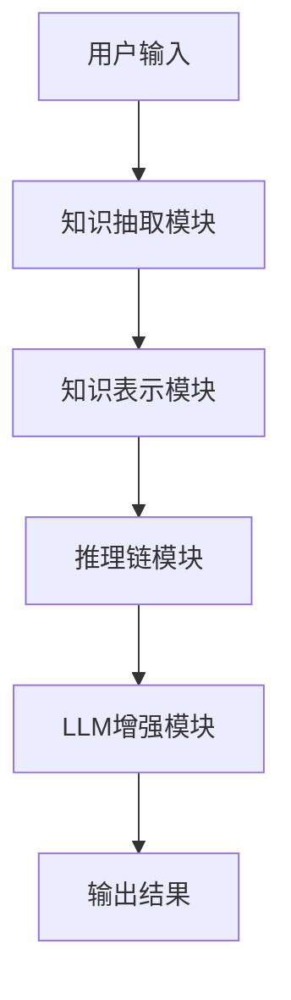
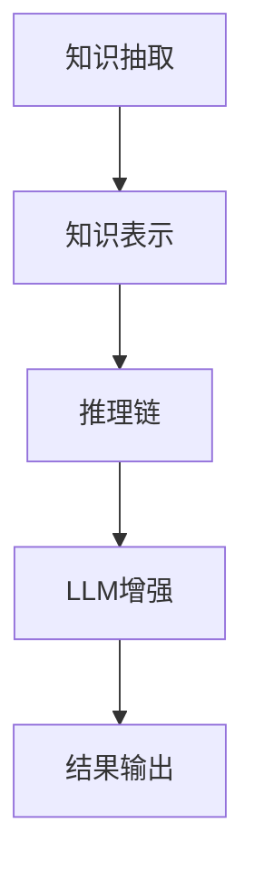
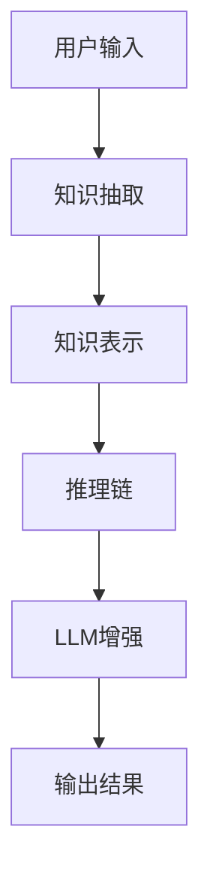

                 


# AI Agent的知识推理链：增强LLM的步骤式思考能力

> 关键词：AI Agent, 知识推理链, 大语言模型, LLM, 推理能力, 步骤式思考, 系统架构

> 摘要：本文深入探讨了AI Agent的知识推理链如何增强大语言模型（LLM）的步骤式思考能力。通过详细分析知识推理链的构建方法、LLM的内部机制、系统架构设计以及项目实战，本文为读者提供了从理论到实践的全面指导，帮助读者理解如何通过知识推理链提升LLM的推理能力。

---

## 第一部分: AI Agent的知识推理链基础

### 第1章: AI Agent与知识推理链概述

#### 1.1 AI Agent的基本概念

##### 1.1.1 AI Agent的定义与特点
AI Agent（人工智能代理）是一种能够感知环境、自主决策并执行任务的智能实体。其特点包括：

1. **自主性**：能够在没有外部干预的情况下自主运行。
2. **反应性**：能够根据环境反馈实时调整行为。
3. **学习能力**：通过数据和经验不断优化自身性能。
4. **交互能力**：能够与人类或其他系统进行有效交互。

##### 1.1.2 知识推理链的定义与作用
知识推理链是一种通过链式推理过程，将分散的知识点连接起来，形成完整逻辑链条的技术。其作用包括：

1. **知识整合**：将零散的知识点整合成结构化的知识网络。
2. **逻辑推理**：通过链式推理实现从已知到未知的推导。
3. **增强思考能力**：通过知识推理链提升AI Agent的逻辑推理和问题解决能力。

##### 1.1.3 AI Agent与知识推理链的关系
AI Agent通过知识推理链实现对复杂问题的分解与解决。知识推理链为AI Agent提供了一种结构化的知识表示和推理机制，使AI Agent能够更高效地完成任务。

#### 1.2 知识推理链的核心要素

##### 1.2.1 知识表示与存储
知识表示是将知识以某种形式存储的过程，常见的知识表示方法包括：

1. **符号表示**：使用符号逻辑表示知识，如谓词逻辑。
2. **图表示**：使用图结构表示知识，如知识图谱。
3. **语义网络**：通过语义关系表示知识。

##### 1.2.2 推理机制与逻辑推理
推理机制是知识推理链的核心部分，常见的推理方法包括：

1. **符号逻辑推理**：基于符号逻辑的演绎推理。
2. **概率推理**：基于概率论的推理方法。
3. **链式推理**：通过链式推理逐步推导出结论。

##### 1.2.3 链式思考与步骤式推理
链式思考是一种通过逐步推理，将问题分解为多个步骤并最终得出结论的方法。步骤式推理强调将问题分解为多个小问题，并逐步解决。

#### 1.3 知识推理链的重要性

##### 1.3.1 提升LLM的思考能力
知识推理链为大语言模型提供了结构化的知识表示和推理能力，使其能够更高效地解决问题。

##### 1.3.2 知识推理链在AI Agent中的应用
AI Agent通过知识推理链实现对复杂问题的分解与解决，提升其问题解决能力。

##### 1.3.3 知识推理链的未来发展趋势
随着AI技术的不断发展，知识推理链将更加智能化和自动化，成为AI Agent的核心技术之一。

---

## 第2章: 知识推理链的构建方法

### 2.1 知识抽取与信息提取

#### 2.1.1 文本信息抽取的基本原理
文本信息抽取是从文本中提取结构化信息的过程，常见的信息抽取方法包括：

1. **基于规则的方法**：使用正则表达式提取信息。
2. **基于模式匹配的方法**：通过模式匹配提取信息。
3. **基于机器学习的方法**：使用机器学习模型提取信息。

#### 2.1.2 基于LLM的信息提取方法
大语言模型（LLM）可以通过生成式的方式提取信息，例如通过提示工程技术（Prompt Engineering）引导模型输出所需信息。

#### 2.1.3 知识图谱构建与应用
知识图谱是一种结构化的知识表示形式，广泛应用于知识推理链的构建中。

---

### 2.2 知识表示与存储

#### 2.2.1 知识图谱的表示方法
知识图谱的表示方法包括：

1. **符号表示**：使用符号逻辑表示知识。
2. **图表示**：使用图结构表示知识。
3. **语义网络**：通过语义关系表示知识。

#### 2.2.2 知识库的构建与管理
知识库的构建与管理包括数据采集、数据清洗、知识抽取、知识融合和知识存储等步骤。

#### 2.2.3 知识表示的标准化与形式化
知识表示的标准化与形式化是知识推理链的重要基础，常见的标准化表示方法包括JSON-LD和RDF。

---

### 2.3 推理机制与链式思考

#### 2.3.1 基于符号逻辑的推理方法
基于符号逻辑的推理方法包括演绎推理和归纳推理。

#### 2.3.2 基于概率的推理方法
基于概率的推理方法包括贝叶斯推理和马尔可夫链推理。

#### 2.3.3 链式思考的实现与优化
链式思考的实现与优化包括推理链的构建、推理链的优化和推理链的并行处理。

---

## 第3章: LLM的内部机制与推理能力

### 3.1 LLM的基本原理

#### 3.1.1 大语言模型的结构与工作原理
大语言模型的结构包括编码器和解码器，其工作原理基于Transformer模型的自注意力机制。

#### 3.1.2 注意力机制与Transformer模型
注意力机制通过计算输入序列中每个位置的重要性来生成输出序列，Transformer模型通过多头注意力机制进一步提升模型的表达能力。

#### 3.1.3 LLM的训练与优化方法
大语言模型的训练与优化方法包括预训练和微调，预训练目标是生成与输入相关的输出，微调目标是根据具体任务优化模型。

---

### 3.2 LLM的推理能力

#### 3.2.1 基于LLM的文本生成原理
大语言模型的文本生成原理基于生成式AI，通过贪心搜索或随机采样生成输出。

#### 3.2.2 LLM的上下文理解能力
大语言模型的上下文理解能力基于其强大的上下文表示能力，能够理解输入文本的语义和逻辑。

#### 3.2.3 LLM的推理局限性与改进方向
大语言模型的推理能力存在局限性，例如知识过时和逻辑推理能力有限，未来需要通过知识增强和推理链优化来提升其推理能力。

---

### 3.3 知识推理链对LLM的增强作用

#### 3.3.1 知识推理链如何提升LLM的思考能力
知识推理链通过提供结构化的知识表示和链式推理能力，提升LLM的逻辑推理和问题解决能力。

#### 3.3.2 知识推理链在LLM中的具体应用
知识推理链在LLM中的具体应用包括知识抽取、知识表示和链式推理。

#### 3.3.3 知识推理链对LLM性能的提升效果
知识推理链通过提升LLM的推理能力和思考能力，显著提升了LLM在复杂任务中的表现。

---

## 第4章: 系统分析与架构设计方案

### 4.1 系统功能设计

#### 4.1.1 知识推理链的系统功能模块划分
知识推理链的系统功能模块包括知识抽取模块、知识表示模块、推理链模块和LLM增强模块。

#### 4.1.2 系统功能流程图（Mermaid）


### 4.2 系统架构设计

#### 4.2.1 系统架构图（Mermaid）


### 4.3 接口设计与交互流程

#### 4.3.1 系统接口设计
系统接口设计包括知识抽取接口、知识表示接口、推理链接口和LLM增强接口。

#### 4.3.2 系统交互流程图（Mermaid）


---

## 第5章: 项目实战与实现

### 5.1 环境安装与配置

#### 5.1.1 开发环境搭建
开发环境搭建包括安装Python、安装必要的库（如numpy、pandas、networkx）和安装知识图谱工具（如Neo4j）。

#### 5.1.2 必要库的安装与配置
```bash
pip install numpy pandas networkx
```

### 5.2 知识推理链的核心实现

#### 5.2.1 知识抽取模块实现
知识抽取模块实现包括文本信息抽取和知识图谱构建。

##### 代码示例：
```python
import networkx as nx

# 创建知识图谱
G = nx.DiGraph()

# 添加节点
G.add_node("A")
G.add_node("B")

# 添加边
G.add_edge("A", "B")

# 可视化知识图谱
nx.draw(G, node_color="red", edge_color="blue", with_labels=True)
plt.show()
```

---

## 第6章: 总结与展望

### 6.1 小结
知识推理链通过提供结构化的知识表示和链式推理能力，显著提升了大语言模型的推理能力和问题解决能力。

### 6.2 注意事项
在实际应用中，需要注意知识推理链的性能优化和知识库的更新维护。

### 6.3 拓展阅读
建议读者进一步阅读相关领域的书籍和论文，深入理解知识推理链和大语言模型的结合应用。

---

## 作者：AI天才研究院/AI Genius Institute & 禅与计算机程序设计艺术 /Zen And The Art of Computer Programming

---

希望这篇文章能为读者提供清晰的知识推理链与大语言模型结合的实现方法，帮助读者更好地理解如何通过知识推理链增强LLM的步骤式思考能力。

