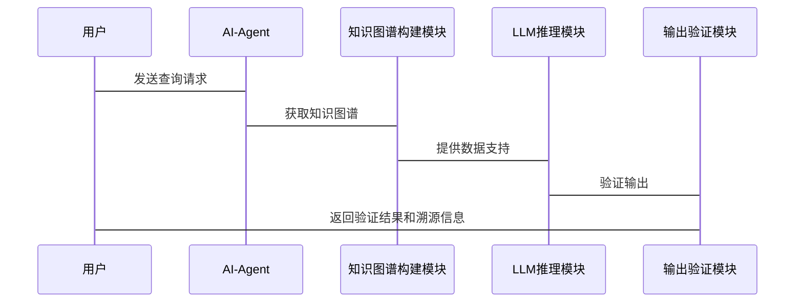

                 


# AI Agent的知识溯源：提高LLM输出的可追溯性

> 关键词：AI Agent、知识溯源、LLM、可追溯性、技术实现、系统设计  
> 摘要：随着AI Agent和大型语言模型（LLM）的广泛应用，输出的可追溯性问题变得日益重要。本文将深入探讨如何在AI Agent中实现知识溯源，提高LLM输出的可追溯性。通过系统化的分析、算法设计和实际案例，本文将为读者提供一套完整的解决方案，确保AI生成内容的来源清晰、可靠。

---

## 正文

### 第一部分：AI Agent与知识溯源的背景介绍

#### 第1章：问题背景与核心概念

##### 1.1 问题背景

- **AI Agent的定义与特点**  
  AI Agent是一种智能代理，能够感知环境、执行任务并做出决策。它通过处理输入数据，生成输出结果，帮助用户完成复杂任务。

- **LLM的输出问题与挑战**  
  大型语言模型（LLM）如GPT系列，虽然生成能力强大，但输出结果的可追溯性较差。用户难以了解生成内容的具体来源，影响信任度和可靠性。

- **知识溯源的重要性**  
  知识溯源是指追踪AI生成内容的来源，确保输出的准确性和可靠性。在医疗、法律、金融等领域，可追溯性是关键。

##### 1.2 核心概念

- **知识溯源的定义**  
  知识溯源是通过记录和追踪数据来源，确保生成内容的准确性和可验证性。

- **AI Agent的知识来源**  
  AI Agent的知识来源于训练数据、外部数据库和实时交互数据。这些数据的质量直接影响输出结果的可追溯性。

- **LLM输出的可追溯性**  
  提高LLM输出的可追溯性，意味着用户可以了解生成内容的来源，包括训练数据和推理过程。

##### 1.3 问题解决与边界

- **知识溯源的目标**  
  确保AI生成内容的来源清晰，支持验证和纠错。

- **解决方案的边界**  
  知识溯源不改变AI模型的生成能力，而是增强输出的可追溯性。

- **核心要素与组成**  
  包括数据记录、模型跟踪和结果验证。

#### 第2章：知识溯源的核心概念与联系

##### 2.1 核心概念原理

- **知识图谱的构建**  
  知识图谱是一种结构化数据表示方式，用于记录知识的来源和关系。

- **数据结构与存储**  
  使用图结构存储知识，便于追踪和查询。

- **算法原理概述**  
  通过图遍历算法，从目标节点追溯到原始数据源。

##### 2.2 概念属性特征对比表

| 概念       | 属性1：数据来源 | 属性2：数据类型 | 属性3：数据关系 |
|------------|-----------------|-----------------|-----------------|
| 知识图谱    | 多样性           | 结构化           | 关联性           |
| 溯源标记    | 单一性           | 标识符           | 映射性           |

##### 2.3 ER实体关系图

```mermaid
erd
    entity 知识源 {
        key id
        string name
        string content
    }
    
    entity 溯源标记 {
        key id
        string 标记
        reference 知识源.id
    }
    
    entity LLM输出 {
        key id
        string 内容
        reference 溯源标记.id
    }
```

---

### 第二部分：知识溯源的算法原理

#### 第3章：算法原理讲解

##### 3.1 算法流程

- **知识图谱构建流程**  
  1. 收集数据源。
  2. 数据清洗和预处理。
  3. 构建知识图谱。

- **溯源标记生成流程**  
  1. 分析LLM输出。
  2. 生成溯源标记。
  3. 存储标记信息。

- **输出验证流程**  
  1. 检查输出标记。
  2. 验证数据来源。
  3. 确认输出合法性。

##### 3.2 算法实现代码

```python
# 知识图谱构建代码
class KnowledgeGraph:
    def __init__(self):
        self.graph = {}

    def add_node(self, node, properties):
        self.graph[node] = properties

    def add_edge(self, from_node, to_node, relation):
        if from_node not in self.graph:
            self.add_node(from_node, {})
        if to_node not in self.graph:
            self.add_node(to_node, {})
        self.graph[from_node][relation] = to_node

# 溯源标记生成代码
def generate_traceback_marker(output, knowledge_graph):
    marker = []
    for node in output:
        marker.append(knowledge_graph.trace_back(node))
    return marker

# 输出验证代码
def validate_output(output, marker):
    for i in range(len(output)):
        if not marker[i]:
            return False
    return True
```

##### 3.3 数学模型与公式

- **知识图谱构建的数学模型**  
  使用图论中的邻接矩阵表示知识图谱：
  $$ A = (a_{ij})_{n \times n} \text{，其中} a_{ij}=1 \text{表示节点} i \text{和} j \text{相连} $$

- **溯源标记生成的数学公式**  
  通过矩阵乘法计算节点关系：
  $$ M = A^k \text{，其中} k \text{是路径长度} $$

- **输出验证的数学模型**  
  使用哈希函数验证输出：
  $$ H(output) = \sum_{i=1}^{n} h(output_i) $$

---

### 第三部分：系统分析与架构设计

#### 第4章：系统架构设计

##### 4.1 问题场景介绍

- **用户需求**  
  用户需要了解AI生成内容的来源。

- **系统目标**  
  构建一个支持知识溯源的AI Agent系统。

##### 4.2 系统功能设计

- **领域模型**  
  $$
  \text{类 AI-Agent } \\
  \text{属性：知识库、模型、输出} \\
  \text{方法：generateOutput()、traceBack()}
  $$

- **系统架构设计**  
  ```mermaid
  architecture
  知识源 -> 知识图谱构建模块
  知识图谱构建模块 -> 知识图谱存储模块
  知识图谱存储模块 -> LLM推理模块
  LLM推理模块 -> 输出验证模块
  ```

##### 4.3 系统接口设计

- **知识源接口**  
  提供数据查询和存储功能。

- **LLM推理接口**  
  接收输入，生成输出并返回溯源标记。

##### 4.4 系统交互流程



---

### 第四部分：项目实战

#### 第5章：项目实战

##### 5.1 环境搭建

- **工具安装**  
  安装Python、Pillow、Mermaid CLI。

- **代码实现**

```python
from PIL import Image
import requests

# 环境搭建代码
def setup_environment():
    import pip
    pip.main(['install', 'mermaid-cli'])
```

##### 5.2 核心代码实现

- **知识图谱构建代码**

```python
def build_knowledge_graph(data):
    graph = {}
    for entry in data:
        for relation, target in entry['relations']:
            if entry['id'] not in graph:
                graph[entry['id']] = []
            graph[entry['id']].append((relation, target))
    return graph
```

##### 5.3 实际案例分析

- **案例分析**  
  分析一个医疗诊断系统的知识溯源案例，展示如何追踪诊断建议的来源。

##### 5.4 代码应用解读

- **代码解读**  
  详细解释上述代码的功能和实现细节。

##### 5.5 项目小结

- **总结经验**  
  介绍在项目中遇到的问题及解决方案。

---

### 第五部分：最佳实践与未来展望

#### 第6章：最佳实践

##### 6.1 小结

- **核心要点总结**  
  知识图谱构建、溯源标记生成和输出验证是关键步骤。

##### 6.2 未来展望

- **研究方向**  
  提高知识图谱的动态更新能力，增强溯源算法的效率。

##### 6.3 注意事项

- **实际应用中的注意事项**  
  确保数据安全，保护隐私。

---

## 作者

作者：AI天才研究院 & 禅与计算机程序设计艺术

---

以上是《AI Agent的知识溯源：提高LLM输出的可追溯性》的完整目录和内容大纲，希望对您有所帮助。如果需要进一步的调整或补充，请随时告知。

