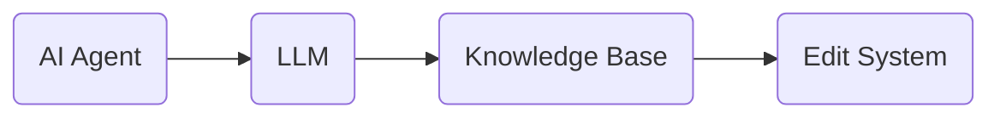
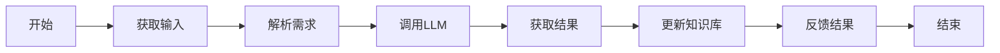
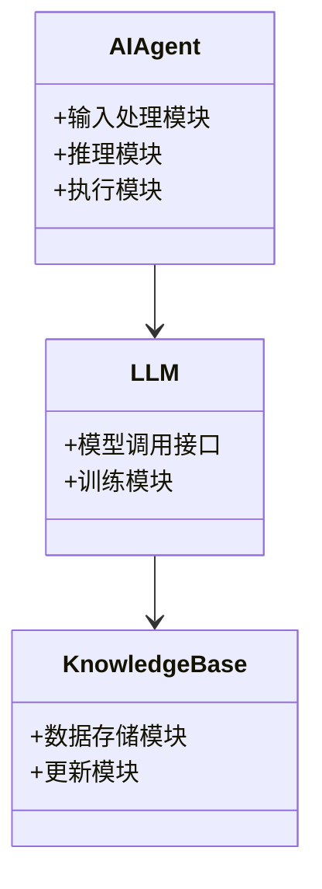
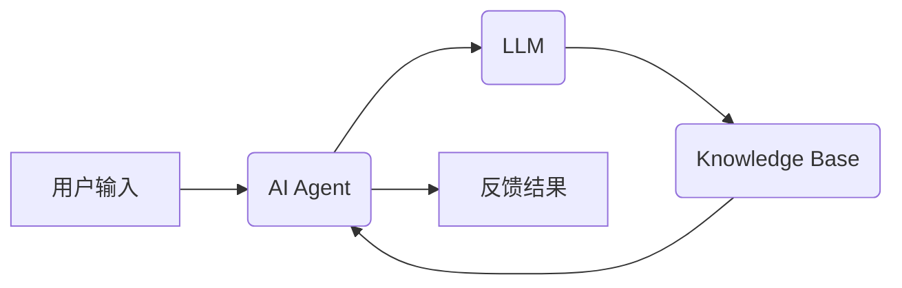
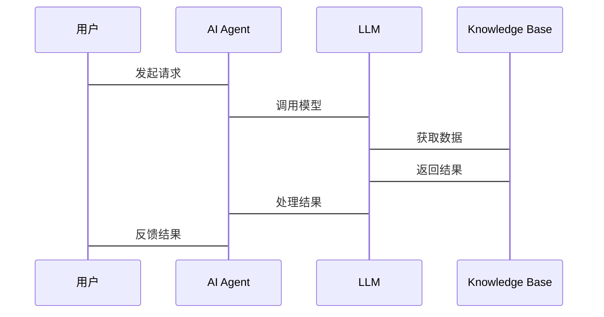

                 


# AI Agent的知识编辑系统：动态管理LLM的知识库

## 关键词：AI Agent, LLM, 知识编辑系统, 动态知识管理, 系统架构设计

## 摘要：本文详细探讨了AI Agent在动态管理大型语言模型（LLM）知识库中的应用。通过分析AI Agent与LLM的关系，揭示了知识编辑系统的算法原理和系统架构设计，结合实际案例，展示了如何通过AI Agent实现知识库的动态更新和优化。

---

# 第1章: AI Agent与知识编辑系统概述

## 1.1 问题背景与目标

### 1.1.1 问题背景介绍
在当今人工智能领域，大型语言模型（LLM）如GPT-4、PaLM等，正在改变我们处理文本数据的方式。这些模型依赖于庞大的知识库，而知识库的动态更新和管理变得至关重要。传统的静态知识库管理方法难以适应快速变化的信息环境，因此需要一种更灵活、动态的知识管理方式。

### 1.1.2 问题描述与目标
知识库的动态管理需要一个智能化的系统，能够实时更新、纠错和优化。AI Agent作为一种智能化的代理，能够通过与LLM的交互，实现对知识库的动态管理。本文的目标是设计一个基于AI Agent的知识编辑系统，实现对LLM知识库的高效动态管理。

### 1.1.3 解决方案概述
通过AI Agent代理，我们可以实现对LLM知识库的实时更新和优化。AI Agent能够理解用户的需求，调用LLM进行信息处理，并根据反馈调整知识库内容。这种动态管理方式能够显著提高知识库的准确性和响应速度。

## 1.2 核心概念与边界

### 1.2.1 AI Agent的基本概念
AI Agent是一种智能代理，能够感知环境、执行任务并做出决策。在知识编辑系统中，AI Agent负责接收用户的请求，调用LLM进行信息处理，并根据结果更新知识库。

### 1.2.2 LLM知识库的定义与特点
LLM知识库是用于训练和推理的大规模文本数据集。其特点是数据量大、覆盖面广，能够处理复杂语言任务。然而，知识库的内容需要动态更新以适应变化。

### 1.2.3 动态知识管理的边界与外延
动态知识管理的边界包括实时更新、版本控制和内容纠错。外延则涉及知识库的优化、扩展和与外部系统的集成。

## 1.3 系统核心要素与组成

### 1.3.1 AI Agent的组成结构
AI Agent由感知模块、推理模块和执行模块组成。感知模块接收输入，推理模块分析需求，执行模块调用LLM并更新知识库。

### 1.3.2 知识编辑系统的功能模块
知识编辑系统包括输入处理模块、LLM调用模块、知识库更新模块和反馈处理模块。这些模块协同工作，实现知识库的动态管理。

### 1.3.3 核心概念之间的关系
通过Mermaid图展示AI Agent、LLM和知识库之间的关系：


## 1.4 本章小结
本章介绍了AI Agent和知识编辑系统的基本概念，分析了它们在动态知识管理中的作用，并通过Mermaid图展示了各模块之间的关系。

---

# 第2章: AI Agent与LLM的关系

## 2.1 AI Agent的核心原理

### 2.1.1 AI Agent的基本原理
AI Agent通过感知环境、理解用户需求，调用LLM进行信息处理，并根据反馈更新知识库。其核心在于智能代理的自主性和适应性。

### 2.1.2 LLM在AI Agent中的作用
LLM作为知识处理的核心，负责理解和生成文本。AI Agent通过调用LLM，实现对知识库的动态更新和优化。

### 2.1.3 知识编辑系统的工作机制
知识编辑系统通过AI Agent接收输入，调用LLM进行信息处理，并根据结果更新知识库。其工作机制包括输入处理、LLM调用、知识更新和反馈处理。

## 2.2 核心概念对比分析

### 2.2.1 AI Agent与传统知识管理系统对比
AI Agent通过智能化代理实现动态管理，而传统系统依赖人工操作，效率较低。

### 2.2.2 LLM与传统NLP模型对比
LLM具有更大的参数规模和更强的上下文理解能力，能够处理更复杂的语言任务。

### 2.2.3 动态知识管理与静态知识管理对比
动态知识管理能够实时更新和优化，而静态管理依赖定期维护，响应速度较慢。

## 2.3 ER实体关系图
通过Mermaid图展示实体关系：


## 2.4 本章小结
本章分析了AI Agent与LLM的关系，对比了传统方法，展示了实体关系图，为后续章节的深入分析奠定了基础。

---

# 第3章: 知识编辑系统的算法原理

## 3.1 算法流程概述
通过Mermaid图展示算法流程：


## 3.2 算法原理详细讲解

### 3.2.1 LLM的训练过程
LLM通过大量文本数据的训练，学习语言模式和语义关系。训练过程包括前向传播和反向传播，优化模型参数。

### 3.2.2 知识编辑系统的更新机制
知识编辑系统通过AI Agent接收输入，调用LLM进行信息处理，并根据结果更新知识库。其更新机制包括内容纠错、版本控制和优化。

### 3.2.3 数学模型与公式
LLM的训练目标是最小化损失函数，公式如下：
$$ L = \frac{1}{N}\sum_{i=1}^{N} \text{loss}(x_i, y_i) $$
其中，$x_i$是输入，$y_i$是标签。

---

# 第4章: 系统分析与架构设计

## 4.1 问题场景介绍
知识编辑系统需要处理用户的输入请求，调用LLM进行信息处理，并更新知识库。系统需要支持高并发和实时更新。

## 4.2 系统功能设计

### 4.2.1 领域模型设计
通过Mermaid类图展示领域模型：


### 4.2.2 系统架构设计
通过Mermaid架构图展示系统架构：


### 4.2.3 接口设计与交互流程图
通过Mermaid序列图展示交互流程：


## 4.3 本章小结
本章通过系统分析和架构设计，展示了知识编辑系统的整体结构和各模块之间的交互关系。

---

# 第5章: 项目实战

## 5.1 环境安装与配置

### 5.1.1 安装Python环境
使用Anaconda安装Python 3.9及以上版本。

### 5.1.2 安装必要的库
安装必要的库，如`transformers`和`torch`：
```bash
pip install transformers torch
```

## 5.2 系统核心实现

### 5.2.1 AI Agent的实现
实现AI Agent的核心功能，包括输入处理和LLM调用：
```python
class AIAssistant:
    def __init__(self, model_name):
        self.model = AutoModelForCausalLM.from_pretrained(model_name)
    
    def process_request(self, input_text):
        # 处理输入并返回结果
        pass
```

### 5.2.2 LLM的调用与知识库更新
实现LLM的调用和知识库的更新：
```python
def update_knowledge_base(input_text, output_text):
    # 更新知识库
    pass
```

### 5.2.3 代码解读与分析
解释代码的功能和实现细节，展示如何通过AI Agent调用LLM并更新知识库。

## 5.3 案例分析与详细讲解
通过实际案例，展示如何使用AI Agent动态管理知识库。例如，用户输入一个查询，AI Agent调用LLM生成回答，并更新知识库。

## 5.4 本章小结
本章通过项目实战，展示了如何实现AI Agent的知识编辑系统，并通过案例分析验证了系统的可行性。

---

# 第6章: 总结与展望

## 6.1 核心内容总结
总结本文的核心内容，包括AI Agent与LLM的关系、知识编辑系统的算法原理和系统架构设计。

## 6.2 最佳实践与注意事项

### 6.2.1 最佳实践
建议在实现知识编辑系统时，注意模块化设计和代码复用。

### 6.2.2 注意事项
避免过度依赖AI Agent，确保系统的可解释性和可维护性。

## 6.3 未来研究方向

### 6.3.1 研究热点
研究如何进一步优化AI Agent与LLM的交互，提高知识编辑系统的效率和准确性。

### 6.3.2 技术趋势
关注大模型的发展和新的算法创新，推动知识编辑系统的智能化和自动化。

## 6.4 本章小结
本章总结了全文内容，并展望了未来的研究方向和技术趋势。

---

# 作者：AI天才研究院 & 禅与计算机程序设计艺术

---

通过以上结构，我们逐步分析了AI Agent的知识编辑系统的各个方面，从背景到实现，从理论到实践，为读者提供了一个全面的理解框架。希望本文能够帮助读者深入理解动态管理LLM知识库的核心思想和实现方法。

