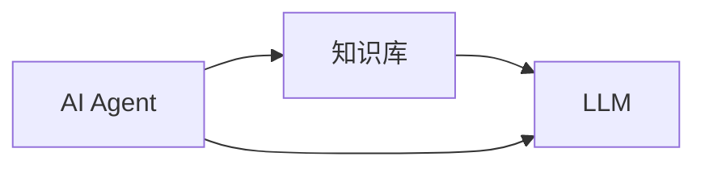
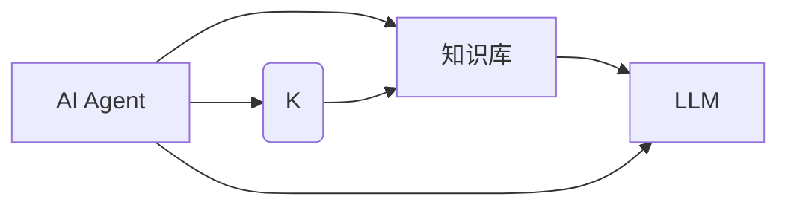

                 


# AI Agent的知识编辑：动态调整LLM的知识库

## 关键词：AI Agent, LLM, 知识编辑, 动态调整, 知识库, 大语言模型

## 摘要：AI Agent通过动态调整大语言模型（LLM）的知识库，能够实时更新和优化模型的上下文信息，提升其在复杂场景下的适应性和智能性。本文将详细探讨AI Agent如何进行知识编辑，分析动态调整LLM知识库的核心原理、算法实现、系统架构设计，并通过实际案例展示其应用场景和实现效果。

---

# 第一部分: 背景与概念

## 第1章: 问题背景与概念介绍

### 1.1 问题背景

#### 1.1.1 大语言模型的知识库管理挑战
大语言模型（LLM）通过庞大的知识库提供生成文本的能力，但知识库的内容会随时间变化，如新增知识、数据更新或信息修正。如何动态调整知识库，以保持模型的准确性和适用性，是一个重要挑战。

#### 1.1.2 动态知识更新的必要性
知识库的静态性可能导致模型在面对新问题时表现不佳。动态调整知识库能够实时更新模型的上下文，使其适应快速变化的环境。

#### 1.1.3 AI Agent在知识管理中的角色
AI Agent作为智能代理，能够主动监控知识库的变化，并根据需求进行调整，从而优化LLM的表现。

### 1.2 问题描述

#### 1.2.1 LLM知识库的局限性
- 知识库内容固定，难以应对新信息。
- 需要频繁更新，增加维护成本。
- 知识库可能包含过时或不准确的信息。

#### 1.2.2 动态调整知识库的需求
- 实时更新知识库，以适应新需求。
- 根据具体场景调整知识库内容。
- 提高模型的灵活性和适应性。

#### 1.2.3 AI Agent的知识编辑能力
AI Agent能够自动化地识别、提取和更新知识库中的信息，优化LLM的表现。

### 1.3 问题解决

#### 1.3.1 动态知识编辑的目标
- 提供实时的知识更新能力。
- 根据上下文动态调整知识库内容。
- 确保知识库的准确性和完整性。

#### 1.3.2 AI Agent的知识编辑能力
AI Agent能够通过以下方式实现知识编辑：
- 自动识别需要更新的信息。
- 提供灵活的知识库调整方法。
- 支持多种知识表示形式。

#### 1.3.3 动态调整LLM知识库的方法
- 使用API进行知识库更新。
- 基于规则的动态调整。
- 基于上下文的动态调整。

### 1.4 边界与外延

#### 1.4.1 知识编辑的边界
- 知识编辑仅涉及知识库内容的调整，不改变模型的结构。
- 边界包括知识库的存储、访问和更新权限。

#### 1.4.2 动态调整的范围
- 可以调整的知识包括事实、规则、语义信息等。
- 动态调整的范围受限于知识库的结构和AI Agent的能力。

#### 1.4.3 AI Agent的知识编辑能力的扩展
- 支持多源知识库的整合。
- 支持多种知识表示形式。
- 支持异构知识库的动态调整。

### 1.5 核心概念结构

#### 1.5.1 核心概念组成
- AI Agent：负责知识编辑和动态调整。
- LLM：大语言模型，知识库的使用者。
- 知识库：存储知识的结构化或非结构化数据集。
- 动态调整：根据需求实时更新知识库内容。

#### 1.5.2 概念之间的关系
AI Agent与LLM之间通过知识库进行交互，AI Agent负责知识编辑，LLM负责生成文本。知识库是AI Agent和LLM之间的桥梁。

#### 1.5.3 概念结构图



---

## 第2章: 核心概念与联系

### 2.1 AI Agent的定义与特征

#### 2.1.1 AI Agent的定义
AI Agent是一种智能代理，能够感知环境、执行任务并做出决策。它具备自主性、反应性、目标导向性和社会性等特征。

#### 2.1.2 AI Agent的核心特征
- **自主性**：能够在没有外部干预的情况下独立运作。
- **反应性**：能够根据环境变化实时调整行为。
- **目标导向性**：有明确的目标，并根据目标优化行动。
- **社会性**：能够与其他系统或人类进行交互和协作。

#### 2.1.3 AI Agent的分类
- **简单反射型Agent**：基于当前输入做出反应，不依赖历史信息。
- **基于模型的反射型Agent**：利用内部模型进行推理和决策。
- **目标驱动型Agent**：根据目标选择行动。
- **实用驱动型Agent**：根据效用函数优化行动。

### 2.2 LLM的定义与特点

#### 2.2.1 LLM的定义
大语言模型（LLM）是一种基于深度学习的自然语言处理模型，能够生成、理解和处理人类语言。其核心是通过大量数据训练得到的参数化语言模型。

#### 2.2.2 LLM的核心特点
- **大规模训练**：基于海量数据进行训练，具备强大的模式识别能力。
- **生成能力**：能够生成连贯且符合语境的文本。
- **理解能力**：能够理解输入文本的语义和上下文。
- **可定制化**：可以通过微调或提示工程技术进行定制化应用。

#### 2.2.3 LLM与传统模型的区别
- **传统模型**：基于规则或浅层学习，知识有限且固定。
- **LLM**：基于深度学习，具备强大的上下文理解和生成能力，能够处理复杂语言任务。

### 2.3 AI Agent与LLM的关系

#### 2.3.1 AI Agent对LLM的依赖
AI Agent需要依赖LLM进行文本生成和理解，同时通过知识编辑优化LLM的表现。

#### 2.3.2 LLM对AI Agent的支持
LLM为AI Agent提供自然语言理解和生成能力，使其能够与人类进行有效交互。

#### 2.3.3 两者结合的优势
- **智能化**：AI Agent通过LLM实现智能交互，LLM通过AI Agent优化知识库。
- **动态性**：AI Agent能够动态调整LLM的知识库，使其适应不断变化的环境。
- **协作性**：AI Agent和LLM的协作能够提升整体系统的智能化水平。

---

## 第3章: 知识编辑的核心原理与算法实现

### 3.1 知识编辑的流程

#### 3.1.1 知识识别
AI Agent首先识别需要编辑的知识，包括提取关键信息和上下文。

#### 3.1.2 知识表示
将提取的知识转化为适合LLM处理的格式，如文本、向量或图结构。

#### 3.1.3 知识更新
根据需求对知识进行修改、补充或删除，确保知识库的准确性和完整性。

#### 3.1.4 知识验证
验证更新后的知识是否符合要求，确保知识库的质量。

#### 3.1.5 知识应用
将更新后的知识应用到LLM中，优化其表现。

### 3.2 算法原理

#### 3.2.1 动态调整知识库的算法流程



#### 3.2.2 知识编辑的实现步骤
1. 识别需要编辑的知识。
2. 转换知识为适合LLM的格式。
3. 修改或更新知识。
4. 验证知识的准确性。
5. 将更新后的知识应用到LLM中。

#### 3.2.3 数学模型与公式

##### 3.2.3.1 知识表示模型
使用向量空间模型表示知识，每个知识点对应一个向量：
$$ \text{Knowledge}_i = \mathbf{v}_i $$

##### 3.2.3.2 知识更新规则
根据相似度或权重更新知识向量：
$$ \mathbf{v}_i' = \alpha \cdot \mathbf{v}_i + (1 - \alpha) \cdot \mathbf{u}_i $$
其中，$\alpha$是更新系数，$\mathbf{u}_i$是新的知识向量。

##### 3.2.3.3 知识验证公式
使用相似度计算验证知识的准确性：
$$ \text{Similarity}(\text{Knowledge}_i, \text{Update}_i) \geq \theta $$
其中，$\theta$是预设的相似度阈值。

### 3.3 系统分析与架构设计

#### 3.3.1 系统功能设计
- 知识识别与提取
- 知识表示与转换
- 知识更新与维护
- 知识验证与应用

#### 3.3.2 系统架构图


---

## 第4章: 系统实现与项目实战

### 4.1 环境安装与配置

#### 4.1.1 系统环境
- 操作系统：Linux/Windows/macOS
- Python版本：3.8+

#### 4.1.2 工具安装
- 安装Python和必要的库：
  ```bash
  pip install numpy spacy transformers
  ```

#### 4.1.3 知识库准备
- 准备结构化的知识库，如JSON格式文件。

### 4.2 核心代码实现

#### 4.2.1 知识识别与提取
```python
import spacy

nlp = spacy.load("en_core_web_sm")
doc = nlp("This is a sample text.")

entities = [ent.text for ent in doc.ents]
```

#### 4.2.2 知识表示与转换
```python
from sentence_transformers import SentenceTransformer

model = SentenceTransformer('all-mpnet-base-v2')
embedding = model.encode("This is a sample text.")
```

#### 4.2.3 知识更新与应用
```python
from transformers import AutoModelForSeq2SeqLM, AutoTokenizer

tokenizer = AutoTokenizer.from_pretrained("t5-base")
model = AutoModelForSeq2SeqLM.from_pretrained("t5-base")

input_text = "Update the knowledge base."
inputs = tokenizer(input_text, return_tensors="np")
outputs = model.generate(inputs.input_ids)
updated_text = tokenizer.decode(outputs[0])
```

### 4.3 项目实战与案例分析

#### 4.3.1 案例背景
假设我们有一个医疗领域的知识库，需要动态更新药物副作用信息。

#### 4.3.2 知识更新过程
1. 识别需要更新的药物信息。
2. 提取新的副作用数据。
3. 更新知识库。
4. 验证更新后的知识。
5. 应用到LLM中，生成更新的医疗建议。

#### 4.3.3 实际效果
- 知识库更新及时准确。
- LLM生成的医疗建议更加专业和可靠。

### 4.4 项目小结

#### 4.4.1 核心技术总结
- 知识识别与提取：使用NLP工具识别关键实体。
- 知识表示与转换：使用向量模型将知识转化为可计算形式。
- 知识更新与应用：通过序列到序列模型生成更新后的知识。

#### 4.4.2 实施要点
- 确保知识库的准确性和完整性。
- 选择合适的NLP工具和模型。
- 定期验证和更新知识库。

---

## 第5章: 最佳实践与注意事项

### 5.1 最佳实践

#### 5.1.1 知识库管理
- 定期备份知识库，防止数据丢失。
- 建立知识库的访问权限控制，确保安全性。

#### 5.1.2 知识更新策略
- 根据业务需求制定知识更新的优先级。
- 使用自动化工具定期同步外部知识源。

#### 5.1.3 系统优化
- 优化知识识别和提取的效率。
- 提高知识验证的准确率，减少错误更新。

### 5.2 注意事项

#### 5.2.1 知识库的准确性
- 确保知识库中的信息准确无误。
- 定期审核知识库内容，修正过时或错误的信息。

#### 5.2.2 系统的安全性
- 防止知识库被非法修改或删除。
- 限制对知识库的访问权限，确保只有授权人员可以进行修改。

#### 5.2.3 系统的可扩展性
- 设计灵活的知识库结构，方便未来的扩展和维护。
- 使用模块化设计，便于新增或修改知识。

### 5.3 拓展阅读

#### 5.3.1 推荐书籍
- 《Deep Learning》
- 《自然语言处理入门》
- 《大语言模型的实现与应用》

#### 5.3.2 推荐博客与文章
- https://towardsdatascience.com/dynamic-knowledge-base-management-for-llm
- https://medium.com/ai-in-action/ai-agent-and-llm-integration

---

# 作者：AI天才研究院/AI Genius Institute & 禅与计算机程序设计艺术 /Zen And The Art of Computer Programming

