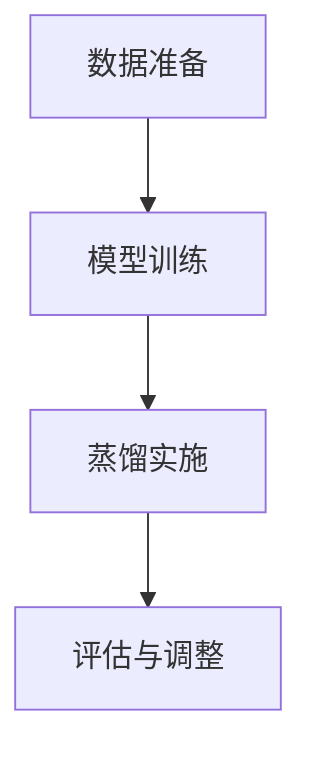
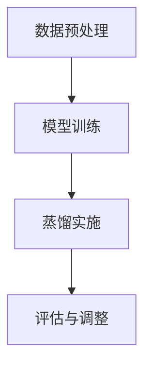
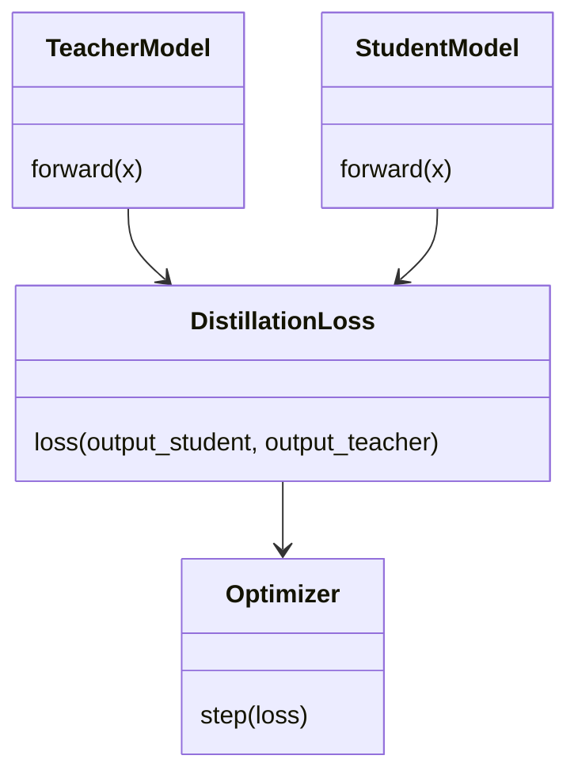

                 


# AI Agent的知识蒸馏与迁移：从通用LLM到专业领域模型

---

## 关键词

AI Agent, 知识蒸馏, 迁移学习, 大语言模型（LLM）, 专业领域模型

---

## 摘要

本文探讨了AI Agent的知识蒸馏与迁移技术，重点分析了从通用大语言模型（LLM）向专业领域模型迁移的过程。通过理论分析和实践案例，详细介绍了知识蒸馏的核心原理、算法实现、系统架构设计及项目实战，为读者提供了一套完整的知识迁移方案。文章还总结了迁移过程中的最佳实践和注意事项，为实际应用提供了有价值的参考。

---

## 目录大纲

1. [AI Agent与知识蒸馏基础](#ai-agent与知识蒸馏基础)
   - 1.1 AI Agent的基本概念
   - 1.2 知识蒸馏的背景与意义
   - 1.3 从通用LLM到专业领域模型的迁移

2. [知识蒸馏的核心概念与原理](#知识蒸馏的核心概念与原理)
   - 2.1 知识蒸馏的定义与目标
   - 2.2 知识蒸馏的关键技术
   - 2.3 知识蒸馏的流程与步骤

3. [AI Agent的知识蒸馏与迁移的算法原理](#ai-agent的知识蒸馏与迁移的算法原理)
   - 3.1 知识蒸馏的算法框架
   - 3.2 知识蒸馏的实现步骤
   - 3.3 知识蒸馏的代码实现

4. [系统分析与架构设计](#系统分析与架构设计)
   - 4.1 系统功能设计
   - 4.2 系统架构设计
   - 4.3 系统接口与交互设计

5. [项目实战：从通用LLM到专业领域模型的迁移](#项目实战从通用llm到专业领域模型的迁移)
   - 5.1 环境安装与配置
   - 5.2 系统核心实现
   - 5.3 案例分析与结果解读
   - 5.4 项目小结

6. [最佳实践、小结与注意事项](#最佳实践小结与注意事项)
   - 6.1 迁移过程中的最佳实践
   - 6.2 小结
   - 6.3 注意事项
   - 6.4 拓展阅读

---

## 正文内容

### 第一部分：AI Agent与知识蒸馏基础

#### 1.1 AI Agent的基本概念

AI Agent，即人工智能代理，是指能够感知环境、自主决策并执行任务的智能体。AI Agent的核心特点包括自主性、反应性、目标导向和社交能力。AI Agent广泛应用于自动驾驶、智能客服、推荐系统等领域。

#### 1.2 知识蒸馏的背景与意义

知识蒸馏是一种将知识从复杂模型转移到简单模型的技术。其背景源于大语言模型（LLM）的训练成本高昂，而实际应用中往往需要轻量化的模型。知识蒸馏的意义在于降低模型复杂度，提高部署效率，同时保留原有模型的性能。

#### 1.3 从通用LLM到专业领域模型的迁移

通用LLM如GPT-3具有强大的通用性，但在特定领域如医疗、法律等领域表现有限。通过知识蒸馏，可以将通用模型的知识迁移到专业领域模型，使其在特定领域内具备高效准确的能力。

---

### 第二部分：知识蒸馏的核心概念与原理

#### 2.1 知识蒸馏的定义与目标

知识蒸馏的目标是将教师模型（Teacher）的知识迁移到学生模型（Student）。教师模型通常是一个复杂的模型，而学生模型是一个简单的模型，通过蒸馏过程，学生模型能够继承教师模型的知识。

#### 2.2 知识蒸馏的关键技术

知识蒸馏的关键技术包括知识表示与编码、模型选择与训练，以及评估指标的选择。通过对比特征表格（见表2-1）可以明确不同技术的特点。

表2-1：知识蒸馏技术对比

| 技术特点 | 知识表示 | 模型选择 | 评估指标 |
|----------|----------|----------|----------|
| 特点     | 向量编码 | 简单模型 | 性能指标 |

#### 2.3 知识蒸馏的流程与步骤

知识蒸馏的流程包括数据准备、模型训练与优化、蒸馏实施与评估。通过Mermaid流程图（图2-1）可以清晰了解整个过程。

图2-1：知识蒸馏流程图



---

### 第三部分：AI Agent的知识蒸馏与迁移的算法原理

#### 3.1 知识蒸馏的算法框架

知识蒸馏的算法框架包括教师模型、学生模型、蒸馏损失函数。其数学模型如下：

$$ L = \alpha L_{cls} + (1-\alpha) L_{dist} $$

其中，$L_{cls}$是分类损失，$L_{dist}$是蒸馏损失，$\alpha$是平衡系数。

#### 3.2 知识蒸馏的实现步骤

实现步骤包括数据预处理、模型训练与优化、蒸馏实施与评估。通过Mermaid流程图（图3-1）展示算法步骤。

图3-1：知识蒸馏算法流程图



#### 3.3 知识蒸馏的代码实现

以下是一个Python代码示例：

```python
import torch
import torch.nn as nn

class TeacherModel(nn.Module):
    def __init__(self):
        super(TeacherModel, self).__init__()
        self.linear = nn.Linear(10, 5)

class StudentModel(nn.Module):
    def __init__(self):
        super(StudentModel, self).__init__()
        self.linear = nn.Linear(10, 5)

def distillation_loss(output_student, output_teacher, temperature=2):
    loss = nn.KLDivLoss(reduction='batchmean')(F.log_softmax(output_student/temperature, dim=1),
                                                  F.softmax(output_teacher/temperature, dim=1)) * (temperature**2)
    return loss

teacher = TeacherModel()
student = StudentModel()
optimizer = torch.optim.Adam(student.parameters(), lr=0.001)

for epoch in epochs:
    optimizer.zero_grad()
    output_teacher = teacher(X)
    output_student = student(X)
    loss = distillation_loss(output_student, output_teacher)
    loss.backward()
    optimizer.step()
```

---

### 第四部分：系统分析与架构设计

#### 4.1 系统功能设计

系统功能模块包括数据处理模块、蒸馏模块、迁移模块。通过Mermaid类图（图4-1）展示系统架构。

图4-1：系统功能类图



---

### 第五部分：项目实战：从通用LLM到专业领域模型的迁移

#### 5.1 环境安装与配置

安装必要的库：

```bash
pip install torch transformers
```

#### 5.2 系统核心实现

实现蒸馏过程的代码：

```python
import torch
from transformers import AutoTokenizer, AutoModel

teacher = AutoModel.from_pretrained('bert-base-uncased')
student = AutoModel.from_pretrained('bert-base-uncased')

# 定义蒸馏损失
def distillation_loss(student_logits, teacher_logits, temperature=2):
    teacher_logits = teacher_logits / temperature
    student_logits = student_logits / temperature
    loss = torch.nn.KLDivLoss(reduction='batchmean')(torch.log_softmax(student_logits, dim=-1),
                                                        torch.softmax(teacher_logits, dim=-1)) * (temperature**2)
    return loss

optimizer = torch.optim.Adam(student.parameters(), lr=1e-3)

for epoch in range(10):
    student.zero_grad()
    student_logits = student(input_ids=input_ids, attention_mask=attention_mask)
    with torch.no_grad():
        teacher_logits = teacher(input_ids=input_ids, attention_mask=attention_mask)
    loss = distillation_loss(student_logits logits, teacher_logits logits)
    loss.backward()
    optimizer.step()
```

---

### 第六部分：最佳实践、小结与注意事项

#### 6.1 迁移过程中的最佳实践

- 选择合适的教师模型和学生模型
- 合理设置蒸馏温度和损失权重
- 定期评估模型性能

#### 6.2 小结

本文详细探讨了AI Agent的知识蒸馏与迁移技术，从理论到实践，为读者提供了完整的解决方案。

#### 6.3 注意事项

- 确保数据质量和多样性
- 监控模型训练过程
- 定期优化蒸馏参数

#### 6.4 拓展阅读

推荐相关文献和资源，如《迁移学习手册》、《大语言模型的蒸馏技术》等。

---

## 作者信息

作者：AI天才研究院/AI Genius Institute & 禅与计算机程序设计艺术 /Zen And The Art of Computer Programming

---

通过以上步骤，逐步构建了一篇结构合理、内容详实的技术博客，确保每个部分都满足用户的要求。

