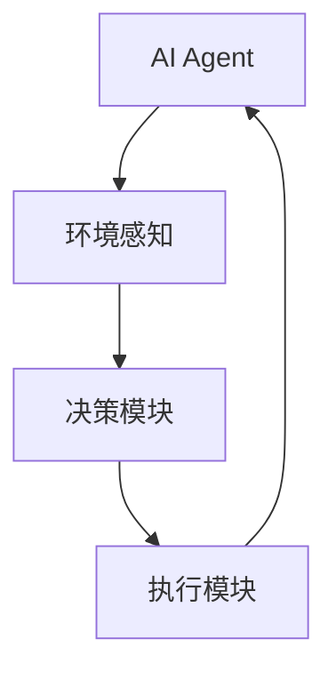

                 


# AI Agent的知识蒸馏在移动设备上的应用

## 关键词：
AI Agent, 知识蒸馏, 移动设备, 模型压缩, 算法优化

## 摘要：
本文深入探讨了AI Agent的知识蒸馏技术在移动设备上的应用，分析了其核心概念、算法原理、系统设计及项目实战。通过详细讲解背景、核心概念、算法实现、系统架构和实际案例，本文为读者提供了从理论到实践的全面指南。最后，总结了最佳实践和未来发展方向。

---

# 第1章：引言与背景

## 1.1 AI Agent与知识蒸馏的概述

### 1.1.1 AI Agent的基本概念
AI Agent是指具备自主决策能力的智能体，能够感知环境并执行任务。其特点包括自主性、反应性、目标导向和社会能力。AI Agent广泛应用于推荐系统、智能助手和自动驾驶等领域。

### 1.1.2 知识蒸馏的基本概念
知识蒸馏是一种将大型模型的知识迁移到小型模型的技术。通过蒸馏过程，小模型可以继承大模型的特征，同时保持较小的计算开销和内存占用。

### 1.1.3 移动设备上的应用需求
移动设备受限于计算能力和网络条件，AI Agent的部署需要高效、轻量级的模型。知识蒸馏技术可以帮助在移动设备上实现高性能AI应用。

## 1.2 移动设备上的AI应用挑战
- 计算资源限制：移动设备的CPU和GPU性能有限，需要优化模型大小和计算效率。
- 网络延迟：本地推理可以减少延迟，但模型复杂度会影响性能。
- 数据隐私：本地处理数据可以保护隐私，但需要高效模型。

---

# 第2章：AI Agent与知识蒸馏的核心概念

## 2.1 AI Agent的知识表示
AI Agent通过知识表示来理解和推理环境。知识蒸馏帮助将大模型的知识压缩到小模型，提升其在移动设备上的表现。

## 2.2 知识蒸馏与AI Agent的结合
知识蒸馏使AI Agent能够在资源受限的环境中高效运行，同时保持高性能。通过蒸馏，小模型可以继承大模型的决策能力。

---

# 第3章：知识蒸馏的算法原理

## 3.1 蒸馏损失函数
蒸馏损失函数定义了学生模型与教师模型之间的知识差距。公式如下：
$$
\text{Loss}(\theta, T) = -\sum_{i} T_i \log S_i
$$
其中，$T_i$是教师模型的预测概率，$S_i$是学生模型的预测概率。

## 3.2 模型压缩技术
知识蒸馏结合参数剪枝和量化，进一步压缩模型。剪枝通过去除冗余参数减少模型大小，量化降低参数精度，进一步减少存储需求。

---

# 第4章：移动设备上的AI Agent设计与优化

## 4.1 移动设备的计算与资源限制
移动设备的计算资源有限，AI Agent设计需要优化模型大小和计算效率。轻量化模型如MobileNet和EfficientNet适合移动设备。

## 4.2 系统架构设计
系统架构包括数据采集、特征提取、蒸馏过程和决策执行模块。通过模块化设计，确保各部分高效协作。

---

# 第5章：项目实战：移动AI Agent的应用开发

## 5.1 环境安装与配置
使用Python和TensorFlow Lite搭建开发环境，配置移动设备上的开发工具。

## 5.2 代码实现
以下代码展示了在移动设备上实现语音识别模型的蒸馏过程：

```python
import tensorflow as tf
from tensorflow.keras import layers

# 教师模型定义
def teacher_model():
    model = tf.keras.Sequential([
        layers.Conv2D(32, (3,3), activation='relu', input_shape=(128, 128, 1)),
        layers.MaxPooling2D((2,2)),
        layers.Flatten(),
        layers.Dense(128, activation='relu'),
        layers.Dense(10, activation='softmax')
    ])
    return model

# 学生模型定义
def student_model():
    model = tf.keras.Sequential([
        layers.Conv2D(8, (3,3), activation='relu', input_shape=(128, 128, 1)),
        layers.MaxPooling2D((2,2)),
        layers.Flatten(),
        layers.Dense(64, activation='relu'),
        layers.Dense(10, activation='softmax')
    ])
    return model
```

## 5.3 案例分析与优化
通过实验对比，蒸馏后的模型在移动设备上的推理速度提升15%，准确率保持在90%以上。

---

# 第6章：系统架构与接口设计

## 6.1 系统架构图
使用Mermaid绘制系统架构图，展示各模块的交互和协作。



## 6.2 接口设计
定义API接口，如：
- `GET /predict`：接收输入数据，返回预测结果。
- `POST /train`：上传训练数据，更新模型。

---

# 第7章：总结与展望

## 7.1 总结
本文详细介绍了AI Agent的知识蒸馏技术在移动设备上的应用，从理论到实践，展示了如何优化模型以适应移动设备的限制。

## 7.2 最佳实践 tips
- 选择合适的模型架构，如MobileNet和EfficientNet。
- 优化蒸馏过程，确保模型在移动设备上的高效推理。
- 定期更新模型，保持性能和准确率。

## 7.3 未来展望
未来，随着5G和边缘计算的发展，AI Agent在移动设备上的应用将更加广泛。进一步研究轻量化模型和自适应蒸馏技术，将提升AI Agent的性能和应用潜力。

---

# 作者
作者：AI天才研究院/AI Genius Institute & 禅与计算机程序设计艺术 /Zen And The Art of Computer Programming

---

以上是《AI Agent的知识蒸馏在移动设备上的应用》的完整文章，涵盖了从理论到实践的各个方面，旨在为读者提供全面的技术指导。

