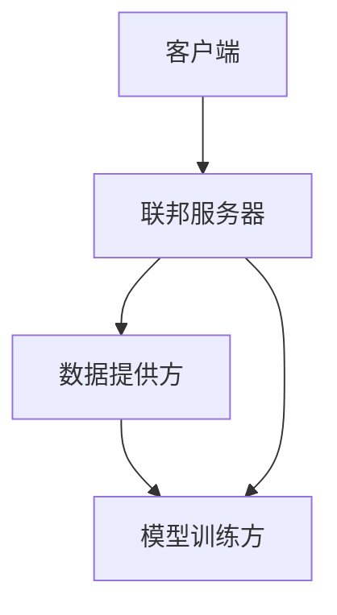

                 


# AI Agent的知识蒸馏在联邦学习中的应用

> 关键词：AI Agent，知识蒸馏，联邦学习，机器学习，分布式系统

> 摘要：本文系统地探讨了AI Agent在知识蒸馏与联邦学习中的应用。首先，文章介绍了AI Agent、知识蒸馏和联邦学习的核心概念。然后，详细分析了知识蒸馏的原理与实现，以及联邦学习的系统架构与通信机制。接着，深入探讨了AI Agent在知识蒸馏与联邦学习中的角色与协同机制。最后，通过具体案例展示了AI Agent的知识蒸馏在联邦学习中的实际应用，并总结了相关技术和实践的经验。

---

# 第一部分: AI Agent与知识蒸馏概述

## 第1章: AI Agent的基本概念

### 1.1 AI Agent的定义与分类

AI Agent（人工智能代理）是指能够感知环境、自主决策并执行任务的智能实体。根据功能和应用场景的不同，AI Agent可以分为以下几类：

1. **简单反射型Agent**：基于当前感知直接执行预定义的行为。
2. **基于模型的反射型Agent**：利用内部状态模型进行决策。
3. **目标驱动型Agent**：根据目标选择最优行动。
4. **效用驱动型Agent**：通过最大化效用函数来决策。

AI Agent的核心功能包括感知、推理、规划和执行，其特点在于能够适应动态环境并自主完成任务。

---

### 1.2 知识蒸馏的基本概念

知识蒸馏是一种将复杂模型的知识迁移到简单模型的技术，旨在在保持性能的同时减少模型的复杂性和计算成本。

- **蒸馏损失函数**：定义教师模型和学生模型之间的知识迁移损失。
  $$ L_{distill} = -\sum_{i=1}^{n} p_i \log p_i' $$
  其中，$p_i$ 是教师模型的预测概率，$p_i'$ 是学生模型的预测概率。

- **知识表示**：教师模型的预测概率分布被视为知识的载体，学生模型通过优化蒸馏损失函数学习这些概率分布。

---

### 1.3 联邦学习的基本概念

联邦学习是一种分布式机器学习方法，允许多个参与方在不共享原始数据的情况下联合训练模型。

- **核心思想**：通过安全的通信协议，在保护数据隐私的前提下，实现模型参数的联合优化。
- **应用场景**：医疗数据共享、金融风险评估、社交网络分析等。

---

## 第2章: 知识蒸馏与联邦学习的核心概念与联系

### 2.1 知识蒸馏的原理与实现

知识蒸馏的实现通常包括以下几个步骤：

1. **教师模型训练**：训练一个高性能的复杂模型（教师模型）。
2. **学生模型构建**：构建一个简单的模型（学生模型）。
3. **蒸馏过程**：通过优化蒸馏损失函数，将教师模型的知识迁移到学生模型。

---

### 2.2 联邦学习的原理与实现

联邦学习的核心在于通过多参与方的协作，实现模型的联合训练。其通信机制包括：

1. **模型参数同步**：参与方定期上传本地模型参数到中央服务器。
2. **全局模型更新**：服务器根据所有参与方的模型参数更新全局模型。
3. **模型参数分发**：服务器将更新后的全局模型参数分发给所有参与方。

---

### 2.3 AI Agent在知识蒸馏与联邦学习中的角色

- **知识蒸馏中的角色**：AI Agent可以作为学生模型的执行者，负责优化蒸馏损失函数。
- **联邦学习中的角色**：AI Agent可以作为参与方的代理，负责本地模型的训练和参数同步。

---

### 2.4 核心概念对比与联系

| 概念 | 知识蒸馏 | 联邦学习 |
|------|----------|----------|
| 核心目标 | 知识迁移 | 联合训练 |
| 参与方 | 教师模型、学生模型 | 多个数据提供方 |
| 通信机制 | 蒸馏损失函数优化 | 模型参数同步 |

---

## 第3章: 知识蒸馏的算法原理与实现

### 3.1 知识蒸馏的基本算法

知识蒸馏的实现步骤如下：

1. **训练教师模型**：使用原始数据训练一个高性能模型。
2. **初始化学生模型**：构建一个简单的模型架构。
3. **蒸馏过程**：通过优化蒸馏损失函数，将教师模型的知识迁移到学生模型。

---

### 3.2 知识蒸馏的数学模型与公式

蒸馏损失函数的数学公式为：
$$ L_{distill} = -\sum_{i=1}^{n} p_i \log p_i' $$

其中，$p_i$ 是教师模型的预测概率，$p_i'$ 是学生模型的预测概率。

---

### 3.3 知识蒸馏的实现步骤

1. **环境安装**：安装必要的库，例如TensorFlow和Keras。
2. **代码实现**：实现教师模型和学生模型的训练与蒸馏过程。
3. **案例分析**：通过具体案例验证知识蒸馏的效果。

---

## 第4章: 联邦学习的系统架构与实现

### 4.1 联邦学习的系统架构

联邦学习的系统架构如下图所示：



---

### 4.2 联邦学习的通信机制

联邦学习的通信机制包括模型参数的同步与更新，具体步骤如下：

1. **模型参数同步**：客户端上传本地模型参数到服务器。
2. **全局模型更新**：服务器根据所有客户端的模型参数更新全局模型。
3. **模型参数分发**：服务器将更新后的模型参数分发给所有客户端。

---

### 4.3 联邦学习的实现

1. **环境安装**：安装必要的库，例如TensorFlow和Keras。
2. **代码实现**：实现联邦学习的通信机制和模型训练过程。
3. **案例分析**：通过具体案例验证联邦学习的效果。

---

## 第5章: AI Agent在知识蒸馏与联邦学习中的协同机制

### 5.1 AI Agent作为知识蒸馏的执行者

AI Agent可以作为学生模型的执行者，负责优化蒸馏损失函数。

- **代码实现**：通过Python代码实现AI Agent的知识蒸馏过程。
- **案例分析**：通过具体案例验证AI Agent在知识蒸馏中的效果。

---

### 5.2 AI Agent作为联邦学习的协调者

AI Agent可以作为参与方的代理，负责本地模型的训练和参数同步。

- **代码实现**：通过Python代码实现AI Agent在联邦学习中的协调机制。
- **案例分析**：通过具体案例验证AI Agent在联邦学习中的效果。

---

## 第6章: 项目实战

### 6.1 环境安装

安装必要的库，例如TensorFlow和Keras。

```bash
pip install tensorflow keras
```

---

### 6.2 系统核心实现源代码

以下是AI Agent的知识蒸馏在联邦学习中的实现代码：

```python
import tensorflow as tf
from tensorflow import keras

# 定义教师模型
def teacher_model():
    model = keras.Sequential([
        keras.layers.Dense(128, activation='relu'),
        keras.layers.Dense(10, activation='softmax')
    ])
    return model

# 定义学生模型
def student_model():
    model = keras.Sequential([
        keras.layers.Dense(64, activation='relu'),
        keras.layers.Dense(10, activation='softmax')
    ])
    return model

# 定义蒸馏损失函数
def distillation_loss(teacher_logits, student_logits, temperature=2):
    teacher_probs = tf.nn.softmax(teacher_logits / temperature)
    student_probs = tf.nn.softmax(student_logits / temperature)
    loss = -tf.reduce_mean(tf.sum(teacher_probs * tf.math.log(student_probs), axis=-1))
    return loss

# 知识蒸馏过程
def distill(teacher_model, student_model, data, epochs=100):
    optimizer = keras.optimizers.Adam()
    for epoch in range(epochs):
        for x, y in data:
            teacher_logits = teacher_model(x)
            student_logits = student_model(x)
            loss = distillation_loss(teacher_logits, student_logits)
            optimizer.minimize(loss, student_model.trainable_weights)
        print(f"Epoch {epoch}, Loss: {loss}")
```

---

## 第7章: 总结与展望

### 7.1 总结

本文系统地探讨了AI Agent在知识蒸馏与联邦学习中的应用，详细分析了相关技术的核心概念、算法原理和系统架构。通过具体案例展示了AI Agent在知识蒸馏与联邦学习中的实际应用，并总结了相关技术和实践的经验。

---

### 7.2 展望

未来的研究方向包括：

1. **更高效的蒸馏算法**：探索更高效的蒸馏方法，进一步降低计算成本。
2. **更安全的联邦学习机制**：研究更安全的通信协议，保护数据隐私。
3. **AI Agent的协同优化**：探索AI Agent在知识蒸馏与联邦学习中的协同优化方法。

---

作者：AI天才研究院/AI Genius Institute & 禅与计算机程序设计艺术 /Zen And The Art of Computer Programming

