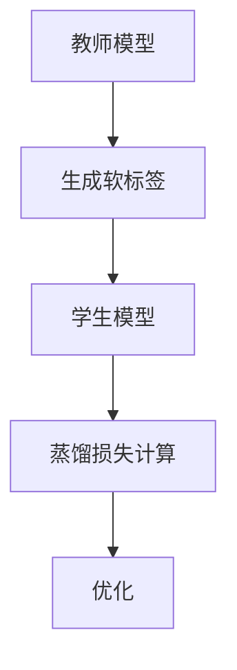
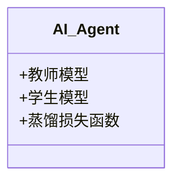
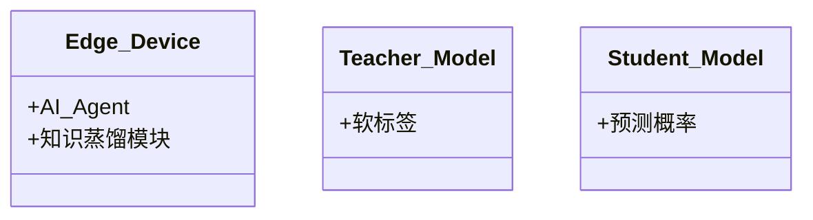

                 


# 《AI Agent的知识蒸馏在边缘AI中的优化策略》

> 关键词：AI Agent, 知识蒸馏, 边缘AI, 优化策略, 分布式计算

> 摘要：本文深入探讨了AI Agent在边缘AI中的应用，重点分析了知识蒸馏技术在优化AI Agent性能中的关键作用。通过系统性地介绍知识蒸馏的核心原理、算法实现、系统设计与优化策略，本文为边缘AI的应用场景提供了理论支持和实践指导。文章结合实际案例，详细阐述了知识蒸馏在边缘AI中的具体应用，提出了优化策略，并对未来的研究方向进行了展望。

---

## 第一部分: AI Agent与知识蒸馏概述

### 第1章: AI Agent与知识蒸馏的基本概念

#### 1.1 AI Agent的基本概念

AI Agent（智能体）是一种能够感知环境、自主决策并执行任务的智能系统。与传统AI相比，AI Agent更注重自主性和适应性，能够在动态环境中完成复杂任务。AI Agent的核心特点包括：

- **自主性**：无需外部干预，自主决策。
- **反应性**：能够实时感知环境并做出反应。
- **主动性**：主动采取行动以实现目标。

在边缘AI场景中，AI Agent常用于设备管理、数据处理、实时监控等领域。例如，在工业物联网（IIoT）中，AI Agent可以作为边缘节点的智能决策者，实时处理传感器数据并做出优化决策。

#### 1.2 知识蒸馏的基本概念

知识蒸馏是一种从教师模型（Teacher）向学生模型（Student）传递知识的技术，旨在降低模型的复杂性，同时保持性能。与传统的迁移学习不同，知识蒸馏通过软标签（soft labels）传递更细粒度的信息。

知识蒸馏的核心思想是：教师模型通过输出概率分布的形式，向学生模型传递知识，从而降低知识的“硬度”，使学生模型能够更好地泛化。

#### 1.3 边缘AI的基本概念

边缘AI是指在靠近数据源的边缘设备（如传感器、边缘服务器等）上直接进行AI计算和推理。边缘AI的优势包括低延迟、高实时性、减少数据传输成本等。然而，边缘AI也面临计算资源有限、数据隐私保护等挑战。

边缘AI的典型应用场景包括工业物联网、智能交通系统、智能安防等。

#### 1.4 本章小结

本章从AI Agent、知识蒸馏和边缘AI三个核心概念出发，详细阐述了它们的定义、特点及应用场景。AI Agent的自主性和反应性使其成为边缘AI的理想选择，而知识蒸馏则为优化AI Agent的性能提供了新的思路。

---

## 第二部分: 知识蒸馏的核心原理与算法

### 第2章: 知识蒸馏的核心原理

#### 2.1 知识蒸馏的原理与流程

知识蒸馏的基本流程包括以下步骤：

1. **教师模型训练**：首先训练一个性能强大的教师模型。
2. **软标签生成**：教师模型为训练样本生成概率分布形式的软标签。
3. **学生模型训练**：学生模型通过最小化预测概率与教师模型软标签之间的差异来学习知识。
4. **蒸馏损失计算**：定义蒸馏损失函数，衡量学生模型预测概率与教师模型软标签的差异。

知识蒸馏的关键在于软标签的设计，以及蒸馏损失函数的优化。

#### 2.2 知识蒸馏的核心算法

以下是几种常见的知识蒸馏算法对比：

| 算法名称       | 核心思想                          | 优点                          | 缺点                          |
|----------------|-----------------------------------|-------------------------------|-------------------------------|
| 直接蒸馏（KD）  | 使用教师模型的软标签              | 提高泛化能力，降低过拟合        | 对教师模型依赖性强            |
| 简单蒸馏（SKD） | 在蒸馏过程中加入KL散度            | 计算简单，适合轻量级设备        | 易受噪声影响                   |
| 聚类蒸馏（CD）  | 将教师模型的知识转化为簇            | 适合处理复杂任务              | 实现复杂                     |

**图1：知识蒸馏流程图**



#### 2.3 知识蒸馏的优化策略

1. **温度系数**：通过调整温度系数，可以控制软标签的分布宽度。温度越大，分布越宽，知识越分散；反之亦然。
2. **蒸馏损失函数**：除了传统的KL散度，还可以结合交叉熵损失进行优化。
3. **混合策略**：将知识蒸馏与传统的迁移学习方法结合，进一步提升性能。

---

## 第三部分: AI Agent的知识蒸馏实现

### 第3章: AI Agent的知识蒸馏实现原理

#### 3.1 AI Agent的知识蒸馏框架

AI Agent的知识蒸馏框架包括以下几个核心组件：

1. **教师模型**：负责生成软标签。
2. **学生模型**：负责学习教师模型的知识。
3. **蒸馏损失函数**：衡量学生模型与教师模型之间的差异。
4. **优化器**：用于优化蒸馏损失函数。

**图2：AI Agent知识蒸馏框架**



#### 3.2 AI Agent的知识蒸馏实现细节

在边缘AI场景中，AI Agent的知识蒸馏实现需要考虑以下几点：

1. **计算资源**：边缘设备通常计算资源有限，因此需要设计轻量级的学生模型。
2. **数据隐私**：知识蒸馏通常需要教师模型的软标签，如何在保证数据隐私的前提下完成知识传递，是一个重要挑战。
3. **实时性**：边缘AI要求实时决策，因此需要设计高效的蒸馏算法。

#### 3.3 知识蒸馏在AI Agent中的效果评估

评估知识蒸馏的效果，需要从以下几个方面进行考量：

1. **性能提升**：蒸馏后AI Agent的准确率、响应时间等指标是否得到显著提升。
2. **资源消耗**：蒸馏过程对计算资源、存储资源的占用情况。
3. **鲁棒性**：AI Agent在面对噪声、干扰等复杂环境时的适应能力。

---

## 第四部分: 边缘AI中的知识蒸

---

### 第4章: 边缘AI中的知识蒸馏优化策略

#### 4.1 边缘AI的知识蒸馏优化框架

在边缘AI场景中，知识蒸馏的优化需要考虑以下因素：

1. **分布式计算**：边缘设备之间的知识蒸馏需要通过分布式计算实现。
2. **通信效率**：减少教师模型与学生模型之间的通信开销。
3. **隐私保护**：确保知识蒸馏过程中数据的安全性。

**图3：边缘AI中的知识蒸馏优化框架**



#### 4.2 分布式知识蒸馏的实现

在分布式环境下，知识蒸馏的具体实现步骤如下：

1. **教师模型生成软标签**：教师模型在中心服务器上生成软标签。
2. **软标签分发**：软标签通过网络分发到各个边缘设备。
3. **学生模型训练**：每个边缘设备上的学生模型根据接收到的软标签进行训练。
4. **模型更新与同步**：定期将学生模型的更新结果同步回中心服务器，更新教师模型。

#### 4.3 边缘AI中的知识蒸馏优化策略

1. **动态蒸馏**：根据边缘设备的负载情况动态调整蒸馏过程。
2. **模型压缩**：通过模型压缩技术进一步降低学生模型的复杂度。
3. **多目标优化**：在蒸馏过程中同时优化多个目标（如准确率、延迟等）。

---

## 第五部分: 项目实战与优化

### 第5章: 项目实战

#### 5.1 项目背景与目标

本项目旨在通过知识蒸馏技术优化边缘AI中的AI Agent性能，具体目标包括：

1. 提高AI Agent的准确率。
2. 降低计算资源消耗。
3. 提升实时性。

#### 5.2 项目实现

1. **环境搭建**：
   - 安装Python、TensorFlow、Keras等开发工具。
   - 配置边缘设备的网络环境。

2. **核心代码实现**：
   ```python
   import tensorflow as tf
   from tensorflow import keras
   import numpy as np

   # 定义教师模型
   def teacher_model():
       model = keras.Sequential([
           keras.layers.Dense(128, activation='relu'),
           keras.layers.Dense(10, activation='softmax')
       ])
       return model

   # 定义学生模型
   def student_model():
       model = keras.Sequential([
           keras.layers.Dense(64, activation='relu'),
           keras.layers.Dense(10, activation='softmax')
       ])
       return model

   # 知识蒸馏函数
   def distillation_loss(y_true, y_pred, teacher logits, temperature):
       soft_labels = tf.nn.softmax(teacher logits / temperature)
       kl_div = tf.keras.losses.KLDivergence()
       loss = kl_div(soft_labels, y_pred)
       return loss

   # 训练过程
   def train():
       teacher = teacher_model()
       student = student_model()
       optimizer = tf.keras.optimizers.Adam()
       # 训练循环
       for epoch in range(num_epochs):
           x_train, y_train = get_data()
           with tf.GradientTape() as tape:
               t logits = teacher(x_train)
               s logits = student(x_train)
               loss = distillation_loss(y_train, s logits, t logits, temperature)
           gradients = tape.gradient(loss, student.trainable_weights)
           optimizer.apply_gradients(gradients, student trainable_weights)
   ```

3. **代码解读**：
   - 教师模型和学生模型分别定义了不同的网络结构。
   - 知识蒸馏损失函数通过计算学生预测概率与教师软标签之间的KL散度来衡量差异。
   - 训练过程中，学生模型通过优化蒸馏损失函数不断学习教师模型的知识。

#### 5.3 实际案例分析

以边缘AI中的设备管理场景为例，假设需要优化AI Agent的设备故障预测能力。通过知识蒸馏技术，教师模型可以将丰富的历史数据经验传递给学生模型，从而提高预测准确率，同时降低计算资源消耗。

#### 5.4 项目优化

1. **模型压缩**：通过剪枝、量化等技术进一步降低学生模型的复杂度。
2. **动态调整**：根据实时负载动态调整蒸馏过程的参数，如温度系数。
3. **多目标优化**：在蒸馏过程中同时优化准确率和响应时间。

---

## 第六部分: 总结与展望

### 第6章: 总结

本文详细探讨了AI Agent在边缘AI中的应用，重点分析了知识蒸馏技术在优化AI Agent性能中的关键作用。通过系统性地介绍知识蒸馏的核心原理、算法实现、系统设计与优化策略，本文为边缘AI的应用场景提供了理论支持和实践指导。

### 第7章: 未来展望

未来的研究方向可能包括：

1. **更高效的蒸馏算法**：探索新的蒸馏方法，进一步降低计算成本。
2. **多模态知识蒸馏**：将知识蒸馏扩展到多模态数据，提升AI Agent的综合能力。
3. **隐私保护**：研究如何在知识蒸馏过程中更好地保护数据隐私。

---

## 作者信息

作者：AI天才研究院/AI Genius Institute & 禅与计算机程序设计艺术 /Zen And The Art of Computer Programming

---

以上是《AI Agent的知识蒸馏在边缘AI中的优化策略》的完整目录大纲和文章内容。希望对您有所帮助！

