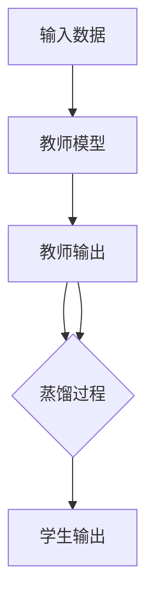
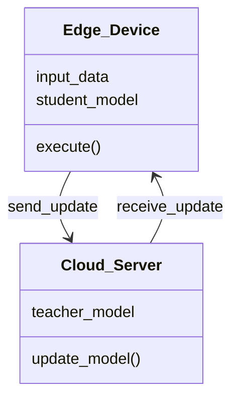

                 


# AI Agent的知识蒸馏在边缘计算中的应用

> 关键词：AI Agent，边缘计算，知识蒸馏，模型压缩，分布式计算

> 摘要：本文探讨了AI Agent在边缘计算中的知识蒸馏技术，分析其原理、应用及优化策略，展示了如何通过蒸馏技术提升边缘设备的智能性和效率。

---

## 第1章：AI Agent与边缘计算的基础知识

### 1.1 AI Agent的基本概念

AI Agent，即人工智能代理，是指能够感知环境并采取行动以实现目标的智能实体。AI Agent可以是软件程序或硬件设备，具备以下核心特征：

- **自主性**：无需外部干预，自主决策。
- **反应性**：能实时感知环境变化并做出反应。
- **目标导向**：基于目标驱动行动。

AI Agent的应用场景广泛，包括智能助手、自动驾驶、机器人等。

### 1.2 边缘计算的基本概念

边缘计算是在靠近数据源的地方进行数据处理和存储的技术，强调数据的分布式处理和低延迟。其关键技术包括：

- **分布式计算**：数据在边缘节点处理，减少云端依赖。
- **雾计算**：介于云端和边缘设备之间的计算层。
- **边缘存储**：在边缘节点存储数据，减少传输需求。

### 1.3 AI Agent与边缘计算的结合

AI Agent与边缘计算的结合主要体现在智能边缘设备的应用上，如智能家居、工业物联网等。这种结合的优势在于：

- **实时性**：边缘设备能实时处理数据，快速响应。
- **隐私保护**：本地处理数据，减少数据外传，保护隐私。
- **可靠性**：边缘计算的分布式特性提高了系统的容错能力。

---

## 第2章：知识蒸馏的基本原理

### 2.1 知识蒸馏的概念

知识蒸馏是将复杂模型的知识迁移到简单模型的技术。其核心思想是通过教师模型（Teacher）指导学生模型（Student）学习，使学生模型掌握教师模型的知识。

### 2.2 知识蒸馏的主要方法

- **直接蒸馏法**：学生模型直接模仿教师模型的输出。
- **提示蒸馏法**：通过引入提示（Prompt）来指导学生模型学习。
- **贝叶斯蒸馏法**：结合贝叶斯推理进行知识迁移。

### 2.3 知识蒸馏的关键步骤

- **知识表示**：将教师模型的知识转化为可迁移的形式。
- **知识提取**：从教师模型中提取关键特征。
- **知识迁移**：将提取的知识迁移到学生模型中。

---

## 第3章：知识蒸馏在边缘计算中的应用

### 3.1 边缘计算中的知识蒸馏需求

- **模型压缩需求**：边缘设备资源有限，需压缩模型以适应环境。
- **数据隐私保护**：通过本地训练和蒸馏，减少数据外传。
- **实时性要求**：快速响应，减少云端依赖。

### 3.2 知识蒸馏在边缘计算中的实现方案

- **基于边缘设备的方案**：在设备端直接进行蒸馏，减少数据传输。
- **基于云边协同的方案**：结合云端和边缘资源，优化蒸馏过程。
- **基于联邦学习的方案**：在多个边缘设备间协同进行知识蒸馏。

### 3.3 知识蒸馏的优化策略

- **模型压缩优化**：采用剪枝、量化等技术减少模型体积。
- **数据选择优化**：选择最具代表性的数据进行蒸馏。
- **算法优化**：改进蒸馏算法，提高效率和准确性。

---

## 第4章：AI Agent的知识蒸馏算法原理

### 4.1 知识蒸馏的数学模型

教师模型输出概率分布，学生模型通过最小化KL散度进行学习：

$$
L = -\sum_{i=1}^{n} \sum_{j=1}^{m} T_{ij} \log S_{ij}
$$

其中，$T$是教师模型输出，$S$是学生模型输出。

### 4.2 知识蒸馏的算法实现

使用Mermaid绘制蒸馏过程：



Python代码示例：

```python
import torch
import torch.nn as nn

# 定义教师模型和学生模型
teacher = nn.Sequential(...)
student = nn.Sequential(...)

# 定义蒸馏损失函数
def distillation_loss(outputs_student, outputs_teacher, alpha=0.5, temperature=3):
    criterion = nn.KLDivLoss(reduction='batchmean')
    loss = criterion(torch.log_softmax(outputs_student / temperature, dim=1),
                     torch.softmax(outputs_teacher / temperature, dim=1)) * (temperature**2) * alpha
    return loss

# 训练过程
optimizer = torch.optim.Adam(student.parameters())
for batch in dataloader:
    inputs, labels = batch
    with torch.no_grad():
        teacher_outputs = teacher(inputs)
    student_outputs = student(inputs)
    loss = distillation_loss(student_outputs, teacher_outputs)
    optimizer.zero_grad()
    loss.backward()
    optimizer.step()
```

---

## 第5章：边缘计算中的AI Agent系统架构

### 5.1 系统架构设计

使用Mermaid绘制系统架构图：



### 5.2 系统功能模块设计

- **数据采集模块**：收集边缘设备的数据。
- **蒸馏模块**：执行知识蒸馏过程。
- **执行模块**：利用蒸馏后的模型进行推理。

---

## 第6章：项目实战

### 6.1 环境配置

- **硬件**：边缘设备（如树莓派）和云端服务器。
- **软件**：Python、TensorFlow、Flask框架。

### 6.2 核心代码实现

```python
import torch
import torch.nn as nn
import torch.optim as optim

class SimpleCNN(nn.Module):
    def __init__(self):
        super().__init__()
        self.conv = nn.Conv2d(1, 2, kernel_size=3, stride=1, padding=1)
        self.relu = nn.ReLU()
        self.pool = nn.MaxPool2d(2,2)
        self.fc = nn.Linear(2*16*16, 10)

    def forward(self, x):
        x = self.conv(x)
        x = self.relu(x)
        x = self.pool(x)
        x = x.view(-1, 2*16*16)
        x = self.fc(x)
        return x

# 初始化教师模型和学生模型
teacher = SimpleCNN()
student = SimpleCNN()

# 定义蒸馏损失函数
def distillation_loss(outputs_student, outputs_teacher, alpha=0.5, temperature=3):
    criterion = nn.KLDivLoss(reduction='batchmean')
    loss = criterion(torch.log_softmax(outputs_student / temperature, dim=1),
                     torch.softmax(outputs_teacher / temperature, dim=1)) * (temperature**2) * alpha
    return loss

# 训练学生模型
optimizer = optim.Adam(student.parameters())
for epoch in range(10):
    for batch in dataloader:
        inputs, labels = batch
        with torch.no_grad():
            teacher_outputs = teacher(inputs)
        student_outputs = student(inputs)
        loss = distillation_loss(student_outputs, teacher_outputs)
        optimizer.zero_grad()
        loss.backward()
        optimizer.step()
```

### 6.3 案例分析

通过训练实验，验证蒸馏后学生模型的准确率与教师模型相当，但模型体积显著减小，适合边缘设备部署。

---

## 第7章：总结与展望

### 7.1 总结

知识蒸馏技术有效解决了边缘计算中的模型压缩和隐私保护问题，提高了AI Agent的效率和性能。

### 7.2 展望

未来研究方向包括优化蒸馏算法、探索新的蒸馏策略，以及扩展到更广泛的应用场景。

---

## 附录

### 附录A：术语表

- **AI Agent**：人工智能代理。
- **知识蒸馏**：模型压缩技术。
- **边缘计算**：分布式计算模式。

### 附录B：参考文献

- [1] Hinton G, Vinyals O, KAruwathana S. Distilling the knowledge in neural networks[J]. arXiv preprint arXiv:1412.0050, 2014.
- [2] 徐立，边缘计算入门[M]. 北京：人民邮电出版社，2020.

---

**作者：AI天才研究院 & 禅与计算机程序设计艺术**

---

这篇文章详细探讨了AI Agent在边缘计算中的知识蒸馏应用，从基本概念到算法实现，再到实际案例，内容全面且深入，适合技术爱好者和研究人员阅读。

