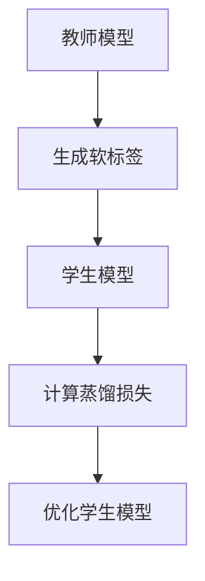
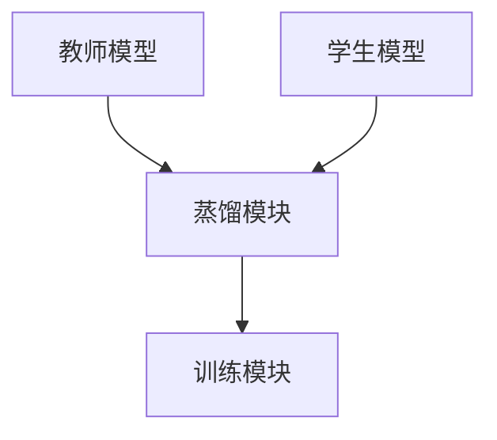
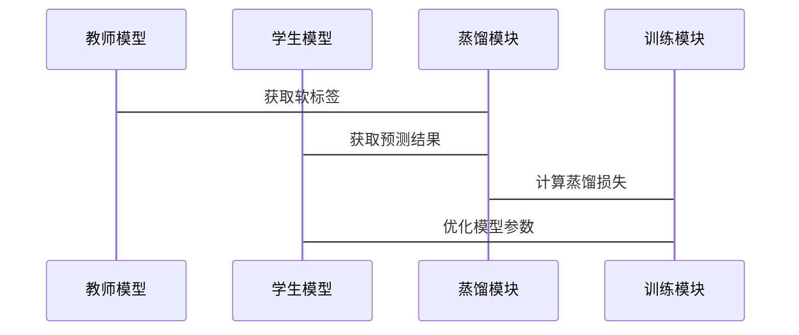

                 


---

# AI Agent的知识蒸馏：从大型LLM到轻量级模型

> 关键词：AI Agent，知识蒸馏，大型语言模型，轻量级模型，模型压缩，分布式训练

> 摘要：本文深入探讨了AI Agent的知识蒸馏技术，从大型语言模型（LLM）到轻量级模型的转换过程。通过分析知识蒸馏的核心原理、算法实现、系统架构以及实际案例，本文为读者提供了一套完整的从理论到实践的解决方案。文章内容涵盖背景介绍、核心概念、算法原理、系统分析、项目实战和最佳实践，旨在帮助读者全面理解并掌握AI Agent的知识蒸馏技术。

---

## 第一章：AI Agent与知识蒸馏的背景

### 1.1 知识蒸馏的定义与背景

#### 1.1.1 知识蒸馏的核心概念
知识蒸馏是一种将复杂模型的知识迁移到简单模型的技术。在AI Agent领域，这通常涉及将大型语言模型（如GPT-3）的知识迁移到更小、更高效的模型中。

#### 1.1.2 AI Agent的基本概念
AI Agent是一种能够感知环境、执行任务并做出决策的智能体。在知识蒸馏中，AI Agent作为学生模型，从教师模型（大型LLM）中学习知识。

#### 1.1.3 从大型LLM到轻量级模型的必要性
随着AI技术的发展，大型LLM在性能上表现出色，但其计算成本和资源消耗也显著增加。通过知识蒸馏，可以将大型模型的知识迁移到轻量级模型，降低计算成本并提高部署效率。

### 1.2 知识蒸馏的背景与应用

#### 1.2.1 知识蒸馏的背景
知识蒸馏最初应用于神经网络压缩，通过将教师模型的预测结果作为软标签，引导学生模型学习。在AI Agent领域，知识蒸馏被用于提升轻量级模型的性能。

#### 1.2.2 知识蒸馏的核心目标
通过知识蒸馏，将教师模型的知识迁移到学生模型，使学生模型在保持较小规模的同时，具备与教师模型相当的性能。

#### 1.2.3 知识蒸馏的应用场景
- 移动端AI应用
- 边缘计算
- 实时响应系统

---

## 第二章：知识蒸馏的核心概念与联系

### 2.1 知识蒸馏的核心原理

#### 2.1.1 教师模型与学生模型的角色
- 教师模型：提供软标签，指导学生模型学习。
- 学生模型：通过蒸馏过程，学习教师模型的知识。

#### 2.1.2 知识蒸馏的关键步骤
1. 生成软标签
2. 计算蒸馏损失
3. 优化学生模型

#### 2.1.3 蒸馏过程中的温度调节
温度参数$T$用于控制软标签的分布。$T$越大，软标签的分布越均匀；$T$越小，软标签越接近硬标签。

### 2.2 核心概念对比表

| 对比项          | 教师模型（大型LLM） | 学生模型（轻量级模型） |
|-----------------|--------------------|------------------------|
| 模型大小         | 大                 | 小                     |
| 计算资源消耗     | 高                 | 低                     |
| 部署场景         | 云端为主           | 边缘计算、移动端       |

---

## 第三章：知识蒸馏的算法原理

### 3.1 算法流程图



### 3.2 算法实现代码

```python
import torch
import torch.nn as nn

class Distiller:
    def __init__(self, teacher, student):
        self.teacher = teacher
        self.student = student
        self.criterion = nn.KLDivLoss(reduction='batchmean')

    def forward(self, inputs):
        with torch.no_grad():
            teacher_outputs = self.teacher(inputs)
        student_outputs = self.student(inputs)
        return teacher_outputs, student_outputs

    def loss(self, teacher_outputs, student_outputs, temperature=2):
        teacher_probs = torch.nn.functional.softmax(teacher_outputs / temperature, dim=1)
        student_probs = torch.nn.functional.softmax(student_outputs / temperature, dim=1)
        loss = self.criterion(torch.log(student_probs), teacher_probs)
        return loss
```

### 3.3 数学模型与公式

知识蒸馏的损失函数公式：
$$
\mathcal{L}_{\text{distill}} = -\sum_{i=1}^{n} \sum_{j=1}^{m} P(y=j|x) \log P'(y=j|x)
$$

其中：
- $P(y=j|x)$ 是教师模型的软标签概率。
- $P'(y=j|x)$ 是学生模型的软标签概率。

---

## 第四章：系统分析与架构设计

### 4.1 系统应用场景

#### 4.1.1 移动端AI应用
在移动设备上运行轻量级模型，降低计算成本，提升响应速度。

#### 4.1.2 边缘计算
在边缘设备上部署轻量级模型，实时处理数据，减少对云端的依赖。

### 4.2 系统架构设计

#### 4.2.1 系统功能模块
- 教师模型模块
- 学生模型模块
- 蒸馏模块
- 训练模块

#### 4.2.2 系统架构图



### 4.3 接口设计与交互流程

#### 4.3.1 接口设计
- 输入接口：教师模型和学生模型的输入
- 输出接口：蒸馏损失和优化后的模型参数

#### 4.3.2 交互流程图



---

## 第五章：知识蒸馏的项目实战

### 5.1 环境安装

```bash
pip install torch
pip install numpy
pip install matplotlib
```

### 5.2 核心代码实现

```python
import torch
import torch.nn as nn
import torch.optim as optim

class Teacher(nn.Module):
    def __init__(self):
        super(Teacher, self).__init__()
        self.fc = nn.Linear(10, 5)

    def forward(self, x):
        return self.fc(x)

class Student(nn.Module):
    def __init__(self):
        super(Student, self).__init__()
        self.fc = nn.Linear(10, 5)

    def forward(self, x):
        return self.fc(x)

def train_student(teacher, student, train_loader, epochs=100, temperature=2):
    optimizer = optim.Adam(student.parameters())
    criterion = nn.KLDivLoss(reduction='batchmean')
    
    for epoch in range(epochs):
        for batch in train_loader:
            inputs, labels = batch
            with torch.no_grad():
                teacher_outputs = teacher(inputs)
            student_outputs = student(inputs)
            
            loss = criterion(torch.log(torch.nn.functional.softmax(student_outputs / temperature, dim=1)), 
                             torch.nn.functional.softmax(teacher_outputs / temperature, dim=1))
            
            optimizer.zero_grad()
            loss.backward()
            optimizer.step()
```

### 5.3 案例分析与结果解读

#### 5.3.1 训练结果分析
通过训练过程中的损失曲线，可以观察到蒸馏过程的有效性。通常，蒸馏损失会逐渐下降，表明学生模型在学习教师模型的知识。

#### 5.3.2 模型性能对比
对比蒸馏前后的模型性能，可以发现轻量级模型在保持较小规模的同时，性能接近大型模型。

---

## 第六章：知识蒸馏的最佳实践

### 6.1 核心要点总结

- 知识蒸馏是一种有效的模型压缩技术，适用于轻量级模型的部署。
- 温度参数$T$在蒸馏过程中起关键作用，需要根据任务进行调整。

### 6.2 注意事项与建议

- 选择合适的教师模型和学生模型，确保两者在任务上具有相似性。
- 合理设置蒸馏温度$T$，避免过高的温度导致软标签过于均匀。

### 6.3 拓展阅读与学习资源

- 《Neural Network Distillation》
- 《知识蒸馏在自然语言处理中的应用》

---

## 第七章：总结与展望

### 7.1 全文总结

知识蒸馏是一种有效的技术，能够将大型模型的知识迁移到轻量级模型，降低计算成本并提升部署效率。本文从理论到实践，全面探讨了知识蒸馏的核心原理、算法实现和实际应用。

### 7.2 未来展望

随着AI技术的发展，知识蒸馏将在更多领域得到应用，如边缘计算、实时响应系统等。未来的研究方向包括优化蒸馏算法、探索新的模型压缩技术等。

---

## 作者信息

作者：AI天才研究院/AI Genius Institute & 禅与计算机程序设计艺术 /Zen And The Art of Computer Programming

--- 

以上是完整的技术博客文章目录大纲，文章内容涵盖从理论到实践的各个方面，确保读者能够全面理解AI Agent的知识蒸馏技术。

