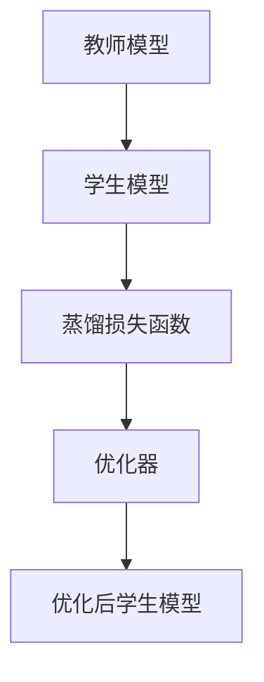

                 


# AI Agent的知识蒸馏：从大型LLM到边缘设备模型

> 关键词：知识蒸馏、AI Agent、大语言模型、边缘设备、模型压缩、轻量化、迁移学习

> 摘要：随着AI技术的快速发展，大型语言模型（LLM）在各个领域的应用越来越广泛。然而，由于边缘设备的计算能力和资源限制，将大型模型直接部署到边缘设备上存在诸多挑战。本文将详细探讨如何通过知识蒸馏技术，将大型LLM的知识迁移到边缘设备模型中，实现模型轻量化和性能优化。文章从知识蒸馏的基本概念出发，深入分析其核心原理、算法实现、系统设计及实际应用案例，最后总结其优势与挑战，并提出未来的研究方向。

---

# 第1章: 知识蒸馏的基本概念

## 1.1 问题背景与描述

### 1.1.1 大型语言模型的局限性
大型语言模型（如GPT系列）在自然语言处理任务中表现出色，但其计算需求和存储需求巨大，难以直接部署到资源受限的边缘设备上。

### 1.1.2 边缘设备的计算能力限制
边缘设备（如手机、物联网设备）通常具备有限的计算资源（CPU、GPU）和存储空间，无法直接运行大型模型。

### 1.1.3 知识蒸馏的必要性与目标
为了将大型模型的知识迁移到边缘设备，知识蒸馏成为一种有效的解决方案。其目标是通过压缩和优化，使边缘设备上的模型能够继承大型模型的核心能力，同时保持较低的计算和存储需求。

## 1.2 AI大模型与边缘设备的对比分析

### 1.2.1 大型语言模型的特点
- 参数量巨大（如GPT-3有1750亿参数）。
- 需要强大的计算资源和存储空间。
- 适用于云端部署，难以直接迁移到边缘设备。

### 1.2.2 边缘设备的计算能力与资源限制
- 通常采用低功耗处理器（如ARM架构）。
- 存储和内存资源有限。
- 对实时性要求高，需本地推理。

### 1.2.3 两者之间的差距与互补性
- 大型模型提供强大的知识库和推理能力。
- 边缘设备负责实时数据处理和快速响应。
- 知识蒸馏通过桥接两者的差距，实现知识的有效迁移。

## 1.3 知识蒸馏的核心概念与目标

### 1.3.1 知识蒸馏的定义
知识蒸馏是一种将大型模型的知识迁移到小模型的技术，通过教师模型（大型模型）指导学生模型（小模型）进行学习，使学生模型继承教师模型的核心能力。

### 1.3.2 知识蒸馏的主要目标
- 模型压缩：减少模型参数量，降低计算和存储需求。
- 性能优化：在边缘设备上实现接近大型模型的推理能力。
- 知识迁移：将大型模型的知识有效传递给小模型。

### 1.3.3 知识蒸馏的关键问题与挑战
- 如何选择合适的蒸馏策略。
- 如何平衡模型压缩与性能损失。
- 如何在边缘设备上实现高效的蒸馏过程。

---

# 第2章: 知识蒸馏的核心原理

## 2.1 知识蒸馏的基本原理

### 2.1.1 知识蒸馏的定义与核心思想
知识蒸馏的核心思想是通过教师模型的输出（软标签）或决策（硬标签）来指导学生模型学习，使学生模型能够逼近教师模型的性能。

### 2.1.2 知识蒸馏的关键步骤
1. **教师模型训练**：先训练一个高性能的大型模型（教师模型）。
2. **学生模型初始化**：初始化一个小型模型（学生模型）。
3. **蒸馏过程**：通过蒸馏损失函数，优化学生模型，使其输出与教师模型的输出尽可能一致。

### 2.1.3 知识蒸馏的数学模型
蒸馏的目标是最小化学生模型输出与教师模型输出之间的差异。常用的蒸馏损失函数为KL散度：
$$ L_{distill} = D_{KL}(P_{teacher}||P_{student}) $$

其中，$P_{teacher}$ 和 $P_{student}$ 分别是教师模型和学生模型的输出概率分布。

---

## 2.2 知识蒸馏的主要方法

### 2.2.1 软蒸馏（Soft Distillation）
- **特点**：使用教师模型的软标签（概率分布）作为监督信号。
- **流程**：
  1. 教师模型输出概率分布。
  2. 学生模型输出概率分布。
  3. 计算KL散度作为损失函数。
  4. 优化学生模型参数。

### 2.2.2 硬蒸馏（Hard Distillation）
- **特点**：使用教师模型的硬标签（类别标签）作为监督信号。
- **流程**：
  1. 教师模型输出类别标签。
  2. 学生模型预测类别标签。
  3. 使用交叉熵损失函数优化学生模型。

### 2.2.3 混合蒸馏（Hybrid Distillation）
- **特点**：结合软标签和硬标签进行监督。
- **流程**：
  1. 教师模型输出概率分布和类别标签。
  2. 学生模型同时优化概率分布和类别标签。
  3. 使用加权损失函数进行优化。

---

## 2.3 知识蒸馏的优缺点分析

### 2.3.1 优点：模型轻量化、推理速度快
- 学生模型参数少，推理速度快。
- 适用于边缘设备的实时任务。

### 2.3.2 缺点：性能损失、知识损失
- 学生模型的性能可能略逊于教师模型。
- 部分知识可能无法完全迁移。

### 2.3.3 适用场景与权衡
- 适用于边缘设备的实时推理任务。
- 在性能与资源之间需要权衡。

---

## 2.4 本章小结

知识蒸馏通过教师模型指导学生模型学习，实现了大型模型知识向小模型的迁移。其核心在于通过蒸馏损失函数优化学生模型，使其输出与教师模型尽可能一致。软蒸馏、硬蒸馏和混合蒸馏是三种主要方法，各有优缺点，适用于不同的场景。

---

# 第3章: 知识蒸馏的数学模型与公式

## 3.1 知识蒸馏的数学模型

### 3.1.1 教师模型与学生模型的关系
- 教师模型：$f_{teacher}(x) = P_{teacher}(x)$
- 学生模型：$f_{student}(x) = P_{student}(x)$

### 3.1.2 知识蒸馏的目标函数
$$ L_{total} = L_{student} + \alpha L_{distill} $$
其中，$L_{student}$是学生模型的原始任务损失，$L_{distill}$是蒸馏损失，$\alpha$是蒸馏损失的权重系数。

---

## 3.2 知识蒸馏的核心公式

### 3.2.1 KL散度公式
$$ D_{KL}(P||Q) = \sum_{i} P(i) \ln \frac{P(i)}{Q(i)} $$

### 3.2.2 蒸馏损失函数
$$ L_{distill} = D_{KL}(P_{teacher}||P_{student}) $$

### 3.2.3 总损失函数
$$ L_{total} = L_{student} + \alpha L_{distill} $$

---

## 3.3 知识蒸馏的优化策略

### 3.3.1 温度缩放
- **定义**：通过调整温度参数$\tau$，使教师模型的输出概率分布更平滑，从而降低蒸馏难度。
- **公式**：
  $$ P_{teacher}(i) = \frac{P_{teacher}(i)^{\tau}}{\sum_j P_{teacher}(j)^{\tau}} $$

### 3.3.2 对抗训练
- **定义**：通过引入对抗训练，增强学生模型的鲁棒性。
- **流程**：
  1. 教师模型输出概率分布。
  2. 学生模型预测概率分布。
  3. 对抗网络生成噪声，干扰学生模型。
  4. 优化学生模型以抵抗噪声。

### 3.3.3 知识蒸馏与迁移学习的结合
- **定义**：结合迁移学习的思想，将蒸馏技术应用于跨任务的知识迁移。

---

## 3.4 本章小结

知识蒸馏的数学模型以KL散度为核心，通过优化学生模型的输出分布，使其逼近教师模型的输出。温度缩放、对抗训练和迁移学习的结合，进一步优化了蒸馏的效果。

---

# 第4章: 知识蒸馏的系统架构与设计

## 4.1 系统架构概述

### 4.1.1 教师模型与学生模型的交互
- 教师模型负责知识生成。
- 学生模型负责知识学习和推理。

### 4.1.2 知识蒸馏的流程
1. **教师模型训练**：训练高性能教师模型。
2. **学生模型初始化**：初始化小型学生模型。
3. **蒸馏过程**：优化学生模型，使其输出与教师模型一致。
4. **部署推理**：将优化后的学生模型部署到边缘设备。

### 4.1.3 系统的模块划分
- **教师模型模块**：负责知识生成。
- **学生模型模块**：负责知识学习和推理。
- **蒸馏模块**：负责优化学生模型。

---

## 4.2 系统功能设计

### 4.2.1 数据预处理模块
- 数据清洗：处理 noisy 数据。
- 数据增强：增强数据多样性。

### 4.2.2 知识蒸馏模块
- 蒸馏策略选择：选择软蒸馏、硬蒸馏或混合蒸馏。
- 损失函数设计：设计蒸馏损失函数。
- 优化算法选择：选择合适的优化算法（如Adam、SGD）。

### 4.2.3 模型优化模块
- 参数优化：优化学生模型参数。
- 模型压缩：进一步压缩模型大小。

---

## 4.3 系统架构图



---

## 4.4 本章小结

知识蒸馏系统的架构设计包括教师模型、学生模型和蒸馏模块。通过模块化设计，确保知识蒸馏过程高效、有序地进行。

---

# 第5章: 知识蒸馏的项目实战

## 5.1 环境安装与配置

### 5.1.1 环境需求
- Python 3.8+
- PyTorch 1.9+
- Transformers库 4.16+

### 5.1.2 安装依赖
```bash
pip install torch transformers
```

---

## 5.2 核心代码实现

### 5.2.1 教师模型定义
```python
class TeacherModel(nn.Module):
    def __init__(self, vocab_size):
        super().__init__()
        self.embedding = nn.Embedding(vocab_size, 512)
        self.lstm = nn.LSTM(512, 512, 2)
        self.dropout = nn.Dropout(0.5)
        self.fc = nn.Linear(512, vocab_size)
```

### 5.2.2 学生模型定义
```python
class StudentModel(nn.Module):
    def __init__(self, vocab_size):
        super().__init__()
        self.embedding = nn.Embedding(v

