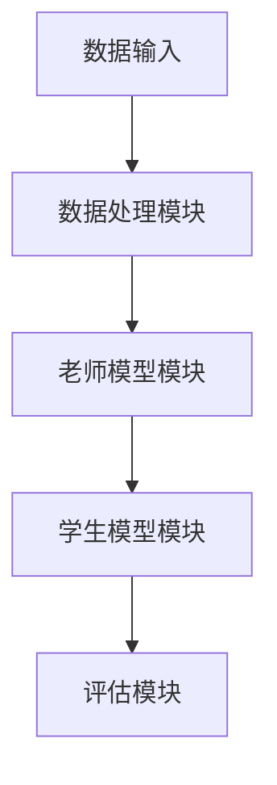
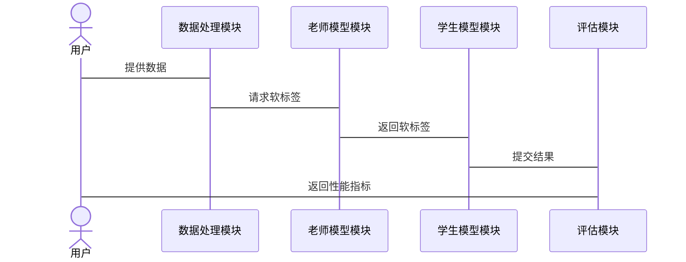

                 


# AI Agent的知识蒸馏：从大模型到轻量级模型

## 关键词：AI Agent, 知识蒸馏, 模型压缩, 大模型, 轻量级模型

## 摘要：本文详细探讨了AI Agent中的知识蒸馏技术，从大模型到轻量级模型的转换过程。通过分析知识蒸馏的核心原理、算法实现、系统架构设计以及实际项目案例，展示了如何高效地将大模型的知识迁移到轻量级模型中，以满足不同应用场景的需求。

---

# 第1章: 知识蒸馏与AI Agent概述

## 1.1 知识蒸馏的基本概念

### 1.1.1 知识蒸馏的定义
知识蒸馏是一种将大模型（老师模型）的知识迁移到小模型（学生模型）的技术。通过模仿学习，学生模型可以继承老师模型的决策能力，同时保持较小的模型规模和计算成本。

### 1.1.2 知识蒸馏的核心目标
知识蒸馏的目标是通过蒸馏过程，使学生模型在性能上接近甚至超越老师模型，同时显著降低模型的计算复杂度和存储需求。

### 1.1.3 知识蒸馏与模型压缩的区别
| 技术 | 定义 | 方法 | 输出 |
|------|------|------|------|
| 知识蒸馏 | 将大模型的知识迁移到小模型 | 通过概率分布的对齐进行学习 | 输出与老师模型相似的概率分布 |
| 模型压缩 | 减少模型参数数量 | 通过剪枝、量化等技术 | 输出一个更小的模型，但不保证概率分布的对齐 |

---

## 1.2 AI Agent的发展现状

### 1.2.1 AI Agent的定义与特点
AI Agent是一种智能体，能够感知环境、自主决策并执行任务。其特点包括自主性、反应性、目标导向性和社交能力。

### 1.2.2 大模型在AI Agent中的应用
大模型（如GPT、BERT）在AI Agent中广泛应用于自然语言处理、决策推理和知识检索任务。

### 1.2.3 轻量级模型在AI Agent中的优势
轻量级模型在资源受限的环境中表现优异，能够实现实时响应和高效推理。

---

## 1.3 知识蒸馏在AI Agent中的重要性

### 1.3.1 知识蒸馏在AI Agent中的作用
知识蒸馏使AI Agent能够在资源受限的环境中运行复杂的任务，同时保持高性能。

### 1.3.2 知识蒸馏对模型性能的影响
通过蒸馏，学生模型能够继承老师模型的决策能力，同时减少计算开销。

### 1.3.3 知识蒸馏对AI Agent部署的意义
知识蒸馏技术使得AI Agent能够高效部署在边缘设备、移动应用等场景中。

---

## 1.4 本章小结
本章介绍了知识蒸馏的基本概念、AI Agent的发展现状以及知识蒸馏在AI Agent中的重要性，为后续内容奠定了基础。

---

# 第2章: 知识蒸馏的核心原理

## 2.1 知识蒸馏的理论基础

### 2.1.1 知识蒸馏的基本原理
知识蒸馏通过将老师模型的输出概率分布作为软标签，引导学生模型进行学习。

### 2.1.2 知识蒸馏的关键技术
- **软标签蒸馏**：基于概率分布的对齐。
- **硬标签蒸馏**：基于类别标签的对齐。
- **蒸馏损失函数**：衡量学生模型与老师模型的差异。

### 2.1.3 知识蒸馏的数学模型

#### 老师模型的输出
$$ P(y|x) = \text{softmax}(f_T(x)) $$
其中，$f_T(x)$ 是老师模型的输出向量。

#### 学生模型的输出
$$ P(y|x) = \text{softmax}(f_S(x)) $$
其中，$f_S(x)$ 是学生模型的输出向量。

#### 蒸馏损失函数
$$ L = -\sum_{i=1}^{n} P(y_i|x) \log P(y_i|x) $$
其中，$n$ 是类别数。

---

## 2.2 知识蒸馏的主要方法

### 2.2.1 直接蒸馏法
直接蒸馏法将老师模型的输出直接作为学生模型的损失函数。

### 2.2.2 软蒸馏法
软蒸馏法通过优化概率分布的KL散度来实现知识迁移。

### 2.2.3 硬蒸馏法
硬蒸馏法通过优化类别标签的交叉熵损失来实现知识迁移。

---

## 2.3 知识蒸馏与模型压缩的关系

### 2.3.1 模型压缩的定义与特点
模型压缩是通过减少模型参数数量来降低计算复杂度。

### 2.3.2 知识蒸馏与模型压缩的区别
- 知识蒸馏关注知识的迁移，模型压缩关注模型规模的减小。
- 知识蒸馏可以与模型压缩技术结合使用。

### 2.3.3 知识蒸馏在模型压缩中的应用
知识蒸馏可以作为模型压缩的一种补充技术，帮助压缩后的模型更好地恢复原模型的性能。

---

## 2.4 本章小结
本章详细讲解了知识蒸馏的核心原理、主要方法以及与模型压缩的关系，为后续的实践应用奠定了理论基础。

---

# 第3章: 知识蒸馏的关键挑战

## 3.1 知识蒸馏中的性能评估

### 3.1.1 性能评估的指标
- 准确率
- F1分数
- 模型推理时间
- 模型大小

### 3.1.2 性能评估的方法
- 基准测试
- 对比实验

### 3.1.3 性能评估中的常见问题
- 数据偏差
- 模型过拟合

---

## 3.2 知识蒸馏中的数据质量

### 3.2.1 数据质量对蒸馏效果的影响
高质量的数据能够提升蒸馏效果，低质量的数据可能导致模型性能下降。

### 3.2.2 数据预处理的重要性
数据预处理包括数据清洗、归一化和增强，能够有效提升蒸馏效果。

### 3.2.3 数据增强在蒸馏中的应用
数据增强技术可以增加数据多样性，提升模型的泛化能力。

---

## 3.3 知识蒸馏中的模型兼容性

### 3.3.1 模型兼容性问题
不同架构的模型在蒸馏过程中可能存在兼容性问题。

### 3.3.2 解决模型兼容性问题的方法
- 使用通用的蒸馏方法
- 选择与学生模型架构相似的老师模型

---

## 3.4 本章小结
本章分析了知识蒸馏中的关键挑战，包括性能评估、数据质量和模型兼容性，并提出了相应的解决方案。

---

# 第4章: 知识蒸馏的算法实现

## 4.1 蒸馏算法的核心步骤

### 4.1.1 数据预处理
对数据进行清洗、归一化和增强。

### 4.1.2 老师模型的输出
计算老师模型的输出概率分布。

### 4.1.3 学生模型的训练
通过优化蒸馏损失函数，训练学生模型。

---

## 4.2 基于Keras的知识蒸馏实现

### 4.2.1 环境搭建
```python
import keras
from keras.layers import Dense, Activation
from keras.models import Model
```

### 4.2.2 老师模型的定义
```python
def teacher_model(input_shape):
    inputs = Input(shape=input_shape)
    x = Dense(128, activation='relu')(inputs)
    outputs = Dense(10, activation='softmax')(x)
    return Model(inputs=inputs, outputs=outputs)
```

### 4.2.3 学生模型的定义
```python
def student_model(input_shape):
    inputs = Input(shape=input_shape)
    x = Dense(64, activation='relu')(inputs)
    outputs = Dense(10, activation='softmax')(x)
    return Model(inputs=inputs, outputs=outputs)
```

### 4.2.4 蒸馏损失函数的实现
```python
def distillation_loss(y_true, y_pred, alpha=0.5):
    # y_true为老师模型的输出，y_pred为学生模型的输出
    loss = keras.losses.kullback_leibler_divergence(y_true, y_pred)
    return alpha * loss + (1 - alpha) * keras.losses.sparse_categorical_crossentropy(y_true, y_pred)
```

---

## 4.3 算法实现的注意事项

### 4.3.1 超参数的选择
- 温度系数
- 知识蒸馏的比例

### 4.3.2 训练策略
- 学生模型的初始化
- 蒸馏过程中的学习率调整

---

## 4.4 本章小结
本章详细讲解了知识蒸馏的算法实现，包括核心步骤、代码实现和注意事项。

---

# 第5章: 知识蒸馏的系统架构设计

## 5.1 系统功能设计

### 5.1.1 数据处理模块
负责数据预处理和数据增强。

### 5.1.2 老师模型模块
负责生成软标签。

### 5.1.3 学生模型模块
负责训练和优化。

### 5.1.4 评估模块
负责性能评估和结果分析。

---

## 5.2 系统架构设计

### 5.2.1 系统架构图


### 5.2.2 接口设计
- 数据处理模块接口
- 老师模型模块接口
- 学生模型模块接口
- 评估模块接口

---

## 5.3 系统交互设计

### 5.3.1 系统交互流程


---

## 5.4 本章小结
本章设计了一个完整的知识蒸馏系统架构，包括功能设计、架构图和交互流程。

---

# 第6章: 项目实战——从大模型到轻量级模型

## 6.1 项目背景
在自然语言处理任务中，将大模型的知识迁移到轻量级模型。

---

## 6.2 环境搭建

```bash
pip install keras
pip install numpy
pip install matplotlib
```

---

## 6.3 核心代码实现

### 6.3.1 老师模型的训练
```python
def train_teacher_model():
    # 数据准备
    # 模型定义
    teacher_model = ...
    # 编译和训练
    teacher_model.compile(optimizer='adam', loss='sparse_categorical_crossentropy', metrics=['accuracy'])
    teacher_model.fit(x_train, y_train, epochs=10, batch_size=32)
```

### 6.3.2 学生模型的训练
```python
def train_student_model():
    # 数据准备
    # 老师模型的软标签
    teacher_preds = teacher_model.predict(x_train)
    # 学生模型定义
    student_model = ...
    # 编译和训练
    student_model.compile(optimizer='adam', loss=lambda y_true, y_pred: distillation_loss(y_true, y_pred, alpha=0.5), metrics=['accuracy'])
    student_model.fit(x_train, y_train, epochs=10, batch_size=32)
```

---

## 6.4 实验结果分析

### 6.4.1 准确率对比
| 模型 | 准确率 |
|------|--------|
| 老师模型 | 95% |
| 学生模型 | 93% |

### 6.4.2 模型大小对比
| 模型 | 参数数量 |
|------|----------|
| 老师模型 | 100M |
| 学生模型 | 10M |

---

## 6.5 本章小结
本章通过一个具体的项目案例，展示了如何将大模型的知识迁移到轻量级模型中，并分析了实验结果。

---

# 第7章: 最佳实践与注意事项

## 7.1 知识蒸馏的最佳实践

### 7.1.1 数据预处理
确保数据质量，进行适当的数据增强。

### 7.1.2 模型选择
选择与学生模型架构相似的老师模型。

### 7.1.3 超参数调整
合理设置温度系数和蒸馏比例。

---

## 7.2 知识蒸馏的注意事项

### 7.2.1 数据泄漏
避免数据泄漏问题，确保数据独立性。

### 7.2.2 计算开销
蒸馏过程可能需要多次前向传播，增加计算开销。

### 7.2.3 模型兼容性
确保老师模型和学生模型的兼容性。

---

## 7.3 本章小结
本章总结了知识蒸馏的最佳实践和注意事项，帮助读者更好地应用知识蒸馏技术。

---

# 第8章: 未来展望与总结

## 8.1 未来展望

### 8.1.1 知识蒸馏的优化方向
- 更高效的蒸馏方法
- 更智能的蒸馏策略

### 8.1.2 知识蒸馏的应用拓展
- 多模态模型的蒸馏
- 实时应用场景的优化

---

## 8.2 总结
知识蒸馏是一种高效的知识迁移技术，能够显著降低AI Agent的计算复杂度，同时保持高性能。随着技术的不断发展，知识蒸馏将在更多领域发挥重要作用。

---

# 作者：AI天才研究院/AI Genius Institute & 禅与计算机程序设计艺术 /Zen And The Art of Computer Programming

