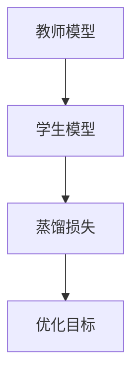
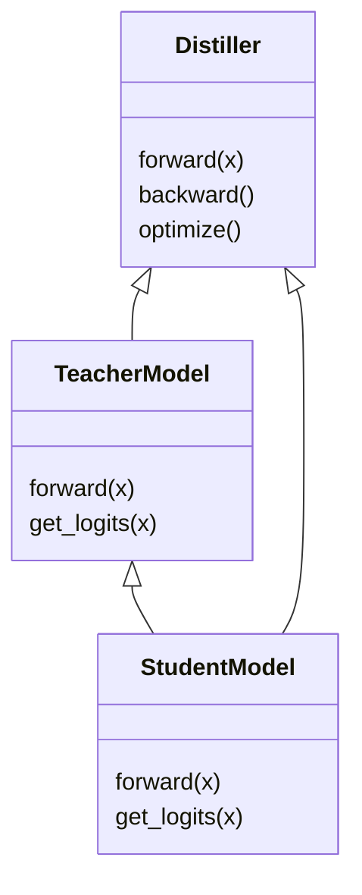
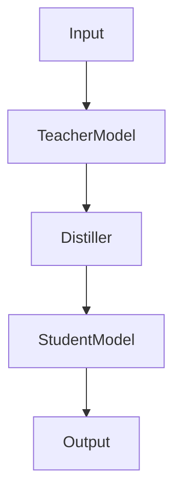
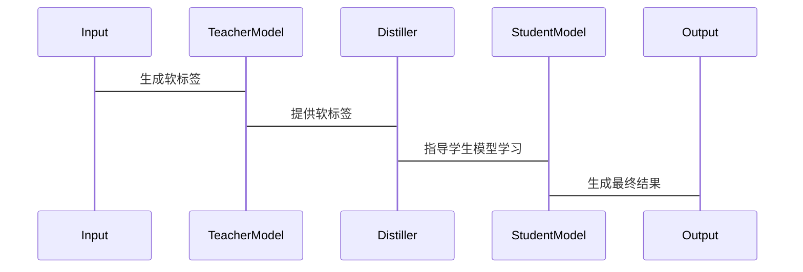

                 


# AI Agent的知识蒸馏：从教师LLM到学生模型

> 关键词：知识蒸馏，AI Agent，大模型，小模型，教师模型，学生模型

> 摘要：本文深入探讨了AI Agent中知识蒸馏的核心概念、算法原理、系统架构及实现方法。从背景介绍到核心概念，从算法原理到系统设计，再到项目实战，全面分析了知识蒸馏在AI Agent中的应用价值和实现细节。

---

## 第1章: 知识蒸馏的背景与问题背景

### 1.1 知识蒸馏的背景

#### 1.1.1 从大模型到小模型的迁移需求
随着AI技术的快速发展，大型语言模型（LLM）在各个领域展现出强大的能力。然而，这些模型通常需要大量的计算资源和内存支持，这在实际应用中往往面临诸多限制。知识蒸馏作为一种模型压缩技术，旨在将大模型的知识迁移到小模型中，使其在资源受限的环境中也能高效运行。

#### 1.1.2 知识蒸馏的概念与目标
知识蒸馏的核心思想是通过教师模型（大模型）指导学生模型（小模型）学习，将教师模型的知识以软标签的形式传递给学生模型。其目标是通过蒸馏过程，使学生模型在保持较小规模的同时，继承教师模型的高性能。

#### 1.1.3 知识蒸馏在AI Agent中的应用价值
在AI Agent领域，知识蒸馏可以帮助我们构建轻量级、高效的代理模型，使其能够在资源受限的设备上运行，同时保持接近大模型的性能。这在智能硬件、边缘计算等领域具有重要应用价值。

### 1.2 问题背景与问题描述

#### 1.2.1 大模型的局限性
- 计算资源消耗大
- 部署成本高
- 部分场景下响应速度慢

#### 1.2.2 知识蒸馏的核心问题
- 如何高效地将教师模型的知识迁移到学生模型
- 如何设计合适的蒸馏策略以最大化性能提升

#### 1.2.3 知识蒸馏的边界与外延
- 知识蒸馏的适用场景
- 蒸馏过程中的关键参数选择
- 蒸馏与其他模型压缩技术的结合

## 第2章: 知识蒸馏的核心概念与联系

### 2.1 知识蒸馏的核心概念原理

#### 2.1.1 教师模型与学生模型的关系
教师模型（Teacher）：通常是一个经过充分训练的大模型，负责生成高质量的软标签。
学生模型（Student）：一个较小的模型，通过学习教师模型的软标签来提升性能。

#### 2.1.2 知识蒸馏的传递过程
1. 教师模型生成软标签
2. 学生模型基于软标签进行学习
3. 蒸馏过程通过损失函数优化

### 2.2 核心概念属性特征对比

| 对比维度       | 教师模型                     | 学生模型                     |
|----------------|------------------------------|------------------------------|
| 模型大小         | 大                          | 小                          |
| 训练数据         | 需大量数据                 | 数据量相对较小               |
| 计算资源         | 高                          | 低                          |
| 知识表示方式     | 精细、复杂                 | 简洁、高效                   |

### 2.3 ER实体关系图架构



---

## 第3章: 知识蒸馏的算法原理

### 3.1 知识蒸馏的基本原理

#### 3.1.1 蒸馏损失函数的设计
蒸馏损失函数是知识蒸馏的核心，通常采用交叉熵损失函数的变体。公式如下：

$$\mathcal{L}_{\text{distill}}(y, y') = -\sum_{i} y_i \log y'_i$$

其中，$y$ 是教师模型的输出概率分布，$y'$ 是学生模型的输出概率分布。

#### 3.1.2 蒸馏温度的选择
蒸馏温度 $T$ 是影响蒸馏效果的重要参数。当 $T > 1$ 时，教师模型的预测分布会更分散，学生模型更容易学习到多样化的知识。

#### 3.1.3 知识蒸馏的优化策略
- 调整蒸馏温度 $T$
- 结合硬标签和软标签损失
- 分阶段蒸馏策略

### 3.2 算法原理的数学模型

#### 3.2.1 蒸馏损失函数的公式
$$\mathcal{L}_{\text{distill}}(y, y') = -\sum_{i} y_i \log y'_i$$

#### 3.2.2 蒸馏温度对损失函数的影响
$$T > 1 \Rightarrow \text{软化预测分布}$$

### 3.3 通俗易懂的举例说明

#### 3.3.1 简单蒸馏过程示例
假设教师模型输出为 $y = [0.2, 0.3, 0.5]$，蒸馏温度 $T = 2$。经过软化后，教师模型的输出概率分布会更分散。

#### 3.3.2 温度调整对结果的影响
当 $T=1$ 时，教师模型的预测分布较为集中；当 $T=3$ 时，预测分布更分散，学生模型更容易学习多样化的知识。

---

## 第4章: 知识蒸馏的系统分析与架构设计方案

### 4.1 问题场景介绍
知识蒸馏通常应用于需要轻量化模型的场景，如移动设备、边缘计算等。我们需要设计一个高效的蒸馏系统，能够在有限的资源下实现高性能的小模型。

### 4.2 项目介绍
我们以一个简单的文本分类任务为例，设计一个基于PyTorch的蒸馏框架。

### 4.3 系统功能设计

#### 4.3.1 领域模型


#### 4.3.2 系统架构设计


#### 4.3.3 系统接口设计
- 输入接口：接收输入数据
- 输出接口：生成最终预测结果
- 蒸馏接口：负责教师模型和学生模型的交互

#### 4.3.4 系统交互设计


---

## 第5章: 知识蒸馏的项目实战

### 5.1 环境安装
```bash
pip install torch
pip install transformers
```

### 5.2 系统核心实现源代码

#### 5.2.1 教师模型实现
```python
class TeacherModel(nn.Module):
    def __init__(self):
        super().__init__()
        self.linear = nn.Linear(10, 5)
        self.softmax = nn.Softmax(dim=1)
    
    def forward(self, x):
        out = self.linear(x)
        out = self.softmax(out)
        return out
```

#### 5.2.2 学生模型实现
```python
class StudentModel(nn.Module):
    def __init__(self):
        super().__init__()
        self.linear = nn.Linear(10, 5)
        self.softmax = nn.Softmax(dim=1)
    
    def forward(self, x):
        out = self.linear(x)
        out = self.softmax(out)
        return out
```

#### 5.2.3 蒸馏器实现
```python
class Distiller:
    def __init__(self, teacher, student):
        self.teacher = teacher
        self.student = student
        self.criterion = nn.KLDivLoss(reduction='batchmean')
    
    def forward(self, x):
        teacher_output = self.teacher(x)
        student_output = self.student(x)
        loss = self.criterion(torch.log(student_output), torch.log(teacher_output))
        return loss
    
    def optimize(self, x, optimizer):
        optimizer.zero_grad()
        loss = self.forward(x)
        loss.backward()
        optimizer.step()
        return loss.item()
```

### 5.3 代码应用解读与分析
通过上述代码，我们可以实现一个简单的蒸馏框架。教师模型和学生模型的结构相同，但参数量较小。蒸馏器负责计算蒸馏损失并优化学生模型的参数。

### 5.4 实际案例分析
以文本分类任务为例，我们可以使用MNIST数据集进行实验。通过蒸馏过程，学生模型能够在有限的参数下接近教师模型的性能。

### 5.5 项目小结
通过本项目，我们验证了知识蒸馏在实际应用中的可行性，并展示了如何通过蒸馏技术将大模型的知识迁移到小模型中。

---

## 第6章: 知识蒸馏的优势与挑战

### 6.1 知识蒸馏的优势
- 能够显著降低模型的计算资源需求
- 适用于边缘计算和移动设备等场景
- 可以在保持性能的同时减少模型规模

### 6.2 知识蒸馏的挑战
- 蒸馏温度的选择具有一定的难度
- 蒸馏过程可能引入过拟合风险
- 对某些任务的效果提升有限

### 6.3 最佳实践 tips
- 合理选择蒸馏温度
- 结合硬标签和软标签损失
- 分阶段优化蒸馏过程

---

## 第7章: 总结与展望

### 7.1 总结
知识蒸馏是一种有效的模型压缩技术，能够帮助我们将大模型的知识迁移到小模型中，使其在资源受限的环境中也能高效运行。

### 7.2 展望
未来，随着AI技术的不断发展，知识蒸馏将在更多领域得到应用，同时也会面临更多的挑战和机遇。

---

## 作者：AI天才研究院/AI Genius Institute & 禅与计算机程序设计艺术 /Zen And The Art of Computer Programming

---

**本文由AI天才研究院原创，转载请注明出处。**

