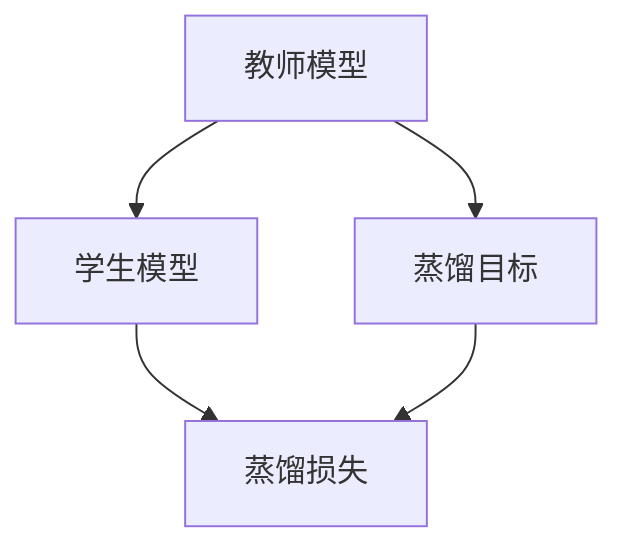
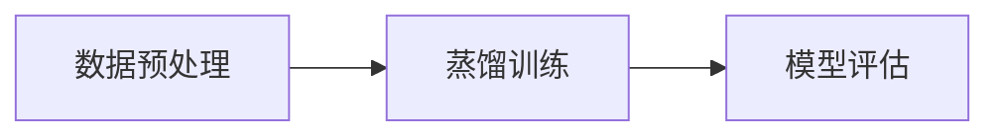

                 


# AI Agent的知识蒸馏：从集成LLM到轻量级模型

> 关键词：知识蒸馏，AI Agent，大语言模型，轻量级模型，模型压缩，机器学习

> 摘要：本文深入探讨了AI Agent的知识蒸馏技术，从集成大语言模型到轻量级模型的实现过程。通过分析知识蒸馏的核心概念、算法原理、系统架构设计以及实际项目案例，本文为读者提供了从理论到实践的全面指导。文章旨在帮助读者理解如何通过知识蒸馏技术，将大模型的知识迁移到轻量级模型中，以满足实际应用中的性能和资源需求。

---

# 第一部分: AI Agent的知识蒸馏背景与概念

## 第1章: 知识蒸馏的背景与问题背景

### 1.1 知识蒸馏的背景介绍

#### 1.1.1 大语言模型的发展与挑战
大语言模型（Large Language Model, LLM）近年来取得了巨大成功，但在实际应用中，其计算成本和资源需求过高，限制了其在移动设备、边缘计算等场景中的应用。

#### 1.1.2 知识蒸馏技术的提出与意义
知识蒸馏技术通过将大模型的知识迁移到小模型中，解决了大模型部署的资源限制问题，同时保持了模型的性能。

#### 1.1.3 AI Agent在实际应用中的需求
AI Agent需要实时响应和快速决策能力，而轻量级模型在资源受限的场景中更具优势。

### 1.2 问题背景与技术挑战

#### 1.2.1 大模型的计算与资源消耗问题
大模型在训练和推理阶段需要大量的计算资源和时间，限制了其在实际应用中的使用。

#### 1.2.2 轻量级模型的需求与应用场景
轻量级模型适合在资源受限的场景中使用，如移动设备、物联网设备等。

#### 1.2.3 知识蒸馏的核心问题与目标
如何有效地将大模型的知识迁移到小模型中，同时保持模型的性能和速度。

### 1.3 知识蒸馏的核心概念与边界

#### 1.3.1 知识蒸馏的定义与核心要素
知识蒸馏是一种通过教师模型（大模型）指导学生模型（小模型）学习的技术。

#### 1.3.2 知识蒸馏的边界与外延
知识蒸馏的核心是将知识从大模型迁移到小模型，与其他模型压缩技术（如剪枝、量化）有区别。

#### 1.3.3 知识蒸馏与其他模型压缩技术的区别
知识蒸馏通过概率分布迁移实现知识传递，而剪枝和量化则是通过减少模型参数数量来实现压缩。

---

## 第2章: 知识蒸馏的核心概念与联系

### 2.1 知识蒸馏的原理与关键因素

#### 2.1.1 教师模型与学生模型的关系
教师模型提供指导，学生模型学习教师模型的知识。

#### 2.1.2 知识蒸馏的关键步骤与流程
1. 确定教师模型和学生模型。
2. 设计蒸馏损失函数。
3. 优化学生模型以最小化蒸馏损失。

#### 2.1.3 蒸馏过程中的核心参数与优化目标
蒸馏温度、损失函数权重、训练轮数等参数影响蒸馏效果。

### 2.2 知识蒸馏的核心概念对比

#### 2.2.1 知识蒸馏与传统迁移学习的对比
知识蒸馏通过教师模型指导学生模型，而传统迁移学习通过共享特征实现迁移。

#### 2.2.2 知识蒸馏与模型剪枝的对比
知识蒸馏通过概率分布迁移实现知识传递，而剪枝通过删除冗余参数实现模型压缩。

#### 2.2.3 知识蒸馏与模型量化的对比
知识蒸馏通过概率分布迁移实现知识传递，而量化通过减少参数位数实现模型压缩。

### 2.3 知识蒸馏的实体关系图



---

## 第3章: 知识蒸馏的算法原理

### 3.1 知识蒸馏的核心算法流程

#### 3.1.1 蒸馏过程的数学模型
教师模型输出概率分布：$P(y|x) = \text{softmax}(f_T(x))$  
学生模型输出概率分布：$Q(y|x) = \text{softmax}(f_S(x))$  

#### 3.1.2 蒸馏损失的计算公式
$$ L_{\text{distill}} = -\sum_{y} P(y|x) \log Q(y|x) $$  

#### 3.1.3 蒸馏温度对结果的影响
蒸馏温度 $T$ 越高，概率分布越平滑，学生模型学习到的知识越通用。

### 3.2 知识蒸馏的数学模型与公式

#### 3.2.1 教师模型的输出概率分布
$$ P(y|x) = \text{softmax}(f_T(x) / T) $$  

#### 3.2.2 学生模型的输出概率分布
$$ Q(y|x) = \text{softmax}(f_S(x) / T) $$  

#### 3.2.3 蒸馏损失的计算公式
$$ L_{\text{distill}} = -\sum_{y} P(y|x) \log Q(y|x) $$  

---

## 第4章: 知识蒸馏的系统分析与架构设计

### 4.1 系统功能设计

#### 4.1.1 系统功能模块
1. 数据预处理模块。
2. 蒸馏训练模块。
3. 模型评估模块。

#### 4.1.2 系统功能流程
1. 数据预处理：将训练数据准备好。
2. 蒸馏训练：通过蒸馏损失函数优化学生模型。
3. 模型评估：评估学生模型的性能。

### 4.2 系统架构设计

#### 4.2.1 系统架构图



---

## 第5章: 知识蒸馏的项目实战

### 5.1 环境安装

```bash
pip install transformers torch
```

### 5.2 核心实现代码

```python
import torch
import torch.nn as nn
from torch.utils.data import Dataset, DataLoader

class TeacherModel(nn.Module):
    def __init__(self):
        super().__init__()
        # 定义教师模型结构
        pass

class StudentModel(nn.Module):
    def __init__(self):
        super().__init__()
        # 定义学生模型结构
        pass

def distillation_loss(P, Q, T=1.0):
    # 计算蒸馏损失
    P = P / T
    Q = Q / T
    return -(P * torch.log(Q)).sum()

# 训练过程
for epoch in epochs:
    for batch in dataloader:
        # 前向传播
        P = teacher_model(batch)
        Q = student_model(batch)
        # 计算损失
        loss = distillation_loss(P, Q)
        # 反向传播与优化
        optimizer.zero_grad()
        loss.backward()
        optimizer.step()
```

### 5.3 实际案例分析与解读

#### 5.3.1 案例分析
通过一个具体案例，展示如何将知识蒸馏应用于实际项目。

#### 5.3.2 案例解读
分析案例中的关键步骤和优化点。

---

## 第6章: 知识蒸馏的最佳实践

### 6.1 小结

### 6.2 注意事项

### 6.3 拓展阅读

---

# 作者：AI天才研究院/AI Genius Institute & 禅与计算机程序设计艺术 /Zen And The Art of Computer Programming

---

以上是一个详细的思考过程和撰写框架，希望对您有所帮助！如果需要进一步补充或调整，请随时告诉我。

