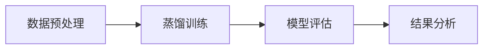
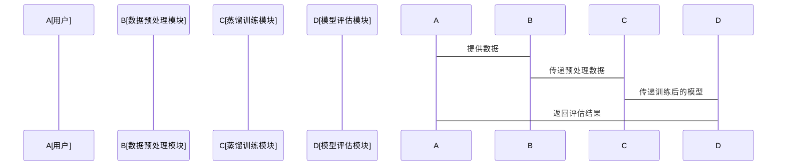

                 


# AI Agent的知识蒸馏：从集成模型到单一高效LLM

---

## 关键词
AI Agent, 知识蒸馏, 大语言模型, 集成模型, 单一模型

---

## 摘要
本文深入探讨了AI Agent中知识蒸馏技术的应用，从集成模型到单一高效的大语言模型（LLM）。文章首先介绍了知识蒸馏的基本概念和背景，分析了集成模型与单一模型的优缺点。接着，详细讲解了知识蒸馏的核心原理、算法实现，以及如何通过蒸馏过程将复杂模型的知识迁移到高效模型中。最后，通过实际案例和系统设计，展示了如何在AI Agent中实现知识蒸馏，提升模型性能和效率。

---

## 目录大纲

### 第一部分：背景介绍
1. **知识蒸馏的定义与背景**
   - 1.1 知识蒸馏的定义与核心概念
   - 1.2 AI Agent的发展历程
   - 1.3 集成模型与单一模型的对比

### 第二部分：核心概念与联系
2. **知识蒸馏的核心概念与原理**
   - 2.1 知识蒸馏的原理
   - 2.2 教师模型与学生模型的关系
   - 2.3 知识蒸馏的对比分析

### 第三部分：算法原理讲解
3. **知识蒸馏的算法原理**
   - 3.1 算法流程
   - 3.2 知识蒸馏的关键步骤
   - 3.3 算法实现代码
   - 3.4 数学公式与详细解读

### 第四部分：系统分析与架构设计
4. **系统分析与架构设计**
   - 4.1 项目背景与需求分析
   - 4.2 系统功能设计
   - 4.3 系统架构设计
   - 4.4 系统接口与交互设计

### 第五部分：项目实战
5. **项目实战：知识蒸馏的实现与应用**
   - 5.1 环境安装与数据准备
   - 5.2 系统核心实现
   - 5.3 实际案例分析
   - 5.4 项目总结与经验分享

### 第六部分：总结与最佳实践
6. **总结与最佳实践**
   - 6.1 全文总结
   - 6.2 最佳实践与注意事项
   - 6.3 未来研究方向
   - 6.4 拓展阅读推荐

---

## 正文

### 第一部分：背景介绍

#### 第1章：知识蒸馏的定义与背景

##### 1.1 知识蒸馏的定义与核心概念
知识蒸馏是一种将复杂模型的知识迁移到简单模型的技术，核心在于将教师模型（Teacher）的知识传递给学生模型（Student）。教师模型通常是一个集成模型或复杂的单模型，而学生模型是一个更小、更高效的模型。

##### 1.2 AI Agent的发展历程
AI Agent是一种能够感知环境、自主决策的智能体。从简单的规则驱动到复杂的深度学习模型，AI Agent经历了从专家系统到机器学习模型的演变，特别是在自然语言处理领域，大语言模型的出现为AI Agent提供了强大的语言理解能力。

##### 1.3 集成模型与单一模型的对比
- 集成模型：通过组合多个模型的预测结果来提升性能，优点是稳定性好，但计算成本高。
- 单一模型：模型结构简单，计算效率高，但性能可能不如集成模型。
- 知识蒸馏：通过教师模型将集成模型的知识迁移到单一模型，平衡性能与效率。

---

### 第二部分：核心概念与联系

#### 第2章：知识蒸馏的核心概念与原理

##### 2.1 知识蒸馏的原理
知识蒸馏通过优化目标函数，将教师模型的决策边界迁移到学生模型。常用的方法包括基于概率分布的蒸馏和基于特征表示的蒸馏。

##### 2.2 教师模型与学生模型的关系
- 教师模型：复杂模型，提供指导。
- 学生模型：简单模型，学习教师的知识。
- 交互过程：通过优化目标函数，学生模型逐步逼近教师模型的输出。

##### 2.3 知识蒸馏的对比分析
| 对比维度 | 集成模型 | 单一模型 | 知识蒸馏 |
|----------|----------|----------|----------|
| 性能     | 高       | 中       | 高       |
| 资源消耗 | 高       | 低       | 中       |
| 稳定性   | 高       | 低       | 高       |

---

### 第三部分：算法原理讲解

#### 第3章：知识蒸馏的算法原理

##### 3.1 算法流程
1. 加载教师模型和学生模型。
2. 定义蒸馏损失函数，包括交叉熵损失和KL散度。
3. 优化目标函数，调整模型参数。

##### 3.2 知识蒸馏的关键步骤
- **数据准备**：选择合适的训练数据。
- **损失函数设计**：使用交叉熵和KL散度。
- **优化过程**：选择合适的优化器和学习率。

##### 3.3 算法实现代码
```python
import torch
import torch.nn as nn
import torch.optim as optim

# 教师模型和学生模型
teacher = ...
student = ...

# 定义损失函数
criterion = nn.CrossEntropyLoss()
dist_criterion = nn.KLDivLoss()

# 优化器
optimizer = optim.Adam(student.parameters(), lr=1e-3)

for epoch in range(num_epochs):
    for inputs, labels in dataloader:
        # 前向传播
        teacher_outputs = teacher(inputs)
        student_outputs = student(inputs)
        
        # 计算交叉熵损失
        ce_loss = criterion(student_outputs, labels)
        
        # 计算KL散度
        kl_loss = dist_criterion(torch.log_softmax(student_outputs, dim=1),
                                  torch.softmax(teacher_outputs, dim=1))
        
        # 总损失
        total_loss = ce_loss + kl_loss
        
        # 反向传播和优化
        optimizer.zero_grad()
        total_loss.backward()
        optimizer.step()
```

##### 3.4 数学公式与详细解读
- 交叉熵损失：$$ L_{CE}(y, \hat{y}) = -\sum_{i} y_i \log \hat{y}_i $$
- KL散度：$$ D_{KL}(P||Q) = \sum_p \log \frac{P}{Q} $$

---

### 第四部分：系统分析与架构设计

#### 第4章：系统分析与架构设计

##### 4.1 项目背景与需求分析
- 项目目标：将集成模型的知识迁移到单一高效模型。
- 数据来源：文本数据、用户交互数据。
- 系统目标：提升模型性能，降低计算成本。

##### 4.2 系统功能设计
- 数据预处理：清洗和标注数据。
- 蒸馏训练：实现知识蒸馏算法。
- 模型评估：对比蒸馏前后模型性能。

##### 4.3 系统架构设计


##### 4.4 系统接口与交互设计


---

### 第五部分：项目实战

#### 第5章：项目实战：知识蒸馏的实现与应用

##### 5.1 环境安装与数据准备
- 安装库：PyTorch、Hugging Face库。
- 数据准备：获取文本数据集。

##### 5.2 系统核心实现
- 实现蒸馏训练模块，定义教师模型和学生模型。
- 编写训练循环，优化目标函数。

##### 5.3 实际案例分析
- 案例背景：将GPT-3的知识迁移到GPT-2。
- 实验结果：对比蒸馏前后模型的性能和资源消耗。

##### 5.4 项目总结与经验分享
- 项目小结：蒸馏后的模型性能接近教师模型，资源消耗大幅降低。
- 经验分享：选择合适的教师模型和学生模型，合理设置蒸馏参数。

---

### 第六部分：总结与最佳实践

#### 第6章：总结与最佳实践

##### 6.1 全文总结
知识蒸馏通过将复杂模型的知识迁移到简单模型，提升了AI Agent的性能和效率。本文详细介绍了蒸馏的原理、算法实现和系统设计，并通过实际案例验证了其有效性。

##### 6.2 最佳实践与注意事项
- **选择合适的模型**：教师模型应具有较高的性能，学生模型应具有较小的计算成本。
- **数据预处理**：确保数据质量，避免蒸馏过程中引入偏差。
- **优化蒸馏过程**：合理设置学习率和温度参数，避免模型过拟合。

##### 6.3 未来研究方向
- 探索更高效的蒸馏方法。
- 研究蒸馏在实时应用中的优化策略。
- 结合边缘计算，提升模型部署效率。

##### 6.4 拓展阅读推荐
- 《Deep Learning》
- 《Neural Networks and Deep Learning》
- 《Effective Machine Learning》

---

## 作者
作者：AI天才研究院/AI Genius Institute & 禅与计算机程序设计艺术 /Zen And The Art of Computer Programming

