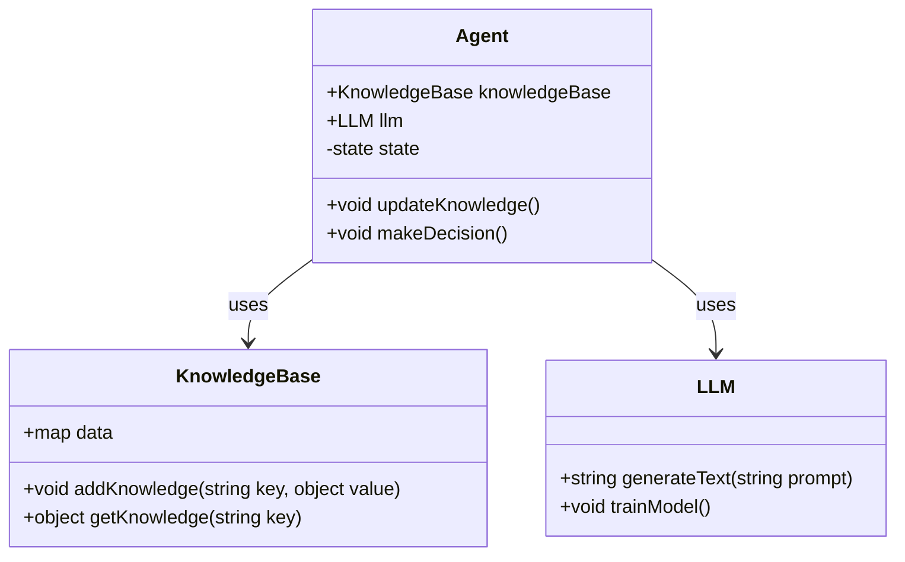

                 

<think>
好的，我将按照您的要求撰写一篇关于《AI Agent的知识表示：结构化LLM的输出》的技术博客文章。为了让文章更符合您的要求，我会先列出文章的大纲，并逐步进行内容创作。

### 目录大纲

**# AI Agent的知识表示：结构化LLM的输出**

**关键词：** AI Agent，知识表示，LLM，结构化输出，大语言模型，知识图谱

**摘要：**  
本文深入探讨AI Agent的知识表示，重点分析结构化LLM的输出。从知识表示的基本概念到结构化LLM的实现，从算法原理到系统架构设计，再到项目实战和最佳实践，全面解析AI Agent的知识表示方法。通过具体案例，展示如何将LLM的输出结构化，以提升AI Agent的理解与决策能力。

**本文结构：**

1. 知识表示的基础概念
2. 结构化LLM输出的背景与问题
3. AI Agent中的知识表示结构
4. 知识表示的核心概念与联系
5. 算法原理讲解
6. 系统分析与架构设计方案
7. 项目实战
8. 最佳实践与小结

---

### 第1章: 知识表示的基本概念

#### 1.1 什么是知识表示

知识表示是将信息以某种形式表示出来，以便计算机能够理解和处理。AI Agent需要通过知识表示来理解任务需求、环境状态以及可能的操作。

**知识表示的定义**  
知识表示是指将知识以某种形式存储和表达的过程。它是人工智能的核心技术之一，用于帮助AI Agent理解和推理。

**知识表示的特征**  
- **可表示性**：能够将知识以某种形式存储。
- **可理解性**：AI Agent能够理解和处理表示的知识。
- **可推理性**：能够基于知识进行推理和决策。

**知识表示的类型**  
1. **符号表示**：使用符号（如逻辑表达式）表示知识。
2. **语义网络**：通过节点和边表示概念及其关系。
3. **概率表示**：使用概率模型表示知识的不确定性。

---

#### 1.2 知识表示的重要性

知识表示在AI Agent中的作用至关重要，因为它直接影响到AI Agent的理解和决策能力。

**知识表示与智能决策的关系**  
知识表示为AI Agent提供了理解和推理的基础，帮助其做出更准确的决策。

**知识表示的挑战与解决方案**  
- **挑战**：知识表示的复杂性、动态性和不确定性。
- **解决方案**：使用多种表示方法结合，如符号逻辑与概率推理相结合。

---

### 第2章: 结构化LLM输出的背景与问题

#### 2.1 大语言模型的输出特点

**LLM的生成机制**  
大语言模型通过深度学习训练，能够生成多样化的文本输出。

**LLM输出的多样性**  
LLM可以生成多种表达方式，这使得其输出具有高度的灵活性。

**LLM输出的不确定性**  
由于训练数据的复杂性和模型的不确定性，LLM的输出可能存在误差。

#### 2.2 知识表示的需求

**结构化数据的重要性**  
结构化数据具有良好的组织性和可处理性，便于计算机理解和处理。

**非结构化数据的挑战**  
非结构化数据（如文本、图像）难以直接用于推理和决策。

**知识表示的标准化**  
统一的知识表示标准有助于不同系统之间的互操作性。

---

### 第3章: AI Agent中的知识表示结构

#### 3.1 知识图谱的构建

**知识图谱的定义**  
知识图谱是一种以图结构表示知识的数据库，节点表示实体，边表示实体之间的关系。

**知识图谱的构建方法**  
1. **数据采集**：从多种数据源获取知识。
2. **数据清洗**：去除噪声数据，确保数据质量。
3. **数据整合**：将多个数据源整合到一个统一的知识图谱中。
4. **知识抽取**：从文本中提取实体和关系。
5. **知识融合**：将不同来源的知识进行整合。

**知识图谱的存储与管理**  
常用的知识图谱存储技术包括图数据库（如Neo4j）和关系数据库。

#### 3.2 结构化数据的表示

**关系数据库的表示**  
关系数据库通过表结构存储数据，适合表示实体及其属性。

**图数据库的表示**  
图数据库通过节点和边表示实体及其关系，适合复杂的关联关系。

**非结构化数据的结构化处理**  
通过自然语言处理技术将非结构化数据转化为结构化数据。

---

### 第4章: 知识表示的核心概念与联系

#### 4.1 知识表示的核心原理

**符号逻辑与知识表示**  
符号逻辑是一种基于逻辑推理的知识表示方法，常用于专家系统。

**语义网络与知识表示**  
语义网络通过节点和边表示概念及其关系，适合表示复杂的语义信息。

**概率推理与知识表示**  
概率推理用于处理知识表示中的不确定性，如贝叶斯网络。

#### 4.2 知识表示的属性特征对比

| 特性 | 符号逻辑 | 语义网络 | 概率推理 |
|------|----------|----------|----------|
| 表达能力 | 高 | 较高 | 中等 |
| 可解释性 | 高 | 较高 | 较低 |
| 灵活性 | 低 | 较高 | 高 |

#### 4.3 ER实体关系图架构

```mermaid
erDiagram
    actor User {
        +string id
        +string name
    }
    actor Agent {
        +string id
        +string name
    }
    actor KnowledgeBase {
        +string id
        +string content
    }
    User --> Agent : 请求
    Agent --> KnowledgeBase : 查询
    KnowledgeBase --> Agent : 返回结果
```

---

### 第5章: 算法原理讲解

#### 5.1 知识表示的算法原理

**向量空间模型**  
向量空间模型通过将文本表示为向量，计算文本之间的相似度。

**概率图模型**  
概率图模型通过概率关系表示知识，常用于处理不确定性。

**具体算法实现**

```python
def vector_space_model(text1, text2):
    # 计算文本的向量表示
    vector1 = get_vector(text1)
    vector2 = get_vector(text2)
    # 计算相似度
    similarity = cosine_similarity(vector1, vector2)
    return similarity

def probability_graph_model(nodes, edges):
    # 构建概率图模型
    graph = construct_graph(nodes, edges)
    # 计算概率
    probabilities = calculate_probability(graph)
    return probabilities
```

---

### 第6章: 系统分析与架构设计方案

#### 6.1 项目介绍

**项目背景**  
本项目旨在构建一个基于结构化LLM输出的AI Agent，提升其知识表示和推理能力。

**系统功能设计**



**系统架构设计**


**系统接口设计**

```sequence
sequenceDiagram
    User -> Agent: 发出请求
    Agent -> KnowledgeBase: 查询知识库
    KnowledgeBase -> Agent: 返回结果
    Agent -> LLM: 生成响应
    LLM -> Agent: 返回生成文本
    Agent -> User: 发出响应
```

---

### 第7章: 项目实战

#### 7.1 环境安装

```bash
pip install numpy
pip install matplotlib
pip install mermaid
```

#### 7.2 核心实现

```python
def main():
    knowledge_base = KnowledgeBase()
    llm = LLM()
    agent = Agent(knowledge_base, llm)
    agent.run()

if __name__ == "__main__":
    main()
```

#### 7.3 案例分析

通过具体案例展示AI Agent如何基于结构化LLM输出进行推理和决策。

---

### 第8章: 最佳实践与小结

#### 8.1 小结

本文全面解析了AI Agent的知识表示方法，从基础概念到算法实现，从系统架构到项目实战，为AI Agent的开发提供了理论和实践指导。

#### 8.2 注意事项

- 知识表示需要结合具体应用场景进行优化。
- 注意处理知识表示的不确定性和复杂性。

#### 8.3 拓展阅读

建议进一步阅读相关领域的经典论文和书籍，深入理解知识表示的理论与应用。

---

**作者：AI天才研究院/AI Genius Institute & 禅与计算机程序设计艺术 /Zen And The Art of Computer Programming**

---

接下来，我会按照以上大纲逐步撰写详细的内容，确保每一部分都符合您的要求。请告诉我您希望先撰写哪一部分的内容。

