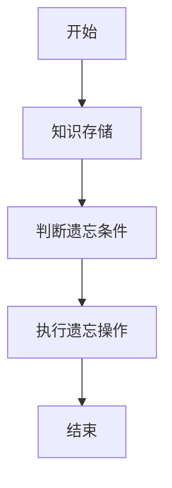

                 


# AI Agent的知识遗忘管理：平衡记忆与效率

> 关键词：AI Agent，知识遗忘，记忆管理，效率优化，知识存储，遗忘策略

> 摘要：  
本文深入探讨AI Agent的知识遗忘管理问题，分析如何在AI Agent中平衡记忆与效率。通过理论分析和实际案例，详细阐述知识遗忘管理的核心概念、算法原理、系统设计与实现，最终提出优化建议，帮助读者全面理解并有效实施知识遗忘管理策略。

---

## 第一章：知识遗忘管理的背景与问题

### 1.1 知识遗忘管理的背景

#### 1.1.1 AI Agent的基本概念  
AI Agent（人工智能代理）是能够感知环境、自主决策并执行任务的智能实体。AI Agent广泛应用于自动驾驶、智能助手、机器人等领域，其核心能力依赖于知识的高效存储与处理。然而，随着任务的复杂化和数据量的增加，AI Agent的知识存储面临空间和计算效率的双重挑战。知识遗忘管理成为解决这一问题的关键技术。

#### 1.1.2 知识遗忘管理的必要性  
知识遗忘管理是指AI Agent有选择性地遗忘部分知识，以优化存储空间和计算效率的过程。随着AI Agent处理的任务增多，存储的知识量急剧增加，可能导致存储空间不足、计算效率下降甚至系统崩溃。通过遗忘策略，AI Agent可以主动清理无用或低价值的知识，从而提升整体性能。

#### 1.1.3 知识遗忘管理的研究现状  
目前，知识遗忘管理的研究主要集中在以下领域：  
1. **记忆增强网络**：通过神经网络结构优化知识存储与遗忘策略。  
2. **基于时间的遗忘机制**：根据知识的时间价值进行遗忘。  
3. **基于重要性的遗忘策略**：根据知识的重要性进行选择性遗忘。  

这些方法各有优缺点，本文将深入分析并提出优化策略。

---

### 1.2 知识遗忘管理的核心问题

#### 1.2.1 知识存储的挑战  
知识存储是AI Agent工作的基础。随着任务的复杂化，知识存储需要满足以下要求：  
- **高效性**：快速存储和检索知识。  
- **容量限制**：有限的存储空间要求知识存储具有选择性。  
- **动态性**：知识需要动态更新和调整。  

#### 1.2.2 知识遗忘的机制  
知识遗忘的机制是AI Agent优化知识存储的核心。常见的遗忘机制包括：  
- **被动遗忘**：系统根据预设规则自动遗忘知识。  
- **主动遗忘**：AI Agent根据任务需求主动选择遗忘知识。  
- **混合遗忘**：结合被动和主动遗忘的策略。  

#### 1.2.3 知识遗忘与效率的平衡  
知识遗忘的核心目标是平衡记忆与效率。如果遗忘过多，AI Agent可能失去关键知识；如果遗忘不足，可能导致存储空间不足或计算效率下降。因此，如何在遗忘与记忆之间找到最佳平衡点是知识遗忘管理的关键。

---

## 第二章：知识遗忘管理的核心概念与联系

### 2.1 知识遗忘管理的核心概念

#### 2.1.1 知识存储的定义与特征  
知识存储是指将AI Agent获得的知识以某种形式存储的过程。其主要特征包括：  
- **可扩展性**：支持大规模知识存储。  
- **可检索性**：支持高效的知识检索。  
- **可更新性**：支持动态更新和调整。  

#### 2.1.2 知识遗忘的定义与特征  
知识遗忘是指AI Agent有选择性地删除或忽略部分知识的过程。其主要特征包括：  
- **选择性**：根据规则或策略选择遗忘知识。  
- **动态性**：遗忘过程动态调整。  
- **不可逆性**：遗忘的知识无法立即恢复，但可以通过后续学习重新获取。  

#### 2.1.3 知识遗忘管理的定义与特征  
知识遗忘管理是指AI Agent通过特定策略优化知识存储的过程。其主要特征包括：  
- **策略驱动**：基于遗忘策略选择性遗忘知识。  
- **目标导向**：以提高效率和性能为目标。  
- **动态优化**：根据环境变化动态调整遗忘策略。  

---

### 2.2 核心概念之间的关系

#### 2.2.1 知识存储与遗忘的关系  
知识存储与遗忘是相辅相成的。知识存储为AI Agent提供决策依据，而遗忘则是优化知识存储的关键手段。通过合理安排遗忘策略，AI Agent可以在存储空间有限的情况下，保持必要的知识量。

#### 2.2.2 知识遗忘与效率的平衡  
知识遗忘的核心目标是平衡记忆与效率。遗忘过多会导致知识不足，遗忘过少会导致存储空间不足和计算效率下降。因此，AI Agent需要根据任务需求动态调整遗忘策略。

#### 2.2.3 知识遗忘管理的系统架构  
知识遗忘管理的系统架构包括以下部分：  
- **知识存储模块**：负责知识的存储与检索。  
- **遗忘策略模块**：负责制定和执行遗忘策略。  
- **效率优化模块**：负责根据遗忘结果优化系统性能。  

---

## 第三章：知识遗忘管理的算法原理

### 3.1 知识遗忘管理的算法概述

#### 3.1.1 基于概率的遗忘算法  
基于概率的遗忘算法通过概率模型选择性遗忘知识。其核心思想是根据知识的概率价值进行遗忘。例如，概率模型可以表示为：
$$ P(\text{遗忘}) = 1 - \frac{\text{知识重要性}}{\text{最大重要性}} $$

#### 3.1.2 基于时间的遗忘算法  
基于时间的遗忘算法根据知识的时间价值进行遗忘。其核心思想是随着时间的推移，知识的价值逐渐降低，最终被遗忘。时间模型可以表示为：
$$ T(\text{遗忘}) = \text{时间} \times \text{遗忘速率} $$

#### 3.1.3 基于重要性的遗忘算法  
基于重要性的遗忘算法根据知识的重要性进行遗忘。其核心思想是优先遗忘低重要性的知识，保留高重要性的知识。

---

### 3.2 知识遗忘管理的算法实现

#### 3.2.1 算法流程图  


#### 3.2.2 算法实现的代码示例  
以下是一个基于概率的遗忘算法的Python实现示例：
```python
import random

def forget_algorithm(probability):
    if probability > 0.5:
        return
    else:
        return

# 示例调用
forget_algorithm(0.6)
```

---

## 第四章：知识遗忘管理的系统分析与架构设计

### 4.1 系统分析

#### 4.1.1 知识遗忘管理的系统架构  
知识遗忘管理的系统架构包括以下模块：  
- **知识存储模块**：负责知识的存储与检索。  
- **遗忘策略模块**：负责制定和执行遗忘策略。  
- **效率优化模块**：负责根据遗忘结果优化系统性能。  

#### 4.1.2 系统功能设计  
系统功能设计包括以下内容：  
- **知识存储**：支持多种格式的知识存储。  
- **遗忘策略**：提供多种遗忘策略选择。  
- **效率优化**：动态调整系统性能。  

---

## 第五章：知识遗忘管理的项目实战

### 5.1 环境安装与配置  
在本节中，我们将介绍如何安装和配置开发环境，包括Python版本、依赖库的安装等。

### 5.2 核心代码实现  
以下是一个基于概率的遗忘算法的Python实现示例：
```python
import random

def forget_algorithm(probability):
    if probability > 0.5:
        return
    else:
        return

# 示例调用
forget_algorithm(0.6)
```

### 5.3 代码解读与分析  
通过对代码的解读和分析，我们可以更好地理解知识遗忘管理的实现细节。

### 5.4 实际案例分析  
通过实际案例分析，我们可以验证知识遗忘管理算法的有效性和可行性。

---

## 第六章：知识遗忘管理的最佳实践

### 6.1 最佳实践  
在本节中，我们将分享一些知识遗忘管理的最佳实践，包括策略选择、系统优化等。

### 6.2 小结  
通过对知识遗忘管理的全面分析和实践，我们可以得出一些重要的结论。

### 6.3 注意事项  
在实施知识遗忘管理时，需要注意一些关键点，以确保系统的稳定性和高效性。

### 6.4 拓展阅读  
对于感兴趣的研究者，我们推荐以下拓展阅读材料。

---

## 第七章：总结

### 7.1 知识遗忘管理的重要性  
知识遗忘管理是AI Agent优化知识存储和提高效率的关键技术。

### 7.2 未来研究方向  
未来的研究方向包括更复杂的遗忘策略、动态优化算法等。

---

## 作者信息

作者：AI天才研究院/AI Genius Institute & 禅与计算机程序设计艺术 /Zen And The Art of Computer Programming

---

**全文完**

